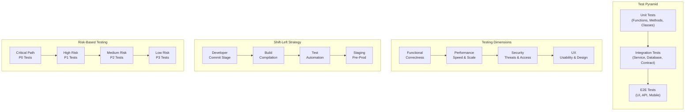
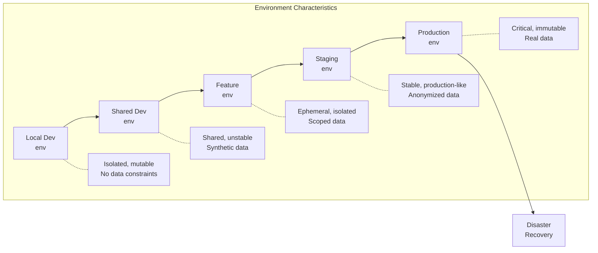

# 01 - Testing Strategies

## Architecture Overview



## What Is Testing Strategy?

A testing strategy is a high-level plan that defines how testing will be performed across the software development lifecycle. It encompasses the testing objectives, scope, approaches, resources, and schedules to ensure quality deliverables.

## Why It Was Created

Testing strategies emerged from the need to systematically validate software quality at scale. Without a cohesive strategy, teams end up with ad-hoc testing that misses critical defects, duplicates effort, and provides false confidence. The strategy aligns testing activities with business risks and development velocity.

## When to Use It

- At the start of every new project or major release
- When transitioning from monolith to microservices
- When adopting CI/CD and DevOps practices
- When scaling engineering teams
- When quality issues start affecting production

## Architecture Deep-Dive

### Test Pyramid

The test pyramid, popularized by Mike Cohn, describes the ideal distribution of automated tests:

- **Unit Tests (70-80%)**: Fast, isolated, testing individual functions or methods. Run in milliseconds. Provide rapid feedback.
- **Integration Tests (15-25%)**: Test interactions between components — service-to-service, database queries, message queues. Take seconds.
- **E2E Tests (5-10%)**: Test complete user journeys through the system. Take minutes. Brittle but high confidence.

### Testing Dimensions

| Dimension | Focus | Tools | When |
|-----------|-------|-------|------|
| Functional | Correct behavior | JUnit, pytest, Jest | Every commit |
| Performance | Response time, throughput | k6, Gatling, JMeter | Pre-release |
| Security | Vulnerabilities, auth | OWASP ZAP, Burp | Nightly |
| UX | User experience | Cypress, Puppeteer | Feature complete |

### Microservice Testing Strategies

**Consumer-Driven Contracts (CDC)**:
- Each service defines expected behavior from its dependencies
- Provider verifies against all consumer contracts
- Enables independent deployment with confidence

**Service-Level Integration Testing**:
- Test each microservice in isolation with real dependencies
- Use test doubles for external services
- Verify API contracts, data formats, error handling

**End-to-End Testing**:
- Focus on critical user journeys only
- Use canary deployments for production validation
- Augment with synthetic monitoring

### Shift-Left Testing

Shift-left moves testing earlier in the development lifecycle:

```
Traditional:  Code -> Build -> Test -> Deploy -> Monitor
Shift-Left:   Design -> Dev/Test -> Build -> Deploy -> Monitor with Testing
```

Benefits:
- Defects caught earlier (10x cheaper to fix)
- Faster feedback loops
- Reduced rework
- Improved developer productivity

Implementation:
- Static analysis in IDE
- Unit tests run on save
- Integration tests in build pipeline
- Contract tests in PR verification

### Test Categorization

Tests are categorized by:
1. **Speed**: Fast (<1s), Medium (<30s), Slow (>30s)
2. **Reliability**: Stable, Flaky, Brittle
3. **Scope**: Unit, Integration, E2E
4. **Criticality**: P0 (blocker), P1 (major), P2 (minor), P3 (cosmetic)
5. **Owner**: Dev, QA, DevOps

### Risk-Based Testing

Prioritize testing based on business impact and technical risk:

```
Risk Score = Likelihood × Impact

Priority Levels:
P0 - Critical path, high business impact, high complexity
P1 - Important features, moderate complexity
P2 - Standard features, low complexity
P3 - Cosmetic, rarely used paths
```

### Test Environments Strategy



## Hands-On Example

### Defining a Test Strategy Document

```yaml
project: Payment Platform v2
version: 1.0
last_updated: 2025-06-01

testing_objectives:
  - Achieve 90% code coverage on critical paths
  - Zero P0/P1 defects in production
  - Test suite completes within 15 minutes in CI

test_levels:
  unit:
    scope: All service methods, utility functions
    framework: JUnit 5 + Mockito
    coverage_target: 85%
    run_frequency: Every commit
    owner: Developers

  integration:
    scope: Database repositories, message queue producers/consumers
    framework: Testcontainers + Spring Boot Test
    coverage_target: 70%
    run_frequency: On PR creation
    owner: Developers + QA

  contract:
    scope: Service-to-service API boundaries
    framework: Pact (CDC)
    coverage_target: 100% of public APIs
    run_frequency: On PR creation
    owner: Service owners

  e2e:
    scope: Critical user journeys (payment, refund, reconciliation)
    framework: Cypress + Playwright
    coverage_target: Key user flows only
    run_frequency: On merge to main
    owner: QA + Automation team

  performance:
    scope: All critical endpoints under expected load
    framework: k6
    run_frequency: Nightly + pre-release
    owner: Performance team

risk_matrix:
  critical_path:
    - payment_processing
    - refund_flow
    - reconciliation
    test_priority: P0
    required_coverage: 100% automated

  high_risk:
    - new_integration_endpoints
    - data_migration_scripts
    test_priority: P1

  standard:
    - report_generation
    - admin_panel
    test_priority: P2

environments:
  local:
    purpose: Development and quick debugging
    setup: Docker Compose + Testcontainers
    data: Synthetic fixtures

  feature:
    purpose: Feature validation
    lifecycle: Ephemeral per branch
    data: Subset of anonymized production

  staging:
    purpose: Pre-release validation
    lifecycle: Persistent
    data: Full anonymized production snapshot

  production:
    monitoring: Synthetic checks + APM
    smoke_tests: Canary deployments
    feature_flags: Gradual rollout
```

### Running a Risk Assessment

```bash
# Sample test prioritization script
cat > test_risk_assessment.py << 'EOF'
import json

tests = [
    {"name": "Payment processing", "likelihood": 3, "impact": 5},
    {"name": "User profile update", "likelihood": 2, "impact": 2},
    {"name": "Report generation", "likelihood": 1, "impact": 3},
]

for t in tests:
    risk_score = t["likelihood"] * t["impact"]
    if risk_score >= 15:
        priority = "P0"
    elif risk_score >= 8:
        priority = "P1"
    elif risk_score >= 4:
        priority = "P2"
    else:
        priority = "P3"

    print(f"{t['name']}: Risk={risk_score}, Priority={priority}")
EOF
python test_risk_assessment.py
```

## Pricing / Cost Considerations

| Strategy Component | Cost Driver | Typical Monthly Cost |
|---|---|---|
| Test infrastructure (CI) | Compute time, parallel agents | $500 - $5,000 |
| Test environment hosting | Cloud resources per env | $1,000 - $10,000 |
| Test data management | Storage, seeding | $200 - $2,000 |
| Visual testing tools | Percy, Applitools licenses | $1,000 - $3,000 |
| Performance testing | Distributed load generators | $500 - $4,000 |
| Chaos engineering tools | Gremlin, Chaos Mesh | $0 - $2,000 |
| Test management platforms | TestRail, Xray | $500 - $2,000 |

**Cost Reduction Strategies**:
- Use ephemeral environments to reduce idle costs
- Right-size test execution (run fast tests more often)
- Share test infrastructure across teams
- Use open-source tools (k6, Gatling, Cypress)

## Best Practices

1. **Align test strategy with business risk** — not all code needs the same test rigor
2. **Follow the test pyramid** — more unit tests, fewer E2E tests
3. **Automate at the appropriate level** — shift-left without sacrificing quality
4. **Treat test code as production code** — same review, same standards
5. **Monitor test suite health** — track flakiness, execution time, coverage trends
6. **Parallelize aggressively** — reduce feedback time without compromising quality
7. **Use feature flags** — separate deployment from release, reduce testing scope
8. **Implement quality gates** — prevent bad code from progressing through pipeline
9. **Review test strategy quarterly** — adapt to changing architecture and business needs
10. **Invest in test infrastructure** — reliable, fast test execution is a force multiplier

## Interview Questions

1. Explain the test pyramid and when you would deviate from it.
2. How do you decide what to test at each level of the pyramid?
3. What is shift-left testing and how do you implement it?
4. How would you design a test strategy for a microservices architecture?
5. Explain risk-based testing and how you prioritize test cases.
6. How do you handle test environments for a multi-service system?
7. What metrics do you use to measure the effectiveness of your test strategy?
8. How do you balance test coverage with development velocity?
9. Describe a time when your test strategy failed and what you learned.
10. How do you decide when to write E2E tests vs integration tests?

## Real Company Usage Examples

| Company | Practice | Impact |
|---------|----------|--------|
| Google | Test Certified process, size-based test classification | 150M+ tests run daily |
| Netflix | Chaos engineering integrated with test strategy | 99.99% uptime across regions |
| Amazon | "You build it, you run it" — developers own testing | Sub-minute deployment frequency |
| Spotify | Squad-owned testing strategy, test squads | High autonomy with quality |
| Etsy | Continuous deployment with comprehensive test suite | 50+ deployments per day |
| Uber | Risk-based test selection for mobile apps | 80% reduction in test execution time |
| Stripe | Integration-focused testing for payment systems | Near-zero payment failures |
| LinkedIn | Test optimization framework, flaky test detection | 40% reduction in CI pipeline time |
| Shopify | Shift-left with massive parallel test execution | Thousands of daily deployments |
| Microsoft | Windows test infrastructure, A/B testing framework | Billions of devices supported |
