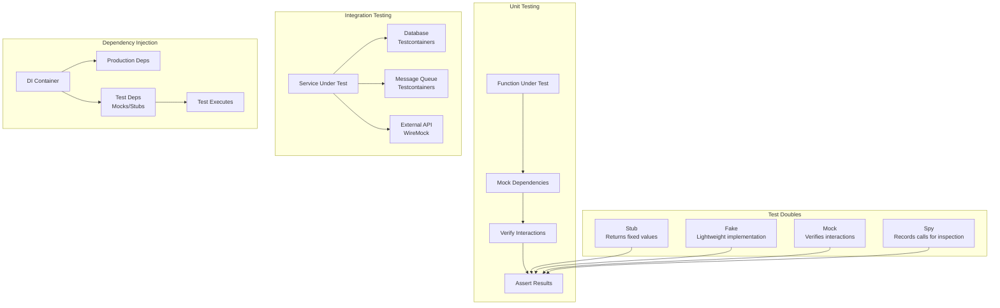
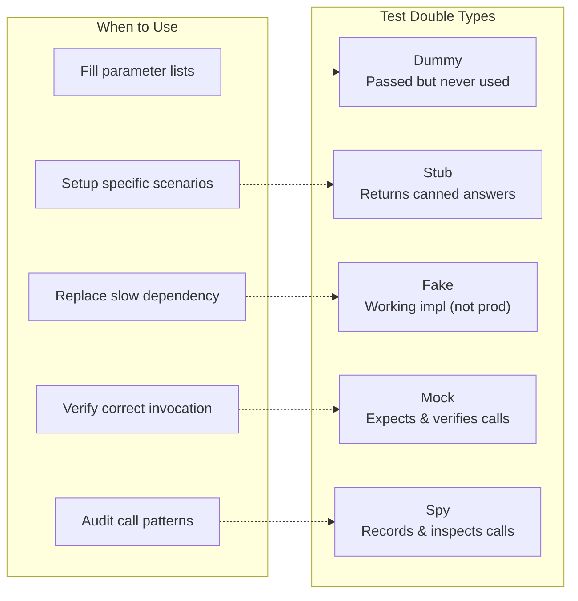
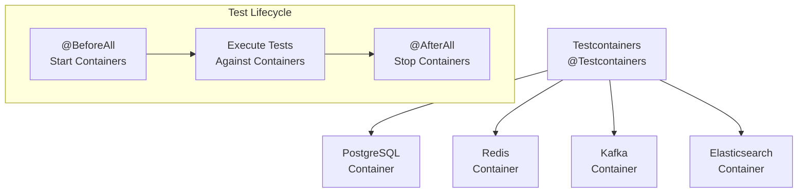

# 02 - Unit & Integration Testing

## Architecture Overview



## What Is Unit & Integration Testing?

**Unit testing** validates individual units of code (functions, methods, classes) in isolation, ensuring each piece behaves correctly. **Integration testing** verifies that multiple units work together correctly, validating interactions between components like databases, APIs, and message queues.

## Why They Were Created

Unit testing provides rapid feedback on code correctness at the smallest granularity. Integration testing catches interface mismatches and configuration errors that unit tests miss. Together, they form the foundation of a reliable automated test suite.

## When to Use

- **Unit tests**: Every function/method with non-trivial logic
- **Integration tests**: Every service boundary (DB, API, queue, file system)
- **Test doubles**: When real dependencies are slow, unavailable, or non-deterministic
- **DI for testability**: When constructing objects with complex dependencies

## Architecture Deep-Dive

### Mocking Frameworks

| Framework | Language | Key Features |
|-----------|----------|--------------|
| Mockito | Java | `@Mock`, `@InjectMocks`, `verify()`, `when()` |
| unittest.mock | Python | `patch()`, `Mock()`, `MagicMock()`, `side_effect` |
| Jest mock | JavaScript | `jest.fn()`, `jest.mock()`, `jest.spyOn()` |
| testify | Go | `mock.Mock`, `On()`, `Return()`, `AssertExpectations` |
| Moq | C# | `Mock<T>`, `Setup()`, `Verify()`, `Returns()` |
| RSpec | Ruby | `double()`, `allow()`, `expect().to receive()` |

### Test Doubles Explained



### Dependency Injection for Testability

**Without DI (hard to test)**:
```java
public class OrderService {
    private PaymentGateway gateway = new StripeGateway();
    private EmailService email = new SESEmailService();

    public void processOrder(Order order) {
        gateway.charge(order.getTotal());
        email.sendConfirmation(order);
    }
}
```

**With DI (testable)**:
```java
public class OrderService {
    private final PaymentGateway gateway;
    private final EmailService email;

    public OrderService(PaymentGateway gateway, EmailService email) {
        this.gateway = gateway;
        this.email = email;
    }

    public void processOrder(Order order) {
        gateway.charge(order.getTotal());
        email.sendConfirmation(order);
    }
}
```

### Integration Testing with Testcontainers

Testcontainers provides disposable Docker containers for integration testing:



### Database Testing Patterns

1. **In-Memory Database**: H2, HSQLDB — fast but SQL dialect differences
2. **Testcontainers**: Real PostgreSQL/MySQL in Docker — accurate but slower
3. **Database Migration Testing**: Flyway/Liquibase applied to test DB
4. **Fixture-Based**: Predefined data loaded before tests
5. **Factory-Based**: Generate test data programmatically

### Test Fixtures and Factories

**Fixture Example (Python)**:
```python
import pytest
from myapp.models import User

@pytest.fixture
def user_factory():
    def create_user(name="default", email=None):
        return User(
            name=name,
            email=email or f"{name}@example.com",
            role="member"
        )
    return create_user

def test_user_creation(user_factory):
    user = user_factory(name="Alice", email="alice@co.com")
    assert user.name == "Alice"
```

**Factory Example (Java + Lombok)**:
```java
@Builder
public class UserFixture {
    public static User.UserBuilder standard() {
        return User.builder()
            .name("default")
            .email("default@example.com")
            .role("member");
    }
}

@Test
void testUserCreation() {
    User user = UserFixture.standard()
        .name("Alice")
        .build();
    assertThat(user.getName()).isEqualTo("Alice");
}
```

## Hands-On Example

### Java: Unit Test with Mockito

```java
import static org.mockito.Mockito.*;
import static org.assertj.core.api.Assertions.*;

@ExtendWith(MockitoExtension.class)
class OrderServiceTest {

    @Mock
    private PaymentGateway paymentGateway;

    @Mock
    private EmailService emailService;

    @InjectMocks
    private OrderService orderService;

    @Test
    void shouldProcessOrderSuccessfully() {
        Order order = new Order(100.00, "USD");
        when(paymentGateway.charge(100.00, "USD"))
            .thenReturn(new PaymentResult("txn_123", true));

        orderService.processOrder(order);

        verify(paymentGateway).charge(100.00, "USD");
        verify(emailService).sendConfirmation(order);
    }

    @Test
    void shouldHandlePaymentFailure() {
        Order order = new Order(100.00, "USD");
        when(paymentGateway.charge(100.00, "USD"))
            .thenThrow(new PaymentException("Insufficient funds"));

        assertThatThrownBy(() -> orderService.processOrder(order))
            .isInstanceOf(PaymentException.class);

        verify(emailService, never()).sendConfirmation(any());
    }
}
```

### Python: Unit Test with unittest.mock

```python
from unittest.mock import Mock, patch
import pytest

def test_process_order_success():
    payment_gateway = Mock()
    email_service = Mock()
    order_service = OrderService(payment_gateway, email_service)

    payment_gateway.charge.return_value = PaymentResult("txn_123", True)

    order_service.process_order(Order(100.00, "USD"))

    payment_gateway.charge.assert_called_once_with(100.00, "USD")
    email_service.send_confirmation.assert_called_once()

def test_handle_payment_failure():
    payment_gateway = Mock()
    email_service = Mock()
    order_service = OrderService(payment_gateway, email_service)

    payment_gateway.charge.side_effect = PaymentException("Insufficient funds")

    with pytest.raises(PaymentException):
        order_service.process_order(Order(100.00, "USD"))

    email_service.send_confirmation.assert_not_called()
```

### Go: Unit Test with testify

```go
import (
    "testing"
    "github.com/stretchr/testify/mock"
    "github.com/stretchr/testify/assert"
)

type MockPaymentGateway struct {
    mock.Mock
}

func (m *MockPaymentGateway) Charge(amount float64, currency string) (*PaymentResult, error) {
    args := m.Called(amount, currency)
    return args.Get(0).(*PaymentResult), args.Error(1)
}

func TestProcessOrder_Success(t *testing.T) {
    gateway := new(MockPaymentGateway)
    email := new(MockEmailService)
    svc := NewOrderService(gateway, email)

    gateway.On("Charge", 100.00, "USD").
        Return(&PaymentResult{TxnID: "txn_123", Success: true}, nil)
    email.On("SendConfirmation", mock.AnythingOfType("*Order")).Return(nil)

    err := svc.ProcessOrder(&Order{Total: 100.00, Currency: "USD"})

    assert.NoError(t, err)
    gateway.AssertExpectations(t)
    email.AssertExpectations(t)
}
```

### Integration Test with Testcontainers (Java)

```java
import org.testcontainers.junit.jupiter.Container;
import org.testcontainers.junit.jupiter.Testcontainers;
import org.testcontainers.containers.PostgreSQLContainer;

@Testcontainers
class UserRepositoryIntegrationTest {

    @Container
    static PostgreSQLContainer<?> postgres = new PostgreSQLContainer<>("postgres:15")
        .withDatabaseName("testdb")
        .withUsername("test")
        .withPassword("test");

    @DynamicPropertySource
    static void configureProperties(DynamicPropertyRegistry registry) {
        registry.add("spring.datasource.url", postgres::getJdbcUrl);
        registry.add("spring.datasource.username", postgres::getUsername);
        registry.add("spring.datasource.password", postgres::getPassword);
    }

    @Autowired
    private UserRepository userRepository;

    @Test
    void shouldSaveAndFindUser() {
        User user = new User("Alice", "alice@example.com");
        User saved = userRepository.save(user);
        Optional<User> found = userRepository.findById(saved.getId());

        assertThat(found).isPresent();
        assertThat(found.get().getName()).isEqualTo("Alice");
    }
}
```

### Running Test Suites

```bash
# Java
mvn test
mvn verify -Pintegration-tests

# Python
pytest tests/unit
pytest tests/integration

# Go
go test ./...
go test -tags=integration ./...

# JavaScript/TypeScript
npm test -- --coverage
npx jest --testPathPattern=integration

# C#
dotnet test
dotnet test --filter Category=Integration
```

## Pricing / Cost Considerations

| Component | Cost |
|-----------|------|
| Mockito / unittest.mock / Jest | Free (open source) |
| Testcontainers | Free (open source) |
| Docker Desktop (CI licensing) | $5-15/developer/month |
| CI compute for test execution | $500-3000/month |
| Test data storage | $100-500/month |

## Best Practices

1. **Test behavior, not implementation** — refactoring should not break tests
2. **One assertion per test concept** — tests should verify one thing clearly
3. **Use descriptive test names** — `shouldThrowExceptionWhenPaymentFails` not `test1`
4. **Arrange-Act-Assert (AAA)** — structure tests consistently
5. **Avoid test interdependence** — each test should run independently
6. **Prefer real implementations over mocks** — mock at boundaries, not internally
7. **Test edge cases** — empty, null, max values, error conditions
8. **Keep tests fast** — slow tests become skipped tests
9. **Use test factories/builders** — reduce repetition in test setup
10. **Match production environment** — database version, OS, locale

## Interview Questions

1. What is the difference between a stub, a mock, and a fake?
2. How does dependency injection improve testability?
3. When would you use Testcontainers vs an in-memory database?
4. How do you mock static methods or private methods?
5. What is the difference between `verify()` and `assert()` in Mockito?
6. How do you handle flaky integration tests?
7. Explain the concept of test fixtures and when to use factory methods.
8. How do you test code that depends on external APIs or services?
9. What is the purpose of the `@InjectMocks` annotation in Mockito?
10. How do you structure integration tests for a microservices architecture?

## Real Company Usage Examples

| Company | Practice | Impact |
|---------|----------|--------|
| Google | Extensive mocking with custom frameworks | 150M+ tests run daily |
| Spotify | Integration tests with Testcontainers for backend services | Low regression rate |
| Netflix | Unit tests for chaos engineering tools | 99.99% reliability |
| Amazon | Code coverage gates with mandatory unit testing | Early defect detection |
| Uber | CI integration testing across 2000+ microservices | Rapid deployment cadence |
| Square | Heavy use of test doubles for payment processing | Payments reliability |
| Atlassian | Integration test suites with containerized dependencies | Zero-downtime deployments |
| GitHub | Factory-based test fixtures for API testing | Fast PR merging |
| Slack | Comprehensive unit testing for real-time messaging | High message delivery reliability |
| Shopify | Massive parallel test execution in CI | Sub-10 minute test suites |
