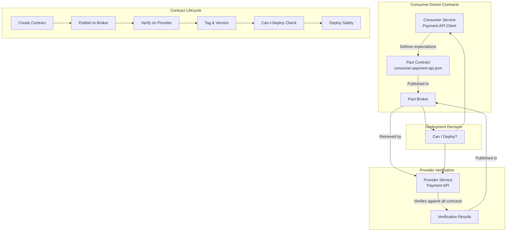
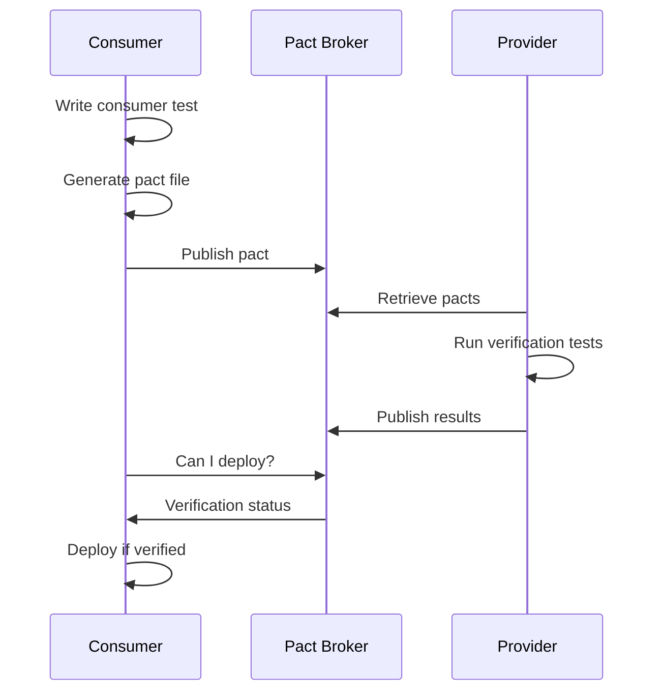

# 03 - Contract Testing

## Architecture Overview



## What Is Contract Testing?

Contract testing validates that services in a distributed system communicate correctly by testing each service's API against a shared contract. It ensures that a provider meets the expectations of all its consumers without requiring end-to-end test environments.

## Why It Was Created

In microservices architectures, integration testing between every pair of services becomes exponentially complex. Contract testing provides a scalable alternative: each consumer declares what it expects from a provider, and the provider verifies it can satisfy all consumers. This enables independent deployment with confidence.

## When to Use

- Microservices architectures with many service-to-service dependencies
- When teams own different services independently
- Before deploying provider changes that other services depend on
- When E2E test suites are too slow or flaky
- In polyglot environments (services in different languages)

## Architecture Deep-Dive

### Pact Framework

Pact is the leading contract testing framework supporting multiple languages:

| Component | Role |
|-----------|------|
| Pact Consumer Library | Generates contracts from consumer tests |
| Pact Provider Library | Verifies provider against contracts |
| Pact Broker | Stores, version, and shares contracts |
| Can-I-Deploy | Queries Broker for safe deployment |
| PactFlow | SaaS version with advanced features |

### Consumer-Driven Contracts (CDC)



### Provider Verification Process

```python
# provider_verification.py
from pact import Verifier

verifier = Verifier(provider="PaymentAPI",
                    provider_base_url="http://localhost:8080")

verify_result = verifier.verify_with_broker(
    broker_url="http://pact-broker:9292",
    broker_username="admin",
    broker_password="admin",
    publish_version="1.0.0",
    publish_verification_results=True
)

exit(0 if verify_result else 1)
```

### Can-I-Deploy

The Can-I-Deploy tool checks whether a deployed version of a service is compatible with other services in the environment:

```bash
# Check if PaymentAPI v1.0.0 can deploy to production
pact-broker can-i-deploy \
  --pacticipant PaymentAPI \
  --version 1.0.0 \
  --to-environment production

# Check multiple participants
pact-broker can-i-deploy \
  --pacticipant OrderService --version 2.1.0 \
  --pacticipant PaymentAPI --version 1.0.0 \
  --pacticipant NotificationService --version 1.5.0 \
  --to-environment staging
```

### Pact Broker

The Pact Broker stores and manages contracts:

- **Version management**: Tags (prod, staging, feature-branch)
- **Matrix view**: Shows which consumer/provider versions are compatible
- **Webhooks**: Trigger provider verification on new contracts
- **Network diagrams**: Visualize service dependencies
- **Badges**: Show verification status in README

### Bi-Directional Contracts

Beyond CDC, some teams use bi-directional contracts where both parties contribute:

```yaml
# OpenAPI-based contract with Pact extensions
openapi: 3.0.0
info:
  title: Payment API
  version: 1.0.0
paths:
  /payments:
    post:
      x-pact-consumer: [OrderService, BillingService]
      requestBody:
        content:
          application/json:
            schema:
              type: object
              required: [amount, currency]
              properties:
                amount:
                  type: number
                  minimum: 0.01
                currency:
                  type: string
                  pattern: "^[A-Z]{3}$"
      responses:
        '200':
          description: Successful payment
```

### Spring Cloud Contract

Spring Cloud Contract integrates contract testing with Spring Boot:

```groovy
// contracts/shouldReturnPaymentReceipt.groovy
Contract.make {
    description "should return payment receipt for valid payment"
    request {
        method POST()
        url "/api/payments"
        body([
            amount: 100.00,
            currency: "USD"
        ])
        headers {
            contentType applicationJson()
        }
    }
    response {
        status OK()
        body([
            transactionId: regex("[0-9a-f]{8}-[0-9a-f]{4}-[0-9a-f]{4}-[0-9a-f]{4}-[0-9a-f]{12}"),
            status: "completed",
            amount: 100.00,
            currency: "USD"
        ])
        headers {
            contentType applicationJson()
        }
    }
}
```

### Contract Testing vs Integration Testing

| Aspect | Contract Testing | Integration Testing |
|--------|-----------------|-------------------|
| Scope | API contract only | Full interaction including data flow |
| Environment | Isolated (mock consumer) | Connected services |
| Speed | Fast (ms) | Slow (seconds to minutes) |
| Maintenance | Low (auto-generated) | High (brittle, environment-dependent) |
| Confidence | Medium (syntax + semantics) | High (end-to-end behavior) |
| Scaling | Linear with services | Quadratic with services |

## Hands-On Example

### JavaScript: Consumer Test with Pact

```javascript
const { Pact } = require('@pact-foundation/pact');
const { API } = require('./payment-api-client');

describe('Payment API Client', () => {
    const provider = new Pact({
        consumer: 'OrderService',
        provider: 'PaymentAPI',
        port: 1234,
        log: './logs/pact.log',
        dir: './pacts',
    });

    beforeAll(() => provider.setup());
    afterAll(() => provider.finalize());

    describe('create payment', () => {
        beforeEach(() => {
            provider.addInteraction({
                state: 'a payment request exists',
                uponReceiving: 'a request to create a payment',
                withRequest: {
                    method: 'POST',
                    path: '/api/payments',
                    headers: { 'Content-Type': 'application/json' },
                    body: { amount: 100.00, currency: 'USD' },
                },
                willRespondWith: {
                    status: 200,
                    headers: { 'Content-Type': 'application/json' },
                    body: {
                        transactionId: like('123e4567-e89b-12d3-a456-426614174000'),
                        status: 'completed',
                    },
                },
            });
        });

        it('sends a payment request and returns receipt', async () => {
            const client = new API(provider.mockService.baseUrl);
            const result = await client.createPayment(100.00, 'USD');
            expect(result.transactionId).toBeDefined();
            expect(result.status).toBe('completed');
        });
    });
});
```

### Java: Provider Verification with Pact

```java
import au.com.dius.pact.provider.junit5.HttpTestTarget;
import au.com.dius.pact.provider.junit5.PactVerificationContext;
import au.com.dius.pact.provider.junitsupport.Provider;
import au.com.dius.pact.provider.junitsupport.State;
import au.com.dius.pact.provider.spring.junit5.MockMvcTestTarget;
import au.com.dius.pact.provider.spring.junit5.PactVerificationSpringProvider;

@SpringBootTest(webEnvironment = SpringBootTest.WebEnvironment.RANDOM_PORT)
@Provider("PaymentAPI")
@PactBroker(url = "${pact.broker.url}")
class PaymentApiProviderPactTest {

    @LocalServerPort
    int port;

    @BeforeEach
    void setUp(PactVerificationContext context) {
        context.setTarget(new HttpTestTarget("localhost", port));
    }

    @TestTemplate
    @ExtendWith(PactVerificationInvocationContextProvider.class)
    void pactVerificationTestTemplate(PactVerificationContext context) {
        context.verifyInteraction();
    }

    @State("a payment request exists")
    void setupPaymentRequest() {
        // Set up test data for the provider state
        Payment payment = new Payment("test-txn", 100.00, "USD");
        paymentRepository.save(payment);
    }
}
```

### Python: Contract Testing with Pact

```python
import atexit
from pact import Consumer, Provider

pact = Consumer('OrderService').has_pact_with(
    Provider('PaymentAPI'),
    host_name='localhost',
    port=1234
)

pact.start_service()
atexit.register(pact.stop_service)

def test_create_payment():
    expected = {
        'transactionId': '123e4567-e89b-12d3-a456-426614174000',
        'status': 'completed',
        'amount': 100.00,
        'currency': 'USD'
    }

    (pact
     .given('a payment request exists')
     .upon_receiving('a request to create a payment')
     .with_request('post', '/api/payments',
                   body={'amount': 100.00, 'currency': 'USD'},
                   headers={'Content-Type': 'application/json'})
     .will_respond_with(200,
                        body=expected,
                        headers={'Content-Type': 'application/json'}))

    with pact:
        client = PaymentAPIClient('http://localhost:1234')
        result = client.create_payment(100.00, 'USD')
        assert result == expected
```

### CI/CD Pipeline Integration

```yaml
# .github/workflows/contract-testing.yml
name: Contract Testing

on: [pull_request]

jobs:
  consumer-tests:
    runs-on: ubuntu-latest
    steps:
      - uses: actions/checkout@v3
      - uses: actions/setup-java@v3
        with:
          java-version: '17'
      - run: mvn test -pl order-service
      - name: Publish Pacts
        run: |
          pact-broker publish ./order-service/target/pacts \
            --consumer-app-version ${{ github.sha }} \
            --branch ${{ github.head_ref }} \
            --broker-base-url ${{ secrets.PACT_BROKER_URL }}
      - name: Can I Deploy?
        run: |
          pact-broker can-i-deploy \
            --pacticipant OrderService \
            --version ${{ github.sha }} \
            --to-environment production

  provider-verification:
    runs-on: ubuntu-latest
    steps:
      - uses: actions/checkout@v3
      - uses: actions/setup-java@v3
        with:
          java-version: '17'
      - run: mvn test -pl payment-api
      - name: Publish Verification Results
        run: |
          pact-broker publish-verification-results \
            --provider PaymentAPI \
            --provider-app-version ${{ github.sha }} \
            --broker-base-url ${{ secrets.PACT_BROKER_URL }}
```

## Pricing / Cost Considerations

| Tool | License | Pricing |
|------|---------|---------|
| Pact (open source) | MIT | Free |
| PactFlow (SaaS) | Commercial | $0-15,000+/month (usage-based) |
| Pact Broker (self-hosted) | MIT | Free (server costs only) |
| Spring Cloud Contract | Apache 2.0 | Free |
| PactNet (.NET) | MIT | Free |

**Self-Hosted Pact Broker Costs**:
- Small: ~$50/month (single VM or container)
- Medium: ~$200/month (replicated, database)
- Large: ~$500/month (HA, backup, monitoring)

## Best Practices

1. **Start with critical service boundaries** — payment, auth, user services
2. **Keep contracts focused on actual usage** — don't test unused paths
3. **Version contracts and use tags** — prod, staging, feature branches
4. **Run provider verification in CI** — before merging provider changes
5. **Use Can-I-Deploy as a quality gate** — prevent incompatible deployments
6. **Maintain contract hygiene** — review and remove unused contracts
7. **Test error responses** — include 4xx/5xx in contracts
8. **Document provider states clearly** — what data must exist for each test
9. **Monitor contract changes over time** — detect scope creep
10. **Combine with OpenAPI/Swagger** — use contracts for testing, specs for documentation

## Interview Questions

1. What problem does contract testing solve in microservices?
2. How does Pact's consumer-driven contract testing work?
3. What is the difference between contract testing and integration testing?
4. Explain the Can-I-Deploy tool and how it prevents breaking changes.
5. How do you handle multiple consumers with different expectations?
6. What are provider states in Pact and why are they important?
7. How do you integrate contract testing into a CI/CD pipeline?
8. When would you choose Spring Cloud Contract over Pact?
9. How do bi-directional contracts differ from consumer-driven contracts?
10. How do you handle versioning and backward compatibility in contracts?

## Real Company Usage Examples

| Company | Practice | Impact |
|---------|----------|--------|
| Spotify | Pact for service-to-service contracts | Independent deployment of 100+ services |
| Atlassian | Contract testing for micro-frontends | Safe UI component deployment |
| Microsoft | Pact in Azure DevOps for internal APIs | Reduced integration test failures by 70% |
| ANZ Bank | Pact for banking API ecosystem | Regulatory compliance with independent releases |
| Deliveroo | CDC for food delivery platform | Zero production API incompatibilities |
| Expedia | Pacts across 500+ travel services | Rapid feature rollout |
| Zendesk | Contract testing for customer service APIs | 99.99% API compatibility |
| Funding Circle | Pact for lending platform microservices | Weekly deployments without coordination |
| Cognito | Spring Cloud Contract in Java microservices | Reduced end-to-end test scope by 60% |
| REA Group | Pact Broker for property platform | 90% reduction in integration test execution time |
