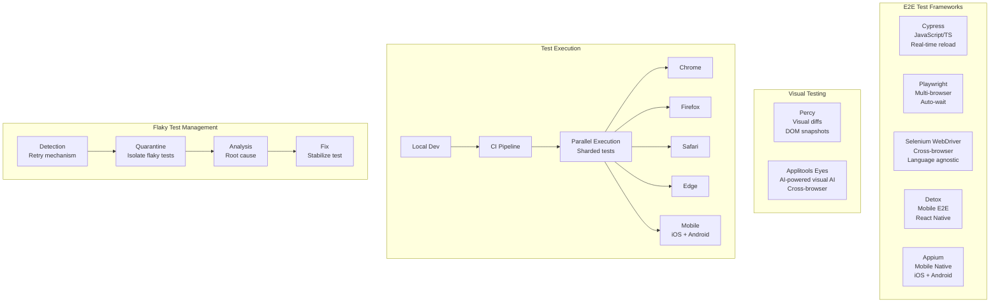
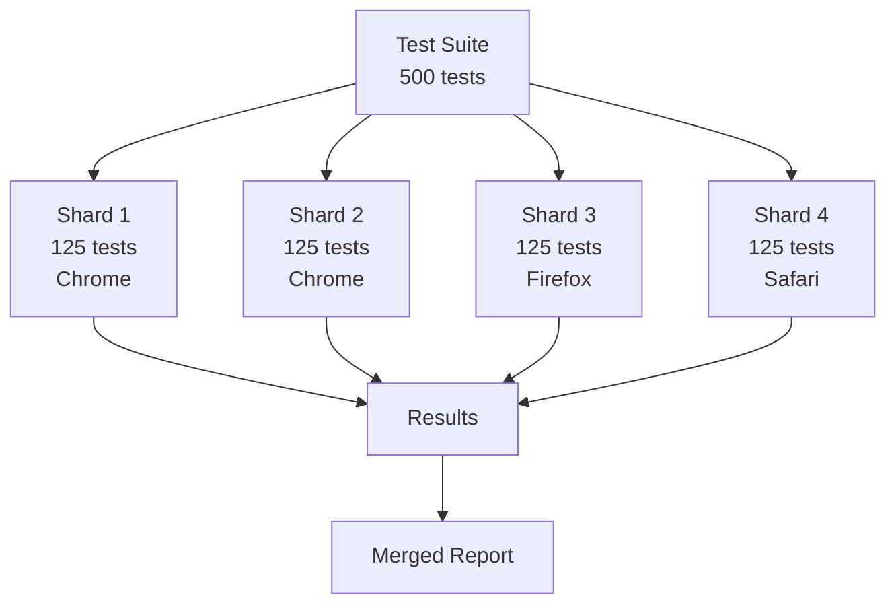

# 04 - End-to-End Testing

## Architecture Overview



## What Is End-to-End Testing?

End-to-End (E2E) testing validates complete user journeys through the entire application stack, from UI to backend services and databases. It tests the system as a real user would interact with it, covering all integrated components.

## Why It Was Created

Unit and integration tests verify individual components, but they cannot catch issues that only appear when the full system is running together — authentication flows across services, client-server data synchronization, or UI state management. E2E tests provide the highest confidence that the system works correctly from the user's perspective.

## When to Use

- Critical user journeys (signup, checkout, payment)
- Cross-service workflows spanning multiple teams
- Pre-release validation before production deployment
- Regression testing for major releases
- Visual regression detection for UI changes

## Architecture Deep-Dive

### Cypress

```javascript
// cypress/e2e/payment-flow.cy.js
describe('Payment Flow', () => {
    beforeEach(() => {
        cy.intercept('POST', '/api/payments', { fixture: 'payment.json' });
        cy.login('user@example.com', 'password123');
    });

    it('should complete a full payment checkout', () => {
        cy.visit('/products');
        cy.contains('Add to Cart').click();
        cy.get('[data-cy=cart-count]').should('contain', '1');
        cy.get('[data-cy=checkout-button]').click();

        cy.url().should('include', '/checkout');
        cy.get('[data-cy=card-number]').type('4242424242424242');
        cy.get('[data-cy=expiry]').type('12/28');
        cy.get('[data-cy=cvc]').type('123');
        cy.get('[data-cy=pay-button]').click();

        cy.contains('Payment Successful').should('be.visible');
        cy.get('[data-cy=transaction-id]').should('exist');
    });

    it('should show error for invalid card', () => {
        cy.visit('/checkout');
        cy.get('[data-cy=card-number]').type('0000000000000000');
        cy.get('[data-cy=pay-button]').click();
        cy.contains('Invalid card number').should('be.visible');
    });
});
```

### Playwright

```typescript
// tests/payment-flow.spec.ts
import { test, expect } from '@playwright/test';

test.describe('Payment Flow', () => {
    test('complete checkout successfully', async ({ page }) => {
        await page.route('**/api/payments', async route => {
            await route.fulfill({ json: { status: 'completed', transactionId: 'txn_123' } });
        });

        await page.goto('/products');
        await page.click('text=Add to Cart');
        await expect(page.locator('[data-cy=cart-count]')).toContainText('1');

        await page.click('[data-cy=checkout-button]');
        await page.fill('[data-cy=card-number]', '4242424242424242');
        await page.fill('[data-cy=expiry]', '12/28');
        await page.fill('[data-cy=cvc]', '123');
        await page.click('[data-cy=pay-button]');

        await expect(page.locator('text=Payment Successful')).toBeVisible();
    });

    test('handle payment error', async ({ page }) => {
        await page.route('**/api/payments', async route => {
            await route.fulfill({ status: 400, json: { error: 'card_declined' } });
        });

        await page.goto('/checkout');
        await page.fill('[data-cy=card-number]', '4000000000000002');
        await page.click('[data-cy=pay-button]');
        await expect(page.locator('text=Card declined')).toBeVisible();
    });
});
```

### Selenium WebDriver

```java
import org.openqa.selenium.*;
import org.openqa.selenium.chrome.ChromeDriver;
import org.openqa.selenium.support.ui.WebDriverWait;
import org.openqa.selenium.support.ui.ExpectedConditions;

public class PaymentFlowTest {
    public static void main(String[] args) {
        WebDriver driver = new ChromeDriver();
        try {
            driver.get("https://staging.example.com/products");

            WebElement addToCart = driver.findElement(By.xpath("//button[text()='Add to Cart']"));
            addToCart.click();

            WebDriverWait wait = new WebDriverWait(driver, 10);
            WebElement checkoutBtn = wait.until(
                ExpectedConditions.elementToBeClickable(By.cssSelector("[data-cy=checkout-button]"))
            );
            checkoutBtn.click();

            driver.findElement(By.cssSelector("[data-cy=card-number]")).sendKeys("4242424242424242");
            driver.findElement(By.cssSelector("[data-cy=pay-button]")).click();

            WebElement successMsg = wait.until(
                ExpectedConditions.visibilityOfElementLocated(By.xpath("//*[text()='Payment Successful']"))
            );
            assert successMsg.isDisplayed() : "Payment failed!";
        } finally {
            driver.quit();
        }
    }
}
```

### Visual Regression Testing

```javascript
// Percy + Cypress
describe('Visual Regression', () => {
    it('checkout page should match snapshot', () => {
        cy.visit('/checkout');
        cy.percySnapshot('Checkout Page - Default State');

        cy.get('[data-cy=card-number]').type('4242424242424242');
        cy.percySnapshot('Checkout Page - Card Entered');
    });
});

// Applitools + Playwright
import { Eyes, VisualGridRunner, Target } from '@applitools/eyes-playwright';

test('visual test for checkout page', async ({ page }) => {
    const eyes = new Eyes(new VisualGridRunner());
    await eyes.open(page, 'MyApp', 'Checkout Page');

    await page.goto('/checkout');
    await eyes.check('Checkout Page', Target.window().fully());

    await eyes.close();
});
```

### Mobile E2E Testing

**Detox (React Native)**:
```javascript
describe('Payment Flow', () => {
    beforeAll(async () => {
        await device.launchApp();
    });

    it('should complete mobile checkout', async () => {
        await element(by.text('Add to Cart')).tap();
        await expect(element(by.id('cart-count'))).toHaveText('1');

        await element(by.id('checkout-button')).tap();
        await element(by.id('card-number')).typeText('4242424242424242');
        await element(by.id('pay-button')).tap();

        await expect(element(by.text('Payment Successful'))).toBeVisible();
    });
});
```

**Appium (Native Mobile)**:
```python
from appium import webdriver
from appium.webdriver.common.appiumby import AppiumBy

desired_caps = {
    'platformName': 'iOS',
    'platformVersion': '16.0',
    'deviceName': 'iPhone 14',
    'app': '/path/to/app.app'
}

driver = webdriver.Remote('http://localhost:4723/wd/hub', desired_caps)

add_to_cart = driver.find_element(AppiumBy.ACCESSIBILITY_ID, 'Add to Cart')
add_to_cart.click()

checkout = driver.find_element(AppiumBy.ACCESSIBILITY_ID, 'checkout-button')
checkout.click()

card_input = driver.find_element(AppiumBy.ACCESSIBILITY_ID, 'card-number')
card_input.send_keys('4242424242424242')

pay_button = driver.find_element(AppiumBy.ACCESSIBILITY_ID, 'pay-button')
pay_button.click()

success = driver.find_element(AppiumBy.XPATH, "//*[contains(@label, 'Payment Successful')]")
assert success.is_displayed()

driver.quit()
```

### Flaky Test Management

```yaml
# .github/flaky-test-config.yml
flaky_test_detection:
  max_retries: 3
  flaky_threshold: 5% # >5% failure rate = flaky
  quarantine_after: 3 failures in 10 runs

auto_quarantine:
  enabled: true
  label: "flaky-test"
  assign_to: "@qa-team"
  create_issue: true

stabilization:
  max_retry_attempts: 2
  screenshot_on_failure: true
  video_recording: true
  log_collection: true
```

### Parallel Execution Strategy



## Hands-On Example

### Full Cypress E2E Setup

```javascript
// cypress.config.js
const { defineConfig } = require('cypress');

module.exports = defineConfig({
    e2e: {
        baseUrl: 'http://localhost:3000',
        viewportWidth: 1280,
        viewportHeight: 720,
        video: true,
        screenshotOnRunFailure: true,
        retries: {
            runMode: 2,
            openMode: 0,
        },
        defaultCommandTimeout: 10000,
        env: {
            apiUrl: 'http://localhost:8080/api',
        },
    },
});
```

```javascript
// cypress/support/commands.js
Cypress.Commands.add('login', (email, password) => {
    cy.session([email, password], () => {
        cy.visit('/login');
        cy.get('[data-cy=email]').type(email);
        cy.get('[data-cy=password]').type(password);
        cy.get('[data-cy=submit]').click();
        cy.url().should('not.include', '/login');
    });
});

Cypress.Commands.add('addToCart', (productName) => {
    cy.contains(productName).parent().within(() => {
        cy.get('[data-cy=add-to-cart]').click();
    });
});
```

### Playwright Configuration

```typescript
// playwright.config.ts
import { defineConfig, devices } from '@playwright/test';

export default defineConfig({
    testDir: './tests',
    fullyParallel: true,
    forbidOnly: !!process.env.CI,
    retries: process.env.CI ? 2 : 0,
    workers: process.env.CI ? 4 : undefined,
    reporter: [
        ['html'],
        ['json', { outputFile: 'test-results.json' }],
        ['junit', { outputFile: 'junit.xml' }],
    ],
    use: {
        baseURL: 'http://localhost:3000',
        trace: 'on-first-retry',
        screenshot: 'only-on-failure',
    },
    projects: [
        { name: 'chromium', use: { ...devices['Desktop Chrome'] } },
        { name: 'firefox', use: { ...devices['Desktop Firefox'] } },
        { name: 'webkit', use: { ...devices['Desktop Safari'] } },
        { name: 'Mobile Chrome', use: { ...devices['Pixel 5'] } },
        { name: 'Mobile Safari', use: { ...devices['iPhone 13'] } },
    ],
});
```

### CI Integration (GitHub Actions)

```yaml
name: E2E Tests
on:
  pull_request:
    types: [opened, synchronize]

jobs:
  e2e-tests:
    runs-on: ubuntu-latest
    strategy:
      fail-fast: false
      matrix:
        shard: [1, 2, 3, 4]
        browser: [chromium, firefox]

    services:
      postgres:
        image: postgres:15
        env:
          POSTGRES_PASSWORD: test
        options: >-
          --health-cmd pg_isready
          --health-interval 10s

    steps:
      - uses: actions/checkout@v3
      - uses: actions/setup-node@v3
        with:
          node-version: 18

      - name: Install dependencies
        run: npm ci

      - name: Start application
        run: |
          npm run build
          npm start &

      - name: Run Playwright tests
        run: npx playwright test --shard=${{ matrix.shard }}/4
          --project=${{ matrix.browser }}

      - uses: actions/upload-artifact@v3
        if: always()
        with:
          name: playwright-report-${{ matrix.shard }}-${{ matrix.browser }}
          path: playwright-report/
```

## Pricing / Cost Considerations

| Tool | Licensing | Cost |
|------|-----------|------|
| Cypress | MIT (OSS) / Cypress Cloud | Free / $75-1200/month |
| Playwright | Apache 2.0 | Free |
| Selenium | Apache 2.0 | Free |
| Detox | MIT | Free |
| Appium | Apache 2.0 | Free |
| Percy | Commercial | Free tier / $1000-5000/month |
| Applitools | Commercial | Free tier / $1500-10000/month |
| BrowserStack/SauceLabs | Commercial | $150-3000/month |
| LambdaTest | Commercial | $100-2000/month |

## Best Practices

1. **Test critical user journeys only** — don't E2E test everything
2. **Use data-cy attributes** — decouple tests from CSS/JS changes
3. **Minimize test flakiness** — use retries, wait for elements not time
4. **Run E2E in CI on merge** — not on every commit (too slow)
5. **Parallelize across shards and browsers** — reduce feedback time
6. **Record test runs** — video + screenshots for failure debugging
7. **Isolate test data** — each test creates and cleans up its own data
8. **Mock external services** — don't depend on third-party availability
9. **Use visual regression sparingly** — high-value but high-maintenance
10. **Integrate with CI/CD quality gates** — E2E tests protect production

## Interview Questions

1. When would you use E2E tests over integration tests?
2. How do you handle flaky E2E tests?
3. Compare Cypress, Playwright, and Selenium.
4. How do you structure E2E tests for a microservices application?
5. What strategies do you use for parallel E2E test execution?
6. How do you implement visual regression testing?
7. What is the role of test data in E2E testing?
8. How do you test on multiple browsers and mobile devices?
9. Explain your approach to mobile E2E testing.
10. How do you decide what to include in the E2E test suite vs other test levels?

## Real Company Usage Examples

| Company | Practice | Impact |
|---------|----------|--------|
| GitHub | Playwright for web E2E tests | 10,000+ tests, <15 min suite |
| Cypress (team) | Cypress for dashboard E2E | Comprehensive UI coverage |
| Slack | Detox for mobile E2E (React Native) | Reliable messaging across platforms |
| Autodesk | Visual regression with Percy | Catch unexpected visual changes |
| Walmart | Selenium Grid for cross-browser | 99.9% browser compatibility |
| Facebook | Appium for Instagram/FB apps | 2B+ user devices covered |
| Netflix | Custom E2E framework + Chaos | Resilient streaming experiences |
| AirBnB | Cypress + Playwright hybrid | Fast CI with broad coverage |
| Uber | Parallel E2E with mobile farms | 1000+ device testing |
| Tripadvisor | Visual regression with Applitools | Consistent UI across 48 markets |
