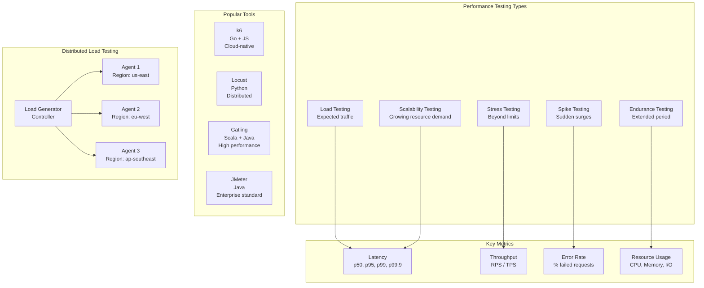
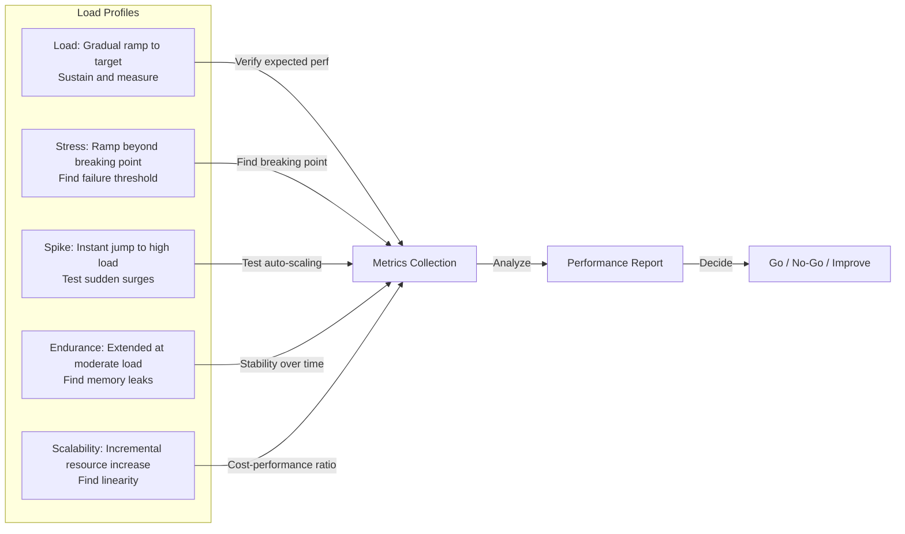
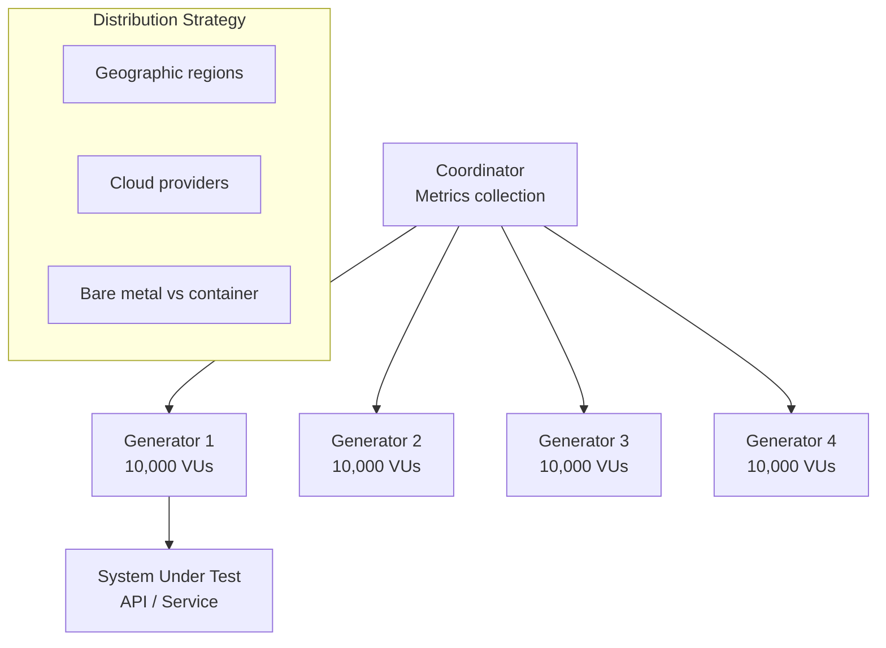

# 05 - Performance Testing

## Architecture Overview



## What Is Performance Testing?

Performance testing evaluates how a system behaves under various load conditions. It measures responsiveness, stability, scalability, and resource usage to ensure the application meets performance requirements.

## Why It Was Created

As applications grow in complexity and user base, performance degradation becomes a leading cause of user dissatisfaction and revenue loss. Performance testing ensures systems can handle expected (and unexpected) traffic, identifies bottlenecks before production, and validates that SLAs are met.

## When to Use

- Before major releases or capacity events
- When adding new features that affect critical paths
- When migrating infrastructure or databases
- As part of CI/CD for performance regression detection
- When setting up performance budgets

## Architecture Deep-Dive

### Types of Performance Testing



### Key Metrics Deep-Dive

| Metric | Definition | Target |
|--------|------------|--------|
| **p50 latency** | Median response time | <200ms for APIs |
| **p95 latency** | 95th percentile (1 in 20 slow) | <500ms for APIs |
| **p99 latency** | 99th percentile (1 in 100 slow) | <1000ms for APIs |
| **p99.9 latency** | 99.9th percentile (tail latency) | <3000ms for APIs |
| **Throughput** | Requests/transactions per second | Varies by system |
| **Error rate** | % of failed requests | <1% under load |
| **CPU usage** | % of CPU capacity | <80% under peak |
| **Memory usage** | Heap/stack utilization | No OOM, stable GC |

### Distributed Load Testing



### Performance Budgets

```yaml
# performance-budget.yml
api_endpoints:
  /api/payments:
    p95_latency: 200ms
    p99_latency: 500ms
    throughput: 1000 rps
    error_rate: 0.5%

  /api/orders:
    p95_latency: 300ms
    p99_latency: 800ms
    throughput: 500 rps
    error_rate: 1.0%

database:
  query_p95: 50ms
  connection_pool_usage: 80%

frontend:
  lighthouse_score: 90
  first_contentful_paint: 1.5s
  time_to_interactive: 3.0s
```

## Hands-On Example

### k6 Performance Test

```javascript
import http from 'k6/http';
import { check, sleep, group } from 'k6';
import { Rate, Trend, Counter } from 'k6/metrics';

const failureRate = new Rate('failed_requests');
const paymentLatency = new Trend('payment_latency');
const totalPayments = new Counter('total_payments');

export const options = {
    stages: [
        { duration: '2m', target: 100 },
        { duration: '5m', target: 100 },
        { duration: '2m', target: 200 },
        { duration: '5m', target: 200 },
        { duration: '2m', target: 0 },
    ],
    thresholds: {
        http_req_duration: ['p(95)<500', 'p(99)<2000'],
        failed_requests: ['rate<0.01'],
        payment_latency: ['p(95)<300'],
    },
    ext: {
        loadimpact: {
            projectID: 12345,
            distribution: {
                'amazon:us:ashburn': { loadZone: 'amazon:us:ashburn', percent: 50 },
                'amazon:gb:london': { loadZone: 'amazon:gb:london', percent: 30 },
                'amazon:jp:tokyo': { loadZone: 'amazon:jp:tokyo', percent: 20 },
            },
        },
    },
};

const BASE_URL = __ENV.BASE_URL || 'http://localhost:8080';

export default function () {
    group('Payment Flow', () => {
        const payload = JSON.stringify({
            amount: Math.random() * 500 + 10,
            currency: 'USD',
        });

        const params = {
            headers: { 'Content-Type': 'application/json' },
            tags: { name: 'createPayment' },
        };

        const response = http.post(`${BASE_URL}/api/payments`, payload, params);

        paymentLatency.add(response.timings.duration);
        totalPayments.add(1);

        const success = check(response, {
            'status is 200': (r) => r.status === 200,
            'response time < 500ms': (r) => r.timings.duration < 500,
            'has transaction ID': (r) => r.json('transactionId') !== undefined,
        });

        failureRate.add(!success);
    });

    sleep(Math.random() * 3 + 1);
}
```

### Locust Test

```python
from locust import HttpUser, task, between, constant
from locust.contrib.fasthttp import FastHttpUser
import random

class PaymentUser(HttpUser):
    wait_time = between(1, 3)
    host = "http://localhost:8080"

    def on_start(self):
        self.client.post("/auth/login", json={
            "username": "test_user",
            "password": "test_pass123"
        })

    @task(3)
    def create_payment(self):
        payload = {
            "amount": round(random.uniform(10, 500), 2),
            "currency": "USD"
        }
        with self.client.post(
            "/api/payments",
            json=payload,
            catch_response=True
        ) as response:
            if response.status_code == 200:
                response.success()
            elif response.status_code == 429:
                response.failure("Rate limited")
            else:
                response.failure(f"Status: {response.status_code}")

    @task(1)
    def get_payment_history(self):
        self.client.get("/api/payments?limit=10")

class StressUser(FastHttpUser):
    wait_time = constant(0)
    host = "http://localhost:8080"

    @task
    def burst_requests(self):
        for _ in range(100):
            self.client.get("/api/health")
```

### Running Tests

```bash
# k6
k6 run --vus 50 --duration 300s payment-test.js
k6 run --out csv=results.csv --out json=results.json payment-test.js
k6 cloud payment-test.js

# Locust
locust -f locustfile.py --headless -u 1000 -r 100 --run-time 10m --host http://localhost:8080
locust -f locustfile.py --web --host http://localhost:8080

# Gatling
mvn gatling:test -Dgatling.simulationClass=payments.PaymentSimulation
gatling.sh -s payments.PaymentSimulation -rf results/

# JMeter (CLI)
jmeter -n -t payment-test.jmx -l results.jtl -e -o report/
```

### Gatling Simulation

```scala
import io.gatling.core.Predef._
import io.gatling.http.Predef._
import scala.concurrent.duration._

class PaymentSimulation extends Simulation {

    val httpProtocol = http
        .baseUrl("http://localhost:8080")
        .acceptHeader("application/json")
        .contentTypeHeader("application/json")

    val paymentScenario = scenario("Payment Flow")
        .exec(http("Create Payment")
            .post("/api/payments")
            .body(StringBody("""{"amount": 150.00, "currency": "USD"}"""))
            .check(status.is(200))
            .check(jsonPath("$.transactionId").exists)
            .check(responseTimeInMillis.lte(500)))

    setUp(
        paymentScenario.inject(
            rampUsersPerSec(10).to(100).during(2.minutes),
            constantUsersPerSec(100).during(5.minutes),
            rampUsersPerSec(100).to(200).during(2.minutes),
            constantUsersPerSec(200).during(5.minutes),
        ).protocols(httpProtocol)
    ).assertions(
        global.responseTime.percentile4.lte(2000),
        global.successfulRequests.percent.gte(99),
        global.responseTime.mean.lte(500)
    )
}
```

### JMeter Configuration (via XML)

```xml
<?xml version="1.0" encoding="UTF-8"?>
<jmeterTestPlan version="1.2" properties="5.0">
  <hashTree>
    <TestPlan guiclass="TestPlanGui" testclass="TestPlan" testname="Payment API Load Test">
      <elementProp name="TestPlan.user_defined_variables" elementType="Arguments">
        <collectionProp name="Arguments.arguments">
          <elementProp name="base_url" elementType="Argument">
            <stringProp name="Argument.value">http://localhost:8080</stringProp>
          </elementProp>
        </collectionProp>
      </elementProp>
    </TestPlan>
    <hashTree>
      <ThreadGroup guiclass="ThreadGroupGui" testclass="ThreadGroup" testname="Users">
        <intProp name="ThreadGroup.num_threads">100</intProp>
        <intProp name="ThreadGroup.ramp_time">30</intProp>
        <stringProp name="ThreadGroup.duration">300</stringProp>
      </ThreadGroup>
      <hashTree>
        <HTTPSamplerProxy guiclass="HttpTestSampleGui" testclass="HTTPSamplerProxy" testname="Create Payment">
          <stringProp name="HTTPSampler.path">/api/payments</stringProp>
          <stringProp name="HTTPSampler.method">POST</stringProp>
          <stringProp name="HTTPSampler.postBodyRaw">true</stringProp>
          <elementProp name="HTTPsampler.Arguments" elementType="Arguments">
            <collectionProp name="Arguments.arguments">
              <elementProp name="body" elementType="Argument">
                <stringProp name="Argument.value">{"amount": 150.00, "currency": "USD"}</stringProp>
              </elementProp>
            </collectionProp>
          </elementProp>
        </HTTPSamplerProxy>
        <hashTree>
          <ResponseAssertion guiclass="AssertionGui" testclass="ResponseAssertion" testname="Assert Status">
            <intProp name="Assertion.test_field">response_code</intProp>
            <stringProp name="Assertion.test_string">200</stringProp>
          </ResponseAssertion>
        </hashTree>
      </hashTree>
    </hashTree>
  </hashTree>
</jmeterTestPlan>
```

### Performance Test CI Integration

```yaml
name: Performance Tests
on:
  schedule:
    - cron: '0 3 * * 1-5'
  workflow_dispatch:

jobs:
  perf-test:
    runs-on: ubuntu-latest
    steps:
      - uses: actions/checkout@v3

      - name: Deploy staging environment
        run: |
          kubectl apply -f k8s/staging/
          kubectl wait --for=condition=available --timeout=300s deployment/api

      - name: Run k6 performance tests
        run: |
          K6_CLOUD_TOKEN=${{ secrets.K6_CLOUD_TOKEN }} \
          BASE_URL=http://staging.example.com \
          k6 run --out cloud tests/perf/payment-test.js

      - name: Check performance budget
        run: |
          k6 inspect --thresholds results.json ||
            echo "Performance budget exceeded!"
```

## Pricing / Cost Considerations

| Tool | Cost |
|------|------|
| k6 OSS | Free |
| k6 Cloud | $99-3000+/month |
| Locust | Free (self-hosted) |
| Gatling OSS | Free |
| Gatling Enterprise | $500-5000+/month |
| JMeter | Free |
| BlazeMeter (JMeter Cloud) | $100-3000/month |
| LoadRunner | $5000-50000+/year |
| Flood.io | $200-2000/month |

**Distributed Load Generator Costs**:
- Self-hosted (AWS): $50-500/month
- Cloud-managed: $200-3000/month

## Best Practices

1. **Define performance requirements before testing** — explicit SLOs
2. **Test in a production-like environment** — matching hardware, data, network
3. **Monitor system resources during tests** — CPU, memory, I/O, network
4. **Create realistic load models** — based on production traffic patterns
5. **Test from multiple geographic locations** — account for network latency
6. **Include warm-up and cool-down periods** — avoid cold-start artifacts
7. **Automate performance tests in CI** — detect regressions early
8. **Investigate tail latency (p99.9)** — outliers matter
9. **Correlate performance metrics with business metrics** — revenue impact
10. **Document and review test results** — create dashboards for trends

## Interview Questions

1. What are the different types of performance testing and when do you use each?
2. Explain the difference between latency, throughput, and bandwidth.
3. Why is p99 latency important and how do you reduce it?
4. How do you design a realistic load model for performance testing?
5. What is the difference between open and closed workload models?
6. How do you identify performance bottlenecks in a distributed system?
7. How do you set and enforce performance budgets?
8. What strategies do you use for distributed load testing?
9. How do you correlate performance metrics with user experience?
10. What is the relationship between performance testing and capacity planning?

## Real Company Usage Examples

| Company | Practice | Impact |
|---------|----------|--------|
| Netflix | Chaos + Performance testing combined | 200M+ streams, 99.99% availability |
| Amazon | Performance testing at every deployment | Sub-second page loads |
| Google | Performance budgets for all products | Lighthouse metric improvements |
| Twitter | Load testing with custom distributed tool | Handle 500M+ tweets/day |
| Stripe | Payment API performance SLOs | p99 < 100ms for payments |
| Uber | Real-time performance monitoring + load testing | 40M+ trips/day reliability |
| Shopify | Black Friday load testing | 10x normal traffic handling |
| Slack | Latency budgets for messaging | <1s message delivery p99 |
| LinkedIn | Performance regression detection in CI | 0.5% latency degradation caught |
| AirBnB | Distributed load testing from multiple regions | Global booking reliability |
