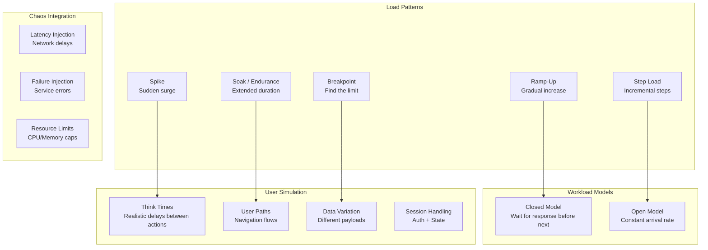
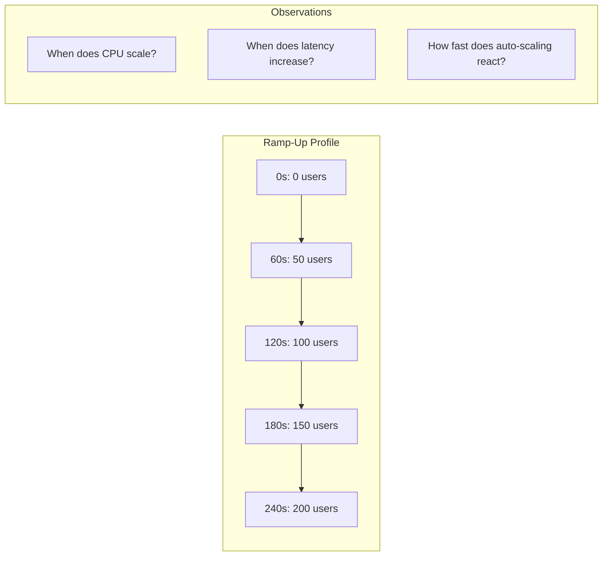
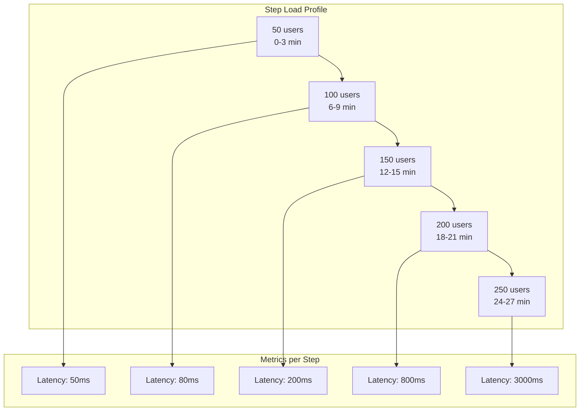
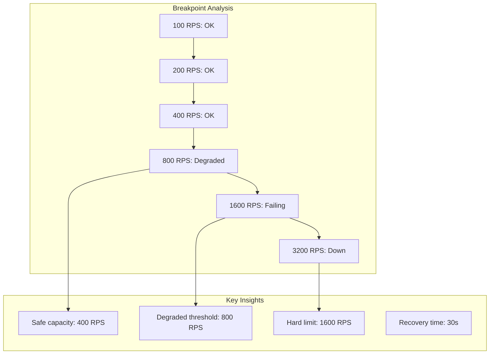

# 06 - Load Testing Patterns

## Architecture Overview



## What Are Load Testing Patterns?

Load testing patterns are reusable approaches for applying load to a system to measure its behavior under different traffic conditions. These patterns simulate real-world usage scenarios to identify performance characteristics, bottlenecks, and breaking points.

## Why They Were Created

Simple load tests (e.g., constant load) miss critical system behaviors — how it handles gradual growth, sudden spikes, sustained pressure, or resource exhaustion. Patterns provide a systematic methodology for exploring the full performance envelope of a system.

## When to Use

- Ramp-Up: Understanding scaling behavior and cold-start effects
- Step Load: Identifying exact capacity thresholds
- Spike: Testing auto-scaling and circuit breaker behavior
- Soak: Finding memory leaks and resource degradation over time
- Breakpoint: Determining maximum system capacity

## Architecture Deep-Dive

### Ramp-Up Pattern

Gradually increases load to understand system behavior during scaling:



**k6 Ramp-Up**:
```javascript
export const options = {
    stages: [
        { duration: '5m', target: 100 },
        { duration: '5m', target: 200 },
        { duration: '5m', target: 300 },
        { duration: '10m', target: 300 },
        { duration: '5m', target: 0 },
    ],
};
```

### Step Load Pattern

Increases load in discrete steps to find the exact capacity threshold:

```javascript
export const options = {
    stages: [
        { duration: '3m', target: 50 },
        { duration: '3m', target: 50 },
        { duration: '3m', target: 100 },
        { duration: '3m', target: 100 },
        { duration: '3m', target: 150 },
        { duration: '3m', target: 150 },
        { duration: '3m', target: 200 },
        { duration: '3m', target: 200 },
        { duration: '10m', target: 0 },
    ],
};
```



### Spike Testing Pattern

Tests system resilience under sudden traffic surges:

```javascript
export const options = {
    stages: [
        { duration: '2m', target: 50 },
        { duration: '10s', target: 500 },
        { duration: '3m', target: 500 },
        { duration: '10s', target: 50 },
        { duration: '2m', target: 50 },
        { duration: '10s', target: 1000 },
        { duration: '3m', target: 1000 },
        { duration: '10s', target: 50 },
        { duration: '5m', target: 0 },
    ],
};
```

Key observations:
- Auto-scaling response time
- Queue depth during spike
- Circuit breaker activation
- Rate limiting behavior
- Recovery time after spike

### Soak/Endurance Testing Pattern

Extended duration (hours or days) at moderate load:

```javascript
export const options = {
    stages: [
        { duration: '10m', target: 100 },
        { duration: '24h', target: 100 },
        { duration: '10m', target: 0 },
    ],
};
```

What to monitor:
- Memory growth (leak detection)
- Database connection pool exhaustion
- Disk space usage
- GC frequency and duration
- Log file rotation
- TLS certificate expiration
- Time-series database compaction

### Breakpoint Testing Pattern

Find the exact breaking point by increasing load until failure:

```javascript
export const options = {
    stages: [
        { duration: '2m', target: 100 },
        { duration: '2m', target: 200 },
        { duration: '2m', target: 400 },
        { duration: '2m', target: 800 },
        { duration: '2m', target: 1600 },
        { duration: '2m', target: 3200 },
    ],
};
```



### Closed vs Open Workload Models

**Closed Model**:
- Virtual user waits for response before sending next request
- Simulates interactive users (browsers, mobile apps)
- Throughput is limited by response time
- Can produce the "capping" effect

```javascript
import { sleep } from 'k6';

export default function () {
    http.get('http://test.k6.io');
    sleep(1); // think time
    // Waits for response + think time before next iteration
}
```

**Open Model**:
- New requests arrive at a constant rate regardless of response time
- Simulates event-driven or streaming systems
- Independent of system response time
- Better for queue and buffer testing

```javascript
import { counter } from 'k6';

export const options = {
    // Open model via arrival rate executor
    scenarios: {
        open_model: {
            executor: 'ramping-arrival-rate',
            startRate: 10,
            timeUnit: '1s',
            preAllocatedVUs: 50,
            maxVUs: 100,
            stages: [
                { target: 100, duration: '5m' },
                { target: 100, duration: '10m' },
            ],
        },
    },
};
```

### Think Times

Realistic delays between user actions to simulate human behavior:

```javascript
function thinkTime() {
    // Random think time between actions (normal distribution)
    const mean = 3000;
    const stdDev = 1000;
    const delay = Math.abs(randomNormal(mean, stdDev));
    sleep(delay / 1000);
}

function randomNormal(mean, stdDev) {
    let u = 0, v = 0;
    while (u === 0) u = Math.random();
    while (v === 0) v = Math.random();
    return Math.sqrt(-2.0 * Math.log(u)) * Math.cos(2.0 * Math.PI * v) * stdDev + mean;
}

export default function () {
    group('Browse Products', () => {
        http.get('/api/products');
        thinkTime();

        http.get('/api/products?category=electronics&page=2');
        thinkTime();

        http.get('/api/products/12345');
        thinkTime();
    });

    group('Checkout', () => {
        http.post('/api/cart', { productId: 12345, quantity: 1 });
        thinkTime();

        http.post('/api/payments', { amount: 150.00 });
        thinkTime();
    });
}
```

### Realistic User Simulation

```javascript
const userProfiles = [
    { type: 'browser', weight: 0.6, paths: ['browse', 'search', 'detail'] },
    { type: 'mobile', weight: 0.3, paths: ['search', 'quick-buy'] },
    { type: 'api', weight: 0.1, paths: ['batch', 'sync'] },
];

const productCatalog = [
    { id: 1, category: 'electronics', price: 299 },
    { id: 2, category: 'books', price: 19 },
    { id: 3, category: 'clothing', price: 49 },
];

function pickRandom(items) {
    return items[Math.floor(Math.random() * items.length)];
}

function weightedPick(profiles) {
    const totalWeight = profiles.reduce((sum, p) => sum + p.weight, 0);
    let random = Math.random() * totalWeight;
    for (const profile of profiles) {
        random -= profile.weight;
        if (random <= 0) return profile;
    }
    return profiles[0];
}

export default function () {
    const profile = weightedPick(userProfiles);

    if (profile.paths.includes('browse')) {
        http.get(`/api/products?category=${pickRandom(['electronics', 'books', 'clothing'])}`);
        sleep(Math.random() * 2 + 1);
    }

    if (profile.paths.includes('search')) {
        http.get(`/api/search?q=${pickRandom(['laptop', 'shirt', 'java'])}`);
        sleep(Math.random() * 1 + 0.5);
    }

    const product = pickRandom(productCatalog);
    http.post('/api/payments', {
        productId: product.id,
        amount: product.price,
        currency: 'USD'
    });
}
```

### Chaos Integration

Combining load testing with chaos engineering:

```javascript
import http from 'k6/http';
import { check } from 'k6';

export const options = {
    stages: [
        { duration: '5m', target: 200 },
        { duration: '5m', target: 500 },
        { duration: '5m', target: 1000 },
    ],
};

export default function () {
    // The system should handle load even with injected failures
    const responses = http.batch([
        ['GET', 'http://payment-service/api/health'],
        ['GET', 'http://order-service/api/health'],
        ['GET', 'http://notification-service/api/health'],
    ]);

    // Under chaos, some services may be degraded
    // Verify the system still maintains core functionality
    const healthyServices = responses.filter(r => r.status === 200).length;
    check(healthyServices, {
        'at least 2 of 3 services healthy': (count) => count >= 2,
    });
}
```

## Hands-On Example

### Comprehensive Load Test with k6

```javascript
import http from 'k6/http';
import { check, sleep, group } from 'k6';
import { Rate, Trend } from 'k6/metrics';

const errorRate = new Rate('errors');
const paymentTrend = new Trend('payment_duration');
const searchTrend = new Trend('search_duration');

export const options = {
    scenarios: {
        ramp_up: {
            executor: 'ramping-vus',
            startVUs: 0,
            stages: [
                { duration: '5m', target: 100 },
                { duration: '10m', target: 100 },
                { duration: '5m', target: 0 },
            ],
            gracefulRampDown: '30s',
        },
        spike_test: {
            executor: 'ramping-vus',
            startVUs: 0,
            stages: [
                { duration: '30s', target: 500 },
                { duration: '2m', target: 500 },
                { duration: '30s', target: 0 },
            ],
            startTime: '20m',
            gracefulRampDown: '30s',
        },
    },
    thresholds: {
        http_req_duration: ['p(95)<500', 'p(99)<2000'],
        errors: ['rate<0.05'],
        payment_duration: ['p(95)<300'],
    },
};

const BASE_URL = __ENV.BASE_URL || 'http://localhost:8080';

export default function () {
    group('Search and Browse', () => {
        const searchResp = http.get(`${BASE_URL}/api/products?q=laptop&page=1`);
        searchTrend.add(searchResp.timings.duration);
        check(searchResp, { 'search returned 200': (r) => r.status === 200 });
        sleep(Math.random() * 3 + 1);
    });

    group('Payment Flow', () => {
        const payload = JSON.stringify({
            productId: 123,
            amount: 299.99,
            currency: 'USD'
        });
        const payResp = http.post(`${BASE_URL}/api/payments`, payload, {
            headers: { 'Content-Type': 'application/json' },
        });
        paymentTrend.add(payResp.timings.duration);
        const success = check(payResp, {
            'payment success': (r) => r.status === 200,
        });
        errorRate.add(!success);
        sleep(Math.random() * 2 + 1);
    });
}
```

### Analysis and Reporting

```bash
# Generate detailed report
k6 run --summary-export=summary.json load-test.js

# Parse thresholds
cat summary.json | jq '.thresholds'

# Convert to HTML report
npm install -g k6-reporter
k6-reporter html --input results.json --output report.html
```

## Pricing / Cost Considerations

| Pattern | Infrastructure Cost | Duration Impact |
|---------|-------------------|-----------------|
| Ramp-Up | Low to Medium | Moderate |
| Step Load | Medium | Moderate |
| Spike | Low (short bursts) | Low |
| Soak | High (long running) | High |
| Breakpoint | Medium | Low |

**Cost-saving tips**:
- Run ramp-up tests on smaller instances first
- Use spot/preemptible instances for load generators
- Run soak tests during off-peak cloud hours
- Right-size generator instances (don't overprovision)

## Best Practices

1. **Start with ramp-up** — understand baseline before advanced patterns
2. **Use realistic user behavior** — mix of paths, think times, payloads
3. **Monitor system under test** — correlate load with infrastructure metrics
4. **Set clear success criteria** — define thresholds before running
5. **Warm up the system** — allow JIT compilation, cache warming
6. **Test recovery** — measure how fast system recovers after load drops
7. **Document test conditions** — environment, data, configuration
8. **Run in production-like environment** — avoid testing artifacts
9. **Combine patterns** — test multiple scenarios in one execution
10. **Automate and schedule** — run nightlies, trend analysis

## Interview Questions

1. What is the difference between closed and open workload models?
2. When would you use a spike test vs a ramp-up test?
3. How do you determine the right think times for load testing?
4. What is the breakpoint testing pattern and why is it important?
5. How long should a soak test run and what do you look for?
6. How do you simulate realistic user behavior in load tests?
7. What is the relationship between load patterns and auto-scaling?
8. How do you combine chaos engineering with load testing?
9. How do you analyze and report results from different load patterns?
10. What patterns would you use to test a new auto-scaling configuration?

## Real Company Usage Examples

| Company | Pattern Used | Outcome |
|---------|-------------|---------|
| Netflix | Spike + Chaos during streaming events | Handle 100x normal traffic |
| Amazon | Ramp-Up + Step load for Prime Day | Scale to millions of requests |
| Shopify | Breakpoint for Black Friday | Known capacity limits |
| Twitter | Spike testing for events (Super Bowl) | No downtime during spikes |
| Uber | Soak testing for dispatch system | 99.99% uptime over 24h+ |
| Stripe | Step load for payment processing | Find max TPS threshold |
| Slack | Ramp-Up for new message routing | Gradual adoption without perf loss |
| LinkedIn | Soak for feed algorithm changes | No memory leaks or degradation |
| AirBnB | Multi-pattern (ramp + spike) for booking | Handle holiday surges |
| Cloudflare | Breakpoint testing for DDoS protection | Identify capacity thresholds |
