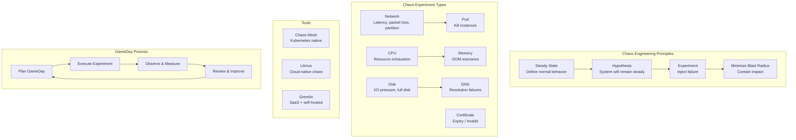
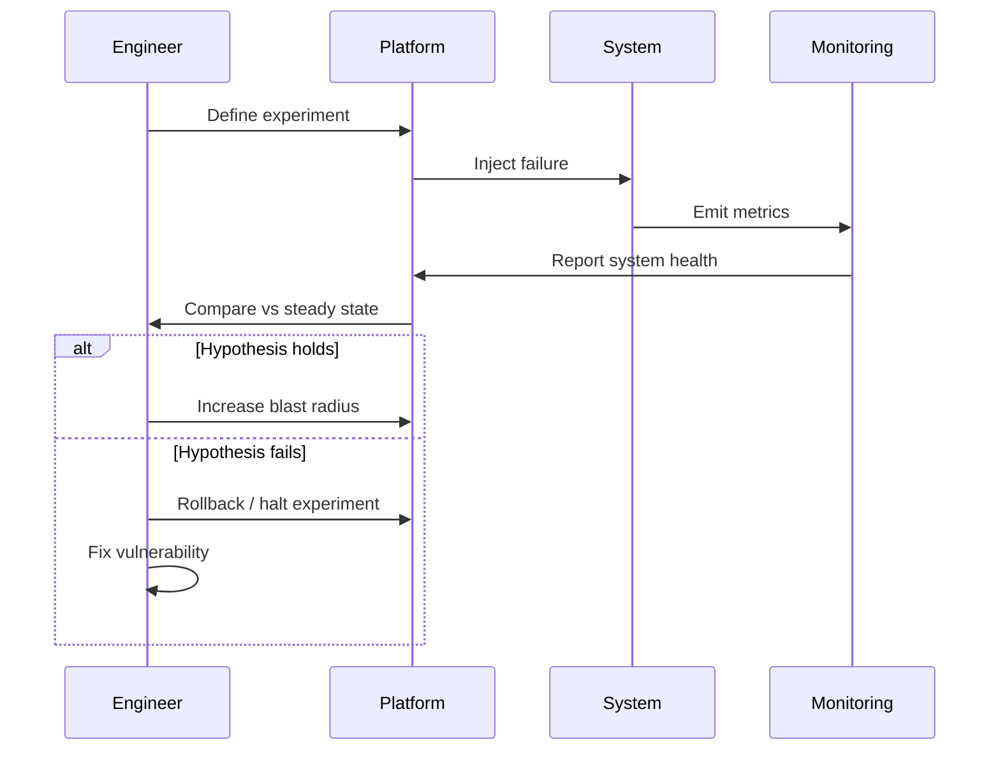
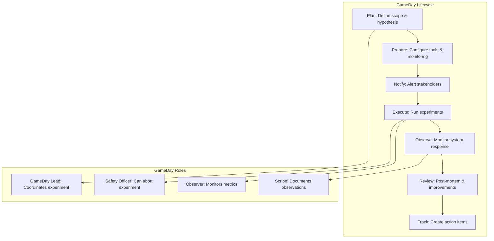

# 07 - Chaos Engineering

## Architecture Overview



## What Is Chaos Engineering?

Chaos engineering is the discipline of experimenting on a system to build confidence in its capability to withstand turbulent conditions in production. It involves intentionally injecting failures into a system to observe how it behaves, identify weaknesses, and improve resilience.

## Why It Was Created

Traditional testing validates that a system works when everything is normal. Production failures often involve complex interactions of multiple failures, cascading issues, and unexpected states. Chaos engineering proactively uncovers these blind spots before they cause user-facing incidents.

## When to Use

- Systems with high availability requirements (99.9%+)
- Microservices architectures with many dependencies
- After major infrastructure changes
- Regularly as part of operational readiness
- Before high-traffic events (Black Friday, product launches)

## Architecture Deep-Dive

### Principles of Chaos Engineering

**1. Define Steady State**:
```yaml
steady_state:
  metrics:
    - name: payment_success_rate
      threshold: "> 99.9%"
    - name: api_p99_latency
      threshold: "< 500ms"
    - name: error_rate
      threshold: "< 0.1%"
  duration: 5m  # Baseline measurement period
```

**2. Form a Hypothesis**:
```
If we kill one payment-service pod,
then the system will continue processing payments
with < 1% error rate and < 1s p99 latency increase.
```

**3. Run the Experiment**: Inject failure in a controlled way.

**4. Minimize Blast Radius**: Start small — one pod, one AZ, one region.

### Chaos Experiment Lifecycle



### Chaos Mesh

Chaos Mesh is a Kubernetes-native chaos engineering platform:

```yaml
# pod-kill-experiment.yaml
apiVersion: chaos-mesh.org/v1alpha1
kind: PodChaos
metadata:
  name: payment-service-pod-kill
  namespace: chaos-testing
spec:
  action: pod-kill
  mode: one
  selector:
    namespaces:
      - production
    labelSelectors:
      app: payment-service
  duration: 60s
  scheduler:
    cron: "@every 30m"
```

```yaml
# network-delay-experiment.yaml
apiVersion: chaos-mesh.org/v1alpha1
kind: NetworkChaos
metadata:
  name: network-delay-payment
  namespace: chaos-testing
spec:
  action: delay
  mode: all
  selector:
    namespaces:
      - production
    labelSelectors:
      app: payment-service
  delay:
    latency: 2000ms
    correlation: 50
    jitter: 500ms
  duration: 180s
  scheduler:
    cron: "@every 2h"
```

### Litmus Chaos

```yaml
# litmus-experiment.yaml
apiVersion: litmuschaos.io/v1alpha1
kind: ChaosEngine
metadata:
  name: payment-chaos
  namespace: litmus
spec:
  appinfo:
    appns: production
    applabel: app=payment-service
    appkind: deployment
  chaosServiceAccount: litmus-sa
  experiments:
    - name: pod-delete
      spec:
        components:
          env:
            - name: TOTAL_CHAOS_DURATION
              value: "60"
            - name: CHAOS_INTERVAL
              value: "10"
            - name: FORCE
              value: "true"
        probe:
          - name: check-payment-api
            type: httpProbe
            httpProbe/inputs:
              url: http://payment-service.production:8080/health
              expectedResponseCode: "200"
              insecureSkipVerify: false
    - name: pod-cpu-hog
      spec:
        components:
          env:
            - name: CPU_CORES
              value: "2"
            - name: TOTAL_CHAOS_DURATION
              value: "120"
    - name: pod-memory-hog
      spec:
        components:
          env:
            - name: MEMORY_CONSUMPTION
              value: "500MB"
            - name: TOTAL_CHAOS_DURATION
              value: "120"
```

### Gremlin

```bash
# Install Gremlin agent
curl -sSL https://get.gremlin.com | sudo bash
sudo gremlin init --team-id $GREMLIN_TEAM_ID

# Run a CPU attack
gremlin attack cpu \
  --length 60 \
  --capacity 0.8 \
  -l payment-service-host

# Run a network latency attack
gremlin attack latency \
  --length 120 \
  --latency 2000 \
  --jitter 500 \
  -l payment-service-host

# Run a blackhole (drop all traffic)
gremlin attack blackhole \
  --length 30 \
  -l payment-service-host \
  --target-name order-service.production.svc.cluster.local
```

### GameDay Process



### Chaos Experiment Types

**Network Experiments**:
```yaml
# Full network partition
apiVersion: chaos-mesh.org/v1alpha1
kind: NetworkChaos
metadata:
  name: payment-to-order-partition
spec:
  action: partition
  mode: all
  selector:
    namespaces: [production]
    labelSelectors:
      app: payment-service
  direction: both
  target:
    mode: all
    selector:
      namespaces: [production]
      labelSelectors:
        app: order-service
  duration: 60s
```

**CPU Exhaustion**:
```yaml
apiVersion: chaos-mesh.org/v1alpha1
kind: StressChaos
metadata:
  name: cpu-stress-payment
spec:
  mode: one
  selector:
    namespaces: [production]
    labelSelectors:
      app: payment-service
  stressors:
    cpu:
      workers: 4
      load: 80
  duration: 120s
```

**Memory Exhaustion**:
```yaml
apiVersion: chaos-mesh.org/v1alpha1
kind: StressChaos
metadata:
  name: memory-stress-payment
spec:
  mode: one
  selector:
    namespaces: [production]
    labelSelectors:
      app: payment-service
  stressors:
    memory:
      workers: 4
      size: 1GB
  duration: 120s
```

**Disk Pressure**:
```yaml
apiVersion: chaos-mesh.org/v1alpha1
kind: IOChaos
metadata:
  name: disk-stress-payment
spec:
  action: latency
  mode: one
  selector:
    namespaces: [production]
    labelSelectors:
      app: payment-service
  volumePath: /data
  path: /data/*
  delay: 100ms
  percent: 50
  duration: 180s
```

**Pod Failure**:
```yaml
apiVersion: chaos-mesh.org/v1alpha1
kind: PodChaos
metadata:
  name: random-pod-kill
spec:
  action: pod-kill
  mode: fixed-percent
  value: "25"
  selector:
    namespaces: [production]
    labelSelectors:
      app: payment-service
  duration: 30s
  scheduler:
    cron: "@every 1h"
```

## Hands-On Example

### Setting Up Chaos Mesh

```bash
# Install Chaos Mesh
helm repo add chaos-mesh https://charts.chaos-mesh.org
helm install chaos-mesh chaos-mesh/chaos-mesh \
  --namespace=chaos-mesh \
  --create-namespace \
  --set dashboard.securityMode=false \
  --set dashboard.persistentVolume.enabled=true

# Verify installation
kubectl get pods -n chaos-mesh

# Access dashboard
kubectl port-forward -n chaos-mesh svc/chaos-dashboard 2333:2333
```

### Running a GameDay Experiment

```bash
#!/bin/bash
# GameDay: Payment Service Resilience

echo "=== GameDay: Payment Service Resilience ==="
echo "Date: $(date)"
echo "Duration: 2 hours"
echo ""

echo "Step 1: Establish steady state"
kubectl run steady-state-check --image=busybox -- \
  wget -qO- http://payment-service:8080/health

echo "Step 2: Inject 2s network latency to payment service"
kubectl apply -f network-delay-payment.yaml

echo "Step 3: Observe for 2 minutes"
sleep 120

echo "Step 4: Measure impact"
kubectl run check --image=busybox -- \
  wget -qO- http://payment-service:8080/metrics

echo "Step 5: Kill 2 payment pods while latency is active"
kubectl scale deployment payment-service --replicas=4
kubectl delete pod -l app=payment-service --count=2

echo "Step 6: Observe recovery"
sleep 60

echo "Step 7: Clean up experiments"
kubectl delete -f network-delay-payment.yaml
echo "GameDay Complete."
```

### GameDay Runbook Template

```markdown
# GameDay Runbook: Payment Service Resilience

## Objective
Verify payment service remains available during network degradation.

## Hypothesis
Payment service will maintain > 99% success rate with < 2s additional latency when 500ms network delay is introduced to the database dependency.

## Experiment Details
- **Date**: 2025-06-15 14:00 UTC
- **Duration**: 60 minutes
- **Scope**: payment-service in production-us-east
- **Blast Radius**: Single availability zone

## Prerequisites
- [ ] Monitoring dashboards ready
- [ ] Incident response team on-call
- [ ] Stakeholders notified
- [ ] Rollback plan documented

## Timeline
| Time | Action | Expected |
|------|--------|----------|
| 14:00 | Establish baseline | p99 < 200ms |
| 14:10 | Inject network delay to DB | p99 increases but < 2s |
| 14:20 | Observe metrics | Error rate < 1% |
| 14:30 | Scale down by 2 pods | Auto-scaling triggers |
| 14:40 | Stop experiment | Recovery to baseline |
| 14:50 | Review results | Document findings |

## Success Criteria
- [ ] Payment success rate > 99%
- [ ] No P0/P1 incidents triggered
- [ ] Auto-scaling activated correctly
- [ ] Recovery within 60s of experiment end

## Rollback Plan
1. Delete Chaos Mesh experiment: `kubectl delete -f experiment.yaml`
2. Scale up deployment if needed: `kubectl scale deployment payment-service --replicas=5`
3. Verify health: `kubectl exec -it test-pod -- wget payment-service:8080/health`
```

### Programmatic Chaos Experiments

```python
# chaos_runner.py
import requests
import time
import json
from dataclasses import dataclass

@dataclass
class Experiment:
    name: str
    hypothesis: str
    duration: int
    action: str
    selector: dict

class ChaosRunner:
    def __init__(self, dashboard_url="http://chaos-dashboard:2333"):
        self.url = dashboard_url
        self.experiments = []

    def add_experiment(self, experiment: Experiment):
        self.experiments.append(experiment)

    def check_steady_state(self):
        response = requests.get(
            f"http://payment-service:8080/health",
            timeout=5
        )
        return response.status_code == 200

    def run_experiment(self, experiment: Experiment):
        print(f"Running: {experiment.name}")
        payload = {
            "kind": "PodChaos",
            "action": experiment.action,
            "duration": f"{experiment.duration}s",
            "selector": experiment.selector,
        }
        response = requests.post(
            f"{self.url}/api/experiments",
            json=payload
        )
        return response.status_code == 201

    def evaluate_hypothesis(self, experiment: Experiment):
        stable = self.check_steady_state()
        print(f"Hypothesis '{experiment.hypothesis}': {'PASS' if stable else 'FAIL'}")
        return stable

    def run_all(self):
        for exp in self.experiments:
            assert self.check_steady_state(), "System not in steady state!"
            self.run_experiment(exp)
            time.sleep(exp.duration + 30)
            self.evaluate_hypothesis(exp)

runner = ChaosRunner()
runner.add_experiment(Experiment(
    name="pod-kill-payment",
    hypothesis="Payment survives single pod failure",
    duration=30,
    action="pod-kill",
    selector={"namespaces": ["production"], "labelSelectors": {"app": "payment-service"}}
))
runner.run_all()
```

## Pricing / Cost Considerations

| Tool | Licensing | Cost |
|------|-----------|------|
| Chaos Mesh | Apache 2.0 | Free |
| Litmus | Apache 2.0 | Free / Enterprise from $15K/year |
| Gremlin | Commercial | Free tier / $500-5000+/month |
| Chaos Monkey (Netflix) | Apache 2.0 | Free |
| AWS Fault Injection Simulator | Per experiment | $0.20-1.00/experiment |

**Infrastructure Costs**:
- Dedicated chaos namespace: $50-200/month
- Monitoring and observability: $200-1000/month
- GameDay planning + execution: 2-4 engineer-days/month

## Best Practices

1. **Start small** — one pod, one service, one failure mode
2. **Always have a hypothesis** — know what you expect to happen
3. **Define steady state** — measure before, during, after
4. **Minimize blast radius** — production experiments must be contained
5. **Automate experiments** — scheduled chaos as part of operations
6. **Monitor during experiments** — real-time observability is critical
7. **Document findings** — create action items from each experiment
8. **Run GameDays regularly** — quarterly at minimum
9. **Include all teams** — dev, ops, product, support
10. **Fix vulnerabilities** — don't just document them, fix them

## Interview Questions

1. What is chaos engineering and how is it different from traditional testing?
2. Explain the four principles of chaos engineering.
3. What is a GameDay and how do you run one?
4. How do you determine the steady state of a system?
5. What's the difference between Chaos Mesh and Gremlin?
6. How do you minimize blast radius in production experiments?
7. How do you integrate chaos engineering with CI/CD?
8. What metrics do you monitor during a chaos experiment?
9. How do you handle a failed hypothesis during a GameDay?
10. Give examples of chaos experiments for a microservices payment system.

## Real Company Usage Examples

| Company | Practice | Impact |
|---------|----------|--------|
| Netflix | Chaos Monkey + Simian Army | 99.99% streaming reliability |
| Amazon | Fault injection testing | AWS service resilience |
| Google | DiRT (Disaster Recovery Testing) | Google Search reliability |
| Microsoft | Azure Chaos Studio | Cloud platform resilience |
| Uber | Chaos testing for dispatch | 40M+ trips/day reliability |
| LinkedIn | Project Chaos for feed service | Zero-downtime deployments |
| Capital One | Chaos engineering for banking | PCI-compliant resilience |
| Twilio | GameDays for telephony services | 99.999% API uptime |
| Slack | Chaos experiments for messaging | Real-time reliability |
| Shopify | Chaos testing pre-Black Friday | 10x traffic handling |
