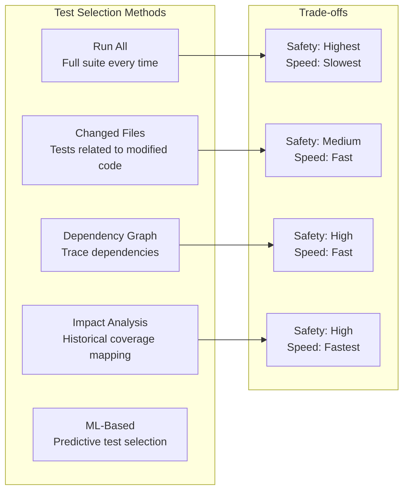
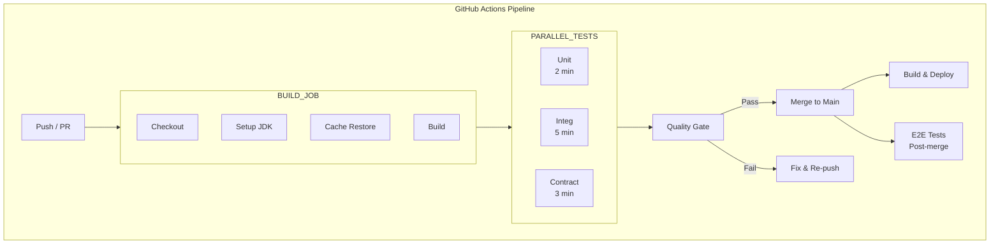

# 09 - CI Test Strategy

## Architecture Overview

```mermaid
graph TB
    subgraph "CI Pipeline Stages"
        COMMIT["Developer Commit"] --> LINT["Lint & Static Analysis"]
        LINT --> BUILD["Build"]
        BUILD --> SEL1["Test Selection<br/>Affected tests"]
        SEL1 --> PARALLEL["Parallel Test Execution"]

        subgraph "Test Execution"
            PARALLEL --> UNIT["Unit Tests"]
            PARALLEL --> INTEG["Integration Tests"]
            PARALLEL --> CONTRACT["Contract Tests"]
        end

        UNIT --> MERGE["Merge Results"]
        INTEG --> MERGE
        CONTRACT --> MERGE
    end

    subgraph "Quality Gates"
        MERGE -> COV["Coverage Check"]
        MERGE -> FLAKE["Flaky Detection"]
        MERGE -> PERF["Performance Budget"]
        COV -> DECIDE["Pass / Fail"]
        FLAKE -> DECIDE
        PERF -> DECIDE
    end

    subgraph "Merged to Main"
        DECIDE -> MAIN["Merge to Main<br/>Build & Deploy"]
        MAIN -> E2E["E2E Tests<br/>Post-merge"]
        E2E -> PROD["Production<br/>Canary Deploy"]
    end

    subgraph "Reporting"
        MERGE -> DASH["Test Dashboard"]
        DASH -> TRENDS["Trend Analysis"]
        DASH -> ALERTS["Flaky Test Alerts"]
    end
```

## What Is a CI Test Strategy?

A CI test strategy defines how tests are selected, executed, and evaluated within a continuous integration pipeline. It determines which tests run when, how they are parallelized, how quality gates are enforced, and how results are reported and acted upon.

## Why It Was Created

As codebases grow, running the full test suite on every commit becomes impractical. A CI test strategy optimizes for fast feedback by running the right tests at the right time, managing flaky tests, enforcing quality standards, and providing actionable insights.

## When to Use

- When the full test suite takes longer than 15 minutes
- When test execution costs are significant
- When flaky tests undermine confidence in CI
- When multiple teams contribute to the same repository
- When deploying to production multiple times per day

## Architecture Deep-Dive

### Test Selection Strategies



**Affected Tests with Dependency Graph**:

```python
# test_selector.py
import os
import json
from pathlib import Path

class TestSelector:
    def __init__(self, dependency_map_file="dependency-graph.json"):
        with open(dependency_map_file) as f:
            self.dependency_map = json.load(f)

    def get_changed_files(self, base_branch="main"):
        changed = os.popen(f"git diff --name-only {base_branch}...HEAD").read()
        return [f.strip() for f in changed.splitlines() if f.strip()]

    def get_affected_tests(self, changed_files):
        affected = set()
        for file in changed_files:
            if file in self.dependency_map:
                affected.update(self.dependency_map[file]["tests"])
        return list(affected)

    def select_tests(self):
        changed = self.get_changed_files()
        if len(changed) > 50:
            return None  # Too many changes, run all tests
        return self.get_affected_tests(changed)

selector = TestSelector()
tests = selector.select_tests()
if tests:
    print(f"Running {len(tests)} affected tests")
    os.environ["TEST_FILTER"] = " or ".join(tests)
else:
    print("Running full suite")
```

### Test Parallelization

```yaml
# Jenkins parallel pipeline
pipeline {
    agent none
    stages {
        stage('Parallel Tests') {
            parallel {
                stage('Unit Tests') {
                    agent { label 'linux' }
                    steps {
                        sh 'mvn test -pl payment-service -Dgroups=unit'
                    }
                }
                stage('Integration Tests Shard 1') {
                    agent { label 'linux' }
                    steps {
                        sh 'mvn test -pl payment-service -Dgroups=integration -Dshard=1 -DtotalShards=4'
                    }
                }
                stage('Integration Tests Shard 2') {
                    agent { label 'linux' }
                    steps {
                        sh 'mvn test -pl payment-service -Dgroups=integration -Dshard=2 -DtotalShards=4'
                    }
                }
                stage('Contract Tests') {
                    agent { label 'linux' }
                    steps {
                        sh 'mvn test -pl payment-service -Dgroups=contract'
                    }
                }
            }
        }
    }
}
```

### Flaky Test Detection and Management

```python
# flaky_detector.py
import json
import time
from collections import defaultdict

class FlakyTestDetector:
    def __init__(self, history_file="test_history.json"):
        self.history_file = history_file
        self.history = self._load_history()

    def _load_history(self):
        try:
            with open(self.history_file) as f:
                return json.load(f)
        except FileNotFoundError:
            return {"tests": {}}

    def record_result(self, test_name, passed, duration_ms):
        if test_name not in self.history["tests"]:
            self.history["tests"][test_name] = {
                "runs": [],
                "flaky_count": 0,
                "currently_flaky": False,
                "last_quarantined": None
            }

        test = self.history["tests"][test_name]
        test["runs"].append({
            "passed": passed,
            "duration_ms": duration_ms,
            "timestamp": int(time.time())
        })

        # Keep only last 30 runs
        test["runs"] = test["runs"][-30:]

        # Calculate flaky rate
        recent = test["runs"][-10:]
        failures = sum(1 for r in recent if not r["passed"])

        if failures >= 3:
            if not test["currently_flaky"]:
                test["flaky_count"] += 1
                test["currently_flaky"] = True
                test["last_quarantined"] = int(time.time())
                self._trigger_alert(test_name)
        else:
            test["currently_flaky"] = False

        self._save_history()

    def _trigger_alert(self, test_name):
        print(f"FLAKY TEST DETECTED: {test_name}")
        print(f"Auto-quarantining and creating JIRA ticket")

    def is_quarantined(self, test_name):
        test = self.history["tests"].get(test_name)
        if not test:
            return False
        if test["currently_flaky"]:
            # Auto-unquarantine after 7 days
            if test["last_quarantined"] and (time.time() - test["last_quarantined"]) > 604800:
                test["currently_flaky"] = False
                return False
            return True
        return False

    def _save_history(self):
        with open(self.history_file, "w") as f:
            json.dump(self.history, f, indent=2)

detector = FlakyTestDetector()

# In CI pipeline:
# for each test result:
#   detector.record_result(test_name, passed, duration_ms)
#   if detector.is_quarantined(test_name):
#       skip_test = True
```

### Test Splitting Algorithm

```python
# test_splitter.py
import json

class TestSplitter:
    def __init__(self, test_timings_file="test_timings.json"):
        with open(test_timings_file) as f:
            self.timings = json.load(f)

    def split_tests(self, total_shards, shard_index, tests):
        test_weights = [
            (test, self.timings.get(test, {"duration_ms": 1000})["duration_ms"])
            for test in tests
        ]

        test_weights.sort(key=lambda x: -x[1])
        shards = [[] for _ in range(total_shards)]
        shard_times = [0] * total_shards

        for test, duration in test_weights:
            # Assign to least-loaded shard
            min_shard = min(range(total_shards), key=lambda i: shard_times[i])
            shards[min_shard].append(test)
            shard_times[min_shard] += duration

        return shards[shard_index]

splitter = TestSplitter()
tests_for_this_shard = splitter.split_tests(4, 0, all_tests)
print(f"Running {len(tests_for_this_shard)} tests on shard 0")
```

### Build Cache Strategy

```yaml
# .github/workflows/build-cache.yml
name: Build with Cache
on: [push, pull_request]

jobs:
  build:
    runs-on: ubuntu-latest
    steps:
      - uses: actions/checkout@v3

      - name: Cache Maven dependencies
        uses: actions/cache@v3
        with:
          path: ~/.m2/repository
          key: ${{ runner.os }}-maven-${{ hashFiles('**/pom.xml') }}
          restore-keys: |
            ${{ runner.os }}-maven-

      - name: Cache Docker layers
        uses: actions/cache@v3
        with:
          path: /tmp/.buildx-cache
          key: ${{ runner.os }}-buildx-${{ github.sha }}
          restore-keys: |
            ${{ runner.os }}-buildx-

      - name: Build with Maven
        run: mvn compile -DskipTests

      - name: Build Docker image
        uses: docker/build-push-action@v4
        with:
          cache-from: type=local,src=/tmp/.buildx-cache
          cache-to: type=local,dest=/tmp/.buildx-cache-new
```

### Merge Gates

```yaml
# Branch protection rules (GitHub)
# Must be configured in repository Settings > Branches

branch_protection:
  pattern: main
  required_status_checks:
    - lint-and-typecheck
    - unit-tests
    - integration-tests
    - contract-tests
    - e2e-tests (staging)
    - coverage-threshold
    - no-flaky-tests-detected
  required_pull_request_reviews:
    required_approving_review_count: 1
    dismiss_stale_reviews: true
  required_linear_history: true
  allow_force_pushes: false
  allow_deletions: false
```

### Quality Gates in CI/CD

```yaml
# quality-gate.yml
name: Quality Gate
on:
  workflow_run:
    workflows: ["Test Pipeline"]
    types: [completed]

jobs:
  evaluate-gate:
    runs-on: ubuntu-latest
    steps:
      - name: Check coverage threshold
        run: |
          COVERAGE=$(curl -s ${{ secrets.SONAR_URL }}/api/measures/component \
            -d "component=payment-service&metricKeys=coverage" | \
            jq -r '.component.measures[0].value' | cut -d. -f1)
          if [ "$COVERAGE" -lt 85 ]; then
            echo "Coverage $COVERAGE% is below 85% threshold"
            exit 1
          fi
          echo "Coverage $COVERAGE% passes threshold"

      - name: Check flaky test count
        run: |
          FLAKY_COUNT=$(curl -s ${{ secrets.FLAKY_API }}/count)
          if [ "$FLAKY_COUNT" -gt 5 ]; then
            echo "Too many flaky tests ($FLAKY_COUNT)"
            exit 1
          fi
          echo "Flaky test count $FLAKY_COUNT is acceptable"

      - name: Check performance regression
        run: |
          RESPONSE=$(curl -s "${{ secrets.PERF_API }}/compare?baseline=main&current=${{ github.sha }}")
          LATENCY_CHANGE=$(echo $RESPONSE | jq -r '.p95_latency_change')
          if (( $(echo "$LATENCY_CHANGE > 10" | bc -l) )); then
            echo "Performance regression detected: $LATENCY_CHANGE% p95 latency increase"
            exit 1
          fi
          echo "Performance within budget"

      - name: Quality gate result
        run: |
          echo "All quality checks passed. Merge allowed."
```

### Test Reporting and Dashboards

```python
# test_dashboard.py
import json
from datetime import datetime, timedelta

class TestDashboard:
    def __init__(self):
        self.data = {
            "total_tests": 0,
            "passed": 0,
            "failed": 0,
            "skipped": 0,
            "flaky": 0,
            "duration_seconds": 0,
            "coverage_pct": 0,
            "trends": []
        }

    def update_from_ci(self, ci_results):
        self.data["total_tests"] = ci_results["total"]
        self.data["passed"] = ci_results["passed"]
        self.data["failed"] = ci_results["failed"]
        self.data["skipped"] = ci_results["skipped"]
        self.data["duration_seconds"] = ci_results["duration"]
        self.data["coverage_pct"] = ci_results["coverage"]
        self.data["timestamp"] = datetime.now().isoformat()

    def add_trend_point(self):
        self.data["trends"].append({
            "date": datetime.now().isoformat(),
            "total": self.data["total_tests"],
            "passed": self.data["passed"],
            "failed": self.data["failed"],
            "flaky": self.data["flaky"],
            "duration": self.data["duration_seconds"],
            "coverage": self.data["coverage_pct"]
        })
        if len(self.data["trends"]) > 90:
            self.data["trends"] = self.data["trends"][-90:]

    def get_health_score(self):
        if self.data["total_tests"] == 0:
            return 0
        pass_rate = self.data["passed"] / self.data["total_tests"]
        flaky_rate = self.data["flaky"] / self.data["total_tests"]
        coverage_score = min(self.data["coverage_pct"] / 85, 1.0)
        return round((pass_rate * 0.5 + (1 - flaky_rate) * 0.3 + coverage_score * 0.2) * 100, 1)

    def generate_report(self):
        return {
            "health_score": self.get_health_score(),
            "summary": self.data,
            "trends": self.data["trends"][-7:],
            "recommendations": self._generate_recommendations()
        }

    def _generate_recommendations(self):
        recs = []
        if self.data["flaky"] > 5:
            recs.append(f"Investigate {self.data['flaky']} flaky tests")
        if self.data["coverage_pct"] < 80:
            recs.append("Improve code coverage")
        if self.data["duration_seconds"] > 900:
            recs.append("Optimize test execution time")
        return recs

dash = TestDashboard()
print(json.dumps(dash.generate_report(), indent=2))
```

### CI Pipeline Visualization



## Hands-On Example

### GitHub Actions Full CI Pipeline

```yaml
name: CI Pipeline
on:
  pull_request:
    types: [opened, synchronize, reopened]
  push:
    branches: [main]

concurrency:
  group: ${{ github.workflow }}-${{ github.ref }}
  cancel-in-progress: true

env:
  CI: true
  JAVA_VERSION: '17'
  NODE_VERSION: '18'

jobs:
  detect-changes:
    runs-on: ubuntu-latest
    outputs:
      affected: ${{ steps.detect.outputs.affected }}
    steps:
      - uses: actions/checkout@v3
        with:
          fetch-depth: 0
      - id: detect
        run: |
          CHANGED=$(git diff --name-only origin/main...HEAD | head -c 2000)
          echo "affected=$CHANGED" >> $GITHUB_OUTPUT

  lint:
    needs: detect-changes
    runs-on: ubuntu-latest
    steps:
      - uses: actions/checkout@v3
      - uses: actions/setup-node@v3
        with:
          node-version: ${{ env.NODE_VERSION }}
          cache: npm
      - run: npm ci
      - run: npm run lint
      - run: npm run format:check

  test:
    needs: lint
    runs-on: ubuntu-latest
    strategy:
      fail-fast: false
      matrix:
        shard: [1, 2, 3, 4]
        type: [unit, integration]
    services:
      postgres:
        image: postgres:15
        env:
          POSTGRES_PASSWORD: test
        options: >-
          --health-cmd pg_isready
          --health-interval 10s
    steps:
      - uses: actions/checkout@v3
      - uses: actions/setup-java@v3
        with:
          java-version: ${{ env.JAVA_VERSION }}
          cache: maven
      - run: |
          mvn test \
            -Dgroups=${{ matrix.type }} \
            -Dshard=${{ matrix.shard }} \
            -DtotalShards=4
      - uses: actions/upload-artifact@v3
        if: always()
        with:
          name: test-results-${{ matrix.type }}-${{ matrix.shard }}
          path: target/surefire-reports/

  coverage:
    needs: test
    runs-on: ubuntu-latest
    steps:
      - uses: actions/checkout@v3
      - uses: actions/setup-java@v3
        with:
          java-version: ${{ env.JAVA_VERSION }}
          cache: maven
      - run: mvn jacoco:report
      - uses: actions/upload-artifact@v3
        with:
          name: coverage-report
          path: target/site/jacoco/
      - name: Check coverage threshold
        run: |
          COV=$(mvn jacoco:check 2>&1 | grep -oP 'Total.*?(\d+\.?\d*)%' | grep -oP '\d+\.?\d*')
          if (( $(echo "$COV < 85" | bc -l) )); then
            echo "Coverage $COV% is below 85%"
            exit 1
          fi

  flaky-detection:
    needs: test
    runs-on: ubuntu-latest
    steps:
      - uses: actions/checkout@v3
      - name: Download test history
        uses: actions/cache@v3
        with:
          path: .test-history
          key: test-history-${{ github.ref }}
      - name: Analyze flaky tests
        run: |
          python scripts/flaky_detector.py \
            --history .test-history \
            --results target/surefire-reports/
```

## Pricing / Cost Considerations

| Component | Cost |
|-----------|------|
| GitHub Actions (free) | 2000 min/month (free) / $0.008/min |
| CircleCI | Free tier / $30-3000+/month |
| Jenkins (self-hosted) | Free (server costs apply) |
| Build cache storage | $50-500/month |
| Test reporting tools | $0-500/month |
| Parallel execution agents | $0-1000/month |

## Best Practices

1. **Run the fastest tests first** — fail fast
2. **Use test selection** — only run affected tests when possible
3. **Parallelize aggressively** — split by timing, not by filename
4. **Detect and quarantine flaky tests** — don't block PRs
5. **Set quality gates** — coverage, performance, lint thresholds
6. **Cache dependencies and build outputs** — speed up repeated runs
7. **Use merge queues** — batch and validate before merging
8. **Monitor CI health** — track duration, pass rate, flakiness trends
9. **Fail fast with early stages** — lint before test, test before deploy
10. **Provide actionable reports** — clear failures, stack traces, artifacts

## Interview Questions

1. How do you design a CI pipeline for a large monorepo?
2. Explain test selection strategies and when to use each.
3. How do you detect, track, and manage flaky tests in CI?
4. What are quality gates and how do you implement them in CI/CD?
5. How do you split tests across parallel CI runners?
6. What metrics do you track for CI pipeline health?
7. How do you handle merge conflicts between CI results?
8. How do you balance test coverage with CI execution time?
9. What is the role of build caching in CI test strategy?
10. How do you implement canary deployments with quality gates?

## Real Company Usage Examples

| Company | Practice | Impact |
|---------|----------|--------|
| Google | Test selection by dependency graph | 150M+ tests daily |
| Meta | Flaky test detection at scale | 99.9% CI reliability |
| Uber | Test splitting with timing history | 50% reduction in CI time |
| Netflix | Canary deployment quality gates | Safe continuous delivery |
| Shopify | Parallel test execution (1000+ workers) | <10 min full test suite |
| LinkedIn | Affected test selection for monorepo | 60% test reduction |
| Twitter | Flaky test quarantine system | 80% flakiness reduction |
| GitHub | Merge queues with batch testing | 5x faster merges |
| Etsy | Continuous deployment CI pipeline | 50+ deployments/day |
| Spotify | Squad-owned CI with quality gates | Zero production regressions |
