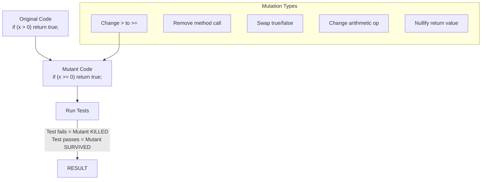
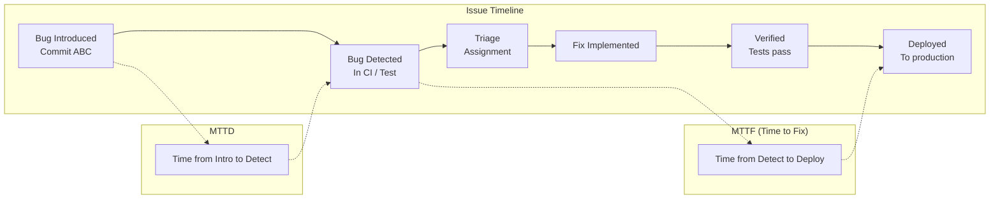

# 10 - Quality Metrics

## Architecture Overview

```mermaid
graph TB
    subgraph "Code Coverage"
        LINE["Line Coverage<br/>% lines executed"]
        BRANCH["Branch Coverage<br/>% branches taken"]
        MUTATION["Mutation Testing<br/>Code change survival rate"]
    end

    subgraph "Code Quality Metrics"
        COMPLEXITY["Cyclomatic Complexity<br/>Code path count"]
        DEFECT["Defect Density<br/>Bugs per KLOC"]
        MTTR["Mean Time to Repair<br/>Time to fix issues"]
        MTTD["Mean Time to Detect<br/>Time to discover issues"]
    end

    subgraph "DORA Metrics"
        DEPLOY_FREQ["Deployment Frequency<br/>How often we deploy"]
        LEAD_TIME["Lead Time for Changes<br/>Time from commit to prod"]
        MTTR_DORA["Time to Restore<br/>Time to recover from incident"]
        CHANGE_FAIL["Change Failure Rate<br/>% of deployments causing issues"]
    end

    subgraph "SLI/SLO for Quality"
        APT["API Success Rate<br/>SLI: % successful requests"]
        LATENCY["Latency<br/>SLI: p95 < 500ms"]
        COVERAGE_SLO["Coverage<br/>SLI: % line coverage"]
    end

    subgraph "Code Review Metrics"
        REVIEW_TIME["Review Time<br/>Time to first review"]
        COMMENTS["Comments per PR<br/>Review thoroughness"]
        REVISIONS["Revisions per PR<br/>Iteration count"]
    end

    LINE --> BRANCH --> MUTATION
    COMPLEXITY --> DEFECT
    DEFECT --> MTTR --> MTTD
    DEPLOY_FREQ --> LEAD_TIME --> MTTR_DORA --> CHANGE_FAIL
    APT --> LATENCY --> COVERAGE_SLO
    REVIEW_TIME --> COMMENTS --> REVISIONS
```



## What Are Quality Metrics?

Quality metrics are quantifiable measures used to evaluate the quality of software products and the effectiveness of testing processes. They provide objective data to make informed decisions about release readiness, process improvements, and resource allocation.

## Why They Were Created

Without metrics, quality is subjective — one person's "good enough" is another's "unacceptable." Quality metrics provide objective, data-driven visibility into the state of the product, enabling teams to set targets, track trends, and make evidence-based decisions about when to ship.

## When to Use

- Establishing quality standards for a new project
- Tracking quality trends over releases
- Setting release readiness criteria
- Evaluating testing process effectiveness
- Reporting quality status to stakeholders
- Continuous improvement initiatives

## Architecture Deep-Dive

### Code Coverage

**Line Coverage**: Percentage of executable lines executed during testing.

**Branch Coverage**: Percentage of decision points (if/else, switch, loops) where both true and false branches are executed.

**Mutation Testing**: Introduces small changes (mutations) into the code and checks if tests detect them:



**PIT (Java Mutation Testing)**:

```xml
<plugin>
    <groupId>org.pitest</groupId>
    <artifactId>pitest-maven</artifactId>
    <version>1.14.0</version>
    <configuration>
        <targetClasses>
            <param>com.payment.service.*</param>
        </targetClasses>
        <targetTests>
            <param>com.payment.service.*Test</param>
        </targetTests>
        <mutationThreshold>85</mutationThreshold>
        <coverageThreshold>90</coverageThreshold>
        <timestampedReports>false</timestampedReports>
    </configuration>
</plugin>
```

```bash
# Run PIT mutation testing
mvn org.pitest:pitest-maven:mutationCoverage

# View report at target/pit-reports/index.html
```

**Stryker (JS/TS Mutation Testing)**:

```json
{
    "stryker": {
        "packageManager": "npm",
        "reporters": ["html", "progress", "dashboard"],
        "testRunner": "jest",
        "coverageAnalysis": "perTest",
        "thresholds": {
            "high": 85,
            "low": 70,
            "break": 60
        },
        "mutate": [
            "src/**/*.ts",
            "!src/**/*.spec.ts"
        ]
    }
}
```

```bash
# Run Stryker mutation testing
npx stryker run
```

### Cyclomatic Complexity

Cyclomatic complexity measures the number of linearly independent paths through a program's source code:

```
M = E - N + 2P

Where:
M = Cyclomatic complexity
E = Number of edges in the control flow graph
N = Number of nodes
P = Number of connected components

Thresholds:
1-10: Simple, low risk
11-20: Moderate complexity
21-50: High complexity, consider refactoring
50+: Untestable, must refactor
```

```java
// Complexity: 1 (single path)
public String getStatus() {
    return "active";
}

// Complexity: 3 (if + else + base)
public String getStatus(boolean isActive, boolean isVerified) {
    if (isActive && isVerified) {
        return "active_verified";
    } else if (isActive) {
        return "active_pending";
    }
    return "inactive";
}

// Complexity: 7 (multiple conditions + switch)
public String getOrderStatus(Order order) {
    if (order == null || order.getItems() == null || order.getItems().isEmpty()) {
        return "empty";
    }

    switch (order.getPaymentStatus()) {
        case PENDING: return "awaiting_payment";
        case PROCESSING: return "processing";
        case COMPLETED: return order.isShipped() ? "shipped" : "ready_to_ship";
        case FAILED: return "payment_failed";
        default: return "unknown";
    }
}
```

### Defect Density

```
Defect Density = Total Defects / Size (KLOC)

Industry Benchmarks:
- < 1 defect/KLOC: Excellent
- 1-5 defects/KLOC: Good
- 5-10 defects/KLOC: Average
- 10-20 defects/KLOC: Needs improvement
- > 20 defects/KLOC: Critical
```

### Mean Time to Detect (MTTD) / Mean Time to Fix (MTTF)



### DORA Metrics for Quality

| Metric | Definition | Elite | High | Medium | Low |
|--------|------------|-------|------|--------|-----|
| Deployment Frequency | How often code is deployed | Multiple times/day | Weekly to monthly | Monthly to every 6 months | Fewer than every 6 months |
| Lead Time for Changes | Time from commit to production | < 1 hour | 1 day to 1 week | 1 week to 1 month | > 6 months |
| Time to Restore Service | Time to recover from incidents | < 1 hour | < 1 day | < 1 week | > 1 month |
| Change Failure Rate | % deployments causing incidents | < 5% | < 10% | < 15% | > 30% |

**Quality-aware DORA dashboard**:

```python
# dora_metrics.py
from datetime import datetime, timedelta
import json

class DORAMetrics:
    def __init__(self):
        self.metrics = {
            "deployment_frequency": [],
            "lead_time_changes": [],
            "time_to_restore": [],
            "change_failure_rate": []
        }

    def record_deployment(self, timestamp, success, duration_hours):
        self.metrics["deployment_frequency"].append({
            "timestamp": timestamp,
            "success": success,
            "duration_hours": duration_hours
        })

    def record_incident(self, timestamp, severity, time_to_resolve_minutes):
        self.metrics["time_to_restore"].append({
            "timestamp": timestamp,
            "severity": severity,
            "time_to_resolve_minutes": time_to_resolve_minutes
        })

    def calculate_change_failure_rate(self, days=30):
        cutoff = datetime.now() - timedelta(days=days)
        recent = [d for d in self.metrics["deployment_frequency"]
                  if datetime.fromisoformat(d["timestamp"]) > cutoff]
        if not recent:
            return 0
        failures = sum(1 for d in recent if not d["success"])
        return round(failures / len(recent) * 100, 2)

    def get_performance_level(self):
        cfr = self.calculate_change_failure_rate()
        if cfr < 5:
            return "Elite"
        elif cfr < 10:
            return "High"
        elif cfr < 15:
            return "Medium"
        else:
            return "Low"

    def generate_report(self):
        return {
            "change_failure_rate": self.calculate_change_failure_rate(),
            "performance_level": self.get_performance_level(),
            "deployments_recorded": len(self.metrics["deployment_frequency"]),
            "incidents_recorded": len(self.metrics["time_to_restore"]),
            "avg_time_to_restore_minutes": self._avg_time_to_restore()
        }

    def _avg_time_to_restore(self):
        times = [i["time_to_resolve_minutes"] for i in self.metrics["time_to_restore"]]
        return round(sum(times) / len(times), 1) if times else 0

dora = DORAMetrics()
print(json.dumps(dora.generate_report(), indent=2))
```

### SLI/SLO for Quality

```yaml
# quality-slo.yaml
apiVersion: "quality.metrics/v1"
kind: QualitySLO
metadata:
  name: payment-service-quality
spec:
  service: payment-service
  owner: payments-team
  quarter: Q2-2025

  slis:
    - name: unit_test_coverage
      description: Line coverage for unit tests
      measurement:
        source: jacoco
        query: "coverage line total"
      target:
        type: threshold
        value: 85

    - name: mutation_score
      description: Mutation testing score
      measurement:
        source: pitest
        query: "mutation score total"
      target:
        type: threshold
        value: 80

    - name: flaky_test_ratio
      description: Percentage of flaky tests
      measurement:
        source: ci_dashboard
        query: "flaky tests / total tests"
      target:
        type: threshold
        value: 2
        comparison: less_than

    - name: defect_density
      description: Defects per KLOC
      measurement:
        source: bug_tracker
        query: "open bugs / KLOC"
      target:
        type: threshold
        value: 2
        comparison: less_than

    - name: review_coverage
      description: % of code reviewed
      measurement:
        source: code_review_tool
        query: "reviewed lines / total lines"
      target:
        type: threshold
        value: 95

  slos:
    - name: test_quality_slo
      description: Overall test quality meets standards
      burn_rate:
        low: 1
        high: 3
      alert:
        - condition: "any SLI below target for 7 consecutive days"
          severity: warning
        - condition: "any SLI below target for 14 consecutive days"
          severity: critical
```

### Code Review Metrics

```python
# review_metrics.py
class CodeReviewMetrics:
    def __init__(self):
        self.reviews = []

    def record_review(self, pr_id, author, reviewer, files_changed,
                      comments, time_to_first_review_hours,
                      revisions, merged):
        self.reviews.append({
            "pr_id": pr_id,
            "author": author,
            "reviewer": reviewer,
            "files_changed": files_changed,
            "comments": comments,
            "time_to_first_review_hours": time_to_first_review_hours,
            "revisions": revisions,
            "merged": merged,
            "timestamp": datetime.now().isoformat()
        })

    def average_time_to_review(self):
        times = [r["time_to_first_review_hours"] for r in self.reviews]
        return round(sum(times) / len(times), 1) if times else 0

    def average_comments_per_review(self):
        comments = [r["comments"] for r in self.reviews]
        return round(sum(comments) / len(comments), 1) if comments else 0

    def review_throughput(self, reviewer):
        return sum(1 for r in self.reviews
                   if r["reviewer"] == reviewer and r["merged"])

    def comments_per_file(self):
        total_comments = sum(r["comments"] for r in self.reviews)
        total_files = sum(r["files_changed"] for r in self.reviews)
        return round(total_comments / total_files, 1) if total_files else 0

    def generate_dashboard(self):
        return {
            "avg_review_time_hours": self.average_time_to_review(),
            "avg_comments_per_pr": self.average_comments_per_review(),
            "comments_per_file": self.comments_per_file(),
            "total_reviews": len(self.reviews),
            "reviewers": list(set(r["reviewer"] for r in self.reviews))
        }
```

## Hands-On Example

### Setting Up Quality Gates with SonarQube

```bash
# sonar-project.properties
sonar.projectKey=payment-service
sonar.projectName=Payment Service
sonar.projectVersion=1.0
sonar.sources=src
sonar.tests=test
sonar.java.binaries=target/classes
sonar.coverage.jacoco.xmlReportPaths=target/site/jacoco/jacoco.xml
sonar.pitest.reportsDir=target/pit-reports

# Quality gate configuration
sonar.qualitygate=true
sonar.qualitygate.wait=true
sonar.qualitygate.timeout=300
```

```yaml
# .github/workflows/sonar-quality.yml
name: SonarQube Quality Gate
on: [pull_request]

jobs:
  sonar:
    runs-on: ubuntu-latest
    steps:
      - uses: actions/checkout@v3
        with:
          fetch-depth: 0
      - uses: actions/setup-java@v3
        with:
          java-version: '17'
          cache: maven

      - run: mvn test jacoco:report pitest:mutationCoverage

      - name: SonarQube Scan
        uses: sonarsource/sonarqube-scan-action@master
        env:
          SONAR_TOKEN: ${{ secrets.SONAR_TOKEN }}
          SONAR_HOST_URL: ${{ secrets.SONAR_HOST_URL }}

      - name: Quality Gate check
        uses: sonarsource/sonarqube-quality-gate-action@master
        timeout-minutes: 5
        env:
          SONAR_TOKEN: ${{ secrets.SONAR_TOKEN }}
```

### Quality Dashboard

```python
# quality_dashboard.py
import json
import requests
from datetime import datetime, timedelta

class QualityDashboard:
    def __init__(self):
        self.metrics = {}

    def collect_sonar_metrics(self, sonar_url, project_key, token):
        headers = {"Authorization": f"Bearer {token}"}
        measures = ["coverage", "line_coverage", "branch_coverage",
                    "complexity", "cognitive_complexity",
                    "bugs", "vulnerabilities", "code_smells",
                    "duplicated_lines_density", "sqale_index"]

        for measure in measures:
            resp = requests.get(
                f"{sonar_url}/api/measures/component",
                params={"component": project_key, "metricKeys": measure},
                headers=headers
            )
            data = resp.json()
            if "component" in data and data["component"].get("measures"):
                self.metrics[measure] = data["component"]["measures"][0]["value"]

    def collect_ci_metrics(self, ci_api_url):
        resp = requests.get(f"{ci_api_url}/api/test-stats")
        data = resp.json()
        self.metrics.update({
            "total_tests": data["total"],
            "passed_tests": data["passed"],
            "failed_tests": data["failed"],
            "flaky_tests": data.get("flaky", 0),
            "test_duration_seconds": data.get("duration", 0)
        })

    def collect_dora_metrics(self, deploy_api_url):
        resp = requests.get(f"{deploy_api_url}/api/dora-metrics")
        data = resp.json()
        self.metrics.update({
            "deploy_frequency": data.get("deploy_frequency", 0),
            "lead_time_hours": data.get("lead_time_hours", 0),
            "change_failure_rate": data.get("change_failure_rate", 0),
            "time_to_restore_minutes": data.get("time_to_restore_minutes", 0)
        })

    def calculate_quality_score(self):
        score = 0
        if float(self.metrics.get("coverage", 0)) >= 85:
            score += 20
        if int(self.metrics.get("bugs", 0)) == 0:
            score += 20
        if int(self.metrics.get("vulnerabilities", 0)) == 0:
            score += 20
        if int(self.metrics.get("code_smells", 0)) < 50:
            score += 20
        if float(self.metrics.get("change_failure_rate", 100)) < 5:
            score += 20
        return score

    def generate_report(self):
        return {
            "timestamp": datetime.now().isoformat(),
            "quality_score": self.calculate_quality_score(),
            "metrics": self.metrics,
            "recommendations": self._recommendations()
        }

    def _recommendations(self):
        recs = []
        if float(self.metrics.get("coverage", 0)) < 85:
            recs.append("Increase code coverage to 85%")
        if int(self.metrics.get("flaky_tests", 0)) > 5:
            recs.append("Reduce flaky test count")
        if float(self.metrics.get("change_failure_rate", 0)) > 5:
            recs.append("Reduce change failure rate")
        return recs

dash = QualityDashboard()
dash.collect_sonar_metrics("https://sonar.example.com", "payment-service", "token123")
dash.collect_ci_metrics("https://ci.example.com")
dash.collect_dora_metrics("https://deploy.example.com")
print(json.dumps(dash.generate_report(), indent=2))
```

## Pricing / Cost Considerations

| Tool | Type | Cost |
|------|------|------|
| JaCoCo | Code coverage (Java) | Free (OSS) |
| PIT | Mutation testing (Java) | Free (OSS) |
| Stryker | Mutation testing (JS/TS) | Free (OSS) / $0-500/month |
| SonarQube Community | Code quality | Free (self-hosted) |
| SonarQube Developer | Code quality | $150/year/loc (SaaS) |
| CodeClimate | Code quality | Free tier / $500-2000/month |
| CodeCov | Coverage reporting | Free tier / $100-500/month |
| Coveralls | Coverage reporting | Free tier / $50-300/month |
| Codacy | Code quality | Free tier / $150-1000/month |

## Best Practices

1. **Coverage is a floor, not a ceiling** — high coverage doesn't mean good testing
2. **Use mutation testing** — it reveals untested code paths better than coverage
3. **Track trends, not snapshots** — quality is about trajectory
4. **Set actionable thresholds** — meaningful quality gates, not arbitrary numbers
5. **Combine quantitative and qualitative metrics** — data + human judgment
6. **Monitor DORA metrics** — they correlate with business outcomes
7. **Review metrics with the team** — shared ownership of quality
8. **Automate metric collection** — no manual measurements
9. **Don't game the metrics** — focus on real quality improvement
10. **Iterate on metric definitions** — what you measure should evolve

## Interview Questions

1. What's the difference between line coverage, branch coverage, and mutation testing?
2. Why is mutation testing more valuable than line coverage alone?
3. What is cyclomatic complexity and how does it relate to testability?
4. How do you calculate and interpret defect density?
5. Explain MTTD and MTTF and how they measure testing effectiveness.
6. What are DORA metrics and how do they relate to quality?
7. How do you design SLIs and SLOs for test quality?
8. What code review metrics indicate a healthy review process?
9. How do you prevent metric manipulation (gaming the numbers)?
10. How do you balance speed and quality using metrics?

## Real Company Usage Examples

| Company | Practice | Impact |
|---------|----------|--------|
| Google | Blaze test infrastructure, coverage dashboards | Industry-leading CI reliability |
| Meta | Mutation testing for critical services | 40% reduction in production bugs |
| Microsoft | DORA metrics for all engineering teams | Measurable DevOps maturity |
| Netflix | Chaos engineering metrics + quality scores | 99.99% streaming availability |
| Spotify | Squad-level quality dashboards | Data-driven quality decisions |
| Etsy | Continuous deployment with coverage gates | 50+ deploys/day, low failure rate |
| Stripe | Mutation testing for payment processing | Near-zero payment failures |
| Shopify | DORA metrics in executive reporting | CEO-level quality visibility |
| LinkedIn | Code review metrics and dashboards | 80% reduction in review time |
| GitHub | SonarQube quality gates in CI | Zero vulnerabilities in production |
