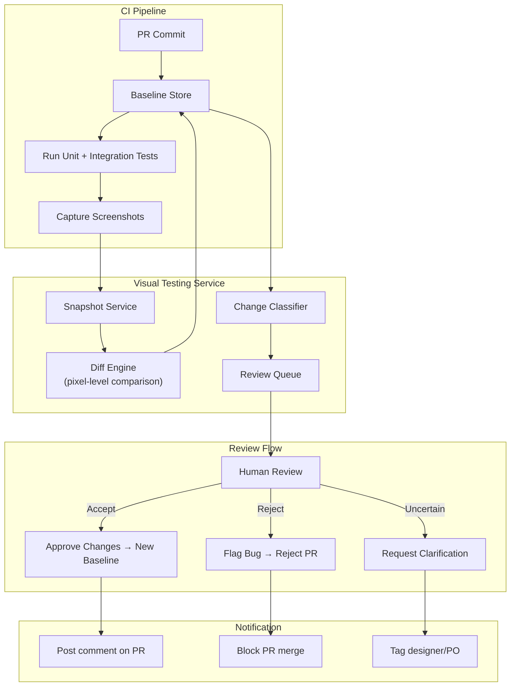

# Visual Testing

> Visual testing (visual regression testing) automates the detection of unintended visual changes in UI components and pages. It captures screenshots at every commit and compares them pixel-by-pixel against a baseline — catching CSS, layout, and rendering bugs that traditional functional tests miss.

## Architecture at a Glance



## What is Visual Testing?

Visual testing compares rendered UI screenshots against approved baselines to detect unintended visual changes. Unlike functional tests that check element presence or text content, visual tests detect pixel-level differences — wrong colors, shifted layouts, missing images, font rendering, responsive breakpoint issues, and CSS regression.

## Why Visual Testing Matters

CSS bugs are the most common type of UI defect, yet they're the hardest to catch with traditional tests. A button that's 2px too wide, a misaligned grid on Safari, or a mobile layout that breaks at certain widths — these slip through unit tests, integration tests, and even manual QA. Visual regression testing catches them automatically.

Companies report:
- **50-70% reduction in UI bugs** after adopting visual testing
- **3x faster QA cycles** — reviewers check diffs instead of full pages
- **100% visual coverage** across browsers and viewports @ commit-level

## Key Capabilities

| Capability | Description | Tools |
|-----------|-------------|-------|
| Pixel diff | Per-pixel comparison with anti-aliasing tolerance | Percy, Chromatic, Applitools |
| Layout diff | DOM-structure-aware comparison | Playwright, BackstopJS |
| AI diff | ML-based change classification (actual bug vs intended change) | Applitools Eyes |
| Responsive testing | Simultaneous screenshots across viewports | Percy, Chromatic |
| Cross-browser | Screenshots in Chrome, Firefox, Safari, Edge | Percy, Sauce Labs |
| Component-level | Test individual components in isolation | Chromatic (Storybook) |
| Animated regions | Stabilize animations before capture | Playwright, Puppeteer |

## Hands-on Example: Percy + Playwright

**Installation:**
```bash
npm install --save-dev @percy/cli @percy/playwright
```

**Visual test script:**
```javascript
const { test, expect } = require('@playwright/test');

test.describe('Checkout page visual tests', () => {
  test('checkout page renders correctly', async ({ page }) => {
    await page.goto('/checkout');

    // Fill form to ensure it's in a realistic state
    await page.fill('[name=email]', 'test@example.com');
    await page.fill('[name=address]', '123 Main St');

    // Percy snapshot — captures full page in a viewport
    await page.percySnapshot('Checkout Page - Desktop', {
      widths: [1280], // desktop
    });
  });

  test('checkout page mobile', async ({ page }) => {
    await page.setViewportSize({ width: 375, height: 812 });
    await page.goto('/checkout');
    
    await page.percySnapshot('Checkout Page - Mobile', {
      widths: [375], // iPhone
    });
  });

  test('checkout error states', async ({ page }) => {
    await page.goto('/checkout');
    await page.click('[type=submit]'); // submit empty form

    // Snapshot with validation errors visible
    await page.percySnapshot('Checkout Page - Validation Errors');
  });
});
```

**CI integration (GitHub Actions):**
```yaml
- name: Visual Tests
  env:
    PERCY_TOKEN: ${{ secrets.PERCY_TOKEN }}
  run: |
    npx percy exec -- npx playwright test --grep "visual"
```

## Component-level Visual Testing with Chromatic + Storybook

**Storybook story:**
```javascript
// Button.stories.jsx
export default {
  title: 'Components/Button',
  component: Button,
  parameters: {
    chromatic: { disableSnapshot: false },
    a11y: { element: 'button' },
  },
};

export const Primary = {
  args: { variant: 'primary', label: 'Submit', disabled: false },
};

export const Disabled = {
  args: { variant: 'primary', label: 'Submit', disabled: true },
};

export const Loading = {
  args: {
    variant: 'primary',
    label: 'Saving...',
    loading: true,
  },
};

// Chromatic auto-captures every story variant
// Covers: normal, hover, focus, active, disabled, loading
```

## Thresholds and Tolerance

| Diff Type | Tolerance | Action |
|-----------|-----------|--------|
| Pixel-level anti-aliasing | 0.1% threshold | Auto-pass |
| Minor layout shift (< 5px) | Review | Human review |
| Major layout shift (> 5px) | Fail | Block PR |
| Content change (text) | Review | Needs approval |
| Color difference | Delta-E < 2 | Auto-pass (perceptual) |

## Interview Questions

**Q1: How do you handle dynamic content in visual tests (e.g., dates, random IDs, A/B test variations)?**
Freeze dynamic content before capture. Mock dates with a fixed timezone, replace random IDs with deterministic values, and disable A/B experiment flags. For third-party widgets (ads, social embeds), mock the API responses or use Percy's DOM snapshot with dynamic content stripped.

**Q2: Your visual test suite takes 45 minutes to run. How do you speed it up?**
Parallelize by split viewports and components across CI runners. Use component-level testing (Chromatin + Storybook) instead of full-page snapshots — 100x faster because each component renders in isolation. Reduce viewport matrix to critical breakpoints only. Run full visual suite nightly; run only changed stories on PRs.

**Q3: Design a visual testing strategy for a design system used across 10 product teams.**
Each design system component gets a Storybook story with Chromatic visual testing. The design system CI builds a preview, captures all story snapshots, and reports differences. Product teams consume the design system package; their visual tests only capture integration (how components render in their specific layout). Design system changes that cause visual diffs in any product team's tests are flagged for cross-team review.

## Best Practices

- **Start with critical user journeys** — checkout, login, search, signup
- **Test across viewports** — desktop (1280), tablet (768), mobile (375)
- **Freeze dynamic content** — replace dates, random IDs, and counters with constants
- **Use component-level snapshots** — faster, more focused, less flaky
- **Review diffs in the PR** — don't force reviewers into a separate tool
- **Update baselines intentionally** — baseline drift is real; review before accepting

## Real Company Usage

| Company | Tool | Impact |
|---------|------|--------|
| **Airbnb** | Percy | Catches visual regressions across 50+ viewports before every deploy |
| **Shopify** | Chromatic | Visual tests on every design system component across all themes |
| **Stripe** | In-house + Playwright | Visual regression on every payment UI change across 40+ countries |
| **Microsoft** | Applitools + Playwright | Fluent UI design system tested across Windows, Mac, iOS, Android |