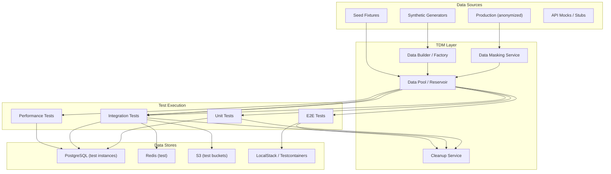

# Test Data Management

> Test data management (TDM) is the practice of creating, maintaining, and provisioning data for automated tests — ensuring tests have realistic, consistent, and isolated data without depending on production systems or manual setup.

## Architecture at a Glance



## What is Test Data Management?

TDM encompasses strategies and tools for provisioning test data — from database seeds and API fixtures to synthetic data generators and production-like datasets. It solves the fundamental testing challenge: tests need data that is realistic enough to catch bugs, deterministic enough to be reproducible, and isolated enough to run in parallel without interference.

## The Test Data Spectrum

| Approach | Realism | Determinism | Speed | Isolation | Best For |
|----------|---------|-------------|-------|-----------|----------|
| Hard-coded fixtures | Low | High | Fast | High | Unit tests |
| Factory/builders | Medium | High | Medium | High | Integration tests |
| Database seeds | Medium | Medium | Slow | Medium | E2E tests |
| Production clone | High | Low | Slow | Low | Performance tests |
| Synthetic data | High | High | Medium | High | E2E + Performance |
| Service virtualization | High | High | Fast | High | Integration tests |

## Patterns

**Pattern 1: Object Mothers / Test Data Builders**
```python
# test_data/builders.py
from dataclasses import dataclass
from typing import Optional
from faker import Faker

fake = Faker()

@dataclass
class UserBuilder:
    name: str = None
    email: str = None
    role: str = "customer"
    verified: bool = True
    created_at: str = None

    @classmethod
    def default(cls):
        return cls()

    def with_name(self, name: str):
        self.name = name
        return self

    def unverified(self):
        self.verified = False
        return self

    def admin(self):
        self.role = "admin"
        return self

    def build(self) -> dict:
        return {
            "name": self.name or fake.name(),
            "email": self.email or fake.email(),
            "role": self.role,
            "verified": self.verified,
            "created_at": self.created_at or fake.iso8601(),
        }

# Usage in tests
def test_order_creation():
    user = UserBuilder.default().admin().build()
    response = client.post("/orders", json={
        "user": user,
        "items": [{"product_id": "p1", "quantity": 2}],
    })
    assert response.status_code == 201
```

**Pattern 2: Data Seeding with TestContainers**
```java
// OrderTestData.java
@Testcontainers
class OrderServiceTest {
    @Container
    static PostgreSQLContainer<?> postgres = new PostgreSQLContainer<>("postgres:16")
        .withDatabaseName("testdb")
        .withInitScript("db/seed.sql");

    @BeforeEach
    void seedTestData() {
        var orders = List.of(
            new OrderEntity("order-1", "user-1", "pending", 2999),
            new OrderEntity("order-2", "user-1", "completed", 5999),
            new OrderEntity("order-3", "user-2", "refunded", 999)
        );
        orderRepository.saveAll(orders);
    }

    @Test
    void shouldReturnOrdersForUser() {
        var result = orderService.getOrdersByUser("user-1");
        assertThat(result).hasSize(2);
    }
}
```

**Pattern 3: Data Pool / Reservoir**
```python
# tdm/pool.py
import redis
import json
from dataclasses import dataclass

class TestDataPool:
    """Pre-provisioned test data pool for parallel test execution."""

    def __init__(self, redis_client: redis.Redis):
        self.redis = redis_client
        self.pool_key = "test:data:pool:users"

    def seed_pool(self, count: int = 100):
        """Pre-generate test users and store in Redis pool."""
        users = []
        for i in range(count):
            users.append(json.dumps({
                "id": f"pool-user-{i}",
                "email": f"pool-user-{i}@test.com",
                "tenant": "test-org",
                "data_volume": "medium",
            }))
        self.redis.rpush(self.pool_key, *users)

    def acquire(self) -> dict:
        """Get a unique test user from the pool."""
        user = self.redis.lpop(self.pool_key)
        if user is None:
            raise RuntimeError("Test data pool exhausted")
        return json.loads(user)

    def release(self, user: dict):
        """Return test user to pool after test completes."""
        self.redis.rpush(self.pool_key, json.dumps(user))
```

## Data Masking for Test Environments

| Data Type | Masking Strategy | Example |
|-----------|-----------------|---------|
| PII (name, email) | Tokenization or fake values | `john.doe@gmail.com` → `user-abc@test.org` |
| Credit cards | Format-preserving encryption | `4111-1111-1111-1111` → `4111-XXXX-XXXX-1111` |
| SSN / Tax ID | Hashing with salt | `123-45-6789` → `xxx-xx-6789` |
| Addresses | Geocoding shift | `1600 Main St` → `1600 Main St` (same format, fake coords) |
| Phone numbers | Numeric tokenization | `+1-555-0100` → `+1-555-0999` |

## Avoiding Test Data Anti-Patterns

- **Shared mutable state** — tests that modify shared data and don't clean up → flaky parallel runs
- **Magic strings** — hard-coded IDs that make tests brittle → use builders or factories
- **Over-seeding** — loading the entire DB for one test → leads to slow tests
- **Production data dependency** — tests that break when production data changes → isolate test data
- **Cleanup neglect** — test artifacts (DB rows, S3 objects) accumulate → periodic purge required

## Interview Questions

**Q1: Design a test data management system for a team running 5000 parallel E2E tests daily.**
Each test acquires data from a Redis-backed pool of pre-provisioned records. Data is organized by tenant (isolation) and type (user profile, order, payment method). Tests lease data for the duration of execution and release it on completion. A nightly job refreshes the pool from anonymized production snapshots. Each test run gets its own database schema (PostgreSQL template databases) for full isolation.

**Q2: How do you handle test data for performance/load tests?**
Performance tests need production-scale data volumes. Use a dedicated performance test environment with cloned production data (anonymized). For repeatability, restore from a known snapshot before each test run. Generate supplemental synthetic data to fill edge cases — 10x more records, maximum page sizes, and boundary condition data (empty sets, single records, millions of records).

**Q3: Your CI environment has limited resources. How do you manage test data for 1000+ integration tests?**
Use in-memory databases (H2, SQLite) or TestContainers with lightweight images. Seed only the specific data needed per test class (not per method). Use @BeforeClass/BeforeAll to seed once per test suite. For tests that need production-like data volumes, tag them as "heavy" and run them in a separate nightly pipeline.

## Best Practices

- **Use builders for complex objects** — avoids brittle constructor calls
- **Isolate test data per test** — no shared mutable state
- **Clean up after yourself** — delete created records or use transaction rollback
- **Version-controlled seeds** — seed data belongs in the repo, not in a shared database
- **Test data as code** — data generation logic should be reviewable, testable, and versioned
- **Measure data freshness** — stale test data causes false positives; rotate periodically

## Real Company Usage

| Company | Approach |
|---------|----------|
| **Uber** | Data reservoir — pre-provisioned, isolated test datasets across 2200+ microservices with automated replenishment |
| **Spotify** | Synthetic data generators for A/B test evaluation pipelines; production-like distributions without PII |
| **Netflix** | Chaos testing with production traffic replays — test data is real anonymized requests against shadow infrastructure |