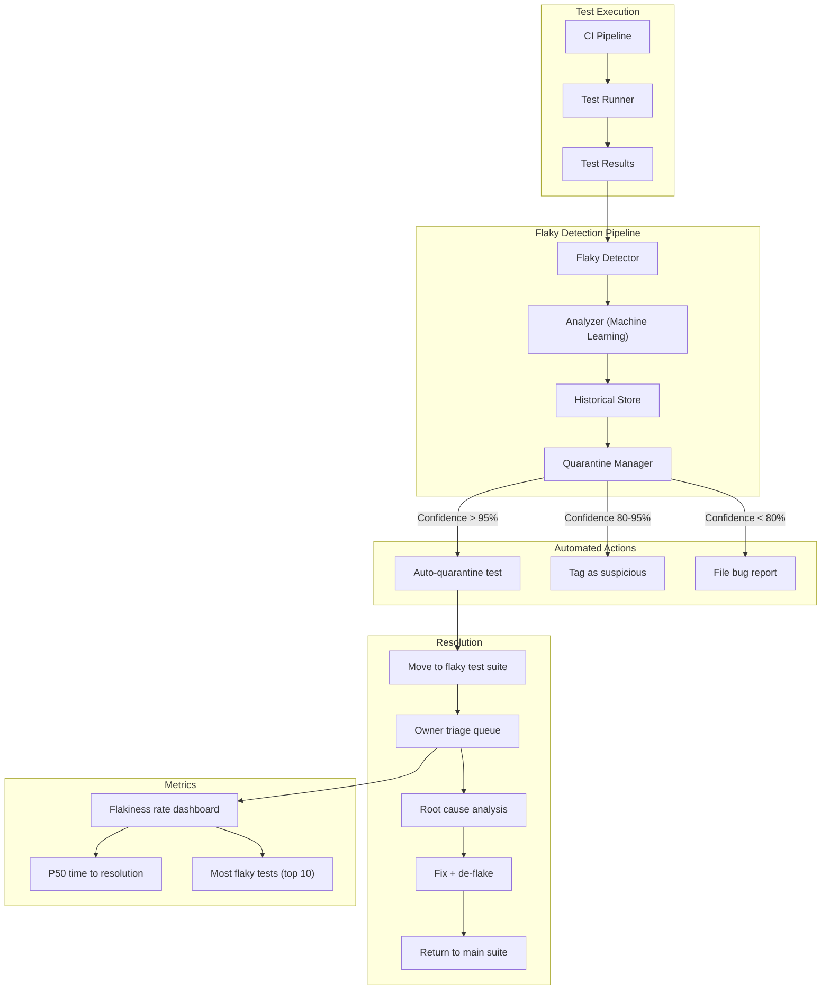

# Flaky Test Management

> Flaky tests are tests that pass or fail intermittently without any code changes — eroding trust in the test suite, wasting developer time, and masking real bugs. Managing flaky tests is a discipline of detection, quarantine, root cause analysis, and systematic elimination.

## Architecture at a Glance



## What is Flaky Test Management?

Flaky test management is the systematic practice of detecting tests that exhibit non-deterministic behavior, quarantining them from the main CI pipeline, identifying root causes, and fixing or retiring them. A test is considered flaky when it produces different results (pass/fail) across multiple runs with the same code and inputs.

## The Cost of Flaky Tests

| Cost | Impact |
|------|--------|
| Developer time | 15-30 minutes per false-positive CI failure — context switching, investigation, re-run |
| CI velocity | Retries consume pipeline capacity; 5% flaky rate = 15% longer queue times |
| Trust erosion | Developers stop trusting test results; real bugs slip through |
| Deploy confidence | Teams deploy less frequently when CI is unreliable |

## Flaky Test Detection

**Detecting Algorithm (Rerun Strategy):**
```yaml
# CI configuration — auto-rerun failed tests to detect flakiness
name: Flaky Detection
on: [push]
jobs:
  test:
    runs-on: ubuntu-latest
    steps:
      - uses: actions/checkout@v4
      - run: npm ci
      # Run tests once
      - id: first_run
        run: npm test -- --junit-output=results1.xml
        continue-on-error: true
      # Rerun failed tests only
      - id: second_run
        if: steps.first_run.outcome == 'failure'
        run: |
          npx jest --listTests --json > all.json
          # Extract only failed tests and rerun
          node -e "
            const failed = require('./jest-results.json').testResults
              .filter(r => r.status === 'failed')
              .map(r => r.name);
            require('child_process').execSync(
              'npx jest ' + failed.join(' ') + ' --json > results2.json'
            );
          "
        continue-on-error: true
      # If test fails first time, passes second time → flaky
      - run: |
          if [[ "${{ steps.first_run.outcome }}" == "failure" && \
                "${{ steps.second_run.outcome }}" == "success" ]]; then
            echo "FLAKY_TEST=true" >> $GITHUB_ENV
          fi
```

**Quarantine Manager (Python):**
```python
class FlakyDetector:
    """Detects flaky tests using statistical analysis."""
    
    def __init__(self, history_days: int = 14):
        self.window = timedelta(days=history_days)
    
    def analyze(self, test_name: str, results: list[TestRun]) -> FlakyScore:
        """Calculate flakiness score for a test."""
        runs = [r for r in results if r.name == test_name 
                and r.timestamp > datetime.utcnow() - self.window]
        
        total = len(runs)
        if total < 10:
            return FlakyScore.INSUFFICIENT_DATA
        
        passes = sum(1 for r in runs if r.passed)
        failures = total - passes
        flake_rate = min(passes, failures) / total
        
        # Same-test flakiness: does the same commit produce different results?
        per_commit = defaultdict(list)
        for r in runs:
            per_commit[r.commit_sha].append(r)
        
        conflict_count = sum(
            1 for cr in per_commit.values()
            if len({r.passed for r in cr}) > 1
        )
        
        score = (flake_rate * 0.6) + (conflict_count / len(per_commit) * 0.4)
        
        if score > 0.05 and total >= 20:
            return FlakyScore.FLAKY
        elif score > 0.02:
            return FlakyScore.SUSPICIOUS
        return FlakyScore.STABLE
```

## Root Causes of Flakiness

| Category | Cause | Detection | Fix |
|----------|-------|-----------|-----|
| **Timing** | Race conditions, async operations | Test passes locally, fails in CI | Add explicit waits (not sleep); use `await` correctly |
| **Order dependency** | Tests assume a specific execution order | Tests pass in isolation, fail in suite | Each test must set up and tear down its own state |
| **Shared mutable state** | Tests modify global DB, filesystem, or env vars | Fails when run in parallel | Use per-test isolation (transaction rollback, database templates) |
| **Randomness** | Tests depend on random/faker data | Fails intermittently with different data | Seed random generators; freeze dates |
| **Network flakiness** | External API calls in tests | Fails when network is slow | Mock external services; use TestContainers |
| **Resource limits** | Memory/disk exhaustion in CI | Fails only on under-resourced CI runners | Limit parallelism; increase CI resources |
| **Leaking state** | Static/global variables not reset | Fails based on previously executed test | Reset static state in `@BeforeEach` or `setup()` |

## Quarantine Workflow

```
1. Detection → A test fails >5% of runs over 14 days
2. Auto-quarantine → Test moved to "flaky suite" (runs but doesn't block CI)
3. Owner assignment → Blame last committer who touched the test or tested code
4. SLO → 7 days to investigate and fix; if unfixed, auto-disable
5. Fix → Address root cause; prove stability with 50 consecutive CI passes
6. Re-integration → Test returns to the main suite with a 14-day monitoring period
```

**Quarantine in code:**
```python
import pytest

# pytest markers for flaky management
@pytest.mark.flaky(reruns=3, reruns_delay=2)
def test_payment_gateway():
    """Known flaky — payment gateway has intermittent timeout."""
    result = payment_service.charge(amount=1000)
    assert result.status == "succeeded"

# pytest markers for quarantine
@pytest.mark.quarantined(reason="https://github.com/org/repo/issues/1234")
def test_fragile_integration():
    """This test is quarantined — tracked in issue #1234."""
    # Test runs but doesn't block CI
```

## Flaky Test Budget / SLO

Treat flaky tests like technical debt: set a budget.

| Metric | Target | Action if breached |
|--------|--------|--------------------|
| Flaky rate | < 2% of total tests | Auto-quarantine new flaky tests |
| Time to resolution | < 7 days P50 | Escalate to team lead |
| Max quarantined tests | < 5% of total tests | Freeze feature deploys until fixed |
| False positive rate | < 1% of CI runs | Roll back recent test changes |

## Interview Questions

**Q1: Your team's CI is failing 30% of the time due to flaky tests. How do you fix this?**
Phase 1 (24h): Auto-quarantine all tests with >5% flakiness. The CI goes green immediately. Phase 2 (1 week): Each team member owns 2-3 flaky tests. Fix root causes. Phase 3 (ongoing): Implement flaky detection in CI, set flaky budget (2% max), and make flaky rate visible on the team dashboard.

**Q2: How do you distinguish a flaky test from a real bug?**
Rerun the failed test 5 times on the same commit. If it passes any run, it's flaky. If it fails 5/5, it's a real regression. For borderline cases, run the test 20 times in isolation — consistent failure indicates a real bug, partial failure indicates flakiness.

**Q3: Design a system to automatically detect and quarantine flaky tests.**
CI pipeline records per-test results with commit SHA, duration, and exit code. A Flaky Detector service analyzes the last 14 days of results. A test is flaky if: (a) same commit produces different results across runs, or (b) pass rate fluctuates >5% without code changes. Auto-quarantine moves the test to a secondary suite that runs but doesn't block the merge gate. Quarantined tests have a 7-day SLO for owner assignment and fix.

## Best Practices

- **Fix flaky tests immediately** — they erode trust faster than any other CI problem
- **Don't retry without investigation** — retry masks the root cause; investigate why it flaked first
- **Fail fast on known flaky tests** — auto-quarantine; don't waste CI time retrying them
- **Write deterministic tests** — no sleep(), always await, seed random, freeze time
- **Isolation is everything** — each test must be capable of running alone, in any order, in parallel
- **Track flakiness by owner** — assign flaky tests to the team that owns the tested code

## Real Company Usage

| Company | Flaky Strategy |
|---------|----------------|
| Google | Flaky test database — every CI run records results; a centralized system tracks flakiness across all repositories; flaky tests auto-severed from presubmit |
| Spotify | Flaky test budget per team: 1% max; exceeded budget = freeze on new tests until resolved |
| Meta | Continuous flaky detection — ML model predicts flaky probability based on historical patterns; auto-remediation for known root cause patterns |
| Stripe | Flaky test SLO: 99.5% reliability target; tests below 99.5% are quarantined and tracked with owner SLA |