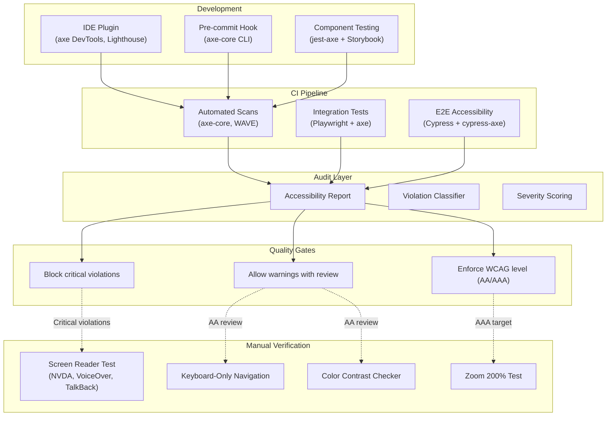

# Accessibility Testing

> Accessibility (a11y) testing ensures software is usable by people with disabilities — including visual, auditory, motor, cognitive, and speech impairments. Automated accessibility testing catches up to 40% of WCAG violations, while manual testing and assistive technology validation cover the rest.

## Architecture at a Glance



## What is Accessibility Testing?

Accessibility testing validates that software meets accessibility standards — primarily WCAG 2.2 (Web Content Accessibility Guidelines) at Levels A, AA, and AAA. Automated testing uses tools like axe-core, Lighthouse, and WAVE to scan rendered pages for violations. Manual verification includes screen reader testing, keyboard-only navigation, color contrast validation, and zoom testing.

## WCAG Levels

| Level | Conformance | Automated Detection | Example Violations |
|-------|-------------|-------------------|-------------------|
| A | Minimum | ~30% detected | Missing alt text, no form labels, keyboard trap |
| AA | Standard (legal requirement) | ~40% detected | Insufficient color contrast, no focus indicators |
| AAA | Highest | ~50% detected | Extended audio descriptions, sign language for video |

## Automated Testing Tools

| Tool | Context | Integration | Coverage |
|------|---------|-------------|----------|
| axe-core | Browser, CI, unit tests | Most widely used | 50+ WCAG rules |
| Lighthouse | Performance + a11y audit | Chrome DevTools, CI | 20+ WCAG rules |
| WAVE | Visual overlay | Browser extension | 60+ WCAG rules |
| Pa11y | CI dashboard | CLI, continuous monitoring | 50+ rules |
| Accessibility Insights | Manual + automated | Browser extension, Windows | Full WCAG + fast pass |

## Hands-on Example: axe-core in CI

**Playwright + axe-core integration:**
```javascript
const { test, expect } = require('@playwright/test');
const AxeBuilder = require('@axe-core/playwright').default;

test.describe('Accessibility compliance', () => {
  test('homepage has no critical a11y violations', async ({ page }) => {
    await page.goto('/');
    
    // Inject axe-core and run analysis
    const results = await new AxeBuilder({ page })
      .withTags(['wcag2a', 'wcag2aa', 'wcag21a', 'wcag21aa'])
      .options({
        runOnly: {
          type: 'tag',
          values: ['wcag2a', 'wcag2aa'],
        },
      })
      .analyze();

    // Assert no critical or serious violations
    const violations = results.violations.filter(
      v => v.impact === 'critical' || v.impact === 'serious'
    );
    expect(violations).toHaveLength(0);
  });

  test('checkout flow passes a11y standards', async ({ page }) => {
    await page.goto('/checkout');
    await page.fill('[name=email]', 'test@example.com');
    await page.click('[type=submit]');

    const results = await new AxeBuilder({ page }).analyze();
    expect(results.violations).toEqual([]);
  });
});
```

**Storybook with a11y addon (component-level):**
```javascript
// Button.stories.jsx
export default {
  title: 'Components/Button',
  component: Button,
  parameters: {
    a11y: {
      element: 'button',
      config: { rules: [{ id: 'color-contrast', enabled: true }] },
    },
  },
};

export const Primary = {
  args: { variant: 'primary', label: 'Submit' },
};

export const Disabled = {
  args: { variant: 'primary', label: 'Submit', disabled: true },
};
```

**CI quality gate (GitHub Action):**
```yaml
- name: Accessibility Audit
  run: |
    npx pa11y-ci --sitemap https://staging.example.com/sitemap.xml \
      --threshold 10 \
      --json > a11y-report.json

- name: Check Severity Thresholds
  run: |
    CRITICAL=$(cat a11y-report.json | jq '[.results[] | select(.type=="error")] | length')
    if [ "$CRITICAL" -gt 0 ]; then
      echo "❌ $CRITICAL critical a11y violations found"
      exit 1
    fi
    echo "✅ Passed accessibility check"
```

## Common Violations and Fixes

| Violation | WCAG Criterion | Automated Check | Fix |
|-----------|---------------|-----------------|-----|
| Missing alt text | 1.1.1 Non-text Content | 100% | Add `alt` attribute on all `` elements |
| Low color contrast | 1.4.3 Contrast (Minimum) | ~80% | Use contrast ratio ≥4.5:1 for normal text |
| No form labels | 3.3.2 Labels or Instructions | 100% | Add `<label>` or `aria-label` to all inputs |
| Keyboard trap | 2.1.2 No Keyboard Trap | ~60% | Ensure focus can move away with Tab/Esc |
| Missing heading levels | 1.3.1 Info and Relationships | 100% | Use hierarchical headings (h1→h2→h3) |
| Empty button/link | 4.1.2 Name, Role, Value | 100% | Add accessible name via text content or aria-label |

## Accessibility Testing in CI (Thresholds)

```yaml
# a11y-thresholds.yaml
severity:
  critical: 0    # Zero tolerance — must be 0
  serious: 3     # Max 3 serious violations
  moderate: 10   # Max 10 moderate violations
  minor: no-limit
wcag_level: AA
exclude:
  - "/admin/*"     # Admin pages have separate audit
  - "/experiments/*" # Feature flags not enforced
```

## Interview Questions

**Q1: How do you integrate accessibility testing into a CI pipeline with zero-flaky policy?**
Use axe-core in Playwright tests with explicit assertions. axe-core is deterministic — same page always produces the same violations (no flakiness). Run a11y scans on every PR for changed pages. Configure quality gates: block PRs with critical or serious violations. Keep a known-violation allowlist for legacy code that can be exempted temporarily with a fix-it ticket.

**Q2: Automated a11y testing catches only 30-40% of WCAG violations. How do you handle the rest?**
Maintain an accessibility audit checklist for manual verification: screen reader testing (NVDA on Windows, VoiceOver on Mac), keyboard-only navigation through all interactive elements, zoom to 200%, high contrast mode, reduced motion. Create a rotating a11y buddy system — every sprint, two team members pair on manual a11y verification of the release candidate.

**Q3: Your team is adopting a design system. How do you ensure all components meet WCAG AA from the start?**
Each component in the design system has an a11y test using jest-axe or Storybook's a11y addon. The test validates the component in every state (normal, hover, focus, disabled, error). Any new component or variant must pass a11y checks before the design system package is published. Product teams inherit a11y compliance by consuming design system components.

## Best Practices

- **Shift left** — catch a11y issues at component level (Storybook) before page-level tests
- **Set severity thresholds** — zero tolerance for critical violations; track serious/moderate trends
- **Use axe-core** — most reliable, deterministic, actively maintained
- **Include a11y in definition of done** — no feature is complete without a11y verification
- **Test with real assistive technology** — automated tools catch patterns, not all real-world issues
- **Educate developers** — run a11y training; create a cheat sheet for common fixes

## Real Company Usage

| Company | Accessibility Program |
|---------|----------------------|
| **Microsoft** | Accessibility Insights tool; mandatory a11y reviews for all features; WCAG AA+ target |
| **GitHub** | a11y integration in Primer design system; axe-core in CI; manual screen reader testing on every release |
| **Apple** | VoiceOver testing mandatory for all apps; WCAG AA for web; high contrast + dynamic type support |
| **Shopify** | Polaris design system enforces a11y at component level; automated + annual manual audit for WCAG AA |