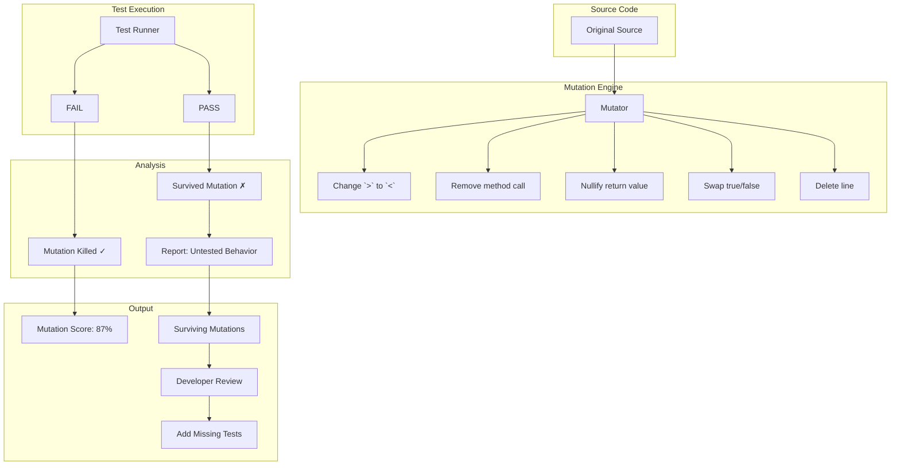

# Mutation Testing

> Mutation testing evaluates test suite quality by introducing small faults ("mutations") into production code and checking whether existing tests catch them. A test suite that fails to detect mutations has gaps in coverage — even if line coverage is 100%.

## Architecture at a Glance



## What is Mutation Testing?

Mutation testing systematically modifies production code with small syntactic changes (mutations) that simulate common programming errors — wrong operator, missing condition, off-by-one, null return. Each mutated version is called a mutant. If the test suite fails on a mutant, the mutant is "killed." If tests still pass, the mutant "survives" — revealing a gap in test coverage.

## Why Mutation Testing Matters

Traditional code coverage (line, branch, statement) measures what code was executed, not whether the tests actually verified the behavior. You can have 100% line coverage with assertions that never fire. Mutation testing measures test quality — if you introduce a bug and the tests don't catch it, your tests aren't effective.

**Coverage vs Mutation Testing:**

| Aspect | Line Coverage | Mutation Testing |
|--------|--------------|------------------|
| What it measures | Code that executed | Code that was verified |
| False confidence | High (green even with weak tests) | Low (killed mutants must be verified) |
| False negatives | Missing branches not detected | Only detects modeled mutation types |
| Runtime | Fast (seconds) | Slow (minutes to hours) |
| Granularity | Per-line | Per condition, operator, boundary |

## Mutation Operators

| Operator | Original | Mutated | What It Simulates |
|----------|----------|---------|-------------------|
| Conditional boundary | `if (x > 5)` | `if (x >= 5)` | Off-by-one error |
| Negate conditional | `if (x == 5)` | `if (x != 5)` | Logic inversion |
| Return value | `return true` | `return false` | Wrong business logic |
| Void method call | `sendEmail()` | `/*sendEmail()*/` | Missing side effect |
| Remove increment | `i++` | `/*i++*/` | Loop not progressing |
| Invert math operator | `a + b` | `a - b` | Wrong calculation |
| Null return | `return result` | `return null` | Missing null check |
| String mutation | `"Success"` | `""` | Empty result masking |

## Mutation Score

```
Mutation Score = Killed Mutants / (Total Mutants - Equivalent Mutants) × 100

Killed Mutants:   87
Survived Mutants: 13
Equivalent Mutants: 3 (semantically identical — excluded)
Total Mutants:  100

Mutation Score:  87 / (100 - 3) = 89.7%
```

**Target scores by context:**
| Context | Target | Rationale |
|---------|--------|-----------|
| Critical business logic | 95%+ | Financial calculations, auth, pricing |
| Core domain services | 90%+ | Order processing, user management |
| Infrastructure code | 80%+ | Database access, API clients |
| UI components | 70%+ | Rendering logic, event handlers |
| Configuration | 50%+ | Trivial getter/setter patterns |

## Hands-on Example: PIT (Java)

**Setup (pom.xml):**
```xml
<plugin>
    <groupId>org.pitest</groupId>
    <artifactId>pitest-maven</artifactId>
    <version>1.15.0</version>
    <configuration>
        <targetClasses>
            <param>com.example.service.*</param>
        </targetClasses>
        <targetTests>
            <param>com.example.service.*Test</param>
        </targetTests>
        <mutationThreshold>90</mutationThreshold>
        <timeoutConstant>3000</timeoutConstant>
        <outputFormats>
            <outputFormat>HTML</outputFormat>
            <outputFormat>XML</outputFormat>
        </outputFormats>
    </configuration>
</plugin>
```

**Running PIT:**
```bash
mvn org.pitest:pitest-maven:mutationCoverage
# Opens report at target/pit-reports/index.html
```

**Example: Pricing Service with Mutation Gap**
```java
public class PricingService {
    public double calculateDiscount(double amount, boolean isPremium) {
        if (amount > 100 && isPremium) {
            return amount * 0.15;  // 15% discount
        }
        return amount * 0.05;       // 5% default
    }
}
```

**Test that achieves 100% line coverage but misses mutations:**
```java
@Test
void testCalculateDiscount() {
    PricingService service = new PricingService();
    double result = service.calculateDiscount(200, true);
    // Assertion missing! Test passes if no exception is thrown
}
```

**Proper test that kills all mutants:**
```java
@Test
void testPremiumDiscountOverThreshold() {
    PricingService service = new PricingService();
    assertThat(service.calculateDiscount(200, true))
        .isCloseTo(30.0, within(0.01)); // 200 * 0.15 = 30
}

@Test
void testStandardDiscountUnderThreshold() {
    PricingService service = new PricingService();
    assertThat(service.calculateDiscount(50, false))
        .isCloseTo(2.5, within(0.01));  // 50 * 0.05 = 2.5
}

@Test
void testPremiumUnderThreshold() {
    PricingService service = new PricingService();
    assertThat(service.calculateDiscount(50, true))
        .isCloseTo(7.5, within(0.01));  // 50 * 0.15 = 7.5 (premium always 15%)
}
```

## Handling Equivalent Mutants

An equivalent mutant is semantically identical to the original code — no test can distinguish it, so it's excluded from the score.

| Mutation | Equivalent? | Reason |
|----------|-------------|--------|
| `if (x > 5)` → `if (x >= 5)` | Sometimes | Only equivalent if x is integer and condition is `x == 6` |
| `return cache.get(key)` → `return null` | No | Cache miss vs null — behavior differs |
| `int result;` → `/*int result;*/` | No | Variable declaration is dead code anyway — remove it |
| `while (true)` → `while (false)` | No | Fundamental behavior change |

Equivalent mutants are identified during code review and added to a suppression list.

## CI Integration Strategies

| Strategy | Cost | Confidence | Best For |
|----------|------|-----------|----------|
| Full mutation testing every PR | High (30-60 min) | High | Critical services |
| Changed-code mutation only | Medium (5-10 min) | Medium | Most services |
| Nightly full suite | Low (off-peak) | Medium | Background monitoring |
| Spot-check on release candidates | Low | Low | Quick sanity check |

**Changed-code mutation with PIT (incremental):**
```bash
# Only mutate files changed in this PR
CHANGED_FILES=$(git diff --name-only origin/main...HEAD -- '*.java')
mvn org.pitest:pitest-maven:mutationCoverage \
  -DtargetClasses="${CHANGED_FILES//$'\n'/,}"
```

## Interview Questions

**Q1: Your team has 100% line coverage but production bugs still escape. How would mutation testing help?**
100% line coverage only means every line executed during tests — it doesn't mean the assertions verified the behavior. Mutation testing would reveal that many tests pass even when logic is broken (e.g., swap `>` with `<` or return the wrong value). These surviving mutants point to tests with weak or missing assertions — the same gaps that let real bugs through.

**Q2: Mutation testing is slow. How do you make it practical for a 500,000-line codebase?**
Use incremental mutation testing — only mutate files changed in the current PR. Run a full mutation suite nightly on a dedicated CI runner. Use mutator sampling — run a subset of mutation operators (skip trivial ones like string mutations). Parallelize across CI runners. Target the mutation budget to critical modules (95% for core domain, 50% for config).

**Q3: Equivalent mutants are wasting review time. How do you handle them?**
Maintain an equivalence suppression list — known false positives that get excluded from scoring. Use tooling that detects common equivalent patterns (e.g., PIT's `-excludedMethods` for trivial getters/setters). During code review, mark surviving mutants as equivalent on the report. Over time, the suppression list converges and review effort drops.

## Best Practices

- **Start small** — apply mutation testing to one critical module first (e.g., pricing, auth)
- **Set a target score** — 85%+ for core modules; treat it as a quality gate
- **Remove dead code** — surviving mutants on dead code indicate you should remove it
- **Don't chase 100%** — diminishing returns; 85-95% is practical for most codebases
- **Use incremental analysis** — mutate only changed code to keep CI fast
- **Suppress equivalent mutants** — maintain a suppression list to avoid noise

## Real Company Usage

| Company | Mutation Testing Program |
|---------|------------------------|
| **Google** | Built internal mutation testing tool. Mutates code at scale, tracks mutation score metrics per team, used as one input for code review quality |
| **Spotify** | Uses PIT for Java services; mutation score is a deploy quality gate for payment and billing services |
| **Uber** | Mutation testing on critical path services (dispatch, pricing, surge); integrated into deployment pipeline |
| **Netflix** | Uses mutation testing alongside chaos engineering; mutation score verified before canary deployments for billing and recommendation services |