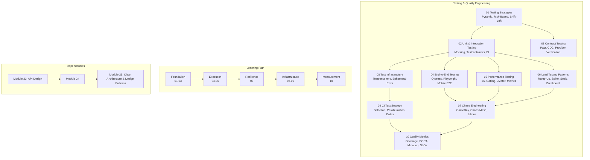

# Module 24: Testing & Quality Engineering

## Module Architecture

## Module Overview

This module covers the complete spectrum of testing and quality engineering — from foundational test strategies and unit testing to advanced topics like chaos engineering, CI test strategy, and quality metrics. Designed for engineers building reliable, testable systems at scale.

## Topics

| # | Topic | Description |
|---|-------|-------------|
| 01 | Testing Strategies | Test pyramid, risk-based testing, shift-left, microservice testing |
| 02 | Unit & Integration Testing | Mocking, test doubles, DI, Testcontainers, fixtures |
| 03 | Contract Testing | Pact CDC, provider verification, Pact Broker, can-i-deploy |
| 04 | End-to-End Testing | Cypress, Playwright, Selenium, visual regression, mobile E2E |
| 05 | Performance Testing | k6, Locust, Gatling, JMeter, metrics, distributed testing |
| 06 | Load Testing Patterns | Ramp-up, step, spike, soak, breakpoint, workload models |
| 07 | Chaos Engineering | Principles, GameDays, Chaos Mesh, Litmus, Gremlin |
| 08 | Test Infrastructure | Testcontainers, ephemeral envs, preview deployments, DB seeding |
| 09 | CI Test Strategy | Test selection, parallelization, flaky detection, merge gates |
| 10 | Quality Metrics | Coverage, mutation testing, DORA metrics, SLI/SLO for quality |

## Learning Path

1. **Start with Foundation (01-03)**: Understand testing strategy, write unit/integration tests, add contract testing for microservices
2. **Move to Execution (04-06)**: Implement E2E, performance, and load testing for critical user journeys
3. **Build Resilience (07)**: Introduce chaos engineering to validate system robustness
4. **Scale Infrastructure (08-09)**: Set up test environments, CI pipelines, and quality gates
5. **Measure and Improve (10)**: Track quality metrics, enforce SLOs, continuously improve

---
Previous: [23 — API Design](../23-API-Design/README.md)
Next: [25 — Clean Architecture & Design Patterns](../25-Clean-Architecture-Design-Patterns/README.md)
