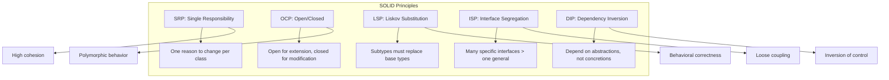

# SOLID Principles

## Architecture Diagram



## What Is SOLID?

SOLID is a set of five design principles introduced by Robert C. Martin (Uncle Bob) in the early 2000s. They guide developers toward creating maintainable, flexible, and understandable object-oriented software.

## Why It Was Created

Before SOLID, software suffered from rigid designs that broke easily when requirements changed. Classes accumulated multiple responsibilities, changes rippled across systems, and testing was nearly impossible. SOLID emerged as a remedy for "code rot" and to enable agile development practices.

## When to Use SOLID

- **Always** — as guiding principles, not rigid rules
- **Greenfield projects** — design for extensibility from day one
- **Legacy refactoring** — identify violations as code smells
- **Team-scale codebases** — where multiple developers collaborate
- **Bend the rules** — in scripts, prototypes, or performance-critical hot paths

---

## 1. Single Responsibility Principle (SRP)

> A class should have one, and only one, reason to change.

### Violation

```go
package invoice

import (
    "database/sql"
    "fmt"
    "net/smtp"
)

type InvoiceHandler struct {
    db *sql.DB
}

func (h *InvoiceHandler) CalculateTotal(invoiceID string) float64 {
    // business logic
    return 100.0
}

func (h *InvoiceHandler) SaveToDatabase(invoiceID string, total float64) error {
    _, err := h.db.Exec("INSERT INTO invoices ...")
    return err
}

func (h *InvoiceHandler) SendEmail(invoiceID string, email string) error {
    body := fmt.Sprintf("Invoice %s total: $%.2f", invoiceID, 100.0)
    return smtp.SendMail("smtp.example.com:587", nil, "billing@co", []string{email}, []byte(body))
}
```

### Fix

```go
package invoice

import "database/sql"

type InvoiceCalculator struct{}

func (c *InvoiceCalculator) CalculateTotal(items []LineItem) float64 {
    var total float64
    for _, item := range items {
        total += item.Price * float64(item.Quantity)
    }
    return total
}
```

```go
package invoice

import "database/sql"

type InvoiceRepository struct {
    db *sql.DB
}

func (r *InvoiceRepository) Save(inv Invoice) error {
    _, err := r.db.Exec("INSERT INTO invoices (id, total) VALUES ($1, $2)", inv.ID, inv.Total)
    return err
}
```

```go
package invoice

import "net/smtp"

type EmailService struct {
    From string
}

func (e *EmailService) SendInvoice(inv Invoice, recipient string) error {
    body := formatInvoiceBody(inv)
    return smtp.SendMail("smtp.example.com:587", nil, e.From, []string{recipient}, []byte(body))
}

func formatInvoiceBody(inv Invoice) string {
    return "Invoice " + inv.ID + " total: $" + formatAmount(inv.Total)
}

func formatAmount(amount float64) string {
    return fmt.Sprintf("%.2f", amount)
}
```

### Real-World Violation

**God classes** like `OrderManager` that handle validation, persistence, email, logging, and reporting. Found in many Rails and Django monoliths.

---

## 2. Open/Closed Principle (OCP)

> Software entities should be open for extension, but closed for modification.

### Violation

```typescript
class PaymentProcessor {
    processPayment(method: string, amount: number): void {
        if (method === "credit_card") {
            // process credit card
        } else if (method === "paypal") {
            // process paypal
        } else if (method === "crypto") {
            // process crypto
        }
        // every new payment method requires modifying this method
    }
}
```

### Fix

```typescript
interface PaymentMethod {
    process(amount: number): PaymentResult;
}

class CreditCardPayment implements PaymentMethod {
    process(amount: number): PaymentResult {
        // charge credit card
        return { success: true, transactionId: "cc_123" };
    }
}

class PayPalPayment implements PaymentMethod {
    process(amount: number): PaymentResult {
        // redirect to PayPal
        return { success: true, transactionId: "pp_456" };
    }
}

class CryptoPayment implements PaymentMethod {
    process(amount: number): PaymentResult {
        // submit to blockchain
        return { success: true, transactionId: "eth_789" };
    }
}

class PaymentProcessor {
    constructor(private methods: Map<string, PaymentMethod>) {}

    process(method: string, amount: number): PaymentResult {
        const handler = this.methods.get(method);
        if (!handler) throw new Error("Unsupported payment method");
        return handler.process(amount);
    }
}
```

### Real-World Application

The **Strategy pattern** — a direct implementation of OCP. Payment gateways, shipping calculators, tax calculators, and notification channels all benefit from OCP.

---

## 3. Liskov Substitution Principle (LSP)

> Objects of a superclass should be replaceable with objects of a subclass without affecting correctness.

### Violation

```python
class Rectangle:
    def __init__(self, width: int, height: int):
        self._width = width
        self._height = height

    @property
    def width(self) -> int:
        return self._width

    @width.setter
    def width(self, value: int):
        self._width = value

    @property
    def height(self) -> int:
        return self._height

    @height.setter
    def height(self, value: int):
        self._height = value

    def area(self) -> int:
        return self._width * self._height

class Square(Rectangle):
    def __init__(self, side: int):
        super().__init__(side, side)

    @Rectangle.width.setter
    def width(self, value: int):
        self._width = value
        self._height = value

    @Rectangle.height.setter
    def height(self, value: int):
        self._width = value
        self._height = value

def resize(rect: Rectangle):
    rect.width = 10
    rect.height = 5
    assert rect.area() == 50  # Fails for Square → area = 25
```

### Fix

```python
from abc import ABC, abstractmethod

class Shape(ABC):
    @abstractmethod
    def area(self) -> int:
        pass

class Rectangle(Shape):
    def __init__(self, width: int, height: int):
        self.width = width
        self.height = height

    def area(self) -> int:
        return self.width * self.height

class Square(Shape):
    def __init__(self, side: int):
        self.side = side

    def area(self) -> int:
        return self.side * self.side
```

### Design by Contract

LSP is formally tied to **Bertrand Meyer's Design by Contract**:
- **Preconditions** cannot be strengthened in subtypes
- **Postconditions** cannot be weakened in subtypes
- **Invariants** must be preserved

---

## 4. Interface Segregation Principle (ISP)

> No client should be forced to depend on methods it does not use.

### Violation

```go
type Worker interface {
    Work()
    Eat()
    Sleep()
}

type HumanWorker struct{}

func (h HumanWorker) Work()  {}
func (h HumanWorker) Eat()   {}
func (h HumanWorker) Sleep() {}

type RobotWorker struct{}

func (r RobotWorker) Work()  {}
func (r RobotWorker) Eat()   {}  // Not applicable
func (r RobotWorker) Sleep() {}  // Not applicable
```

### Fix

```go
type Workable interface {
    Work()
}

type Eatable interface {
    Eat()
}

type Sleepable interface {
    Sleep()
}

type HumanWorker struct{}

func (h HumanWorker) Work()  {}
func (h HumanWorker) Eat()   {}
func (h HumanWorker) Sleep() {}

type RobotWorker struct{}

func (r RobotWorker) Work() {}
```

### ISP in Rust (Traits)

```rust
trait Renderer {
    fn render(&self) -> String;
}

trait Clickable {
    fn on_click(&self);
}

trait Draggable {
    fn on_drag(&self, x: i32, y: i32);
}

struct Button {
    label: String,
}

impl Renderer for Button {
    fn render(&self) -> String {
        format!("<button>{}</button>", self.label)
    }
}

impl Clickable for Button {
    fn on_click(&self) {
        println!("Button clicked!");
    }
}

struct Image {
    url: String,
}

impl Renderer for Image {
    fn render(&self) -> String {
        format!("", self.url)
    }
}
```

---

## 5. Dependency Inversion Principle (DIP)

> High-level modules should not depend on low-level modules. Both should depend on abstractions. Abstractions should not depend on details.

### Violation

```typescript
class MySQLDatabase {
    connect(): void { /* MySQL specific */ }
    query(sql: string): any[] { /* MySQL specific */ }
}

class UserService {
    private db = new MySQLDatabase();  // Hard dependency on MySQL

    getUsers() {
        this.db.connect();
        return this.db.query("SELECT * FROM users");
    }
}
```

### Fix

```typescript
interface Database {
    connect(): void;
    query(sql: string): any[];
}

class MySQLDatabase implements Database {
    connect(): void { /* MySQL specific */ }
    query(sql: string): any[] { /* MySQL specific */ }
}

class PostgresDatabase implements Database {
    connect(): void { /* Postgres specific */ }
    query(sql: string): any[] { /* Postgres specific */ }
}

class UserService {
    constructor(private db: Database) {}

    getUsers() {
        this.db.connect();
        return this.db.query("SELECT * FROM users");
    }
}
```

### DIP with Dependency Injection

```typescript
// Composition root
const db = new MySQLDatabase();
const userService = new UserService(db);
```

### DIP Violation in Python

```python
class EmailNotifier:
    def send(self, message: str):
        import smtplib
        # send via SMTP

class OrderService:
    def __init__(self):
        self.notifier = EmailNotifier()

    def place_order(self, order):
        self.notifier.send(f"Order {order.id} placed")
```

### Fix

```python
from abc import ABC, abstractmethod

class Notifier(ABC):
    @abstractmethod
    def send(self, message: str):
        pass

class EmailNotifier(Notifier):
    def send(self, message: str):
        import smtplib
        pass

class SmsNotifier(Notifier):
    def send(self, message: str):
        import twilio
        pass

class OrderService:
    def __init__(self, notifier: Notifier):
        self.notifier = notifier

    def place_order(self, order):
        self.notifier.send(f"Order {order.id} placed")
```

---

## When to Bend the Rules

| Principle | Bend When | Why |
|-----------|-----------|-----|
| SRP | Small scripts, one-off tools | YAGNI — extra classes add unnecessary complexity |
| OCP | Rapid prototyping | Extension mechanisms slow iteration speed |
| LSP | Deep framework inheritance | Framework constraints may require it |
| ISP | Internal code, single consumer | Fat interfaces with one consumer are harmless |
| DIP | Performance-critical paths | Virtual dispatch and DI frameworks have overhead |

---

## Best Practices

1. **Start with SRP** — if you can't name what a class does in one sentence, it likely violates SRP
2. **Prefer composition over inheritance** — avoids LSP pitfalls and supports OCP
3. **Use dependency injection containers** — Spring, Guice, NestJS, FastAPI Depends
4. **Write tests first** — TDD naturally guides toward SOLID designs
5. **Apply patterns, not dogma** — SOLID serves the code, not the reverse
6. **Combine with YAGNI** — don't over-engineer for hypothetical future changes
7. **Use static analysis** — linters detect many SOLID violations (e.g., too many methods, deep inheritance)

---

## Interview Questions

1. Can a class have multiple methods and still follow SRP?
2. How does OCP relate to the Strategy pattern?
3. What is the classic Rectangle-Square LSP violation? How do you fix it?
4. Why is fat interfaces a code smell? How does ISP address this?
5. Explain the difference between Dependency Injection and Dependency Inversion.
6. How do you detect SRP violations in a large codebase?
7. Can you violate SOLID in microservices? If so, how?
8. Describe a real-world LSP violation you've encountered.
9. How does functional programming approach SOLID principles differently?
10. What is the "Composition Root" and how does it relate to DIP?

---

## Real Company Usage

| Company | Principle | Application |
|---------|-----------|-------------|
| **Netflix** | DIP | Zuul gateway depends on plugin abstractions |
| **Uber** | SRP | Domain services split across ~2200 microservices |
| **Google** | OCP | Protocol Buffers — extend schemas without modifying parsers |
| **Amazon** | ISP | AWS SDKs: service-specific client interfaces |
| **Spotify** | LSP | Plugin architecture for audio backends |
| **Microsoft** | DIP | ASP.NET Core DI container as a first-class citizen |
