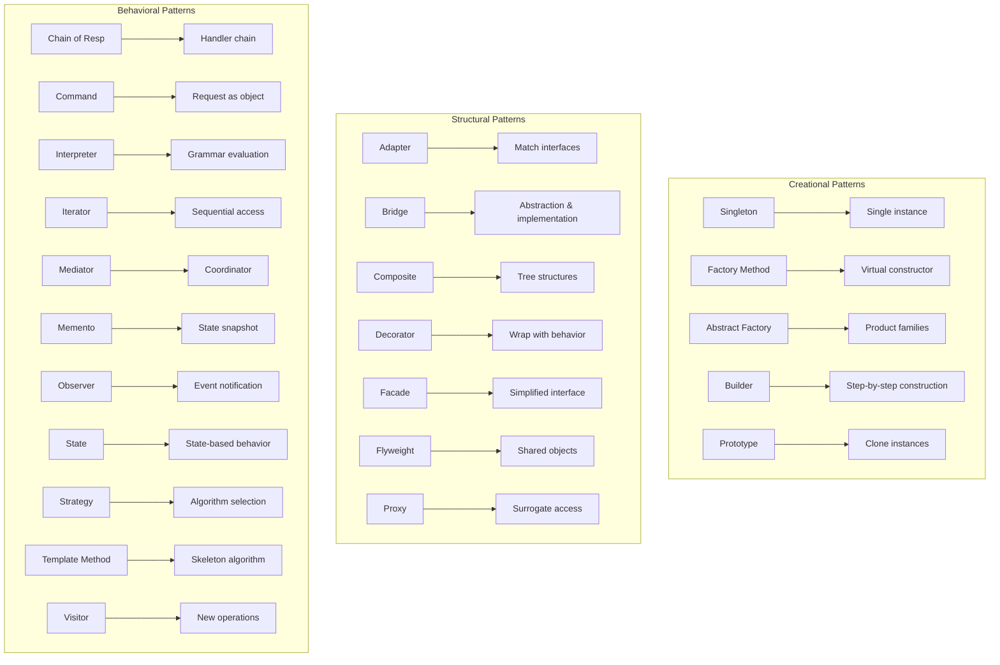

# GoF Design Patterns

## Architecture Diagram



## What Are GoF Design Patterns?

The **Gang of Four (GoF)** patterns were cataloged by Erich Gamma, Richard Helm, Ralph Johnson, and John Vlissides in their 1994 book *Design Patterns: Elements of Reusable Object-Oriented Software*. They describe 23 solutions to common software design problems.

## Why They Were Created

Before GoF, developers independently rediscovered the same solutions. The book created a shared vocabulary for design, enabling teams to communicate complex structural ideas succinctly and avoid reinventing the wheel.

## When to Use GoF Patterns

- **Code reviews** — pattern language makes discussions precise
- **Comprehension** — "this uses Observer" conveys more than explaining the whole mechanism
- **Refactoring** — patterns give target structures for improving code
- **Do not force patterns** — let them emerge from refactoring, don't start with them

---

## Creational Patterns

### Singleton

Ensures a class has only one instance and provides a global point of access.

```go
package config

import (
    "sync"
)

type Config struct {
    DatabaseURL string
    APIKey      string
}

var (
    instance *Config
    once     sync.Once
)

func GetConfig() *Config {
    once.Do(func() {
        instance = &Config{
            DatabaseURL: "postgres://localhost:5432/app",
            APIKey:      "secret-key",
        }
    })
    return instance
}
```

**When to avoid**: Singletons introduce global state, hinder testing, and hide dependencies. Use dependency injection instead when possible.

### Factory Method

Defines an interface for creating an object but lets subclasses decide which class to instantiate.

```typescript
interface Document {
    open(): void;
    save(): void;
}

class PDFDocument implements Document {
    open(): void { /* open PDF */ }
    save(): void { /* save PDF */ }
}

class WordDocument implements Document {
    open(): void { /* open Word */ }
    save(): void { /* save Word */ }
}

abstract class DocumentCreator {
    abstract createDocument(): Document;

    process(): void {
        const doc = this.createDocument();
        doc.open();
        doc.save();
    }
}

class PDFCreator extends DocumentCreator {
    createDocument(): Document {
        return new PDFDocument();
    }
}

class WordCreator extends DocumentCreator {
    createDocument(): Document {
        return new WordDocument();
    }
}
```

### Abstract Factory

Provides an interface for creating families of related or dependent objects without specifying concrete classes.

```kotlin
interface GUIFactory {
    fun createButton(): Button
    fun createCheckbox(): Checkbox
}

class WindowsFactory : GUIFactory {
    override fun createButton(): Button = WindowsButton()
    override fun createCheckbox(): Checkbox = WindowsCheckbox()
}

class MacFactory : GUIFactory {
    override fun createButton(): Button = MacButton()
    override fun createCheckbox(): Checkbox = MacCheckbox()
}

interface Button {
    fun render(): String
}

class WindowsButton : Button {
    override fun render(): String = "Windows-style button"
}

class MacButton : Button {
    override fun render(): String = "Mac-style button"
}
```

### Builder

Separates the construction of a complex object from its representation.

```python
class Pizza:
    def __init__(self):
        self.size = None
        self.cheese = False
        self.pepperoni = False
        self.mushrooms = False
        self.olives = False

class PizzaBuilder:
    def __init__(self):
        self.pizza = Pizza()

    def set_size(self, size: str):
        self.pizza.size = size
        return self

    def add_cheese(self):
        self.pizza.cheese = True
        return self

    def add_pepperoni(self):
        self.pizza.pepperoni = True
        return self

    def add_mushrooms(self):
        self.pizza.mushrooms = True
        return self

    def add_olives(self):
        self.pizza.olives = True
        return self

    def build(self) -> Pizza:
        return self.pizza

pizza = PizzaBuilder() \
    .set_size("large") \
    .add_cheese() \
    .add_pepperoni() \
    .build()
```

### Prototype

Creates new objects by copying an existing object (prototype).

```typescript
interface Prototype {
    clone(): Prototype;
}

class Shape implements Prototype {
    constructor(
        public x: number,
        public y: number,
        public color: string
    ) {}

    clone(): Shape {
        return new Shape(this.x, this.y, this.color);
    }
}

class Circle extends Shape {
    constructor(
        x: number,
        y: number,
        color: string,
        public radius: number
    ) {
        super(x, y, color);
    }

    clone(): Circle {
        return new Circle(this.x, this.y, this.color, this.radius);
    }
}
```

---

## Structural Patterns

### Adapter

Allows incompatible interfaces to work together.

```rust
trait JsonSerializer {
    fn to_json(&self) -> String;
}

struct User {
    name: String,
    age: u32,
}

impl JsonSerializer for User {
    fn to_json(&self) -> String {
        format!("{{\"name\":\"{}\",\"age\":{}}}", self.name, self.age)
    }
}

struct LegacyXmlUser {
    name: String,
    age: u32,
}

impl LegacyXmlUser {
    fn to_xml(&self) -> String {
        format!("<user><name>{}</name><age>{}</age></user>", self.name, self.age)
    }
}

struct XmlToJsonAdapter {
    legacy: LegacyXmlUser,
}

impl JsonSerializer for XmlToJsonAdapter {
    fn to_json(&self) -> String {
        format!("{{\"name\":\"{}\",\"age\":{}}}", self.legacy.name, self.legacy.age)
    }
}
```

### Bridge

Decouples an abstraction from its implementation so the two can vary independently.

```typescript
interface Device {
    isEnabled(): boolean;
    enable(): void;
    disable(): void;
    getVolume(): number;
    setVolume(percent: number): void;
}

class TV implements Device {
    private on = false;
    private volume = 50;

    isEnabled(): boolean { return this.on; }
    enable(): void { this.on = true; }
    disable(): void { this.on = false; }
    getVolume(): number { return this.volume; }
    setVolume(percent: number): void { this.volume = percent; }
}

class Radio implements Device {
    private on = false;
    private volume = 30;

    isEnabled(): boolean { return this.on; }
    enable(): void { this.on = true; }
    disable(): void { this.on = false; }
    getVolume(): number { return this.volume; }
    setVolume(percent: number): void { this.volume = percent; }
}

class Remote {
    constructor(protected device: Device) {}

    togglePower(): void {
        if (this.device.isEnabled()) {
            this.device.disable();
        } else {
            this.device.enable();
        }
    }

    volumeUp(): void {
        this.device.setVolume(this.device.getVolume() + 10);
    }

    volumeDown(): void {
        this.device.setVolume(this.device.getVolume() - 10);
    }
}
```

### Composite

Composes objects into tree structures to represent part-whole hierarchies.

```python
from abc import ABC, abstractmethod

class Component(ABC):
    @abstractmethod
    def render(self) -> str:
        pass

class Leaf(Component):
    def __init__(self, name: str):
        self.name = name

    def render(self) -> str:
        return self.name

class Composite(Component):
    def __init__(self, name: str):
        self.name = name
        self.children: list[Component] = []

    def add(self, child: Component):
        self.children.append(child)

    def render(self) -> str:
        result = f"{self.name}: ["
        result += ", ".join(child.render() for child in self.children)
        result += "]"
        return result

file1 = Leaf("file1.txt")
file2 = Leaf("file2.txt")
folder = Composite("Documents")
folder.add(file1)
folder.add(file2)
print(folder.render())
```

### Decorator

Attaches additional responsibilities to an object dynamically.

```typescript
interface Coffee {
    cost(): number;
    description(): string;
}

class SimpleCoffee implements Coffee {
    cost(): number { return 5; }
    description(): string { return "Simple coffee"; }
}

class MilkDecorator implements Coffee {
    constructor(private coffee: Coffee) {}

    cost(): number { return this.coffee.cost() + 2; }
    description(): string { return this.coffee.description() + ", milk"; }
}

class SugarDecorator implements Coffee {
    constructor(private coffee: Coffee) {}

    cost(): number { return this.coffee.cost() + 1; }
    description(): string { return this.coffee.description() + ", sugar"; }
}

class WhippedCreamDecorator implements Coffee {
    constructor(private coffee: Coffee) {}

    cost(): number { return this.coffee.cost() + 3; }
    description(): string { return this.coffee.description() + ", whipped cream"; }
}

let coffee: Coffee = new SimpleCoffee();
coffee = new MilkDecorator(coffee);
coffee = new SugarDecorator(coffee);
coffee = new WhippedCreamDecorator(coffee);
```

### Facade

Provides a unified interface to a set of interfaces in a subsystem.

```python
class CPU:
    def freeze(self): pass
    def jump(self, position: int): pass
    def execute(self): pass

class Memory:
    def load(self, position: int, data: bytes): pass

class HardDrive:
    def read(self, lba: int, size: int) -> bytes:
        return b"boot data"

class ComputerFacade:
    def __init__(self):
        self.cpu = CPU()
        self.memory = Memory()
        self.hard_drive = HardDrive()

    def start(self):
        self.cpu.freeze()
        self.memory.load(0, self.hard_drive.read(0, 1024))
        self.cpu.jump(0)
        self.cpu.execute()
```

### Flyweight

Shares fine-grained objects to minimize memory usage.

```go
package main

import "fmt"

type TreeType struct {
    name    string
    color   string
    texture string
}

var treeTypes = make(map[string]*TreeType)

func GetTreeType(name, color, texture string) *TreeType {
    key := name + "|" + color + "|" + texture
    if t, ok := treeTypes[key]; ok {
        return t
    }
    t := &TreeType{name, color, texture}
    treeTypes[key] = t
    return t
}

type Tree struct {
    x, y int
    typeRef *TreeType
}

func (t *Tree) Render() {
    fmt.Printf("Tree at (%d,%d) type=%s color=%s\n", t.x, t.y, t.typeRef.name, t.typeRef.color)
}

type Forest struct {
    trees []Tree
}

func (f *Forest) PlantTree(x, y int, name, color, texture string) {
    t := GetTreeType(name, color, texture)
    f.trees = append(f.trees, Tree{x, y, t})
}

func (f *Forest) Render() {
    for _, t := range f.trees {
        t.Render()
    }
}
```

### Proxy

Provides a surrogate or placeholder for another object to control access.

```typescript
interface Image {
    display(): void;
}

class RealImage implements Image {
    constructor(private filename: string) {
        this.loadFromDisk();
    }

    private loadFromDisk(): void {
        console.log(`Loading ${this.filename} from disk...`);
    }

    display(): void {
        console.log(`Displaying ${this.filename}`);
    }
}

class ProxyImage implements Image {
    private realImage: RealImage | null = null;

    constructor(private filename: string) {}

    display(): void {
        if (!this.realImage) {
            this.realImage = new RealImage(this.filename);
        }
        this.realImage.display();
    }
}

const image: Image = new ProxyImage("photo.jpg");
image.display();
image.display();
```

---

## Behavioral Patterns

### Chain of Responsibility

Passes requests along a chain of handlers.

```typescript
abstract class Handler {
    protected next: Handler | null = null;

    setNext(handler: Handler): Handler {
        this.next = handler;
        return handler;
    }

    abstract handle(request: string): string | null;
}

class AuthHandler extends Handler {
    handle(request: string): string | null {
        if (request.includes("token")) {
            return this.next?.handle(request) ?? null;
        }
        return "Auth failed: no token";
    }
}

class ValidationHandler extends Handler {
    handle(request: string): string | null {
        if (request.length > 0) {
            return this.next?.handle(request) ?? null;
        }
        return "Validation failed: empty request";
    }
}

class CacheHandler extends Handler {
    handle(request: string): string | null {
        return `Cached response for: ${request}`;
    }
}

const chain = new AuthHandler();
chain.setNext(new ValidationHandler()).setNext(new CacheHandler());
console.log(chain.handle("request with token"));
```

### Command

Encapsulates a request as an object.

```python
from abc import ABC, abstractmethod

class Command(ABC):
    @abstractmethod
    def execute(self):
        pass

    @abstractmethod
    def undo(self):
        pass

class TextEditor:
    def __init__(self):
        self.text = ""

    def append(self, text: str):
        self.text += text

    def remove(self, n: int):
        self.text = self.text[:-n]

class AppendCommand(Command):
    def __init__(self, editor: TextEditor, text: str):
        self.editor = editor
        self.text = text

    def execute(self):
        self.editor.append(self.text)

    def undo(self):
        self.editor.remove(len(self.text))

class CommandHistory:
    def __init__(self):
        self.history: list[Command] = []

    def execute(self, cmd: Command):
        cmd.execute()
        self.history.append(cmd)

    def undo(self):
        if self.history:
            cmd = self.history.pop()
            cmd.undo()

editor = TextEditor()
history = CommandHistory()
history.execute(AppendCommand(editor, "Hello "))
history.execute(AppendCommand(editor, "World!"))
print(editor.text)
history.undo()
print(editor.text)
```

### Interpreter

Defines a grammar and an interpreter for sentences in that grammar.

```go
package main

import (
    "fmt"
    "strconv"
    "strings"
)

type Expression interface {
    Interpret() int
}

type Number struct {
    value int
}

func (n *Number) Interpret() int {
    return n.value
}

type Add struct {
    left, right Expression
}

func (a *Add) Interpret() int {
    return a.left.Interpret() + a.right.Interpret()
}

type Subtract struct {
    left, right Expression
}

func (s *Subtract) Interpret() int {
    return s.left.Interpret() - s.right.Interpret()
}

func parse(tokens []string) Expression {
    if len(tokens) == 1 {
        v, _ := strconv.Atoi(tokens[0])
        return &Number{v}
    }
    if tokens[1] == "+" {
        return &Add{parse([]string{tokens[0]}), parse(tokens[2:])}
    }
    if tokens[1] == "-" {
        return &Subtract{parse([]string{tokens[0]}), parse(tokens[2:])}
    }
    return nil
}

func main() {
    expr := parse(strings.Split("3 + 4 - 2", " "))
    fmt.Println(expr.Interpret())
}
```

### Iterator

Provides a way to access elements of a collection sequentially.

```rust
struct Stack<T> {
    items: Vec<T>,
}

impl<T> Stack<T> {
    fn new() -> Self {
        Stack { items: Vec::new() }
    }

    fn push(&mut self, item: T) {
        self.items.push(item);
    }

    fn iter(&self) -> StackIterator<T> {
        StackIterator {
            stack: &self.items,
            index: self.items.len(),
        }
    }
}

struct StackIterator<'a, T> {
    stack: &'a Vec<T>,
    index: usize,
}

impl<'a, T> Iterator for StackIterator<'a, T> {
    type Item = &'a T;

    fn next(&mut self) -> Option<Self::Item> {
        if self.index == 0 {
            None
        } else {
            self.index -= 1;
            Some(&self.stack[self.index])
        }
    }
}

fn main() {
    let mut stack = Stack::new();
    stack.push(1);
    stack.push(2);
    stack.push(3);
    for item in stack.iter() {
        println!("{}", item);
    }
}
```

### Mediator

Defines an object that encapsulates how objects interact.

```typescript
interface ChatMediator {
    sendMessage(user: User, message: string): void;
    addUser(user: User): void;
}

class ChatRoom implements ChatMediator {
    private users: User[] = [];

    addUser(user: User): void {
        this.users.push(user);
    }

    sendMessage(user: User, message: string): void {
        for (const u of this.users) {
            if (u !== user) {
                u.receive(user.name, message);
            }
        }
    }
}

class User {
    constructor(public name: string, private mediator: ChatMediator) {
        mediator.addUser(this);
    }

    send(message: string): void {
        console.log(`${this.name} sends: ${message}`);
        this.mediator.sendMessage(this, message);
    }

    receive(from: string, message: string): void {
        console.log(`${this.name} received from ${from}: ${message}`);
    }
}

const room = new ChatRoom();
const alice = new User("Alice", room);
const bob = new User("Bob", room);
alice.send("Hello!");
```

### Memento

Captures and restores an object's internal state.

```python
class Memento:
    def __init__(self, state: str):
        self._state = state

    def get_state(self) -> str:
        return self._state

class Editor:
    def __init__(self):
        self._content = ""

    def write(self, text: str):
        self._content += text

    def get_content(self) -> str:
        return self._content

    def save(self) -> Memento:
        return Memento(self._content)

    def restore(self, memento: Memento):
        self._content = memento.get_state()

class History:
    def __init__(self):
        self._states: list[Memento] = []

    def push(self, memento: Memento):
        self._states.append(memento)

    def pop(self) -> Memento:
        return self._states.pop()

editor = Editor()
history = History()

editor.write("Hello ")
history.push(editor.save())

editor.write("World!")
history.push(editor.save())

print(editor.get_content())
editor.restore(history.pop())
print(editor.get_content())
```

### Observer

Defines a one-to-many dependency between objects so that when one object changes state, all dependents are notified.

```python
class Observer:
    def update(self, message: str):
        pass

class Subject:
    def __init__(self):
        self._observers: list[Observer] = []

    def attach(self, observer: Observer):
        self._observers.append(observer)

    def detach(self, observer: Observer):
        self._observers.remove(observer)

    def notify(self, message: str):
        for observer in self._observers:
            observer.update(message)

class EmailObserver(Observer):
    def __init__(self, email: str):
        self.email = email

    def update(self, message: str):
        print(f"Email to {self.email}: {message}")

class SMSObserver(Observer):
    def __init__(self, phone: str):
        self.phone = phone

    def update(self, message: str):
        print(f"SMS to {self.phone}: {message}")

subject = Subject()
subject.attach(EmailObserver("alice@example.com"))
subject.attach(SMSObserver("+1234567890"))
subject.notify("Order shipped!")
```

### State

Allows an object to alter its behavior when its internal state changes.

```go
package main

import "fmt"

type State interface {
    Play(player *MusicPlayer)
    Pause(player *MusicPlayer)
    Stop(player *MusicPlayer)
}

type PlayingState struct{}

func (s *PlayingState) Play(player *MusicPlayer) {
    fmt.Println("Already playing")
}

func (s *PlayingState) Pause(player *MusicPlayer) {
    fmt.Println("Pausing playback")
    player.SetState(&PausedState{})
}

func (s *PlayingState) Stop(player *MusicPlayer) {
    fmt.Println("Stopping playback")
    player.SetState(&StoppedState{})
}

type PausedState struct{}

func (s *PausedState) Play(player *MusicPlayer) {
    fmt.Println("Resuming playback")
    player.SetState(&PlayingState{})
}

func (s *PausedState) Pause(player *MusicPlayer) {
    fmt.Println("Already paused")
}

func (s *PausedState) Stop(player *MusicPlayer) {
    fmt.Println("Stopping from pause")
    player.SetState(&StoppedState{})
}

type StoppedState struct{}

func (s *StoppedState) Play(player *MusicPlayer) {
    fmt.Println("Starting playback")
    player.SetState(&PlayingState{})
}

func (s *StoppedState) Pause(player *MusicPlayer) {
    fmt.Println("Cannot pause: stopped")
}

func (s *StoppedState) Stop(player *MusicPlayer) {
    fmt.Println("Already stopped")
}

type MusicPlayer struct {
    state State
}

func (p *MusicPlayer) SetState(s State) {
    p.state = s
}

func (p *MusicPlayer) Play()  { p.state.Play(p) }
func (p *MusicPlayer) Pause() { p.state.Pause(p) }
func (p *MusicPlayer) Stop()  { p.state.Stop(p) }

func main() {
    player := &MusicPlayer{state: &StoppedState{}}
    player.Play()
    player.Pause()
    player.Play()
    player.Stop()
}
```

### Strategy

Defines a family of algorithms, encapsulates each, and makes them interchangeable.

```typescript
interface SortingStrategy {
    sort(data: number[]): number[];
}

class BubbleSort implements SortingStrategy {
    sort(data: number[]): number[] {
        const arr = [...data];
        for (let i = 0; i < arr.length; i++) {
            for (let j = 0; j < arr.length - i - 1; j++) {
                if (arr[j] > arr[j + 1]) {
                    [arr[j], arr[j + 1]] = [arr[j + 1], arr[j]];
                }
            }
        }
        return arr;
    }
}

class QuickSort implements SortingStrategy {
    sort(data: number[]): number[] {
        if (data.length <= 1) return data;
        const pivot = data[0];
        const left = data.slice(1).filter(x => x < pivot);
        const right = data.slice(1).filter(x => x >= pivot);
        return [...this.sort(left), pivot, ...this.sort(right)];
    }
}

class Sorter {
    constructor(private strategy: SortingStrategy) {}

    setStrategy(strategy: SortingStrategy): void {
        this.strategy = strategy;
    }

    sort(data: number[]): number[] {
        return this.strategy.sort(data);
    }
}

const sorter = new Sorter(new BubbleSort());
sorter.sort([3, 1, 4, 1, 5, 9]);
sorter.setStrategy(new QuickSort());
sorter.sort([3, 1, 4, 1, 5, 9]);
```

### Template Method

Defines the skeleton of an algorithm in a method, deferring some steps to subclasses.

```python
from abc import ABC, abstractmethod

class DataMiner(ABC):
    def mine(self, path: str) -> str:
        data = self.load(path)
        parsed = self.parse(data)
        self.clean(parsed)
        return self.analyze(parsed)

    @abstractmethod
    def load(self, path: str) -> str:
        pass

    @abstractmethod
    def parse(self, data: str) -> dict:
        pass

    def clean(self, data: dict):
        pass

    def analyze(self, data: dict) -> str:
        return f"Analysis: {data}"

class PDFMiner(DataMiner):
    def load(self, path: str) -> str:
        return f"PDF content from {path}"

    def parse(self, data: str) -> dict:
        return {"type": "pdf", "content": data}

class CSVDataMiner(DataMiner):
    def load(self, path: str) -> str:
        return f"CSV content from {path}"

    def parse(self, data: str) -> dict:
        return {"type": "csv", "rows": data.split("\n")}

    def clean(self, data: dict):
        data["rows"] = [r for r in data["rows"] if r.strip()]
```

### Visitor

Represents an operation to be performed on elements of an object structure.

```go
package main

import "fmt"

type Visitor interface {
    VisitCircle(c *Circle)
    VisitRectangle(r *Rectangle)
}

type Shape interface {
    Accept(v Visitor)
}

type Circle struct {
    Radius float64
}

func (c *Circle) Accept(v Visitor) {
    v.VisitCircle(c)
}

type Rectangle struct {
    Width, Height float64
}

func (r *Rectangle) Accept(v Visitor) {
    v.VisitRectangle(r)
}

type AreaCalculator struct {
    TotalArea float64
}

func (a *AreaCalculator) VisitCircle(c *Circle) {
    area := 3.14159 * c.Radius * c.Radius
    a.TotalArea += area
    fmt.Printf("Circle area: %.2f\n", area)
}

func (a *AreaCalculator) VisitRectangle(r *Rectangle) {
    area := r.Width * r.Height
    a.TotalArea += area
    fmt.Printf("Rectangle area: %.2f\n", area)
}

type JSONSerializer struct {
    result string
}

func (j *JSONSerializer) VisitCircle(c *Circle) {
    j.result = fmt.Sprintf("{\"type\":\"circle\",\"radius\":%f}", c.Radius)
}

func (j *JSONSerializer) VisitRectangle(r *Rectangle) {
    j.result = fmt.Sprintf("{\"type\":\"rectangle\",\"width\":%f,\"height\":%f}", r.Width, r.Height)
}

func main() {
    shapes := []Shape{&Circle{Radius: 5}, &Rectangle{Width: 3, Height: 4}}
    calc := &AreaCalculator{}
    for _, s := range shapes {
        s.Accept(calc)
    }
    fmt.Printf("Total: %.2f\n", calc.TotalArea)
}
```

---

## Best Practices

1. **Favor composition over inheritance** — most patterns use composition
2. **Know when NOT to use a pattern** — Singleton and Visitor are often overused
3. **Patterns are a vocabulary** — use them to communicate, not to dictate design
4. **Let patterns emerge from refactoring**, not upfront design
5. **Combine patterns** — patterns compose well (e.g., Strategy + Factory)
6. **Modern language features replace some patterns** — closures replace Strategy in FP languages
7. **Document which patterns you use** — aids onboarding and maintenance

---

## Interview Questions

1. What is the difference between Factory Method and Abstract Factory?
2. When would you use a Prototype pattern instead of a Factory?
3. How does the Decorator pattern differ from inheritance?
4. Explain the Proxy pattern with a real-world example.
5. What is the relationship between Observer and Mediator patterns?
6. How does the State pattern differ from Strategy?
7. When is the Visitor pattern appropriate? What are its drawbacks?
8. What modern language features can replace the Command pattern?
9. How would you implement a thread-safe Singleton?
10. Can you combine Composite and Visitor patterns? How?

---

## Real Company Usage

| Pattern | Company | Application |
|---------|---------|-------------|
| Singleton | **Google** | Logging and config in Android SDK |
| Factory | **Netflix** | Content encoding pipeline creation |
| Builder | **Uber** | Trip request builder pattern |
| Adapter | **Spotify** | Cross-platform audio backend abstraction |
| Decorator | **AWS** | S3 request signing decorator chain |
| Observer | **RxJS** | ReactiveX observer pattern |
| Strategy | **Stripe** | Payment method strategy resolution |
| Command | **VS Code** | Editor action commands with undo |
| Proxy | **Nginx** | Reverse proxy pattern |
