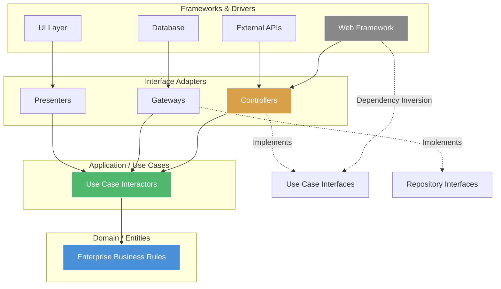

# Clean Architecture

## Architecture Diagram



## What Is Clean Architecture?

Clean Architecture, introduced by Robert C. Martin in his 2012 book, is a software architecture philosophy that enforces separation of concerns through concentric layers. The core principle: **source code dependencies must point inward** — outer layers depend on inner layers, never the reverse.

## Why It Was Created

Traditional layered architectures create tight coupling to frameworks, databases, and UI. Changes in technology ripple through the entire system. Clean Architecture decouples business rules from infrastructure, making systems:

- **Framework-independent** — frameworks are tools, not constraints
- **Testable** — core business logic tests without infrastructure
- **UI-independent** — swap UI without changing rules
- **Database-independent** — swap DB without changing rules
- **Agnostic to external agencies** — business rules don't know about anything outside

## When to Use Clean Architecture

- **Long-lived enterprise applications** — where technology evolves but business rules persist
- **Domain-complex systems** — fintech, healthcare, insurance, law
- **Microservices** — each service can have clean architecture internally
- **Overkill for** — CRUD apps (unless domain logic is complex), prototypes, small scripts

---

## Layer Breakdown

### 1. Entities (Enterprise Business Rules)

The innermost layer. Contains enterprise-wide business rules in the form of entities. These are the most stable, least likely to change.

```typescript
// domain/entities/User.ts
export class User {
    constructor(
        public readonly id: string,
        public readonly email: string,
        public readonly name: string,
        private _role: UserRole,
        private _isActive: boolean
    ) {}

    get role(): UserRole {
        return this._role;
    }

    get isActive(): boolean {
        return this._isActive;
    }

    activate(): void {
        if (this._isActive) throw new Error("User is already active");
        this._isActive = true;
    }

    deactivate(): void {
        if (this._role === UserRole.ADMIN) {
            throw new Error("Cannot deactivate admin users");
        }
        this._isActive = false;
    }

    changeRole(newRole: UserRole): void {
        if (!this._isActive) throw new Error("Cannot change role of inactive user");
        this._role = newRole;
    }
}

export enum UserRole {
    ADMIN = "admin",
    EDITOR = "editor",
    VIEWER = "viewer",
}
```

### 2. Use Cases (Application Business Rules)

Contains application-specific business rules. Orchestrates the flow of data to and from entities.

```typescript
// application/usecases/CreateUserUseCase.ts
import { User, UserRole } from "../domain/entities/User";
import { UserRepository } from "../domain/repositories/UserRepository";
import { EmailService } from "../domain/services/EmailService";
import { CreateUserDTO } from "./dtos/CreateUserDTO";

export class CreateUserUseCase {
    constructor(
        private userRepository: UserRepository,
        private emailService: EmailService
    ) {}

    async execute(dto: CreateUserDTO): Promise<User> {
        const existing = await this.userRepository.findByEmail(dto.email);
        if (existing) {
            throw new Error("User with this email already exists");
        }

        const user = new User(
            crypto.randomUUID(),
            dto.email,
            dto.name,
            UserRole.VIEWER,
            true
        );

        await this.userRepository.save(user);
        await this.emailService.sendWelcomeEmail(user.email, user.name);

        return user;
    }
}
```

### 3. Interface Adapters

Converts data from the format most convenient for use cases/entities to the format most convenient for external agencies.

```typescript
// application/adapters/controllers/UserController.ts
import { Request, Response } from "express";
import { CreateUserUseCase } from "../../usecases/CreateUserUseCase";
import { CreateUserDTO } from "../../usecases/dtos/CreateUserDTO";

export class UserController {
    constructor(private createUserUseCase: CreateUserUseCase) {}

    async create(req: Request, res: Response): Promise<void> {
        try {
            const dto: CreateUserDTO = {
                email: req.body.email,
                name: req.body.name,
            };

            const user = await this.createUserUseCase.execute(dto);

            res.status(201).json({
                id: user.id,
                email: user.email,
                name: user.name,
                role: user.role,
            });
        } catch (error) {
            if (error instanceof Error) {
                res.status(400).json({ error: error.message });
                return;
            }
            res.status(500).json({ error: "Internal server error" });
        }
    }
}
```

```typescript
// application/adapters/gateways/PostgresUserRepository.ts
import { Pool } from "pg";
import { User } from "../../domain/entities/User";
import { UserRole } from "../../domain/entities/User";
import { UserRepository } from "../../domain/repositories/UserRepository";

export class PostgresUserRepository implements UserRepository {
    constructor(private pool: Pool) {}

    async findByEmail(email: string): Promise<User | null> {
        const result = await this.pool.query(
            "SELECT id, email, name, role, is_active FROM users WHERE email = $1",
            [email]
        );
        if (result.rows.length === 0) return null;
        const row = result.rows[0];
        return new User(row.id, row.email, row.name, row.role as UserRole, row.is_active);
    }

    async save(user: User): Promise<void> {
        await this.pool.query(
            `INSERT INTO users (id, email, name, role, is_active)
             VALUES ($1, $2, $3, $4, $5)
             ON CONFLICT (id) DO UPDATE SET
                email = $2, name = $3, role = $4, is_active = $5`,
            [user.id, user.email, user.name, user.role, user.isActive]
        );
    }
}
```

### 4. Frameworks & Drivers

The outermost layer — database, web framework, UI toolkit, external APIs. This is where implementation details live.

```typescript
// infrastructure/express/index.ts
import express from "express";
import { Pool } from "pg";
import { CreateUserUseCase } from "../application/usecases/CreateUserUseCase";
import { PostgresUserRepository } from "../application/adapters/gateways/PostgresUserRepository";
import { SmtpEmailService } from "./services/SmtpEmailService";
import { UserController } from "../application/adapters/controllers/UserController";

const app = express();
const pool = new Pool({ connectionString: process.env.DATABASE_URL });
const userRepository = new PostgresUserRepository(pool);
const emailService = new SmtpEmailService();
const createUserUseCase = new CreateUserUseCase(userRepository, emailService);
const userController = new UserController(createUserUseCase);

app.post("/users", (req, res) => userController.create(req, res));
app.listen(3000);
```

---

## Dependency Rule

Dependencies must **only point inward**. Nothing in an inner circle can know about something in an outer circle.

```mermaid
graph LR
    subgraph "Dependency Direction"
        ENT[Entities] <-- USEC[Use Cases] <-- ADAPT[Adapters] <-- FRAME[Frameworks]
    end
    style ENT fill:#4a90d9,stroke:#fff,color:#fff
    style USEC fill:#50b86c,stroke:#fff,color:#fff
    style ADAPT fill:#d9a04a,stroke:#fff,color:#fff
    style FRAME fill:#888,stroke:#fff,color:#fff
```

## Boundary Crossing

When outer layer code needs to communicate with inner layer code, cross boundaries using **Dependency Inversion**:

```typescript
// Inner layer defines the interface
// domain/repositories/UserRepository.ts
export interface UserRepository {
    findByEmail(email: string): Promise<User | null>;
    save(user: User): Promise<void>;
}
```

```typescript
// Outer layer implements it
// PostgresUserRepository implements UserRepository
```

```typescript
// Use case depends on abstraction
// application/usecases/CreateUserUseCase.ts
constructor(private userRepository: UserRepository) {}
```

## Screaming Architecture

Your project structure should **scream** what the system is about. A healthcare system's structure should scream "healthcare," not "Spring" or "Express."

### Good: Screams "E-commerce"

```
src/
├── domain/
│   ├── entities/
│   │   ├── Product.ts
│   │   ├── Order.ts
│   │   ├── Customer.ts
│   │   └── Cart.ts
│   ├── repositories/
│   │   ├── ProductRepository.ts
│   │   ├── OrderRepository.ts
│   │   └── CustomerRepository.ts
│   └── services/
│       ├── PricingService.ts
│       └── ShippingService.ts
├── application/
│   ├── usecases/
│   │   ├── AddProductToCartUseCase.ts
│   │   ├── CheckoutUseCase.ts
│   │   ├── ProcessPaymentUseCase.ts
│   │   └── ShipOrderUseCase.ts
│   └── dtos/
│       ├── AddToCartDTO.ts
│       └── CheckoutDTO.ts
├── adapters/
│   ├── controllers/
│   │   ├── ProductController.ts
│   │   ├── OrderController.ts
│   │   └── CartController.ts
│   ├── gateways/
│   │   ├── PostgresProductRepository.ts
│   │   ├── StripePaymentGateway.ts
│   │   └── ShipEngineShippingAdapter.ts
│   └── presenters/
│       └── OrderPresenter.ts
└── infrastructure/
    ├── express/
    ├── postgres/
    └── redis/
```

### Bad: Screams "Framework"

```
src/
├── models/
├── controllers/
├── views/
├── helpers/
├── config/
└── migrations/
```

## Use Case Interactors

A use case interactor:
1. **Takes input** from an adapter (controller)
2. **Validates** business rules
3. **Orchestrates** entities and domain services
4. **Returns output** (or calls presenter)

```typescript
// application/usecases/CheckoutUseCase.ts
import { Order } from "../../domain/entities/Order";
import { Cart } from "../../domain/entities/Cart";
import { OrderRepository } from "../../domain/repositories/OrderRepository";
import { PaymentService } from "../../domain/services/PaymentService";
import { InventoryService } from "../../domain/services/InventoryService";
import { NotificationService } from "../../domain/services/NotificationService";
import { CheckoutRequest } from "./dtos/CheckoutRequest";
import { CheckoutResponse } from "./dtos/CheckoutResponse";

export class CheckoutUseCase {
    constructor(
        private orderRepository: OrderRepository,
        private paymentService: PaymentService,
        private inventoryService: InventoryService,
        private notificationService: NotificationService
    ) {}

    async execute(request: CheckoutRequest): Promise<CheckoutResponse> {
        const cart = await this.restoreCart(request.cartId);
        cart.validate();

        const available = await this.inventoryService.checkAvailability(cart.items);
        if (!available) {
            throw new Error("Some items are out of stock");
        }

        const order = Order.create(cart, request.customerId);
        const payment = await this.paymentService.charge(order.total, request.paymentMethod);

        order.confirmPayment(payment.transactionId);
        await this.orderRepository.save(order);
        await this.inventoryService.deductInventory(cart.items);
        await this.notificationService.sendOrderConfirmation(order);

        return {
            orderId: order.id,
            total: order.total,
            status: order.status,
        };
    }

    private async restoreCart(cartId: string): Promise<Cart> {
        throw new Error("not implemented");
    }
}
```

## Real Project Structure Example

```
order-management-service/
├── pom.xml
├── src/
│   ├── main/
│   │   ├── java/com/company/orders/
│   │   │   ├── domain/
│   │   │   │   ├── entity/
│   │   │   │   │   ├── Order.java
│   │   │   │   │   ├── OrderItem.java
│   │   │   │   │   └── Customer.java
│   │   │   │   ├── repository/
│   │   │   │   │   └── OrderRepository.java
│   │   │   │   ├── service/
│   │   │   │   │   ├── PricingService.java
│   │   │   │   │   └── TaxCalculator.java
│   │   │   │   └── spec/
│   │   │   │       └── ShippingSpecification.java
│   │   │   ├── application/
│   │   │   │   ├── usecase/
│   │   │   │   │   ├── CreateOrderUseCase.java
│   │   │   │   │   ├── CancelOrderUseCase.java
│   │   │   │   │   └── TrackOrderUseCase.java
│   │   │   │   └── dto/
│   │   │   │       ├── CreateOrderRequest.java
│   │   │   │       ├── CancelOrderRequest.java
│   │   │   │       └── OrderResponse.java
│   │   │   ├── adapter/
│   │   │   │   ├── inbound/
│   │   │   │   │   ├── rest/
│   │   │   │   │   │   ├── OrderController.java
│   │   │   │   │   │   └── OrderDTOMapper.java
│   │   │   │   │   └── messaging/
│   │   │   │   │       └── OrderEventConsumer.java
│   │   │   │   └── outbound/
│   │   │   │       ├── persistence/
│   │   │   │       │   ├── JpaOrderRepository.java
│   │   │   │       │   └── OrderEntityMapper.java
│   │   │   │       ├── payment/
│   │   │   │       │   └── StripePaymentAdapter.java
│   │   │   │       └── notification/
│   │   │   │           └── SnsNotificationAdapter.java
│   │   │   └── infrastructure/
│   │   │       ├── config/
│   │   │       │   ├── BeanConfiguration.java
│   │   │       │   └── DatabaseConfig.java
│   │   │       └── security/
│   │   │           └── JwtAuthFilter.java
├── docker-compose.yml
└── k8s/
    └── deployment.yaml
```

---

## Best Practices

1. **Keep entities pure** — no framework annotations, no serialization logic, no database concerns
2. **Use case interactors are the heart** — they should be testable without mocking infrastructure
3. **Repository interfaces belong in the domain** — implementations in adapters
4. **DTOs cross boundaries** — never pass entities to controllers or presenters
5. **One use case per class** — keeps interactors focused and testable
6. **Cross boundaries with interfaces** — never import concrete outer-layer classes in inner layers
7. **Dependency injection at composition root** — wire everything up at application startup
8. **Validation in use cases** — not in controllers or entities
9. **Presenters for UI logic** — keep formatting and display logic out of entities and use cases

---

## Interview Questions

1. Explain the dependency rule in Clean Architecture.
2. How do you cross layer boundaries without violating the dependency rule?
3. What is the difference between a use case interactor and a controller?
4. How does Clean Architecture handle database access?
5. What is "Screaming Architecture" and why does it matter?
6. Where do you put validation logic in Clean Architecture?
7. How do entities differ from DTOs?
8. Can Clean Architecture work with microservices?
9. How does Clean Architecture relate to Hexagonal Architecture?
10. What are the warning signs that you're violating Clean Architecture?

---

## Real Company Usage

| Company | Application | How They Use It |
|---------|-------------|-----------------|
| **Uber** | Trip management | Domain-centric services with use case orchestration |
| **Spotify** | Feature backends | Clean layers for playlist, recommendation, and search |
| **Netflix** | Video pipeline | Entity-driven encoding and transcoding use cases |
| **Airbnb** | Booking system | Domain models with use case interactors for reservations |
| **Thoughtworks** | Client projects | Clean Architecture as standard project template |
| **Groupon** | Deal management | Domain-centric microservices with repository pattern |
