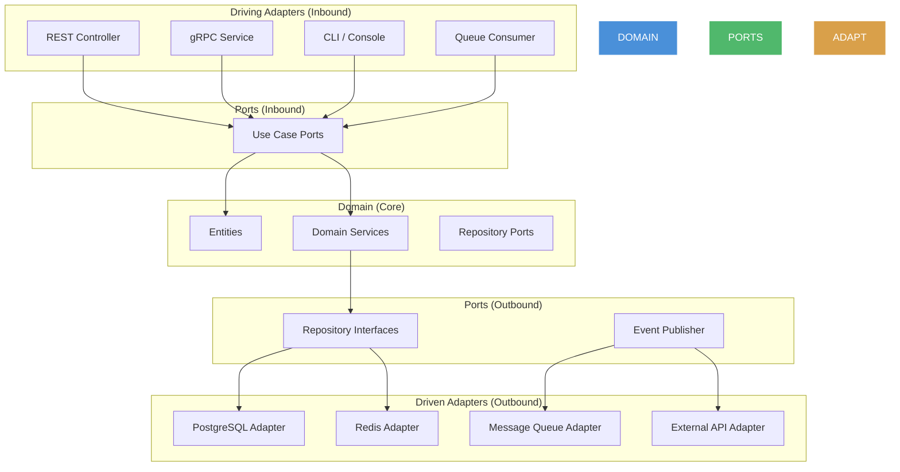
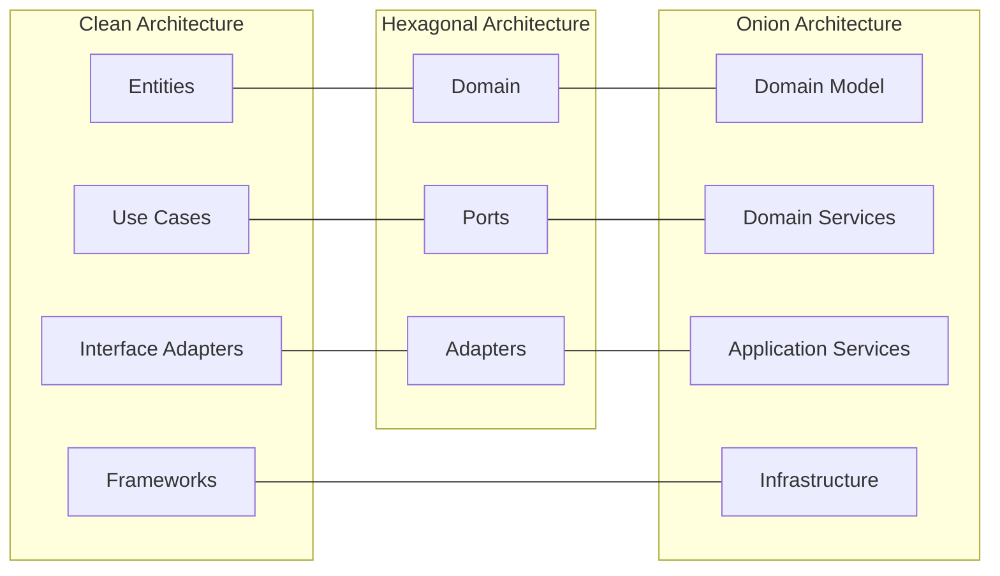

# Hexagonal Architecture (Ports & Adapters)

## Architecture Diagram



## What Is Hexagonal Architecture?

Hexagonal Architecture (also called **Ports & Adapters**) was introduced by **Alistair Cockburn** in 2005. It structures applications so that the **domain core is completely isolated** from external concerns. Communication with the outside world happens through **ports** (interfaces) and **adapters** (implementations).

## Why It Was Created

Traditional layered architectures often leaked technology choices into the business layer. Cockburn's insight: rather than having the application control the outside world, flip it — the outside world plugs into the application through defined ports. This creates:

- **Testability** — domain logic tests without infrastructure
- **Technology independence** — swap databases, UIs, or messaging with zero domain changes
- **Parallel development** — teams can work on domain and adapters simultaneously
- **Delayed decisions** — postpone infrastructure choices until absolutely necessary

## When to Use Hexagonal Architecture

- **Any non-trivial application** — the cost is low, the payoff is high
- **Systems likely to change infrastructure** — cloud migrations, DB swaps, API version changes
- **Domain-heavy applications** — fintech, insurance, logistics
- **Microservices** — each service gets its own hexagonal boundary
- **Not for** — throwaway scripts, embedded systems with fixed hardware, trivial CRUD

---

## Core Concepts

### Ports (Interfaces)

Ports define **contracts** between the domain and the outside world.

**Inbound Ports** — what the application can do (use cases):

```rust
use std::error::Error;

pub trait OrderUseCase {
    fn create_order(&self, request: CreateOrderRequest) -> Result<OrderResponse, Box<dyn Error>>;
    fn cancel_order(&self, order_id: &str, reason: &str) -> Result<(), Box<dyn Error>>;
    fn get_order(&self, order_id: &str) -> Result<OrderResponse, Box<dyn Error>>;
}

pub struct CreateOrderRequest {
    pub customer_id: String,
    pub items: Vec<OrderItemRequest>,
    pub shipping_address: Address,
}

pub struct OrderItemRequest {
    pub product_id: String,
    pub quantity: u32,
}

pub struct Address {
    pub street: String,
    pub city: String,
    pub zip_code: String,
    pub country: String,
}

pub struct OrderResponse {
    pub order_id: String,
    pub status: String,
    pub total: f64,
    pub items: Vec<OrderItemResponse>,
}

pub struct OrderItemResponse {
    pub product_id: String,
    pub quantity: u32,
    pub price: f64,
}
```

**Outbound Ports** — what the application needs from the outside (repositories, services):

```rust
#[async_trait]
pub trait OrderRepository: Send + Sync {
    async fn save(&self, order: Order) -> Result<(), Box<dyn Error>>;
    async fn find_by_id(&self, order_id: &str) -> Result<Option<Order>, Box<dyn Error>>;
    async fn find_by_customer(&self, customer_id: &str) -> Result<Vec<Order>, Box<dyn Error>>;
}

#[async_trait]
pub trait PaymentGateway: Send + Sync {
    async fn charge(&self, charge: ChargeRequest) -> Result<ChargeResponse, Box<dyn Error>>;
    async fn refund(&self, transaction_id: &str) -> Result<(), Box<dyn Error>>;
}

#[async_trait]
pub trait InventoryService: Send + Sync {
    async fn reserve(&self, items: Vec<ReservationItem>) -> Result<ReservationResult, Box<dyn Error>>;
    async fn release(&self, reservation_id: &str) -> Result<(), Box<dyn Error>>;
}
```

### Adapters (Implementations)

**Driving (Inbound) Adapters** — initiate interaction with the application (e.g., REST controller, gRPC service, CLI):

```rust
use actix_web::{web, HttpResponse, Responder};
use std::sync::Arc;

pub struct OrderController {
    order_usecase: Arc<dyn OrderUseCase + Send + Sync>,
}

impl OrderController {
    pub fn new(order_usecase: Arc<dyn OrderUseCase + Send + Sync>) -> Self {
        Self { order_usecase }
    }

    pub async fn create_order(&self, body: web::Json<CreateOrderJson>) -> impl Responder {
        let request = CreateOrderRequest {
            customer_id: body.customer_id.clone(),
            items: body.items.iter().map(|i| OrderItemRequest {
                product_id: i.product_id.clone(),
                quantity: i.quantity,
            }).collect(),
            shipping_address: Address {
                street: body.street.clone(),
                city: body.city.clone(),
                zip_code: body.zip_code.clone(),
                country: body.country.clone(),
            },
        };

        match self.order_usecase.create_order(request) {
            Ok(response) => HttpResponse::Created().json(response),
            Err(e) => HttpResponse::BadRequest().json(serde_json::json!({"error": e.to_string()})),
        }
    }
}

#[derive(serde::Deserialize)]
pub struct CreateOrderJson {
    pub customer_id: String,
    pub items: Vec<OrderItemJson>,
    pub street: String,
    pub city: String,
    pub zip_code: String,
    pub country: String,
}

#[derive(serde::Deserialize)]
pub struct OrderItemJson {
    pub product_id: String,
    pub quantity: u32,
}
```

**Driven (Outbound) Adapters** — are called by the application to interact with external systems:

```rust
use sqlx::PgPool;

pub struct PostgresOrderRepository {
    pool: PgPool,
}

impl PostgresOrderRepository {
    pub fn new(pool: PgPool) -> Self {
        Self { pool }
    }
}

#[async_trait]
impl OrderRepository for PostgresOrderRepository {
    async fn save(&self, order: Order) -> Result<(), Box<dyn Error>> {
        sqlx::query(
            "INSERT INTO orders (id, customer_id, status, total, created_at) VALUES ($1, $2, $3, $4, $5)"
        )
        .bind(&order.id)
        .bind(&order.customer_id)
        .bind(&order.status)
        .bind(order.total)
        .bind(order.created_at)
        .execute(&self.pool)
        .await?;

        for item in &order.items {
            sqlx::query(
                "INSERT INTO order_items (order_id, product_id, quantity, price) VALUES ($1, $2, $3, $4)"
            )
            .bind(&order.id)
            .bind(&item.product_id)
            .bind(item.quantity)
            .bind(item.price)
            .execute(&self.pool)
            .await?;
        }

        Ok(())
    }

    async fn find_by_id(&self, order_id: &str) -> Result<Option<Order>, Box<dyn Error>> {
        let row = sqlx::query_as::<_, OrderRow>(
            "SELECT id, customer_id, status, total, created_at FROM orders WHERE id = $1"
        )
        .bind(order_id)
        .fetch_optional(&self.pool)
        .await?;

        match row {
            Some(r) => {
                let items = sqlx::query_as::<_, OrderItemRow>(
                    "SELECT product_id, quantity, price FROM order_items WHERE order_id = $1"
                )
                .bind(order_id)
                .fetch_all(&self.pool)
                .await?;

                Ok(Some(Order {
                    id: r.id,
                    customer_id: r.customer_id,
                    status: r.status,
                    total: r.total,
                    items: items.into_iter().map(|i| OrderItem {
                        product_id: i.product_id,
                        quantity: i.quantity,
                        price: i.price,
                    }).collect(),
                    created_at: r.created_at,
                }))
            }
            None => Ok(None),
        }
    }

    async fn find_by_customer(&self, customer_id: &str) -> Result<Vec<Order>, Box<dyn Error>> {
        unimplemented!()
    }
}

#[derive(sqlx::FromRow)]
struct OrderRow {
    id: String,
    customer_id: String,
    status: String,
    total: f64,
    created_at: chrono::NaiveDateTime,
}

#[derive(sqlx::FromRow)]
struct OrderItemRow {
    product_id: String,
    quantity: u32,
    price: f64,
}
```

### Domain (Core)

The domain contains **zero infrastructure dependencies**:

```rust
pub struct Order {
    pub id: String,
    pub customer_id: String,
    pub status: OrderStatus,
    pub total: f64,
    pub items: Vec<OrderItem>,
    pub created_at: chrono::NaiveDateTime,
}

pub enum OrderStatus {
    Pending,
    Confirmed,
    Shipped,
    Delivered,
    Cancelled,
}

pub struct OrderItem {
    pub product_id: String,
    pub quantity: u32,
    pub price: f64,
}

impl Order {
    pub fn new(customer_id: String, items: Vec<OrderItem>) -> Self {
        let total: f64 = items.iter().map(|i| i.price * i.quantity as f64).sum();
        Self {
            id: uuid::Uuid::new_v4().to_string(),
            customer_id,
            status: OrderStatus::Pending,
            total,
            items,
            created_at: chrono::Utc::now().naive_utc(),
        }
    }

    pub fn confirm(&mut self) -> Result<(), &'static str> {
        match self.status {
            OrderStatus::Pending => {
                self.status = OrderStatus::Confirmed;
                Ok(())
            }
            _ => Err("Only pending orders can be confirmed"),
        }
    }

    pub fn cancel(&mut self) -> Result<(), &'static str> {
        match self.status {
            OrderStatus::Pending | OrderStatus::Confirmed => {
                self.status = OrderStatus::Cancelled;
                Ok(())
            }
            _ => Err("Order cannot be cancelled in current status"),
        }
    }
}
```

---

## Comparison: Clean Architecture vs Hexagonal vs Onion



| Aspect | Clean Architecture | Hexagonal | Onion |
|--------|-------------------|-----------|-------|
| Creator | Robert C. Martin | Alistair Cockburn | Jeffrey Palermo |
| Focus | Layer separation | Port/Adapter isolation | Domain-centric layering |
| Terminology | Entities, Use Cases, Adapters, Frameworks | Domain, Ports, Adapters | Domain, Application, Infrastructure |
| Dependency direction | Inward (toward entities) | Inward (toward domain) | Inward (toward domain) |
| Number of layers | 4 (typically) | 3 (domain, ports, adapters) | 4 (domain model, services, app, infra) |
| Primary benefit | Framework independence | Testable business logic | Dependency inversion |

All three share the same fundamental idea: **the domain is the center, dependencies point inward**.

---

## Adapter Implementation Examples

### REST Controller (Driving Adapter)

```python
from fastapi import APIRouter, HTTPException, Depends
from pydantic import BaseModel
from typing import List

router = APIRouter()

class CreateOrderRequest(BaseModel):
    customer_id: str
    items: List[OrderItemRequest]
    shipping_address: Address

class OrderItemRequest(BaseModel):
    product_id: str
    quantity: int

class Address(BaseModel):
    street: str
    city: str
    zip_code: str
    country: str

class OrderResponse(BaseModel):
    order_id: str
    status: str
    total: float

@router.post("/orders", response_model=OrderResponse)
async def create_order(
    request: CreateOrderRequest,
    order_usecase: CreateOrderUseCase = Depends(get_order_usecase)
):
    result = await order_usecase.execute(request.dict())
    return result
```

### gRPC Service (Driving Adapter)

```protobuf
syntax = "proto3";
package orders;

service OrderService {
    rpc CreateOrder (CreateOrderRequest) returns (OrderResponse);
    rpc GetOrder (GetOrderRequest) returns (OrderResponse);
}

message CreateOrderRequest {
    string customer_id = 1;
    repeated OrderItem items = 2;
    Address shipping_address = 3;
}
```

```python
import grpc
from concurrent import futures
from adapters.inbound.grpc import order_pb2, order_pb2_grpc

class OrderGrpcService(order_pb2_grpc.OrderServiceServicer):
    def __init__(self, create_order_use_case, get_order_use_case):
        self.create_order_use_case = create_order_use_case
        self.get_order_use_case = get_order_use_case

    async def CreateOrder(self, request, context):
        result = await self.create_order_use_case.execute({
            "customer_id": request.customer_id,
            "items": [{"product_id": i.product_id, "quantity": i.quantity} for i in request.items],
        })
        return order_pb2.OrderResponse(
            order_id=result["order_id"],
            status=result["status"],
            total=result["total"],
        )

def serve():
    server = grpc.aio.server(futures.ThreadPoolExecutor(max_workers=10))
    order_pb2_grpc.add_OrderServiceServicer_to_server(OrderGrpcService(...), server)
    server.add_insecure_port("[::]:50051")
    server.start()
    server.wait_for_termination()
```

### Database Adapter (Driven Adapter)

```go
package adapter

import (
    "database/sql"
    "time"
)

type OrderRepositoryPostgres struct {
    db *sql.DB
}

func NewOrderRepositoryPostgres(db *sql.DB) *OrderRepositoryPostgres {
    return &OrderRepositoryPostgres{db: db}
}

func (r *OrderRepositoryPostgres) Save(order Order) error {
    tx, err := r.db.Begin()
    if err != nil {
        return err
    }
    defer tx.Rollback()

    _, err = tx.Exec(
        "INSERT INTO orders (id, customer_id, status, total, created_at) VALUES ($1, $2, $3, $4, $5)",
        order.ID, order.CustomerID, order.Status, order.Total, order.CreatedAt,
    )
    if err != nil {
        return err
    }

    for _, item := range order.Items {
        _, err = tx.Exec(
            "INSERT INTO order_items (order_id, product_id, quantity, price) VALUES ($1, $2, $3, $4)",
            order.ID, item.ProductID, item.Quantity, item.Price,
        )
        if err != nil {
            return err
        }
    }

    return tx.Commit()
}

func (r *OrderRepositoryPostgres) FindByID(id string) (*Order, error) {
    row := r.db.QueryRow("SELECT id, customer_id, status, total, created_at FROM orders WHERE id = $1", id)
    var o Order
    err := row.Scan(&o.ID, &o.CustomerID, &o.Status, &o.Total, &o.CreatedAt)
    if err != nil {
        return nil, err
    }

    rows, err := r.db.Query("SELECT product_id, quantity, price FROM order_items WHERE order_id = $1", id)
    if err != nil {
        return nil, err
    }
    defer rows.Close()

    for rows.Next() {
        var item OrderItem
        if err := rows.Scan(&item.ProductID, &item.Quantity, &item.Price); err != nil {
            return nil, err
        }
        o.Items = append(o.Items, item)
    }

    return &o, nil
}

type Order struct {
    ID         string
    CustomerID string
    Status     string
    Total      float64
    Items      []OrderItem
    CreatedAt  time.Time
}

type OrderItem struct {
    ProductID string
    Quantity  int
    Price     float64
}
```

### Message Queue Adapter (Driven Adapter)

```typescript
import { SNSClient, PublishCommand } from "@aws-sdk/client-sns";
import { EventPublisher } from "../../domain/ports/EventPublisher";

export class SNSEventPublisher implements EventPublisher {
    private client: SNSClient;

    constructor(private topicArn: string) {
        this.client = new SNSClient({ region: process.env.AWS_REGION });
    }

    async publish<T>(event: DomainEvent<T>): Promise<void> {
        await this.client.send(new PublishCommand({
            TopicArn: this.topicArn,
            Message: JSON.stringify(event),
            MessageAttributes: {
                eventType: {
                    DataType: "String",
                    StringValue: event.type,
                },
            },
        }));
    }
}

interface DomainEvent<T> {
    id: string;
    type: string;
    timestamp: Date;
    data: T;
}
```

---

## Best Practices

1. **Ports are owned by the domain** — they express what the domain needs, not what adapters provide
2. **One adapter per port implementation** — each external system gets its own adapter
3. **Adapter logic is shallow** — adapters convert, they don't contain business logic
4. **Test domain in isolation** — mock ports, not adapters
5. **Composition root wires adapters to ports** — don't let adapters instantiate each other
6. **Configuration drives adapter selection** — feature flags or config files choose adapters
7. **Functional boundaries are hexagonal** — each bounded context or microservice has its own hexagon

---

## Interview Questions

1. What is the difference between a driving and a driven adapter?
2. How does Hexagonal Architecture achieve testability?
3. Can a port have multiple adapters? Give an example.
4. How do you handle transactions across multiple driven adapters?
5. What lives in the domain layer vs the adapter layer?
6. How is Hexagonal Architecture different from Clean Architecture?
7. What happens when an adapter changes the data format? Where do you convert?
8. How do you handle authentication in Hexagonal Architecture?
9. Can you use Hexagonal Architecture for a CLI tool?
10. What is the composition root and why is it important?

---

## Real Company Usage

| Company | Application | Adapters Used |
|---------|-------------|---------------|
| **Amazon** | Order processing | REST, Kafka, DynamoDB, SQS |
| **Netflix** | Content management | gRPC, S3, Cassandra, Elasticsearch |
| **SoundCloud** | Audio processing | REST, RabbitMQ, PostgreSQL, S3 |
| **Delivery Hero** | Order management | gRPC, Kafka, PostgreSQL, Redis |
| **ING Bank** | Core banking | REST, IBM MQ, Oracle, Kafka |
| **Zalando** | E-commerce platform | REST, Kafka, PostgreSQL, Spree |
