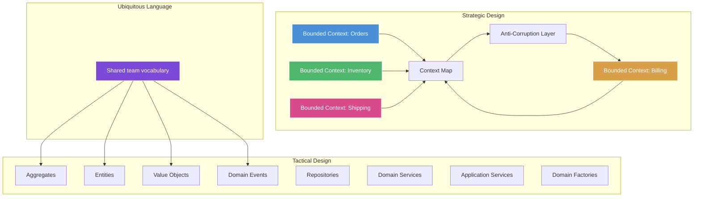
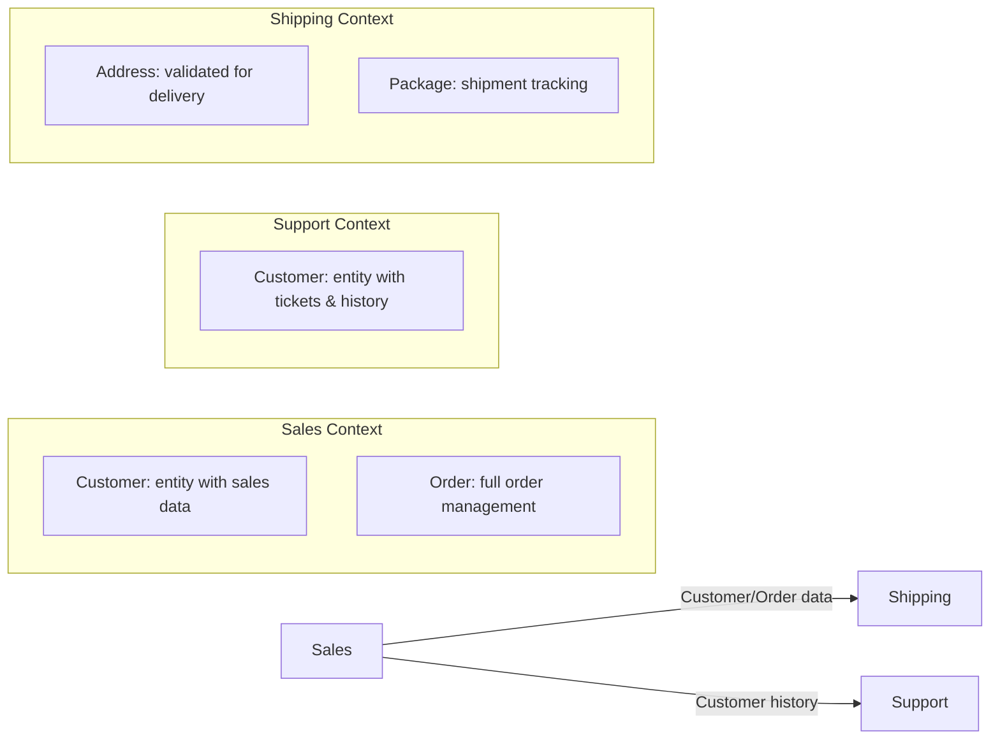

# Domain-Driven Design (DDD)

## Architecture Diagram



## What Is Domain-Driven Design?

DDD is an approach to software development introduced by **Eric Evans** in his 2003 book *Domain-Driven Design: Tackling Complexity in the Heart of Software*. It emphasizes **understanding and modeling the business domain** rather than technical concerns.

## Why It Was Created

Complex business domains (finance, insurance, healthcare, logistics) are difficult to model with generic CRUD approaches. Developers and domain experts often speak different languages, leading to software that doesn't match business needs. DDD provides patterns for:

- **Shared understanding** between developers and domain experts
- **Managing complexity** through bounded contexts
- **Business-aligned models** that evolve with the domain

## When to Use DDD

- **Complex domains** — not simple CRUD applications
- **Long-lived projects** — where domain knowledge accumulates over years
- **Large teams** — multiple bounded contexts enable parallel work
- **High domain complexity > technical complexity** — fintech, healthcare, logistics, insurance
- **Not for** — simple CRUD apps, data-driven dashboards, reporting tools

---

## Tactical Patterns

### Entities

Objects with a **distinct identity** that persists over time and across state changes.

```typescript
import { randomUUID } from "crypto";

export class Customer {
    private constructor(
        public readonly id: string,
        public readonly email: Email,
        public readonly name: CustomerName,
        public readonly loyaltyPoints: number,
        public readonly createdAt: Date,
        private _isVip: boolean
    ) {}

    static create(email: Email, name: CustomerName): Customer {
        return new Customer(
            randomUUID(),
            email,
            name,
            0,
            new Date(),
            false
        );
    }

    addLoyaltyPoints(points: number): void {
        if (points <= 0) throw new Error("Points must be positive");
        const newPoints = this.loyaltyPoints + points;
        if (newPoints >= 1000 && !this._isVip) {
            this._isVip = true;
        }
    }

    get isVip(): boolean {
        return this._isVip;
    }

    equals(other: Customer): boolean {
        return this.id === other.id;
    }
}
```

### Value Objects

Objects defined by their **attributes** (not identity). Immutable, interchangeable, self-validating.

```typescript
export class Email {
    private constructor(public readonly value: string) {
        this.validate(value);
    }

    static create(email: string): Email {
        return new Email(email);
    }

    private validate(email: string): void {
        const emailRegex = /^[^\s@]+@[^\s@]+\.[^\s@]+$/;
        if (!emailRegex.test(email)) {
            throw new Error("Invalid email format");
        }
    }

    equals(other: Email): boolean {
        return this.value.toLowerCase() === other.value.toLowerCase();
    }

    get domain(): string {
        return this.value.split("@")[1];
    }
}

export class Money {
    constructor(
        public readonly amount: number,
        public readonly currency: string
    ) {
        if (amount < 0) throw new Error("Amount cannot be negative");
        if (currency.length !== 3) throw new Error("Invalid currency code");
    }

    add(other: Money): Money {
        if (this.currency !== other.currency) {
            throw new Error("Cannot add different currencies");
        }
        return new Money(this.amount + other.amount, this.currency);
    }

    multiply(factor: number): Money {
        return new Money(this.amount * factor, this.currency);
    }

    equals(other: Money): boolean {
        return this.amount === other.amount && this.currency === other.currency;
    }
}

export class Address {
    constructor(
        public readonly street: string,
        public readonly city: string,
        public readonly state: string,
        public readonly zipCode: string,
        public readonly country: string
    ) {}

    equals(other: Address): boolean {
        return (
            this.street === other.street &&
            this.city === other.city &&
            this.state === other.state &&
            this.zipCode === other.zipCode &&
            this.country === other.country
        );
    }
}

export class CustomerName {
    constructor(
        public readonly firstName: string,
        public readonly lastName: string
    ) {
        if (!firstName || !lastName) throw new Error("Name cannot be empty");
    }

    get fullName(): string {
        return `${this.firstName} ${this.lastName}`;
    }
}
```

### Aggregates

A cluster of domain objects treated as a single unit. Each aggregate has a **root entity** and a **boundary**.

```typescript
import { randomUUID } from "crypto";

export interface OrderEvent {
    type: string;
    orderId: string;
    timestamp: Date;
    data: Record<string, unknown>;
}

export class Order {
    private _events: OrderEvent[] = [];

    constructor(
        public readonly id: string,
        public readonly customerId: string,
        private _status: OrderStatus,
        private _items: OrderItem[],
        private _shippingAddress: Address,
        public readonly createdAt: Date
    ) {}

    static create(customerId: string, items: OrderItem[], address: Address): Order {
        if (items.length === 0) throw new Error("Order must have at least one item");
        const order = new Order(
            randomUUID(),
            customerId,
            OrderStatus.DRAFT,
            items,
            address,
            new Date()
        );
        order.addEvent("order.created", { customerId, itemCount: items.length });
        return order;
    }

    get status(): OrderStatus {
        return this._status;
    }

    get items(): ReadonlyArray<OrderItem> {
        return this._items;
    }

    get total(): Money {
        return this._items.reduce(
            (sum, item) => sum.add(item.subtotal),
            new Money(0, "USD")
        );
    }

    submit(): void {
        if (this._status !== OrderStatus.DRAFT) {
            throw new Error("Only draft orders can be submitted");
        }
        this._status = OrderStatus.SUBMITTED;
        this.addEvent("order.submitted", { orderId: this.id });
    }

    addItem(productId: string, name: string, quantity: number, unitPrice: Money): void {
        if (this._status !== OrderStatus.DRAFT) {
            throw new Error("Cannot modify submitted order");
        }
        const existing = this._items.find(i => i.productId === productId);
        if (existing) {
            existing.increaseQuantity(quantity);
        } else {
            this._items.push(new OrderItem(productId, name, quantity, unitPrice));
        }
        this.addEvent("order.item_added", { productId, quantity });
    }

    pay(transactionId: string): void {
        if (this._status !== OrderStatus.SUBMITTED) {
            throw new Error("Only submitted orders can be paid");
        }
        this._status = OrderStatus.PAID;
        this.addEvent("order.paid", { transactionId });
    }

    ship(): void {
        if (this._status !== OrderStatus.PAID) {
            throw new Error("Only paid orders can be shipped");
        }
        this._status = OrderStatus.SHIPPED;
        this.addEvent("order.shipped", { orderId: this.id });
    }

    get domainEvents(): OrderEvent[] {
        return [...this._events];
    }

    clearEvents(): void {
        this._events = [];
    }

    private addEvent(type: string, data: Record<string, unknown>): void {
        this._events.push({
            type,
            orderId: this.id,
            timestamp: new Date(),
            data,
        });
    }
}

export enum OrderStatus {
    DRAFT = "draft",
    SUBMITTED = "submitted",
    PAID = "paid",
    SHIPPED = "shipped",
    DELIVERED = "delivered",
    CANCELLED = "cancelled",
}

export class OrderItem {
    constructor(
        public readonly productId: string,
        public readonly name: string,
        private _quantity: number,
        public readonly unitPrice: Money
    ) {
        if (_quantity <= 0) throw new Error("Quantity must be positive");
    }

    get quantity(): number {
        return this._quantity;
    }

    get subtotal(): Money {
        return this.unitPrice.multiply(this._quantity);
    }

    increaseQuantity(amount: number): void {
        if (amount <= 0) throw new Error("Increase amount must be positive");
        this._quantity += amount;
    }
}
```

### Domain Events

Events that capture something meaningful that happened in the domain. Past-tense names are standard.

```typescript
export interface DomainEvent {
    eventId: string;
    occurredAt: Date;
    eventType: string;
}

export class OrderSubmittedEvent implements DomainEvent {
    public readonly eventId: string;
    public readonly occurredAt: Date;
    public readonly eventType = "order.submitted";

    constructor(
        public readonly orderId: string,
        public readonly customerId: string,
        public readonly total: Money
    ) {
        this.eventId = randomUUID();
        this.occurredAt = new Date();
    }
}

export class PaymentReceivedEvent implements DomainEvent {
    public readonly eventId: string;
    public readonly occurredAt: Date;
    public readonly eventType = "payment.received";

    constructor(
        public readonly orderId: string,
        public readonly transactionId: string,
        public readonly amount: Money
    ) {
        this.eventId = randomUUID();
        this.occurredAt = new Date();
    }
}
```

### Repositories

Provide collection-like access to aggregates, abstracting persistence.

```typescript
export interface OrderRepository {
    save(order: Order): Promise<void>;
    findById(id: string): Promise<Order | null>;
    findByCustomerId(customerId: string): Promise<Order[]>;
    delete(id: string): Promise<void>;
}
```

### Domain Services

Stateless services that coordinate domain logic that doesn't naturally fit in an entity or value object.

```typescript
export class PricingService {
    calculateDiscount(order: Order, customer: Customer): Money {
        let discount = new Money(0, "USD");

        if (customer.isVip) {
            discount = discount.add(order.total.multiply(0.1));
        }

        if (order.total.amount > 500) {
            discount = discount.add(new Money(25, "USD"));
        }

        return discount;
    }

    isEligibleForFreeShipping(order: Order): boolean {
        return order.total.amount >= 100;
    }
}
```

### Application Services

Thin coordinators that orchestrate use cases. They are part of the application layer, not the domain layer.

```typescript
import { OrderRepository } from "./OrderRepository";
import { PricingService } from "./PricingService";
import { CustomerRepository } from "./CustomerRepository";
import { OrderSubmittedEvent } from "./OrderSubmittedEvent";
import { DomainEventBus } from "./DomainEventBus";

export class OrderApplicationService {
    constructor(
        private orderRepository: OrderRepository,
        private customerRepository: CustomerRepository,
        private pricingService: PricingService,
        private eventBus: DomainEventBus
    ) {}

    async submitOrder(customerId: string, items: SubmitItem[], address: Address): Promise<Order> {
        const customer = await this.customerRepository.findById(customerId);
        if (!customer) throw new Error("Customer not found");

        const orderItems = items.map(i => new OrderItem(i.productId, i.name, i.quantity, i.price));
        const order = Order.create(customerId, orderItems, address);

        const discount = this.pricingService.calculateDiscount(order, customer);
        if (discount.amount > 0) {
            // apply discount
        }

        order.submit();
        await this.orderRepository.save(order);

        this.eventBus.publish(new OrderSubmittedEvent(
            order.id,
            customerId,
            order.total
        ));

        return order;
    }
}

interface SubmitItem {
    productId: string;
    name: string;
    quantity: number;
    price: Money;
}
```

### Domain Factories

Encapsulate complex creation logic for aggregates.

```typescript
export class OrderFactory {
    static createFromCart(cart: Cart, customer: Customer, address: Address): Order {
        const items = cart.items.map(i => new OrderItem(
            i.productId,
            i.name,
            i.quantity,
            i.unitPrice
        ));

        const order = Order.create(customer.id, items, address);

        if (customer.isVip) {
            // apply VIP priority flag
        }

        return order;
    }

    static createSubscriptionOrder(
        customer: Customer,
        plan: SubscriptionPlan,
        address: Address
    ): Order {
        const item = new OrderItem(
            plan.productId,
            plan.name,
            1,
            plan.monthlyPrice
        );

        return Order.create(customer.id, [item], address);
    }
}
```

---

## Strategic Design

### Bounded Contexts

A bounded context is a **semantic boundary** within which a particular model is defined and applicable.



### Context Mapping

| Pattern | Description | Relationship |
|---------|-------------|--------------|
| **Partnership** | Two contexts cooperate bilaterally | Peer-to-peer |
| **Shared Kernel** | Shared subset of model | Mutual dependency |
| **Customer-Supplier** | Upstream supplies, downstream consumes | One-way |
| **Conformist** | Downstream conforms to upstream model | Conformity |
| **Anti-Corruption Layer** | Translates between contexts | Protection |
| **Separate Ways** | No integration | Independence |
| **Open Host Service** | Published protocol for integration | Published language |

### Anti-Corruption Layer (ACL)

Translates between a legacy or external model and your bounded context's model.

```typescript
// External legacy system model
interface LegacyCustomerRecord {
    cust_id: number;
    first_name: string;
    last_name: string;
    email_addr: string;
    status_code: string;
    vip_flag: string;
    acct_balance_cents: number;
}

// Your domain model
export class Customer {
    constructor(
        public readonly id: string,
        public readonly name: CustomerName,
        public readonly email: Email,
        public readonly isActive: boolean,
        public readonly isVip: boolean,
        public readonly balance: Money
    ) {}
}

export class LegacyCustomerTranslator {
    translate(record: LegacyCustomerRecord): Customer {
        return new Customer(
            record.cust_id.toString(),
            new CustomerName(record.first_name, record.last_name),
            Email.create(record.email_addr),
            record.status_code === "ACTIVE",
            record.vip_flag === "Y",
            new Money(record.acct_balance_cents / 100, "USD")
        );
    }

    translateBack(customer: Customer): LegacyCustomerRecord {
        return {
            cust_id: parseInt(customer.id),
            first_name: customer.name.firstName,
            last_name: customer.name.lastName,
            email_addr: customer.email.value,
            status_code: customer.isActive ? "ACTIVE" : "INACTIVE",
            vip_flag: customer.isVip ? "Y" : "N",
            acct_balance_cents: Math.round(customer.balance.amount * 100),
        };
    }
}

export class LegacyCustomerRepository implements CustomerRepository {
    constructor(
        private legacyApi: LegacyCustomerApi,
        private translator: LegacyCustomerTranslator
    ) {}

    async findById(id: string): Promise<Customer | null> {
        const legacyRecord = await this.legacyApi.getCustomer(parseInt(id));
        if (!legacyRecord) return null;
        return this.translator.translate(legacyRecord);
    }

    async save(customer: Customer): Promise<void> {
        const legacyRecord = this.translator.translateBack(customer);
        await this.legacyApi.updateCustomer(legacyRecord);
    }
}
```

### Ubiquitous Language

The shared language between developers and domain experts. It should be:

- **Used everywhere** — code, conversations, documentation, tests
- **Evolving** — as understanding deepens, language changes
- **Precise** — each term has exactly one meaning within a bounded context

**Example**: In an e-commerce domain:

| Ubiquitous Term | Instead Of |
|----------------|------------|
| Cart | "basket", "shopping bag", "order in progress" |
| Checkout | "confirm order", "place order", "submit" |
| SKU | "product code", "item number", "part ID" |
| Fulfillment | "shipping", "delivery", "dispatch" |

---

## Best Practices

1. **Start with strategic design** — bounded contexts before aggregates
2. **Listen to domain experts** — their language reveals the model
3. **Aggregates are consistency boundaries** — one aggregate per transaction
4. **Keep aggregates small** — large aggregates create performance problems
5. **Reference other aggregates by ID** — not by object reference
6. **Use events for cross-aggregate communication** — eventual consistency
7. **Repositories return aggregates** — not individual entities within aggregates
8. **Domain services for operations that involve multiple aggregates**
9. **Application services are thin** — orchestrate, don't implement domain logic
10. **Test domain logic with unit tests** — infrastructure with integration tests

---

## Interview Questions

1. What is the difference between an Entity and a Value Object?
2. What is an Aggregate? What is its root?
3. How do you choose aggregate boundaries?
4. What is a Bounded Context and how do you identify one?
5. What is an Anti-Corruption Layer and when do you need one?
6. What is Ubiquitous Language and why does it matter?
7. How do Domain Events differ from application events?
8. What is the difference between a Domain Service and an Application Service?
9. How does DDD relate to microservices?
10. What is Event Sourcing and how does it complement DDD?

---

## Real Company Usage

| Company | Domain | DDD Application |
|---------|--------|-----------------|
| **Amazon** | E-commerce | Aggregates for orders, inventory, fulfillment across bounded contexts |
| **Uber** | Ride-hailing | Bounded contexts: rides, payments, drivers, pricing |
| **Airbnb** | Hospitality | Booking aggregate, pricing domain service, availability context |
| **ING Bank** | Banking | Domain-driven core banking, aggregate-based transaction processing |
| **Zalando** | Fashion retail | Bounded contexts: catalog, cart, order, payment, fulfillment |
| **Spotify** | Music streaming | Contexts: catalog, playlist, recommendation, billing, social |
| **KLM** | Airline | DDD for flight booking, loyalty programs, baggage handling |
