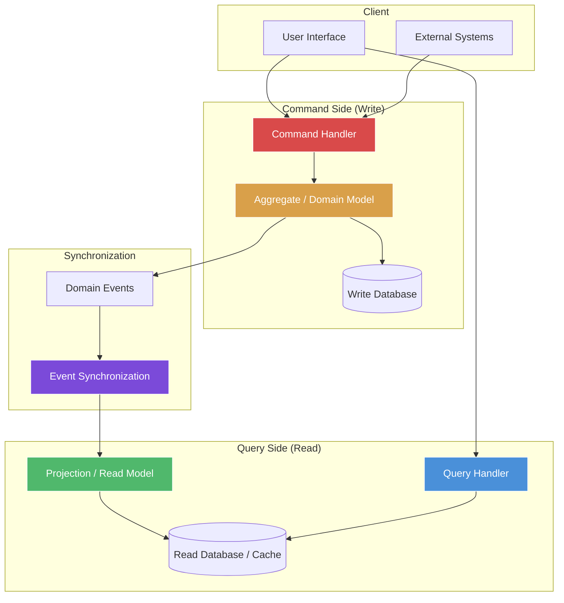
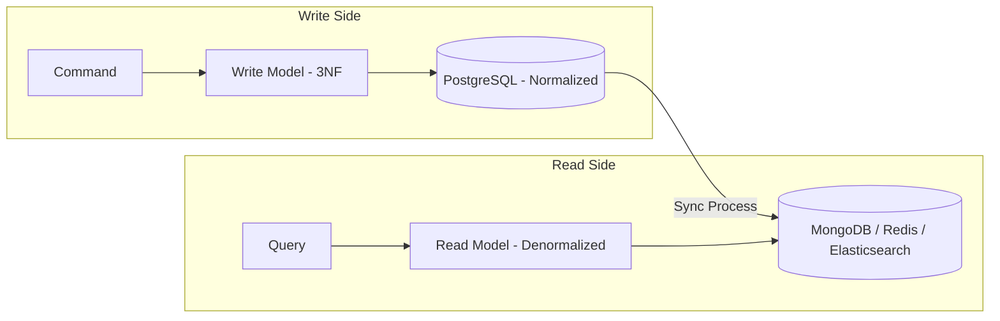

# CQRS (Command Query Responsibility Segregation)

## Architecture Diagram



## What Is CQRS?

CQRS (Command Query Responsibility Segregation) is a pattern introduced by **Greg Young** that separates **read** and **write** operations into different models. Commands change state (writes), queries return state (reads) — they never both.

## Why It Was Created

Traditional CRUD architectures use the same model for reads and writes. This creates tension:

- **Reads** want denormalized, aggregated, cached data
- **Writes** want normalized, validated, consistent models
- **Performance tuning** for reads often harms write performance and vice versa
- **Security models** differ — what you can read vs what you can write are often different

CQRS resolves this by letting each side evolve independently.

## When to Use CQRS

- **High read/write disparity** — wildly different read vs write volumes
- **Complex domain logic** — on the write side, simple denormalized reads on the query side
- **Performance requirements** — need to scale reads and writes independently
- **Collaborative domains** — multiple users changing the same data
- **Not for** — simple CRUD apps (overkill), when one model works fine

---

## Command Side (Write Model)

Commands are **imperative** — they express intent. Named in the imperative tense.

```typescript
// application/commands/PlaceOrderCommand.ts
export class PlaceOrderCommand {
    constructor(
        public readonly orderId: string,
        public readonly customerId: string,
        public readonly items: OrderItemCommand[],
        public readonly shippingAddress: Address
    ) {}
}

export class OrderItemCommand {
    constructor(
        public readonly productId: string,
        public readonly quantity: number
    ) {}
}

export class Address {
    constructor(
        public readonly street: string,
        public readonly city: string,
        public readonly zipCode: string
    ) {}
}
```

### Command Handler

Commands are handled by **command handlers** — one handler per command type.

```typescript
// application/commands/PlaceOrderCommandHandler.ts
import { OrderRepository } from "../../domain/OrderRepository";
import { Order } from "../../domain/Order";
import { InventoryService } from "../../domain/InventoryService";
import { EventBus } from "../../infrastructure/EventBus";

export class PlaceOrderCommandHandler {
    constructor(
        private orderRepository: OrderRepository,
        private inventoryService: InventoryService,
        private eventBus: EventBus
    ) {}

    async handle(command: PlaceOrderCommand): Promise<void> {
        const availability = await this.inventoryService.checkAvailability(
            command.items
        );

        if (!availability.allAvailable) {
            throw new Error("Some items are out of stock");
        }

        const order = Order.create(
            command.customerId,
            command.items.map(i => ({
                productId: i.productId,
                quantity: i.quantity,
            })),
            command.shippingAddress
        );

        await this.inventoryService.reserveInventory(command.items);
        await this.orderRepository.save(order);

        for (const event of order.domainEvents) {
            await this.eventBus.publish(event);
        }
    }
}
```

### Command Validation

Commands should be validated before reaching the handler.

```typescript
export class PlaceOrderValidator {
    validate(command: PlaceOrderCommand): ValidationResult {
        const errors: string[] = [];

        if (!command.customerId) {
            errors.push("Customer ID is required");
        }

        if (!command.items || command.items.length === 0) {
            errors.push("At least one item is required");
        }

        for (const item of command.items) {
            if (item.quantity <= 0) {
                errors.push(`Invalid quantity for product ${item.productId}`);
            }
            if (!item.productId) {
                errors.push("Product ID is required for all items");
            }
        }

        if (!command.shippingAddress) {
            errors.push("Shipping address is required");
        }

        return new ValidationResult(errors.length === 0, errors);
    }
}

export class ValidationResult {
    constructor(
        public readonly isValid: boolean,
        public readonly errors: string[]
    ) {}
}
```

### Command Bus

Commands are dispatched through a command bus, enabling middleware (logging, validation, transactions, metrics).

```typescript
export interface CommandBus {
    execute<T>(command: T): Promise<void>;
}

export class InMemoryCommandBus implements CommandBus {
    private handlers = new Map<string, CommandHandler<any>>();
    private middlewares: Middleware[] = [];

    register<T>(commandType: string, handler: CommandHandler<T>): void {
        this.handlers.set(commandType, handler);
    }

    addMiddleware(middleware: Middleware): void {
        this.middlewares.push(middleware);
    }

    async execute<T>(command: T): Promise<void> {
        const commandName = command.constructor.name;
        const handler = this.handlers.get(commandName);

        if (!handler) {
            throw new Error(`No handler registered for ${commandName}`);
        }

        const pipeline = async (cmd: T) => {
            const startTime = Date.now();
            try {
                await handler.handle(cmd);
                console.log(`Command ${commandName} succeeded in ${Date.now() - startTime}ms`);
            } catch (error) {
                console.error(`Command ${commandName} failed:`, error);
                throw error;
            }
        };

        const composed = this.middlewares.reduceRight(
            (next, middleware) => (cmd: T) => middleware.execute(cmd, next),
            pipeline
        );

        await composed(command);
    }
}

interface CommandHandler<T> {
    handle(command: T): Promise<void>;
}

interface Middleware {
    execute<T>(command: T, next: (command: T) => Promise<void>): Promise<void>;
}

class LoggingMiddleware implements Middleware {
    async execute<T>(command: T, next: (command: T) => Promise<void>): Promise<void> {
        console.log(`Executing: ${command.constructor.name}`);
        await next(command);
        console.log(`Completed: ${command.constructor.name}`);
    }
}

class TransactionMiddleware implements Middleware {
    constructor(private db: any) {}

    async execute<T>(command: T, next: (command: T) => Promise<void>): Promise<void> {
        const client = await this.db.connect();
        try {
            await client.query("BEGIN");
            await next(command);
            await client.query("COMMIT");
        } catch (error) {
            await client.query("ROLLBACK");
            throw error;
        } finally {
            client.release();
        }
    }
}
```

## Query Side (Read Model)

Queries return **read-optimized data models** — denormalized, cached, pre-joined.

```typescript
// application/queries/GetOrderQuery.ts
export class GetOrderQuery {
    constructor(public readonly orderId: string) {}
}

export interface OrderReadModel {
    id: string;
    customerName: string;
    status: string;
    totalAmount: number;
    currency: string;
    items: OrderItemReadModel[];
    shippingAddress: string;
    createdAt: Date;
    estimatedDelivery: Date | null;
}

export interface OrderItemReadModel {
    productName: string;
    quantity: number;
    unitPrice: number;
    subtotal: number;
    imageUrl: string;
}

export interface GetOrderQueryHandler {
    handle(query: GetOrderQuery): Promise<OrderReadModel | null>;
}

export class GetOrderQueryHandlerImpl implements GetOrderQueryHandler {
    constructor(private orderReadRepository: OrderReadRepository) {}

    async handle(query: GetOrderQuery): Promise<OrderReadModel | null> {
        return this.orderReadRepository.findById(query.orderId);
    }
}

export interface OrderReadRepository {
    findById(id: string): Promise<OrderReadModel | null>;
    findByCustomerId(customerId: string, page: number, size: number): Promise<PaginatedResult<OrderReadModel>>;
    findRecentOrders(since: Date): Promise<OrderReadModel[]>;
    getOrderStats(customerId: string): Promise<OrderStats>;
}

export class PaginatedResult<T> {
    constructor(
        public readonly items: T[],
        public readonly total: number,
        public readonly page: number,
        public readonly size: number
    ) {}

    get totalPages(): number {
        return Math.ceil(this.total / this.size);
    }
}

export interface OrderStats {
    totalOrders: number;
    totalSpent: number;
    averageOrderValue: number;
    mostPurchasedCategory: string;
}
```

## Separate Databases

In a full CQRS implementation, read and write databases are separate.



### Write Database Schema

```sql
-- PostgreSQL (Normalized)
CREATE TABLE orders (
    id UUID PRIMARY KEY,
    customer_id UUID NOT NULL REFERENCES customers(id),
    status VARCHAR(20) NOT NULL DEFAULT 'draft',
    created_at TIMESTAMP NOT NULL DEFAULT NOW(),
    updated_at TIMESTAMP NOT NULL DEFAULT NOW()
);

CREATE TABLE order_items (
    id UUID PRIMARY KEY DEFAULT gen_random_uuid(),
    order_id UUID NOT NULL REFERENCES orders(id),
    product_id UUID NOT NULL REFERENCES products(id),
    quantity INT NOT NULL CHECK (quantity > 0),
    unit_price_cents INT NOT NULL
);
```

### Read Database Schema

```javascript
// MongoDB (Denormalized)
db.orders.createIndex({ customerId: 1 });
db.orders.createIndex({ status: 1 });
db.orders.createIndex({ "items.productId": 1 });

// Example document:
{
  "_id": "order-123",
  "customerId": "cust-456",
  "customerName": "Alice Smith",
  "status": "shipped",
  "totalAmount": 129.99,
  "currency": "USD",
  "items": [
    {
      "productId": "prod-789",
      "productName": "Wireless Headphones",
      "category": "Electronics",
      "quantity": 1,
      "unitPrice": 99.99,
      "subtotal": 99.99
    },
    {
      "productId": "prod-012",
      "productName": "USB Cable",
      "category": "Accessories",
      "quantity": 2,
      "unitPrice": 15.00,
      "subtotal": 30.00
    }
  ],
  "shippingAddress": "123 Main St, Springfield, 12345",
  "createdAt": ISODate("2026-05-15T10:30:00Z"),
  "estimatedDelivery": ISODate("2026-05-20T18:00:00Z"),
  "lastUpdated": ISODate("2026-05-16T14:22:00Z")
}
```

## Event-Driven CQRS

Changes to the write model emit events that update read models.

```typescript
import { Kafka, Producer, Consumer, EachMessagePayload } from "kafkajs";

export class KafkaEventBus {
    private producer: Producer;

    constructor(private kafka: Kafka) {
        this.producer = kafka.producer();
    }

    async connect(): Promise<void> {
        await this.producer.connect();
    }

    async publish(event: DomainEvent): Promise<void> {
        await this.producer.send({
            topic: event.eventType,
            messages: [
                {
                    key: event.aggregateId,
                    value: JSON.stringify(event),
                    headers: {
                        "event-type": event.eventType,
                        "version": event.version.toString(),
                    },
                },
            ],
        });
    }
}

export class OrderProjectionUpdater {
    private consumer: Consumer;

    constructor(
        private kafka: Kafka,
        private readRepository: OrderReadRepository
    ) {
        this.consumer = kafka.consumer({ groupId: "order-projection" });
    }

    async start(): Promise<void> {
        await this.consumer.connect();
        await this.consumer.subscribe({ topic: "order.created" });
        await this.consumer.subscribe({ topic: "order.updated" });
        await this.consumer.subscribe({ topic: "order.shipped" });

        await this.consumer.run({
            eachMessage: async (payload: EachMessagePayload) => {
                const event = JSON.parse(payload.message.value!.toString());

                switch (payload.message.headers!["event-type"]!.toString()) {
                    case "order.created":
                        await this.handleOrderCreated(event);
                        break;
                    case "order.updated":
                        await this.handleOrderUpdated(event);
                        break;
                    case "order.shipped":
                        await this.handleOrderShipped(event);
                        break;
                }
            },
        });
    }

    private async handleOrderCreated(event: any): Promise<void> {
        await this.readRepository.upsert(event.aggregateId, {
            id: event.aggregateId,
            customerId: event.data.customerId,
            customerName: event.data.customerName,
            status: "pending",
            totalAmount: event.data.total,
            items: event.data.items,
            createdAt: event.occurredAt,
        });
    }

    private async handleOrderUpdated(event: any): Promise<void> {
        await this.readRepository.updateStatus(
            event.aggregateId,
            event.data.newStatus
        );
    }

    private async handleOrderShipped(event: any): Promise<void> {
        await this.readRepository.updateShipping(
            event.aggregateId,
            event.data.trackingNumber,
            event.data.estimatedDelivery
        );
    }
}
```

## CQRS Without Event Sourcing

CQRS does **not** require event sourcing. Many teams use CQRS with traditional persistence.

```typescript
// Simple CQRS without event sourcing
// Same database, different models

export interface OrdersWriteRepository {
    save(order: Order): Promise<void>;
    updateStatus(orderId: string, status: OrderStatus): Promise<void>;
}

export interface OrdersReadRepository {
    findById(id: string): Promise<OrderDetailDto | null>;
    search(criteria: OrderSearchCriteria): Promise<PaginatedResult<OrderSummaryDto>>;
}

// Write model: Domain aggregate
export class Order {
    constructor(
        public readonly id: string,
        public readonly customerId: string,
        private _status: OrderStatus,
        private _items: OrderItem[],
        public readonly createdAt: Date
    ) {}

    submit(): void {
        if (this._status !== OrderStatus.DRAFT) {
            throw new Error("Order is not in draft state");
        }
        this._status = OrderStatus.SUBMITTED;
    }
}

// Read model: Denormalized DTO
export interface OrderDetailDto {
    id: string;
    customerName: string;
    customerEmail: string;
    items: {
        productName: string;
        imageUrl: string;
        quantity: number;
        price: number;
    }[];
    subtotal: number;
    tax: number;
    shippingCost: number;
    total: number;
    status: string;
    trackingNumber: string | null;
    createdAt: string;
    estimatedDelivery: string | null;
}
```

## When CQRS Is Overkill

| Scenario | Alternative |
|----------|-------------|
| Simple CRUD with balanced reads/writes | Standard repository pattern |
| Reporting dashboards | Separate reporting database + ETL |
| API with different read/write shapes | DTO projections in repository |
| Small team, simple domain | Keep it simple — add CQRS when pain emerges |
| Prototype / MVP | Start with CRUD, evolve to CQRS |

---

## Best Practices

1. **Commands return no data** — void return, signal success via events
2. **Queries never change state** — idempotent, side-effect-free
3. **One command handler per command type** — clear separation
4. **Commands are validated before handling** — use a validation middleware
5. **Read models are denormalized** — optimized for the specific query need
6. **Eventual consistency between models** — accept that read model may lag
7. **Start with separate models in same DB** — split databases only when needed
8. **Sync reads can use materialized views** — simpler than event-driven projections
9. **Use CQRS at bounded context boundary** — not everywhere

---

## Interview Questions

1. What is the difference between a command and a query?
2. Does CQRS require separate databases?
3. How do you handle eventual consistency between read and write models?
4. What is the difference between CQRS and CRUD?
5. How does CQRS relate to Event Sourcing?
6. When should you NOT use CQRS?
7. How do you validate commands in CQRS?
8. What is a projection in the context of CQRS?
9. How do you handle transactions across commands?
10. Can commands return data? What does the pattern recommend?

---

## Real Company Usage

| Company | Application | CQRS Setup |
|---------|-------------|------------|
| **Microsoft** | Dynamics CRM | Event-sourced CQRS for entity tracking |
| **Uber** | Trip management | Commands for ride requests, queries for ETAs |
| **Amazon** | Order processing | Write DB for orders, Elasticsearch for search |
| **Spotify** | Playlist service | Commands for playlist mutations, read replicas |
| **Netflix** | Viewing history | Write to Cassandra, read from Elasticsearch |
| **Event Store** | Event store DB | Full CQRS + Event Sourcing as core pattern |
