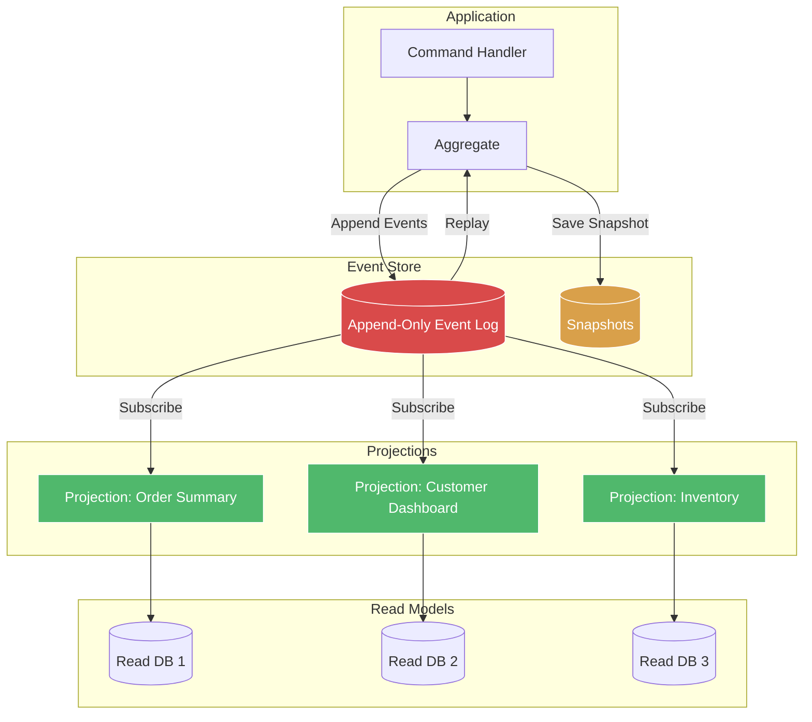

# Event Sourcing

## Architecture Diagram



## What Is Event Sourcing?

Event Sourcing ensures that **every change to the application state is captured as an event** in an append-only log. Current state is derived by replaying events. The event store is the **source of truth**, not the current state.

## Why It Was Created

Traditional databases store current state (a snapshot), losing historical context. Event Sourcing was created to:

- **Audit trail** — every state change is recorded forever
- **Temporal queries** — reconstruct past state at any point in time
- **Debugging** — replay events to reproduce bugs
- **CQRS integration** — natural source for read model projections
- **Event-driven collaboration** — events are the integration mechanism

## When to Use Event Sourcing

- **Audit/logging requirements** — regulatory compliance (finance, healthcare)
- **Complex state management** — collaborative domains, workflow systems
- **Multiple read models** — need to serve different views of same data
- **Debugging and analysis** — event replay for troubleshooting
- **Not for** — simple CRUD, high-throughput system state with low audit needs, teams new to the pattern

---

## Event Store

The event store is an **append-only log** of events. Each event represents a fact.

```typescript
// domain/events/OrderEvents.ts
export interface DomainEvent {
    eventId: string;
    aggregateId: string;
    aggregateType: string;
    eventType: string;
    version: number;
    data: Record<string, unknown>;
    metadata: EventMetadata;
    occurredAt: Date;
}

export interface EventMetadata {
    correlationId: string;
    causationId: string;
    userId: string;
    timestamp: Date;
}

export class OrderCreatedEvent implements DomainEvent {
    public readonly eventId: string;
    public readonly aggregateType = "order";
    public readonly eventType = "OrderCreated";
    public readonly occurredAt: Date;

    constructor(
        public readonly aggregateId: string,
        public readonly version: number,
        public readonly data: {
            customerId: string;
            items: { productId: string; quantity: number; price: number }[];
            shippingAddress: string;
        },
        public readonly metadata: EventMetadata
    ) {
        this.eventId = crypto.randomUUID();
        this.occurredAt = new Date();
    }
}

export class OrderItemAddedEvent implements DomainEvent {
    public readonly eventId: string;
    public readonly aggregateType = "order";
    public readonly eventType = "OrderItemAdded";
    public readonly occurredAt: Date;

    constructor(
        public readonly aggregateId: string,
        public readonly version: number,
        public readonly data: {
            productId: string;
            quantity: number;
            price: number;
        },
        public readonly metadata: EventMetadata
    ) {
        this.eventId = crypto.randomUUID();
        this.occurredAt = new Date();
    }
}

export class OrderSubmittedEvent implements DomainEvent {
    public readonly eventId: string;
    public readonly aggregateType = "order";
    public readonly eventType = "OrderSubmitted";
    public readonly occurredAt: Date;

    constructor(
        public readonly aggregateId: string,
        public readonly version: number,
        public readonly data: Record<string, unknown>,
        public readonly metadata: EventMetadata
    ) {
        this.eventId = crypto.randomUUID();
        this.occurredAt = new Date();
    }
}
```

### Event Store Interface

```typescript
export interface EventStore {
    appendEvents(
        aggregateId: string,
        expectedVersion: number,
        events: DomainEvent[]
    ): Promise<void>;

    getEvents(aggregateId: string): Promise<DomainEvent[]>;

    getEventsByType(eventType: string, from: Date, to: Date): Promise<DomainEvent[]>;

    getAggregateIds(count: number, offset: number): Promise<string[]>;
}
```

### PostgreSQL Event Store Implementation

```typescript
import { Pool } from "pg";

export class PostgresEventStore implements EventStore {
    constructor(private pool: Pool) {}

    async appendEvents(
        aggregateId: string,
        expectedVersion: number,
        events: DomainEvent[]
    ): Promise<void> {
        const client = await this.pool.connect();
        try {
            await client.query("BEGIN");

            const result = await client.query(
                "SELECT MAX(version) as current_version FROM events WHERE aggregate_id = $1",
                [aggregateId]
            );

            const currentVersion = result.rows[0]?.current_version ?? 0;

            if (currentVersion !== expectedVersion) {
                throw new ConcurrencyError(
                    `Version mismatch: expected ${expectedVersion}, current ${currentVersion}`
                );
            }

            for (const event of events) {
                await client.query(
                    `INSERT INTO events (
                        event_id, aggregate_id, aggregate_type, event_type,
                        version, data, metadata, occurred_at
                    ) VALUES ($1, $2, $3, $4, $5, $6, $7, $8)`,
                    [
                        event.eventId,
                        event.aggregateId,
                        event.aggregateType,
                        event.eventType,
                        event.version,
                        JSON.stringify(event.data),
                        JSON.stringify(event.metadata),
                        event.occurredAt,
                    ]
                );
            }

            await client.query("COMMIT");
        } catch (error) {
            await client.query("ROLLBACK");
            throw error;
        } finally {
            client.release();
        }
    }

    async getEvents(aggregateId: string): Promise<DomainEvent[]> {
        const result = await this.pool.query(
            "SELECT * FROM events WHERE aggregate_id = $1 ORDER BY version ASC",
            [aggregateId]
        );

        return result.rows.map(row => ({
            eventId: row.event_id,
            aggregateId: row.aggregate_id,
            aggregateType: row.aggregate_type,
            eventType: row.event_type,
            version: row.version,
            data: row.data,
            metadata: row.metadata,
            occurredAt: row.occurred_at,
        }));
    }

    async getEventsByType(
        eventType: string,
        from: Date,
        to: Date
    ): Promise<DomainEvent[]> {
        const result = await this.pool.query(
            "SELECT * FROM events WHERE event_type = $1 AND occurred_at BETWEEN $2 AND $3 ORDER BY occurred_at ASC",
            [eventType, from, to]
        );

        return this.mapRows(result.rows);
    }

    async getAggregateIds(count: number, offset: number): Promise<string[]> {
        const result = await this.pool.query(
            "SELECT DISTINCT aggregate_id FROM events ORDER BY aggregate_id LIMIT $1 OFFSET $2",
            [count, offset]
        );
        return result.rows.map(r => r.aggregate_id);
    }

    private mapRows(rows: any[]): DomainEvent[] {
        return rows.map(row => ({
            eventId: row.event_id,
            aggregateId: row.aggregate_id,
            aggregateType: row.aggregate_type,
            eventType: row.event_type,
            version: row.version,
            data: row.data,
            metadata: row.metadata,
            occurredAt: row.occurred_at,
        }));
    }
}

export class ConcurrencyError extends Error {
    constructor(message: string) {
        super(message);
        this.name = "ConcurrencyError";
    }
}
```

### Event Store Schema

```sql
CREATE TABLE IF NOT EXISTS events (
    id BIGSERIAL PRIMARY KEY,
    event_id UUID NOT NULL UNIQUE,
    aggregate_id VARCHAR(255) NOT NULL,
    aggregate_type VARCHAR(100) NOT NULL,
    event_type VARCHAR(100) NOT NULL,
    version INT NOT NULL,
    data JSONB NOT NULL,
    metadata JSONB NOT NULL DEFAULT '{}',
    occurred_at TIMESTAMP NOT NULL,

    UNIQUE(aggregate_id, version)
);

CREATE INDEX idx_events_aggregate_id ON events(aggregate_id, version);
CREATE INDEX idx_events_event_type ON events(event_type, occurred_at);
CREATE INDEX idx_events_occurred_at ON events(occurred_at);
```

## Snapshots

Snapshots optimize event replay by saving the aggregate state at a given version. Instead of replaying all events, start from the latest snapshot and replay only events after it.

```typescript
export interface SnapshotStore {
    saveSnapshot(aggregateId: string, version: number, state: Record<string, unknown>): Promise<void>;
    getLatestSnapshot(aggregateId: string): Promise<Snapshot | null>;
}

export interface Snapshot {
    aggregateId: string;
    version: number;
    state: Record<string, unknown>;
    createdAt: Date;
}

export class PostgresSnapshotStore implements SnapshotStore {
    constructor(private pool: Pool) {}

    async saveSnapshot(
        aggregateId: string,
        version: number,
        state: Record<string, unknown>
    ): Promise<void> {
        await this.pool.query(
            `INSERT INTO snapshots (aggregate_id, version, state, created_at)
             VALUES ($1, $2, $3, NOW())
             ON CONFLICT (aggregate_id, version) DO NOTHING`,
            [aggregateId, version, JSON.stringify(state)]
        );
    }

    async getLatestSnapshot(aggregateId: string): Promise<Snapshot | null> {
        const result = await this.pool.query(
            "SELECT * FROM snapshots WHERE aggregate_id = $1 ORDER BY version DESC LIMIT 1",
            [aggregateId]
        );

        if (result.rows.length === 0) return null;

        return {
            aggregateId: result.rows[0].aggregate_id,
            version: result.rows[0].version,
            state: result.rows[0].state,
            createdAt: result.rows[0].created_at,
        };
    }
}

CREATE TABLE IF NOT EXISTS snapshots (
    id BIGSERIAL PRIMARY KEY,
    aggregate_id VARCHAR(255) NOT NULL,
    version INT NOT NULL,
    state JSONB NOT NULL,
    created_at TIMESTAMP NOT NULL DEFAULT NOW(),
    UNIQUE(aggregate_id, version)
);
```

### Aggregate with Snapshot Support

```typescript
export class Order {
    private events: DomainEvent[] = [];
    public version: number = 0;

    constructor(
        public readonly id: string,
        public customerId: string,
        public status: string,
        public items: Map<string, OrderItemState>,
        public createdAt: Date
    ) {}

    static fromHistory(events: DomainEvent[]): Order {
        const order = new Order("", "", "", new Map(), new Date());
        for (const event of events) {
            order.apply(event);
        }
        return order;
    }

    static fromSnapshotAndEvents(
        snapshot: Snapshot | null,
        events: DomainEvent[]
    ): Order {
        if (!snapshot) return Order.fromHistory(events);

        const state = snapshot.state as any;
        const order = new Order(
            snapshot.aggregateId,
            state.customerId,
            state.status,
            new Map(Object.entries(state.items ?? {})),
            new Date(state.createdAt)
        );
        order.version = snapshot.version;

        for (const event of events) {
            order.apply(event);
        }

        return order;
    }

    apply(event: DomainEvent): void {
        this.version = event.version;

        switch (event.eventType) {
            case "OrderCreated":
                const createdData = event.data as any;
                this.customerId = createdData.customerId;
                this.status = "draft";
                this.items = new Map(
                    createdData.items.map((i: any) => [
                        i.productId,
                        { productId: i.productId, quantity: i.quantity, price: i.price },
                    ])
                );
                break;
            case "OrderItemAdded":
                const addData = event.data as any;
                this.items.set(addData.productId, {
                    productId: addData.productId,
                    quantity: addData.quantity,
                    price: addData.price,
                });
                break;
            case "OrderSubmitted":
                this.status = "submitted";
                break;
            case "OrderPaid":
                this.status = "paid";
                break;
            case "OrderShipped":
                this.status = "shipped";
                break;
        }
    }

    addEvent(event: DomainEvent): void {
        this.events.push(event);
        this.apply(event);
    }

    getUncommittedEvents(): DomainEvent[] {
        return [...this.events];
    }

    clearEvents(): void {
        this.events = [];
    }
}

interface OrderItemState {
    productId: string;
    quantity: number;
    price: number;
}
```

## Event Replay

Replaying events can restore state or rebuild projections.

```typescript
export class EventReplayer {
    constructor(private eventStore: EventStore) {}

    async replayAggregate(aggregateId: string): Promise<Order> {
        const events = await this.eventStore.getEvents(aggregateId);
        return Order.fromHistory(events);
    }

    async replayAll(aggregateType: string, handler: (event: DomainEvent) => Promise<void>): Promise<void> {
        let offset = 0;
        const batchSize = 100;

        while (true) {
            const ids = await this.eventStore.getAggregateIds(batchSize, offset);
            if (ids.length === 0) break;

            for (const id of ids) {
                const events = await this.eventStore.getEvents(id);
                for (const event of events) {
                    await handler(event);
                }
            }

            offset += batchSize;
        }
    }

    async replayByDateRange(
        from: Date,
        to: Date,
        handler: (event: DomainEvent) => Promise<void>
    ): Promise<void> {
        const eventTypes = [
            "OrderCreated",
            "OrderItemAdded",
            "OrderSubmitted",
            "OrderPaid",
            "OrderShipped",
        ];

        for (const eventType of eventTypes) {
            const events = await this.eventStore.getEventsByType(eventType, from, to);
            for (const event of events) {
                await handler(event);
            }
        }
    }
}
```

## Projections

Projections transform the event stream into read models.

```typescript
export class OrderSummaryProjection {
    private model: Map<string, OrderSummary> = new Map();

    apply(event: DomainEvent): void {
        switch (event.eventType) {
            case "OrderCreated":
                const created = event.data as any;
                this.model.set(event.aggregateId, {
                    id: event.aggregateId,
                    customerId: created.customerId,
                    customerName: "",
                    status: "draft",
                    itemCount: created.items.length,
                    total: created.items.reduce(
                        (sum: number, i: any) => sum + i.price * i.quantity,
                        0
                    ),
                    createdAt: event.occurredAt,
                });
                break;

            case "OrderSubmitted":
                this.update(event.aggregateId, { status: "submitted" });
                break;

            case "OrderPaid":
                this.update(event.aggregateId, { status: "paid" });
                break;

            case "OrderShipped":
                this.update(event.aggregateId, { status: "shipped" });
                break;
        }
    }

    private update(id: string, partial: Partial<OrderSummary>): void {
        const current = this.model.get(id);
        if (current) {
            this.model.set(id, { ...current, ...partial });
        }
    }

    getSummary(id: string): OrderSummary | undefined {
        return this.model.get(id);
    }

    getAll(): OrderSummary[] {
        return Array.from(this.model.values());
    }
}

interface OrderSummary {
    id: string;
    customerId: string;
    customerName: string;
    status: string;
    itemCount: number;
    total: number;
    createdAt: Date;
}
```

## Event Versioning

Events evolve over time. Versioning ensures backward compatibility.

```typescript
export class EventMigrator {
    private migrations: Map<string, Map<number, (event: any) => any>> = new Map();

    registerMigration(
        eventType: string,
        fromVersion: number,
        migrator: (event: any) => any
    ): void {
        if (!this.migrations.has(eventType)) {
            this.migrations.set(eventType, new Map());
        }
        this.migrations.get(eventType)!.set(fromVersion, migrator);
    }

    migrate(event: DomainEvent): DomainEvent {
        const eventMigrations = this.migrations.get(event.eventType);
        if (!eventMigrations) return event;

        const version = event.metadata.version ?? 1;
        let migrated = event;

        for (let v = version; v < this.getCurrentVersion(event.eventType); v++) {
            const migrator = eventMigrations.get(v);
            if (migrator) {
                migrated = migrator(migrated);
            }
        }

        return migrated;
    }

    private getCurrentVersion(eventType: string): number {
        const migrations = this.migrations.get(eventType);
        if (!migrations || migrations.size === 0) return 1;
        return Math.max(...migrations.keys()) + 1;
    }
}

// Example: v1 -> v2 migration for OrderCreated
const migrator = new EventMigrator();
migrator.registerMigration("OrderCreated", 1, (event: any) => ({
    ...event,
    data: {
        ...event.data,
        currency: event.data.currency ?? "USD",
        promoCode: null,
    },
    metadata: {
        ...event.metadata,
        version: 2,
    },
}));
```

## CQRS + Event Sourcing Integration

```typescript
export class OrderCommandHandler {
    constructor(
        private eventStore: EventStore,
        private snapshotStore: SnapshotStore,
        private eventBus: EventBus
    ) {}

    async handleCreateOrder(command: CreateOrderCommand): Promise<void> {
        const snapshot = await this.snapshotStore.getLatestSnapshot(command.orderId);
        const events = snapshot
            ? await this.eventStore.getEvents(command.orderId)
            : [];

        const order = Order.fromSnapshotAndEvents(snapshot, events);

        if (order.status !== "") {
            throw new Error("Order already exists");
        }

        const event: OrderCreatedEvent = {
            eventId: crypto.randomUUID(),
            aggregateId: command.orderId,
            aggregateType: "order",
            eventType: "OrderCreated",
            version: order.version + 1,
            data: {
                customerId: command.customerId,
                items: command.items,
                shippingAddress: command.shippingAddress,
            },
            metadata: {
                correlationId: command.correlationId,
                causationId: command.commandId,
                userId: command.userId,
                timestamp: new Date(),
            },
            occurredAt: new Date(),
        };

        await this.eventStore.appendEvents(command.orderId, order.version, [event]);
        await this.eventBus.publish(event);

        if (event.version % 50 === 0) {
            const newOrder = Order.fromSnapshotAndEvents(snapshot, [event]);
            await this.snapshotStore.saveSnapshot(
                command.orderId,
                event.version,
                { customerId: newOrder.customerId, status: newOrder.status, items: {}, createdAt: newOrder.createdAt }
            );
        }
    }
}
```

## Idempotency

```typescript
export class IdempotentEventStore implements EventStore {
    constructor(
        private inner: EventStore,
        private idempotencyStore: Map<string, boolean>
    ) {}

    async appendEvents(
        aggregateId: string,
        expectedVersion: number,
        events: DomainEvent[]
    ): Promise<void> {
        const idempotencyKey = events[0]?.metadata?.correlationId;
        if (idempotencyKey && this.idempotencyStore.has(idempotencyKey)) {
            return;
        }

        await this.inner.appendEvents(aggregateId, expectedVersion, events);

        if (idempotencyKey) {
            this.idempotencyStore.set(idempotencyKey, true);
        }
    }

    async getEvents(aggregateId: string): Promise<DomainEvent[]> {
        return this.inner.getEvents(aggregateId);
    }

    async getEventsByType(eventType: string, from: Date, to: Date): Promise<DomainEvent[]> {
        return this.inner.getEventsByType(eventType, from, to);
    }

    async getAggregateIds(count: number, offset: number): Promise<string[]> {
        return this.inner.getAggregateIds(count, offset);
    }
}
```

---

## Best Practices

1. **Events are facts** — name them in past tense (OrderCreated, not CreateOrder)
2. **Events are immutable** — never delete or modify past events
3. **Make events self-contained** — include all necessary data, reference external entities by ID
4. **Take regular snapshots** — every N events (50-100 is common)
5. **Version your events** — schema evolves; forward/backward compatibility matters
6. **Use a unique constraint** — (aggregate_id, version) to prevent concurrency issues
7. **Store metadata** — correlationId, causationId, userId for traceability
8. **Consider compaction** — snapshot + delete old events for GDPR compliance
9. **Read models are disposable** — rebuild them from the event store anytime
10. **Eventual consistency is inherent** — design for it, don't fight it

---

## Interview Questions

1. What problem does Event Sourcing solve?
2. How does Event Sourcing differ from traditional persistence?
3. What is a snapshot and why is it needed?
4. How do you handle event schema evolution?
5. What is the relationship between CQRS and Event Sourcing?
6. How do you ensure idempotency in Event Sourcing?
7. What is a projection and how is it built?
8. How do you handle concurrency conflicts in an event store?
9. Can Event Sourcing work with relational databases?
10. What are the GDPR implications of Event Sourcing?

---

## Real Company Usage

| Company | Application | Event Store |
|---------|-------------|-------------|
| **Event Store Ltd** | EventStoreDB | Purpose-built event store |
| **Microsoft** | Azure Event Hub | Event sourcing with CosmosDB |
| **Uber** | Trip lifecycle | Schemaless event store on MySQL |
| **Netflix** | Video processing pipeline | Cassandra-based event log |
| **LMAX** | Financial exchange | Disruptor + in-memory event store |
| **Bank of America** | Transaction processing | Kafka-based event sourcing |
| **Jet.com (Walmart)** | E-commerce | CQRS + Event Sourcing on SQL Server |
