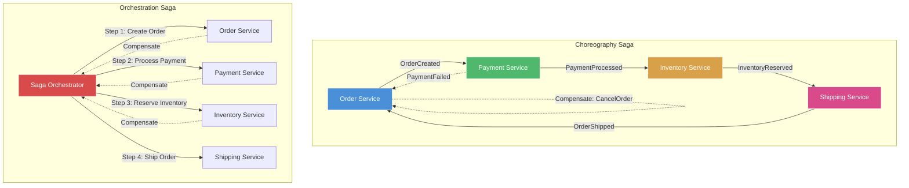
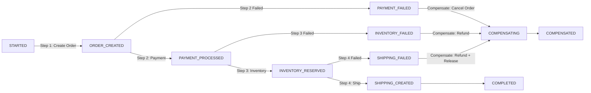

# Saga Pattern

## Architecture Diagram



## What Is the Saga Pattern?

A Saga is a sequence of local transactions where each transaction updates data within a single service. If a step fails, the saga executes **compensating transactions** to undo previous steps. Sagas were first described by **Hector Garcia-Molina and Kenneth Salem** in 1987.

## Why It Was Created

Distributed transactions (2PC/XA) don't scale well in microservices. They require locks, cause contention, and aren't supported by many modern databases. Sagas provide a way to maintain **data consistency across services** without distributed transactions.

## When to Use Sagas

- **Multi-service transactions** — operations spanning multiple microservices
- **Long-running business processes** — workflows that take minutes, hours, or days
- **Eventual consistency is acceptable** — sagas are eventually consistent by design
- **Not for** — single-service transactions, strongly consistent systems, high-frequency operations

---

## Choreography Saga

Each service produces and listens to events. Decentralized coordination.

```typescript
// Order Service - part of choreography saga
import { Kafka } from "kafkajs";

export class OrderSagaParticipant {
    constructor(
        private kafka: Kafka,
        private orderRepository: OrderRepository
    ) {}

    async start(): Promise<void> {
        const consumer = this.kafka.consumer({ groupId: "order-saga" });
        await consumer.connect();
        await consumer.subscribe({
            topics: [
                "payment.processed",
                "payment.failed",
                "inventory.reserved",
                "inventory.failed",
                "shipping.created",
                "shipping.failed",
            ],
        });

        await consumer.run({
            eachMessage: async ({ topic, message }) => {
                const event = JSON.parse(message.value!.toString());

                switch (topic) {
                    case "payment.processed":
                        await this.handlePaymentProcessed(event);
                        break;
                    case "payment.failed":
                        await this.handlePaymentFailed(event);
                        break;
                    case "inventory.reserved":
                        await this.handleInventoryReserved(event);
                        break;
                    case "inventory.failed":
                        await this.handleInventoryFailed(event);
                        break;
                    case "shipping.created":
                        await this.handleShippingCreated(event);
                        break;
                    case "shipping.failed":
                        await this.handleShippingFailed(event);
                        break;
                }
            },
        });
    }

    async createOrder(command: CreateOrderCommand): Promise<void> {
        const order = await this.orderRepository.create(
            command.customerId,
            command.items,
            OrderStatus.PENDING
        );

        // Publish event - next step in saga
        await this.publish("order.created", {
            orderId: order.id,
            customerId: command.customerId,
            items: command.items,
            total: order.total,
        });
    }

    private async handlePaymentProcessed(event: any): Promise<void> {
        await this.orderRepository.updateStatus(
            event.orderId,
            OrderStatus.PAYMENT_CONFIRMED
        );
        // Trigger next step
        await this.publish("order.payment_confirmed", {
            orderId: event.orderId,
            transactionId: event.transactionId,
        });
    }

    private async handlePaymentFailed(event: any): Promise<void> {
        await this.orderRepository.updateStatus(
            event.orderId,
            OrderStatus.PAYMENT_FAILED
        );
        // Saga ends - no compensation needed for creation (cleanup)
        await this.orderRepository.delete(event.orderId);
    }

    private async handleInventoryReserved(event: any): Promise<void> {
        await this.orderRepository.updateStatus(
            event.orderId,
            OrderStatus.INVENTORY_RESERVED
        );
    }

    private async handleInventoryFailed(event: any): Promise<void> {
        await this.orderRepository.updateStatus(
            event.orderId,
            OrderStatus.INVENTORY_FAILED
        );
        // Compensate: refund payment
        await this.publish("order.refund_required", {
            orderId: event.orderId,
            transactionId: event.transactionId,
            amount: event.amount,
            reason: "Inventory unavailable",
        });
    }

    private async handleShippingCreated(event: any): Promise<void> {
        await this.orderRepository.updateStatus(
            event.orderId,
            OrderStatus.SHIPPED
        );
    }

    private async handleShippingFailed(event: any): Promise<void> {
        await this.orderRepository.updateStatus(
            event.orderId,
            OrderStatus.SHIPPING_FAILED
        );
        // Compensate: refund payment + release inventory
        await this.publish("order.compensation_required", {
            orderId: event.orderId,
            transactionId: event.transactionId,
            reason: "Shipping unavailable",
        });
    }

    private async publish(topic: string, data: any): Promise<void> {
        const producer = this.kafka.producer();
        await producer.connect();
        await producer.send({
            topic,
            messages: [{ value: JSON.stringify(data) }],
        });
        await producer.disconnect();
    }
}

enum OrderStatus {
    PENDING = "pending",
    PAYMENT_CONFIRMED = "payment_confirmed",
    PAYMENT_FAILED = "payment_failed",
    INVENTORY_RESERVED = "inventory_reserved",
    INVENTORY_FAILED = "inventory_failed",
    SHIPPED = "shipped",
    SHIPPING_FAILED = "shipping_failed",
}
```

### Choreography Pros & Cons

| Pros | Cons |
|------|------|
| No single point of failure | Hard to understand flow end-to-end |
| Simple implementation | Cyclic dependencies between services |
| Decentralized | Debugging is complex |
| Each service owns its logic | Logic spread across services |

---

## Orchestration Saga

A central **Saga Orchestrator** tells services what to do and handles compensation.

```typescript
export class OrderSagaOrchestrator {
    private sagaState: Map<string, SagaState> = new Map();

    constructor(
        private orderClient: OrderServiceClient,
        private paymentClient: PaymentServiceClient,
        private inventoryClient: InventoryServiceClient,
        private shippingClient: ShippingServiceClient,
        private eventStore: SagaEventStore
    ) {}

    async startSaga(command: CreateOrderCommand): Promise<string> {
        const sagaId = crypto.randomUUID();
        const state: SagaState = {
            sagaId,
            status: SagaStatus.STARTED,
            currentStep: 0,
            completedSteps: [],
            data: { customerId: command.customerId, items: command.items },
            createdAt: new Date(),
        };

        this.sagaState.set(sagaId, state);
        await this.eventStore.save(state);

        // Start async saga execution
        this.executeNextStep(sagaId).catch(err => {
            console.error(`Saga ${sagaId} failed:`, err);
        });

        return sagaId;
    }

    private async executeNextStep(sagaId: string): Promise<void> {
        const state = this.sagaState.get(sagaId)!;

        try {
            switch (state.currentStep) {
                case 0:
                    const order = await this.orderClient.createOrder(
                        state.data.customerId,
                        state.data.items
                    );
                    state.data.orderId = order.id;
                    break;

                case 1:
                    const payment = await this.paymentClient.processPayment(
                        state.data.orderId,
                        state.data.customerId,
                        state.data.total
                    );
                    state.data.transactionId = payment.transactionId;
                    break;

                case 2:
                    await this.inventoryClient.reserveInventory(
                        state.data.orderId,
                        state.data.items
                    );
                    break;

                case 3:
                    const shipment = await this.shippingClient.createShipment(
                        state.data.orderId,
                        state.data.shippingAddress
                    );
                    state.data.trackingNumber = shipment.trackingNumber;
                    state.status = SagaStatus.COMPLETED;
                    await this.eventStore.save(state);
                    return;

                default:
                    state.status = SagaStatus.COMPLETED;
                    return;
            }

            state.completedSteps.push(state.currentStep);
            state.currentStep++;
            await this.eventStore.save(state);
            await this.executeNextStep(sagaId);

        } catch (error) {
            state.status = SagaStatus.FAILED;
            state.error = error as Error;
            await this.eventStore.save(state);
            await this.compensate(sagaId);
        }
    }

    private async compensate(sagaId: string): Promise<void> {
        const state = this.sagaState.get(sagaId)!;

        // Compensate in reverse order
        const steps = [...state.completedSteps].reverse();

        for (const step of steps) {
            try {
                switch (step) {
                    case 2: // Compensate inventory
                        await this.inventoryClient.releaseInventory(
                            state.data.orderId
                        );
                        break;
                    case 1: // Compensate payment
                        await this.paymentClient.refund(
                            state.data.transactionId
                        );
                        break;
                    case 0: // Compensate order
                        await this.orderClient.cancelOrder(
                            state.data.orderId
                        );
                        break;
                }
            } catch (err) {
                console.error(`Compensation failed for step ${step}:`, err);
                // Log failure for manual intervention or retry
                await this.eventStore.saveCompensationFailure(
                    sagaId,
                    step,
                    err as Error
                );
            }
        }

        state.status = SagaStatus.COMPENSATED;
        await this.eventStore.save(state);
    }

    async getSagaStatus(sagaId: string): Promise<SagaStatus | null> {
        const state = this.sagaState.get(sagaId);
        return state?.status ?? null;
    }
}

interface SagaState {
    sagaId: string;
    status: SagaStatus;
    currentStep: number;
    completedSteps: number[];
    data: Record<string, any>;
    error?: Error;
    createdAt: Date;
}

enum SagaStatus {
    STARTED = "started",
    COMPLETED = "completed",
    FAILED = "failed",
    COMPENSATED = "compensated",
}
```

### Orchestration Pros & Cons

| Pros | Cons |
|------|------|
| Single flow to understand | Orchestrator is a SPOF (not really, can be HA) |
| Services are simple | Orchestrator complexity grows |
| Easy to monitor | Central coordination overhead |
| Clear compensation logic | Orchestrator must be resilient |

---

## Saga State Machine



## Compensation Transactions

Each step in a saga must have a compensating action that semantically undoes it.

```typescript
export class CompensationHandler {
    private compensators: Map<string, Compensator> = new Map();

    register(stepName: string, compensator: Compensator): void {
        this.compensators.set(stepName, compensator);
    }

    async compensate(stepName: string, context: CompensationContext): Promise<void> {
        const compensator = this.compensators.get(stepName);
        if (!compensator) {
            throw new Error(`No compensator registered for step: ${stepName}`);
        }
        await compensator.compensate(context);
    }
}

interface Compensator {
    compensate(context: CompensationContext): Promise<void>;
}

interface CompensationContext {
    sagaId: string;
    stepName: string;
    originalRequest: any;
    originalResponse: any;
    error: Error;
}

// Step 1: Create Order -> Compensate: Cancel Order
export class CancelOrderCompensator implements Compensator {
    constructor(private orderRepository: OrderRepository) {}

    async compensate(context: CompensationContext): Promise<void> {
        const { orderId } = context.originalResponse;
        await this.orderRepository.updateStatus(orderId, OrderStatus.CANCELLED);
        console.log(`Order ${orderId} cancelled as compensation`);
    }
}

// Step 2: Process Payment -> Compensate: Refund
export class RefundPaymentCompensator implements Compensator {
    constructor(private paymentGateway: PaymentGateway) {}

    async compensate(context: CompensationContext): Promise<void> {
        const { transactionId, amount } = context.originalResponse;
        await this.paymentGateway.refund(transactionId, amount);
        console.log(`Payment ${transactionId} refunded`);
    }
}

// Step 3: Reserve Inventory -> Compensate: Release Inventory
export class ReleaseInventoryCompensator implements Compensator {
    constructor(private inventoryService: InventoryService) {}

    async compensate(context: CompensationContext): Promise<void> {
        const { reservationId } = context.originalResponse;
        await this.inventoryService.release(reservationId);
        console.log(`Inventory reservation ${reservationId} released`);
    }
}
```

## Saga with Kafka / EventBridge

```typescript
import { Kafka, Producer } from "kafkajs";
import { EventBridgeClient, PutEventsCommand } from "@aws-sdk/client-eventbridge";

export class KafkaSagaCoordinator {
    private producer: Producer;

    constructor(private kafka: Kafka) {
        this.producer = kafka.producer();
    }

    async startSaga(sagaId: string, initialState: any): Promise<void> {
        await this.producer.send({
            topic: "saga-events",
            messages: [{
                key: sagaId,
                value: JSON.stringify({
                    sagaId,
                    type: "SagaStarted",
                    timestamp: new Date().toISOString(),
                    data: initialState,
                }),
            }],
        });
    }

    async stepCompleted(sagaId: string, step: string, result: any): Promise<void> {
        await this.producer.send({
            topic: "saga-events",
            messages: [{
                key: sagaId,
                value: JSON.stringify({
                    sagaId,
                    type: "StepCompleted",
                    step,
                    timestamp: new Date().toISOString(),
                    data: result,
                }),
            }],
        });
    }

    async stepFailed(sagaId: string, step: string, error: any): Promise<void> {
        await this.producer.send({
            topic: "saga-events",
            messages: [{
                key: sagaId,
                value: JSON.stringify({
                    sagaId,
                    type: "StepFailed",
                    step,
                    timestamp: new Date().toISOString(),
                    error: error.message,
                }),
            }],
        });
    }
}

export class EventBridgeSagaCoordinator {
    private client: EventBridgeClient;

    constructor() {
        this.client = new EventBridgeClient({ region: process.env.AWS_REGION });
    }

    async emitSagaEvent(sagaId: string, eventType: string, detail: any): Promise<void> {
        await this.client.send(new PutEventsCommand({
            Entries: [{
                EventBusName: "saga-bus",
                Source: "saga.orchestrator",
                DetailType: eventType,
                Detail: JSON.stringify({
                    sagaId,
                    timestamp: new Date().toISOString(),
                    ...detail,
                }),
            }],
        }));
    }
}
```

## Orchestration with Temporal

```typescript
import { Connection, Client, Workflow } from "@temporalio/client";
import { proxyActivities } from "@temporalio/workflow";

// Workflow definition
const { createOrder, processPayment, reserveInventory, createShipment } =
    proxyActivities<typeof activities>({
        startToCloseTimeout: "1 minute",
        retry: { initialInterval: "1s", maximumAttempts: 3 },
    });

export async function orderSagaWorkflow(
    input: OrderSagaInput
): Promise<OrderSagaResult> {
    let orderId: string | undefined;
    let transactionId: string | undefined;
    let reservationId: string | undefined;

    try {
        // Step 1
        const order = await createOrder(input.customerId, input.items);
        orderId = order.id;

        // Step 2
        const payment = await processPayment(
            order.id,
            input.customerId,
            order.total
        );
        transactionId = payment.transactionId;

        // Step 3
        const inventory = await reserveInventory(order.id, input.items);
        reservationId = inventory.reservationId;

        // Step 4
        const shipment = await createShipment(
            order.id,
            input.shippingAddress
        );

        return {
            success: true,
            orderId: order.id,
            trackingNumber: shipment.trackingNumber,
        };
    } catch (error) {
        // Compensation in reverse order
        if (reservationId) {
            await releaseInventory(reservationId);
        }
        if (transactionId) {
            await refundPayment(transactionId);
        }
        if (orderId) {
            await cancelOrder(orderId);
        }
        throw error;
    }
}

// Client
async function startSaga() {
    const connection = await Connection.connect();
    const client = new Client({ connection });

    const handle = await client.workflow.start(orderSagaWorkflow, {
        taskQueue: "order-saga",
        workflowId: "order-saga-" + Date.now(),
        args: [{
            customerId: "cust-123",
            items: [{ productId: "prod-1", quantity: 2 }],
            shippingAddress: "123 Main St",
        }],
    });

    const result = await handle.result();
    console.log("Saga completed:", result);
}
```

---

## Error Handling

```typescript
export class SagaErrorHandler {
    constructor(
        private dlq: DeadLetterQueue,
        private alertService: AlertService
    ) {}

    async handleMaxRetriesExceeded(
        sagaId: string,
        step: string,
        error: Error
    ): Promise<void> {
        await this.dlq.send({
            sagaId,
            step,
            error: error.message,
            timestamp: new Date().toISOString(),
        });

        await this.alertService.sendAlert({
            severity: "critical",
            title: "Saga max retries exceeded",
            message: `Saga ${sagaId} failed at step ${step}`,
            metadata: { sagaId, step, error: error.message },
        });
    }

    async handleOrchestratorCrash(
        sagaId: string,
        state: SagaState
    ): Promise<void> {
        // Persist state for recovery
        await this.persistRecoveryPoint(sagaId, state);
    }

    private async persistRecoveryPoint(
        sagaId: string,
        state: SagaState
    ): Promise<void> {
        // Implementation depends on storage
    }
}
```

---

## Best Practices

1. **Always implement compensating transactions** — every step needs an undo
2. **Idempotent operations** — retries should be safe
3. **Timeouts and retries** — never wait indefinitely for a step
4. **Persist saga state** — allows recovery from crashes
5. **Monitor sagas** — dashboard for in-flight, failed, and completed sagas
6. **Prefer orchestration for complex flows** — easier to understand and maintain
7. **Use choreography for simple workflows** — fewer moving parts
8. **Limit saga scope** — don't create god sagas spanning 20+ services
9. **Handle partial failures gracefully** — compensations can also fail
10. **Dead letter queue for unrecoverable failures** — manual intervention path

---

## Interview Questions

1. What is the difference between choreography and orchestration sagas?
2. How do you handle compensation failures in a saga?
3. When would you choose choreography over orchestration?
4. How does a saga differ from a distributed transaction (2PC)?
5. What is idempotency and why is it important in sagas?
6. How do you test sagas?
7. How does a saga state machine work?
8. What happens if the orchestrator crashes mid-saga?
9. How do you handle long-running sagas (hours/days)?
10. Can you implement sagas without a message broker?

---

## Real Company Usage

| Company | Application | Saga Type |
|---------|-------------|-----------|
| **Netflix** | Video encoding pipeline | Orchestration (Conductor) |
| **Uber** | Trip lifecycle | Choreography (Ringpop) |
| **Amazon** | Order fulfillment | Orchestration (SWF) |
| **Airbnb** | Booking workflow | Orchestration (Temporal) |
| **Uber** | Payment processing | Choreography (Kafka) |
| **Walmart** | Order management | Orchestration (custom engine) |
| **Stripe** | Payment processing | Choreography + Orchestration |
