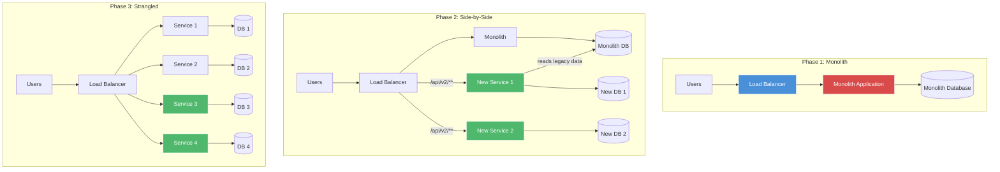
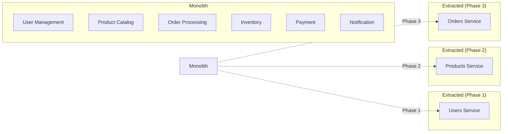

# Strangler Fig Pattern

## Architecture Diagram



## What Is the Strangler Fig Pattern?

The Strangler Fig pattern (named after tropical fig trees that grow around host trees, eventually replacing them) is a strategy for **incrementally migrating** a legacy system to a new architecture. You gradually replace pieces of functionality until the old system is entirely supplanted.

## Why It Was Created

Ripping and replacing a monolithic system in one shot ("big bang rewrite") is one of the riskiest software engineering activities. It often fails. The Strangler Fig pattern, popularized by **Martin Fowler**, reduces risk by:

- **Incremental delivery** — value delivered throughout the migration
- **Continuous rollback** — you can stop at any phase
- **Risk reduction** — each replacement is small and testable
- **Business continuity** — the system stays running throughout

## When to Use Strangler Fig

- **Legacy monolith to microservices** — the most common use case
- **Database migration** — change DB vendor or schema incrementally
- **Platform rewrite** — replace aging technology stack
- **Cloud migration** — move from on-prem to cloud incrementally
- **Not for** — greenfield projects, small systems where rewrite is cheaper

---

## Route / URL Strangulation

The simplest approach: use a reverse proxy or API gateway to route traffic to the old or new service.

```nginx
# Phase 1: All traffic to monolith
server {
    listen 80;
    location / {
        proxy_pass http://monolith:3000;
    }
}
```

```nginx
# Phase 2: New endpoints routed to microservices
upstream monolith {
    server monolith:3000;
}

upstream users_service {
    server users-service:4001;
}

upstream products_service {
    server products-service:4002;
}

upstream orders_service {
    server orders-service:4003;
}

server {
    listen 80;

    location /api/v2/users {
        proxy_pass http://users_service;
    }

    location /api/v2/products {
        proxy_pass http://products_service;
    }

    location /api/v2/orders {
        proxy_pass http://orders_service;
    }

    location / {
        proxy_pass http://monolith;
    }
}
```

```typescript
// API Gateway approach with Express
import express from "express";
import { createProxyMiddleware } from "http-proxy-middleware";

const app = express();

app.use("/api/v2/users", createProxyMiddleware({
    target: "http://users-service:4001",
    changeOrigin: true,
}));

app.use("/api/v2/products", createProxyMiddleware({
    target: "http://products-service:4002",
    changeOrigin: true,
}));

app.use("/api/v2/orders", createProxyMiddleware({
    target: "http://orders-service:4003",
    changeOrigin: true,
}));

// All other routes go to monolith
app.use("/", createProxyMiddleware({
    target: "http://monolith:3000",
    changeOrigin: true,
}));

app.listen(8080);
```

## Domain Strangulation

Identify bounded contexts in the monolith and extract one at a time.



### Extraction Example: Users Service

```typescript
// Step 1: Extract User-related code from monolith
import express from "express";
import bcrypt from "bcrypt";
import jwt from "jsonwebtoken";

const app = express();
app.use(express.json());

// Database connection
const db = require("./db");

app.post("/users", async (req, res) => {
    const { email, password, name } = req.body;

    const hashed = await bcrypt.hash(password, 10);
    const result = await db.query(
        "INSERT INTO users (email, password_hash, name) VALUES ($1, $2, $3) RETURNING id",
        [email, hashed, name]
    );

    res.status(201).json({ id: result.rows[0].id, email, name });
});

app.post("/login", async (req, res) => {
    const { email, password } = req.body;
    const result = await db.query("SELECT * FROM users WHERE email = $1", [email]);

    if (result.rows.length === 0) {
        return res.status(401).json({ error: "Invalid credentials" });
    }

    const user = result.rows[0];
    const valid = await bcrypt.compare(password, user.password_hash);

    if (!valid) {
        return res.status(401).json({ error: "Invalid credentials" });
    }

    const token = jwt.sign({ userId: user.id, role: user.role }, process.env.JWT_SECRET!);
    res.json({ token, user: { id: user.id, email: user.email, name: user.name } });
});

app.get("/users/:id", async (req, res) => {
    const result = await db.query("SELECT id, email, name, role FROM users WHERE id = $1", [req.params.id]);
    if (result.rows.length === 0) return res.status(404).json({ error: "Not found" });
    res.json(result.rows[0]);
});

app.listen(4001);
```

## Service Strangulation

Gradually replace service logic at the code level, using feature flags.

```typescript
export class OrderService {
    constructor(
        private legacyRepository: LegacyOrderRepository,
        private newRepository: NewOrderRepository
    ) {}

    async getOrder(orderId: string): Promise<OrderDTO> {
        if (featureFlags.useNewOrderService) {
            return this.getOrderFromNewService(orderId);
        }
        return this.getOrderFromLegacy(orderId);
    }

    private async getOrderFromLegacy(orderId: string): Promise<OrderDTO> {
        const data = await this.legacyRepository.findById(orderId);
        return this.transformLegacyToDTO(data);
    }

    private async getOrderFromNewService(orderId: string): Promise<OrderDTO> {
        const response = await fetch(`http://orders-service:4003/orders/${orderId}`);
        return response.json();
    }

    private transformLegacyToDTO(data: LegacyOrder): OrderDTO {
        return {
            id: data.id,
            customerName: `${data.first_name} ${data.last_name}`,
            items: data.items.map(i => ({
                productName: i.name,
                quantity: i.qty,
                unitPrice: i.price_cents / 100,
            })),
            total: data.items.reduce((sum, i) => sum + (i.price_cents * i.qty) / 100, 0),
            status: data.status,
            createdAt: data.created_at,
        };
    }
}

// Feature flags configuration
const featureFlags = {
    useNewOrderService: process.env.FEATURE_NEW_ORDER === "true",
    useNewPaymentFlow: process.env.FEATURE_NEW_PAYMENT === "true",
    useNewInventory: process.env.FEATURE_NEW_INVENTORY === "true",
};
```

## Feature Flags for Migration

```typescript
export class FeatureFlagRouter {
    private flags: Map<string, number> = new Map();

    constructor() {
        // Initialize from config source
        this.flags.set("new-checkout", 0);
        this.flags.set("new-payment", 0);
        this.flags.set("new-inventory", 0);
    }

    isEnabled(flagName: string, userId?: string): boolean {
        const rollout = this.flags.get(flagName) ?? 0;

        if (rollout === 0) return false;
        if (rollout >= 100) return true;

        // Gradual rollout based on user ID hash
        if (userId) {
            const hash = this.hashCode(userId) % 100;
            return hash < rollout;
        }

        return false;
    }

    setRollout(flagName: string, percentage: number): void {
        this.flags.set(flagName, Math.max(0, Math.min(100, percentage)));
    }

    private hashCode(str: string): number {
        let hash = 0;
        for (let i = 0; i < str.length; i++) {
            const char = str.charCodeAt(i);
            hash = ((hash << 5) - hash) + char;
            hash |= 0;
        }
        return Math.abs(hash);
    }
}

// Usage in migration
class CheckoutController {
    constructor(
        private legacyCheckout: LegacyCheckoutService,
        private newCheckout: NewCheckoutService,
        private featureFlags: FeatureFlagRouter
    ) {}

    async checkout(req: Request, res: Response): Promise<void> {
        const userId = req.user.id;

        if (this.featureFlags.isEnabled("new-checkout", userId)) {
            const result = await this.newCheckout.process(req.body);
            res.json(result);
        } else {
            const result = await this.legacyCheckout.process(req.body);
            res.json(result);
        }
    }
}
```

## Database Decomposition

The hardest part of strangled migration. Strategies for incremental DB decomposition.

```sql
-- Phase 1: Monolith DB (shared)
CREATE TABLE orders (
    id UUID PRIMARY KEY,
    customer_id UUID REFERENCES customers(id),
    product_id UUID REFERENCES products(id),
    quantity INT,
    total_cents INT,
    status VARCHAR(20),
    created_at TIMESTAMP
);

-- Phase 2: Extract orders into own DB, keep foreign keys pointing back
-- New orders DB
CREATE TABLE orders_new (
    id UUID PRIMARY KEY,
    customer_id UUID,  -- references customers in legacy DB
    created_at TIMESTAMP
);

CREATE TABLE order_items_new (
    id UUID PRIMARY KEY,
    order_id UUID REFERENCES orders_new(id),
    product_id UUID,  -- references products in legacy DB
    quantity INT,
    unit_price_cents INT
);

-- Phase 3: Sync both databases during migration
CREATE MATERIALIZED VIEW orders_sync AS
SELECT
    o.id,
    o.customer_id,
    o.created_at,
    json_agg(json_build_object(
        'product_id', oi.product_id,
        'quantity', oi.quantity,
        'price', oi.unit_price_cents
    )) as items
FROM orders_new o
LEFT JOIN order_items_new oi ON oi.order_id = o.id
GROUP BY o.id, o.customer_id, o.created_at;
```

### Dual Writes Pattern

```typescript
export class DualWriteRepository {
    constructor(
        private legacyDb: Database,
        private newDb: Database
    ) {}

    async saveOrder(order: Order): Promise<void> {
        // Write to legacy (primary)
        await this.legacyDb.query(
            "INSERT INTO orders (id, customer_id, product_id, quantity, total_cents, status) VALUES ($1, $2, $3, $4, $5, $6)",
            [order.id, order.customerId, order.productId, order.quantity, order.totalCents, order.status]
        );

        // Write to new (secondary)
        await this.newDb.query(
            "INSERT INTO orders (id, customer_id, created_at) VALUES ($1, $2, $3) ON CONFLICT DO NOTHING",
            [order.id, order.customerId, order.createdAt]
        );

        for (const item of order.items) {
            await this.newDb.query(
                "INSERT INTO order_items (id, order_id, product_id, quantity, unit_price_cents) VALUES ($1, $2, $3, $4, $5) ON CONFLICT DO NOTHING",
                [item.id, order.id, item.productId, item.quantity, item.unitPriceCents]
            );
        }
    }
}
```

## Parallel Run Strategies

Run old and new systems simultaneously, compare outputs.

```typescript
export class ParallelRunValidator {
    private mismatches: MismatchRecord[] = [];

    constructor(
        private alertService: AlertService
    ) {}

    async compareGetOrder(orderId: string): Promise<OrderDTO> {
        const legacyPromise = this.callLegacy(`/orders/${orderId}`);
        const newPromise = this.callNew(`/orders/${orderId}`);

        const [legacyResult, newResult] = await Promise.all([
            legacyPromise,
            newPromise,
        ]);

        const mismatch = this.findMismatch(legacyResult, newResult);
        if (mismatch) {
            this.mismatches.push({
                orderId,
                timestamp: new Date(),
                legacyValue: mismatch.legacy,
                newValue: mismatch.newValue,
            });

            if (this.mismatches.length > 10) {
                await this.alertService.sendAlert({
                    severity: "warning",
                    title: "Parallel run mismatch threshold exceeded",
                    message: `Found ${this.mismatches.length} mismatches between legacy and new order service`,
                    metadata: { sample: this.mismatches.slice(0, 3) },
                });
            }
        }

        // Return the legacy result during validation phase
        return legacyResult;
    }

    private findMismatch(
        legacy: OrderDTO,
        newService: OrderDTO
    ): { legacy: any; newValue: any } | null {
        if (legacy.total !== newService.total) {
            return { legacy: legacy.total, newValue: newService.total };
        }
        if (legacy.status !== newService.status) {
            return { legacy: legacy.status, newValue: newService.status };
        }
        return null;
    }

    private async callLegacy(path: string): Promise<OrderDTO> {
        const res = await fetch(`http://monolith:3000${path}`);
        return res.json();
    }

    private async callNew(path: string): Promise<OrderDTO> {
        const res = await fetch(`http://orders-service:4003${path}`);
        return res.json();
    }
}
```

## Migration Checklist

```yaml
migration_plan:
  service: order_processing
  phases:
    - phase: 1
      name: "Extract Read-Only"
      duration: "2 weeks"
      actions:
        - Create new service with read-only endpoints
        - Route GET /orders to new service
        - Monolith still handles writes
      validation:
        - Compare read responses between old and new
        - Monitor error rates
      rollback:
        - Revert routing in gateway

    - phase: 2
      name: "Dual Writes"
      duration: "4 weeks"
      actions:
        - Write to both monolith DB and new DB
        - Implement sync validation
        - Feature flag for gradual rollout
      validation:
        - Compare data consistency across DBs
        - Monitor write latency
      rollback:
        - Disable dual writes, keep monolith as source

    - phase: 3
      name: "Full Migration"
      duration: "2 weeks"
      actions:
        - Route all traffic to new service
        - New service handles reads and writes
        - Monolith becomes read-only
      validation:
        - End-to-end functional testing
        - Performance benchmarks
      rollback:
        - Switch back to monolith

    - phase: 4
      name: "Retire Monolith"
      duration: "1 week"
      actions:
        - Decommission old service
        - Archive monolith code
        - Update documentation
      validation:
        - Verify no dependencies remain on monolith
      rollback:
        - Canary deploy new service before final cutover
```

---

## Best Practices

1. **Identify bounded contexts first** — understand the domain boundaries before extracting
2. **Start with read-only services** — safest first extraction
3. **Use feature flags** — allow gradual rollout and instant rollback
4. **Parallel runs for validation** — compare old and new behavior before cutting over
5. **Invest in data sync** — most migrations fail due to data inconsistency
6. **Keep the strangulation phase short** — long-running migrations lose momentum
7. **Don't mix strangulation with major refactors** — move code as-is, refactor later
8. **Monitor performance** — the gateway/proxy becomes a critical path
9. **Have a rollback plan** — if something goes wrong, you must be able to revert
10. **Celebrate each extraction** — keep team morale high during long migrations

---

## Interview Questions

1. Why is "big bang rewrite" risky and how does Strangler Fig reduce that risk?
2. How do you handle database decomposition during strangulation?
3. What is dual writes and how do you keep them consistent?
4. How do feature flags help in the strangulation process?
5. How do you validate that the new service behaves identically to the old one?
6. What are the different types of strangulation (route, domain, service)?
7. How does the strangler fig pattern relate to the anti-corruption layer?
8. What is a parallel run and when would you use it?
9. How do you handle authentication/authorization during migration?
10. What are the warning signs that a strangulation is taking too long?

---

## Real Company Usage

| Company | Migration | Strategy |
|---------|-----------|----------|
| **Amazon** | Monolith to microservices | Route strangulation via API gateway |
| **Netflix** | Datacenter to AWS | API proxy + gradual traffic shifting |
| **Uber** | Monolith to SOA | Domain extraction, one service at a time |
| **Shopify** | Rails monolith to services | Feature flags + route-based strangulation |
| **SoundCloud** | Monolith to microservices | Database decomposition + dual writes |
| **Etsy** | PHP monolith to services | Feature flags + incremental extraction |
| **Groupon** | Monolith rewrite | Route strangulation + parallel run |
