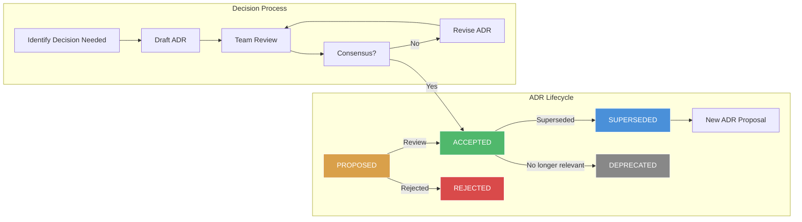
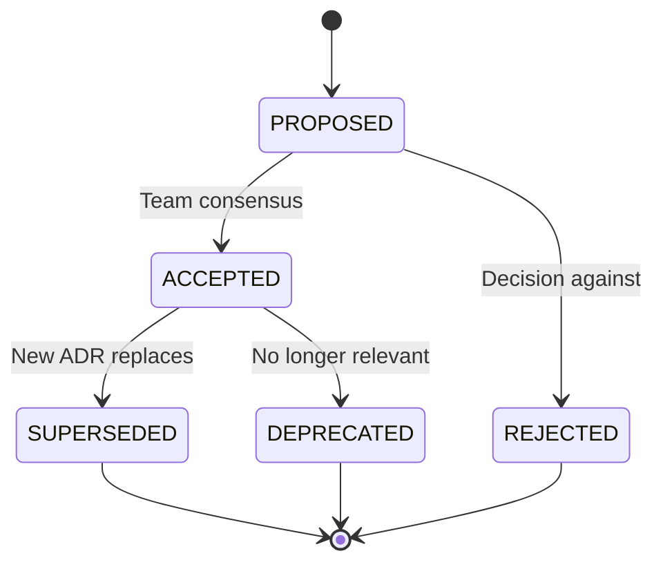

# Architecture Decision Records (ADRs)

## Workflow Diagram



## What Are Architecture Decision Records?

An Architecture Decision Record (ADR) is a **document that captures an important architectural decision** along with its context, consequences, and rationale. ADRs were popularized by **Michael Nygard** in 2011.

## Why They Were Created

Architectural decisions are often implicit, undocumented, or communicated verbally. When team members leave or the rationale is forgotten, future developers can't understand **why** things are the way they are. ADRs solve:

- **Knowledge loss** — decisions outlive the deciders
- **Repeated debates** — record why alternative X was chosen over Y
- **Onboarding** — new team members learn the architecture's history
- **Accountability** — every decision has documented rationale

## When to Use ADRs

- **Every architectural decision** — significant technology, pattern, or infrastructure choice
- **When alternatives exist** — multiple valid options were considered
- **When tradeoffs exist** — no perfect choice, document the tradeoffs
- **Not for** — trivial decisions (indentation style), reversible decisions (library minor version)

---

## ADR Format (Template)

```markdown
# ADR-NNN: Title of the Decision

## Status
[PROPOSED | ACCEPTED | DEPRECATED | SUPERSEDED]

## Context
Describe the problem, constraints, and forces at play. What prompted this decision?
What alternatives were considered? What are the business and technical drivers?

## Decision
State the decision in clear, imperative terms. "We will use X for Y."
Include details about the implementation approach.

## Consequences
Describe the resulting context after applying the decision.
- Positive consequences (benefits)
- Negative consequences (tradeoffs)
- Neutral consequences (changes to processes)

## Compliance
How will this decision be enforced?
- Automated checks (linters, CI/CD gates)
- Manual review requirements
- Architecture fitness functions

## Notes
- References to related ADRs
- Links to documentation
- Meeting notes or discussion links
```

### Example: Good ADR

```markdown
# ADR-001: Use PostgreSQL as Primary Database

## Status
ACCEPTED

## Context
Our e-commerce platform is currently using MySQL 5.7 as the primary database.
We are migrating from a monolith to microservices architecture and need a
database that better supports:
1. JSON document storage for flexible product catalogs
2. Advanced indexing (GIN, GiST) for full-text search
3. Better concurrency with MVCC under high write loads

Alternatives considered:
- **MySQL 8.0**: Stay with MySQL, upgrade version. Lacks native JSONB and
  advanced index types we need.
- **MongoDB**: Better document support but lacks ACID transactions across
  multiple documents, which we need for order management.
- **CockroachDB**: Excellent scaling but operational complexity is too high
  for our current team size.

## Decision
We will use PostgreSQL 16 as our primary operational database.

Specific commitments:
- All new microservices will use PostgreSQL as their primary store
- Existing MySQL databases will be migrated incrementally using the
  Strangler Fig pattern (see ADR-004)
- We will use the `uuid-ossp` extension for primary keys
- We will use JSONB columns where flexible schema is required

## Consequences
Positive:
- Built-in JSONB with indexing improves product catalog flexibility
- MVCC handles our write-heavy workload better
- PostGIS opens future geospatial capabilities
- Excellent tooling and community support

Negative:
- Team needs PostgreSQL training (estimated 2 weeks)
- Migration cost for existing MySQL data (~$50k engineering time)
- Some MySQL-specific queries need rewriting

Neutral:
- DevOps team needs to manage a second RDBMS during migration period
- ORM layer needs multi-dialect support temporarily

## Compliance
- Enforced via CI/CD: Terraform templates enforce PostgreSQL provisioning
- Code review: All new services must use PostgreSQL
- Migration: Gradual, with parallel run validation (see ADR-004)

## Notes
- Supersedes informal decision "we use MySQL for everything" (2019)
- Related: ADR-004 (Database Migration Strategy)
- Related: ADR-007 (JSONB vs JSON Column Types)
- Discussion: 2026-03-15 Architecture Review (recording: link)
```

### Example: Bad ADR

```markdown
# ADR-002: Use Redis

## Status
ACCEPTED

## Context
We need caching.

## Decision
We'll use Redis.

## Consequences
Faster responses.
```

**Why it's bad**: No context about why alternatives weren't chosen, no details about deployment, no tradeoff analysis, no version, no relationship to other decisions.

---

## ADR Lifecycle



### Lifecycle Management

```yaml
# .adr/config.yaml
adr_directory: docs/adr
adr_prefix: ADR
adr_number_padding: 3

statuses:
  - PROPOSED
  - ACCEPTED
  - REJECTED
  - DEPRECATED
  - SUPERSEDED

supersedes_field: true
template: docs/adr/template.md
```

## ADR Tools

### adr-tools (Command Line)

```bash
# Install
brew install adr-tools

# Create new ADR
adr new "Use PostgreSQL as primary database"

# Creates: doc/adr/0001-use-postgresql-as-primary-database.md

# List all ADRs
adr list
# 0001: Use PostgreSQL as primary database [ACCEPTED]
# 0002: Use Redis for session caching [PROPOSED]

# Supersede an ADR
adr new -s 1 "Use CockroachDB for multi-region deployment"

# Link ADRs
adr link 1 "Superseded by" 3
```

### Log4brains (Web UI)

```bash
# Install
npm install -g @log4brains/cli

# Initialize
log4brains init

# Create ADR with web UI
log4brains adr:new

# Start documentation portal
log4brains preview

# Build static site
log4brains build
```

Log4brains provides:
- Auto-generated documentation portal
- ADR graph visualization
- Search across ADRs
- Markdown-based
- Decoupled from project layout

### Manual ADR Organization

```
docs/
├── adr/
│   ├── README.md           # Index of all ADRs
│   ├── template.md          # ADR template
│   ├── 0001-use-postgresql.md
│   ├── 0002-use-redis-caching.md
│   ├── 0003-migrate-to-kafka.md
│   └── config.yaml
```

## ADRs in Practice

### Netflix

Netflix uses ADRs extensively in their **engineering culture**. Every material architecture decision requires an ADR before implementation.

Key practices:
- **ADR-as-code** — stored alongside code in git
- **Mandatory review** — at least 3 senior engineers
- **Decision log** — public within the organization
- **Periodic review** — quarterly ADR health check

### Spotify

Spotify uses ADRs within the **Guild model** — squads, chapters, and guilds all document decisions.

Key practices:
- **Lightweight format** — half-page standard
- **Squad-level ADRs** — decisions affecting a single squad
- **Tribal ADRs** — spanning multiple squads
- **Guild ADRs** — technology-specific decisions

### Thoughtworks

Thoughtworks (where ADRs were popularized) uses them on **every client engagement**.

Key practices:
- **Decision-first** — write the ADR before implementing
- **Time-boxed** — ADR review within 48 hours
- **Mutable ADRs** — decisions can be revisited
- **Client-visible** — ADRs shared with stakeholders

---

## ADR Decision Framework

```typescript
export class ADRDecisionRouter {
    constructor(private adrRepository: ADRRepository) {}

    async getActiveDecisions(domain: string): Promise<ADR[]> {
        const all = await this.adrRepository.findByDomain(domain);
        return all
            .filter(a => a.status === "ACCEPTED")
            .sort((a, b) => b.date - a.date);
    }

    async checkDecision(
        domain: string,
        deciderFunction: () => boolean,
        adrTitle: string
    ): Promise<DecisionCompliance> {
        const decisions = await this.getActiveDecisions(domain);
        const currentState = deciderFunction();

        for (const adr of decisions) {
            if (adr.hasComplianceCheck && !adr.complianceCheck()) {
                return {
                    compliant: false,
                    violatingADR: adr,
                    expectedState: adr.decision,
                    actualState: currentState,
                };
            }
        }

        return { compliant: true };
    }
}

interface ADR {
    id: string;
    title: string;
    status: "PROPOSED" | "ACCEPTED" | "REJECTED" | "DEPRECATED" | "SUPERSEDED";
    domain: string;
    decision: string;
    date: Date;
    hasComplianceCheck: boolean;
    complianceCheck: () => boolean;
}

interface DecisionCompliance {
    compliant: boolean;
    violatingADR?: ADR;
    expectedState?: string;
    actualState?: boolean;
}
```

---

## Best Practices

1. **Write ADRs before implementing** — the decision document drives the work
2. **Keep them concise** — 1-2 pages, not an essay
3. **Include rejected alternatives** — shows why the chosen path was selected
4. **Update status** — don't let ADRs go stale; mark them deprecated/superseded
5. **Link ADRs** — create a decision graph showing relationships
6. **Store with code** — ADRs are engineering artifacts, keep them in the repo
7. **Review ADRs like code** — peer review, feedback, iteration
8. **Use consistent numbering** — sequential, never renumbered
9. **Make them searchable** — consistent front-matter for tooling
10. **Track compliance** — automate checks where possible

---

## Interview Questions

1. What is an ADR and why is it useful?
2. What are the key sections of an ADR?
3. What is the ADR lifecycle?
4. How do ADRs help with team onboarding?
5. What's the difference between a good and a bad ADR?
6. When should you write an ADR vs when is it unnecessary?
7. How do you handle superseded ADRs?
8. How do ADRs relate to architecture fitness functions?
9. What tools are available for managing ADRs?
10. How do large organizations like Netflix manage ADRs at scale?

---

## Real Company Usage

| Company | Practice | Tooling |
|---------|----------|---------|
| **Netflix** | Mandatory ADR for all architectural decisions | Custom tooling + GitHub |
| **Spotify** | Guild-based ADR review | Markdown + in-house portal |
| **Thoughtworks** | Client-facing ADRs on every engagement | adr-tools + Log4brains |
| **Microsoft** | Azure architecture review with ADRs | Azure DevOps Wiki |
| **Amazon** | PR/FAQ document then ADR | Internal tools |
| **Google** | Design docs (similar to ADRs) | Google Docs + g3doc |
| **Shopify** | RFC process with ADR as output | GitHub + custom dashboard |
