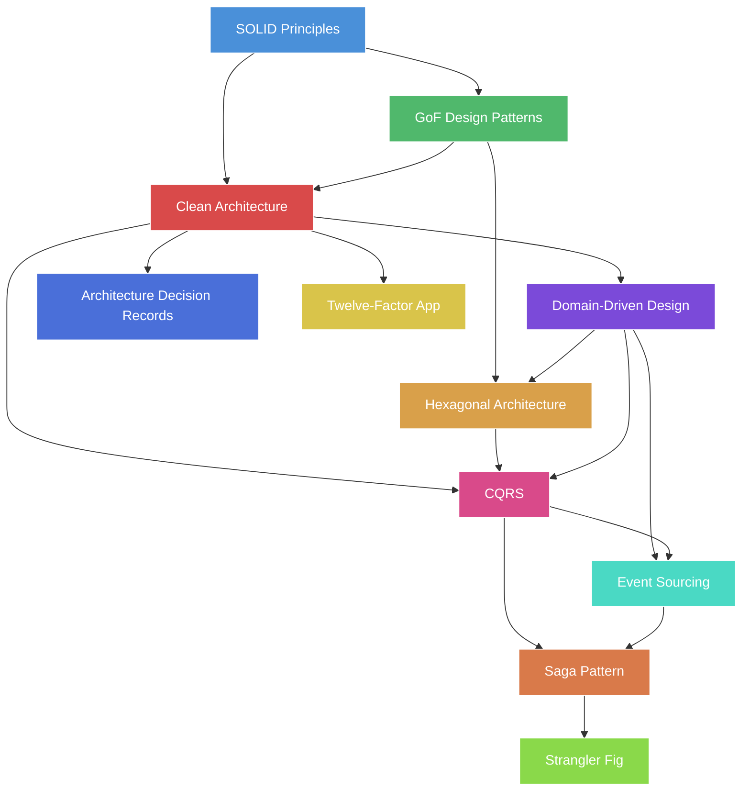

# 25 — Clean Architecture & Design Patterns

> A comprehensive guide to software architecture patterns, design principles, and structural paradigms that underpin modern, maintainable, and scalable systems.

## Module Overview

## Learning Path

| Step | Topic | Prerequisites | Est. Time |
|------|-------|---------------|-----------|
| 1 | SOLID Principles | OOP fundamentals | 2 hr |
| 2 | GoF Design Patterns | SOLID | 4 hr |
| 3 | Clean Architecture | SOLID + Patterns | 3 hr |
| 4 | Hexagonal Architecture | Clean Architecture | 2 hr |
| 5 | Domain-Driven Design | Clean + Hexagonal | 4 hr |
| 6 | CQRS | DDD + Clean | 2 hr |
| 7 | Event Sourcing | CQRS | 3 hr |
| 8 | Saga Pattern | Distributed Systems | 2 hr |
| 9 | Strangler Fig Pattern | Microservices | 1.5 hr |
| 10 | Architecture Decision Records | Any architecture | 1 hr |
| 11 | Twelve-Factor App | Cloud-native | 1.5 hr |

## Topics

| # | File | Description |
|---|------|-------------|
| 01 | [solid-principles.md](01-solid-principles.md) | SOLID: SRP, OCP, LSP, ISP, DIP with modern examples |
| 02 | [gof-patterns.md](02-gof-patterns.md) | 23 Gang of Four patterns across creational, structural, behavioral |
| 03 | [clean-architecture.md](03-clean-architecture.md) | Uncle Bob's Clean Architecture: layers, dependency rule, use cases |
| 04 | [hexagonal-architecture.md](04-hexagonal-architecture.md) | Ports & Adapters: domain isolation, driving/driven adapters |
| 05 | [domain-driven-design.md](05-domain-driven-design.md) | DDD: bounded contexts, aggregates, domain events, strategic design |
| 06 | [cqrs-pattern.md](06-cqrs-pattern.md) | CQRS: command/query separation, read/write models |
| 07 | [event-sourcing.md](07-event-sourcing.md) | Event Sourcing: event store, replay, projections |
| 08 | [saga-pattern.md](08-saga-pattern.md) | Saga: choreography vs orchestration, compensation |
| 09 | [strangler-fig-pattern.md](09-strangler-fig-pattern.md) | Strangler Fig: incremental monolith-to-microservices migration |
| 10 | [architecture-decision-records.md](10-architecture-decision-records.md) | ADRs: format, lifecycle, tools, real-world practice |
| 11 | [twelve-factor-app.md](11-twelve-factor-app.md) | Twelve-Factor: cloud-native application methodology |

## Navigation

- **Previous**: [24 - Testing & Quality Engineering](../24-Testing-Quality-Engineering/README.md)
- **Next**: Back to [Main README](../README.md)

## Diagrams Legend

Throughout this module, diagrams use the following conventions:

- `Rectangle[Label]` — Component or module
- `Rectangle((Label))` — External system
- `Cylinder[(Label)]` — Database or storage
- `Diamond{Label}` — Decision or gateway
- **Arrows** indicate data flow or dependency direction

---
Previous: [24 — Testing & Quality Engineering](../24-Testing-Quality-Engineering/README.md)
Next: [🏠 Back to Main README](../README.md)
