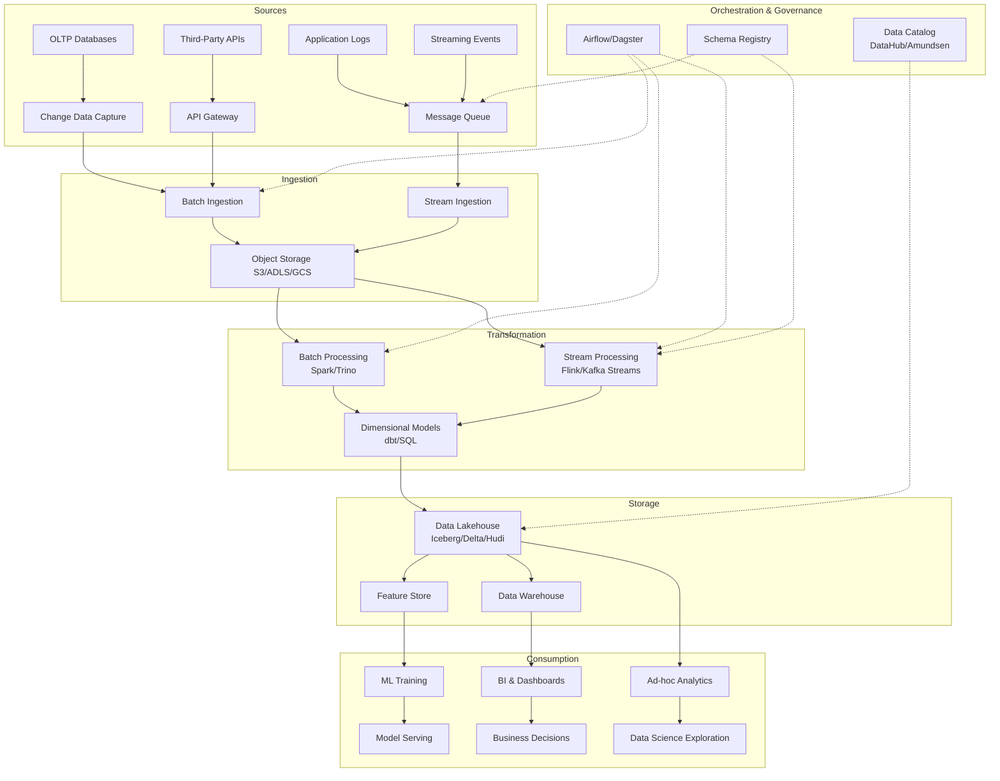

# Data Engineering Overview

## Architecture at a Glance



## What is it?

Data Engineering is the discipline of designing, building, and maintaining systems that collect, store, process, and make data available for analysis and machine learning. It concerns the entire data pipeline — from ingesting raw data from heterogeneous sources to delivering clean, reliable, and well-structured datasets to downstream consumers (analysts, data scientists, ML models, BI tools).

The modern data stack consists of several layers:

- **Storage** — Object stores (S3, ADLS, GCS) and table formats (Iceberg, Delta Lake, Hudi) that provide a single source of truth.
- **Compute** — Distributed processing engines (Spark, Trino, Flink) that execute transformations at scale.
- **Transformation** — Tools like dbt and SQL-based pipelines that convert raw data into analytical models.
- **Orchestration** — Workflow managers (Airflow, Dagster, Prefect) that schedule, monitor, and manage pipeline dependencies.
- **BI & Analytics** — Visualization tools (Looker, Tableau, Metabase) that present data to decision-makers.
- **ML & AI** — Feature stores and model training/inference pipelines (MLflow, Feast) that operationalize data science.

## Why it was created

Data Engineering emerged as a distinct discipline because traditional software engineering and database administration could no longer handle the scale, variety, and velocity of data generated in modern organizations. Early data work relied on manual processes and siloed databases where analysts ran queries directly on production systems, causing performance degradation and reliability issues.

The rise of big data frameworks (Hadoop, Spark) and cloud computing (AWS, GCP, Azure) made it possible to store and process petabytes cost-effectively, but introduced immense complexity. Organizations needed dedicated engineers to build reliable pipelines, manage infrastructure, ensure data quality, and create reusable data products — tasks that neither software engineers nor data scientists had the bandwidth or expertise to own.

Data Engineering professionalizes the data supply chain, analogous to how DevOps professionalized the software delivery pipeline. It enables data scientists and analysts to work with trustworthy, up-to-date data rather than spending 80% of their time finding, cleaning, and joining datasets.

## When to use it

| Scenario | Why Data Engineering is needed |
|---|---|
| Data volume exceeds single-node processing | Distributed systems (Spark, Trino) required |
| Multiple source systems need integration | Ingestion, CDC, and transformation pipelines |
| Data quality and reliability are critical | Automated testing, monitoring, and reconciliation |
| ML models need production-grade features | Feature engineering, backfilling, serving |
| Regulatory compliance (GDPR, HIPAA) | Lineage tracking, retention policies, auditing |
| Self-serve analytics across the org | Curated data marts, consistent definitions |
| Real-time decision-making | Stream processing, low-latency pipelines |

## Hands-on Example

### Simple Batch Pipeline with Python (Local)

```python
# etl_pipeline.py
import pandas as pd
from datetime import datetime
import json

# Extract
def extract_orders(file_path="data/orders.json"):
    with open(file_path, "r") as f:
        return pd.DataFrame(json.load(f)["orders"])

def extract_customers(file_path="data/customers.json"):
    with open(file_path, "r") as f:
        return pd.DataFrame(json.load(f)["customers"])

# Transform
def transform(orders: pd.DataFrame, customers: pd.DataFrame) -> pd.DataFrame:
    # Join and clean data
    df = orders.merge(customers, on="customer_id", how="left")
    df["order_total_usd"] = df["amount"] * df["fx_rate"]
    df["order_date"] = pd.to_datetime(df["created_at"]).dt.date
    df["order_month"] = pd.to_datetime(df["created_at"]).dt.to_period("M")

    # Filter active customers
    df = df[df["status"] == "active"]

    # Monthly aggregation
    monthly = (
        df.groupby(["order_month", "segment"])
        .agg(
            total_revenue=("order_total_usd", "sum"),
            order_count=("order_id", "count"),
            unique_customers=("customer_id", "nunique"),
        )
        .reset_index()
    )
    return monthly

# Load
def load(df: pd.DataFrame, output_path="data/monthly_orders.parquet"):
    df.to_parquet(output_path, index=False)
    print(f"Loaded {len(df)} rows to {output_path}")

# Orchestrate
def run_pipeline():
    orders = extract_orders()
    customers = extract_customers()
    result = transform(orders, customers)
    load(result)

if __name__ == "__main__":
    run_pipeline()
```

### Orchestration with Airflow DAG Skeleton

```python
# dags/order_etl.py
from datetime import datetime, timedelta
from airflow import DAG
from airflow.operators.python import PythonOperator
from airflow.operators.bash import BashOperator
from etl_pipeline import run_pipeline

default_args = {"owner": "data_eng", "retries": 2, "retry_delay": timedelta(minutes=5)}

with DAG(
    dag_id="order_etl",
    start_date=datetime(2024, 1, 1),
    schedule="0 6 * * *",
    default_args=default_args,
    catchup=False,
    tags=["orders", "batch"],
) as dag:

    extract = BashOperator(task_id="extract_raw", bash_command="python scripts/extract.py")
    transform = PythonOperator(task_id="transform_load", python_callable=run_pipeline)
    notify = BashOperator(task_id="notify_slack", bash_command="python scripts/slack_alert.py --status success")

    extract >> transform >> notify
```

## Best Practices

- **Design for idempotency** — Pipelines should produce the same output when re-run with the same input. Use upsert/merge patterns (SCD Type 2, MERGE INTO) so replaying a failed run doesn't duplicate data.
- **Implement data quality checks** — Test expectations at every stage (row count, null-rate, referential integrity, schema drift). Use Great Expectations, dbt tests, or custom assertions.
- **Partition and sort data strategically** — Partition by commonly filtered columns (date, region) and sort within partitions by high-cardinality keys (user_id, order_id) to optimize query pruning.
- **Instrument observability** — Log row counts, latency percentiles, error rates, and lineage. Use OpenLineage for column-level lineage tracking.
- **Isolate environments** — Maintain dev, staging, and prod data with separate access controls. Never run untested transformations on production data.
- **Version everything** — Version control pipelines code, SQL models, schemas, and configurations. Use CI/CD for database migrations and schema evolution.
- **Plan for data retention** — Define TTL policies, archival strategies, and purge mechanisms. Automate cleanup with vacuum/compaction jobs.
- **Use schema registries** — Centralize schema management for streaming and batch datasets to prevent silent schema drift.
- **Right-size compute** — Choose appropriate cluster sizes and auto-scaling policies. Monitor shuffle, spill, and resource utilization.
- **Document the data** — Maintain a data catalog with descriptions, owners, freshness SLAs, and known issues. Empower analysts with self-serve discovery.

## Interview Questions

### 1. Walk through the full lifecycle of a data pipeline you've designed.

**Answer**: Start with *requirements gathering* — understand the business question, data frequency needs (real-time vs daily), target consumers, and SLAs. Then *source analysis* — profile source schemas, estimate volume (rows/day, size), identify PII, and assess data quality. *Architecture selection* — choose between ELT (dbt on warehouse) vs ETL (Spark for complex transforms), streaming (Kafka + Flink) vs batch (Airflow + Spark), and storage (lake, warehouse, or lakehouse). *Implementation* — build ingestion (CDC or batch export), apply transformations with testing at each stage, maintain idempotency, and add observability (row count monitors, freshness alerts). *Deployment* — CI/CD pipeline for SQL and code, staged rollout (dev → staging → prod), backfill strategy for historical data. *Maintenance* — monitor for failures, schema drift, and performance regression; schedule compaction/vacuum; update documentation and catalog. The key is treating the pipeline as a *product* — defining SLAs, establishing on-call rotation, and iterating with consumers on requirements.

### 2. Compare ETL and ELT. When would you choose one over the other?

**Answer**: In **ETL** (Extract, Transform, Load), data is transformed in a staging layer before loading into the target system. This is necessary when the target cannot do heavy transformations (e.g., loading into a graph DB, search index, or legacy warehouse with limited compute) or when you need to strip PII before data enters the warehouse. ETL requires a transformation engine (Spark, EMR) between source and target.

In **ELT** (Extract, Load, Transform), raw data is loaded directly into the target (cloud warehouse, lakehouse) and transformations happen in-place. This is preferred when the target is a modern MPP warehouse (Snowflake, BigQuery, Redshift) or a lakehouse engine (Trino, SparkSQL) that can scale compute separately from storage. ELT is simpler, faster to develop, and keeps raw data available for reprocessing.

Choose **ETL** when: target systems lack compute capacity, you need real-time masking/transformation before load, or you're loading into a non-analytical store (API, search engine). Choose **ELT** when: target is cloud-native with elastic compute, you want to preserve raw data for future re-processing, and you value development speed.

### 3. What is the modern data stack and what problem does it solve?

**Answer**: The modern data stack (MDS) replaces the monolithic, on-premise data warehouse era (Teradata, Oracle DW) with a decoupled architecture of cloud-native, best-of-breed components connected via open formats (Parquet, Avro, Iceberg). Key characteristics: (1) **Separated storage and compute** — object storage (S3) is the foundation; compute engines (Spark, Trino, Snowflake) are ephemeral and elastic. (2) **Open table formats** (Iceberg, Delta Lake) provide ACID transactions on object storage, enabling time travel, schema evolution, and concurrent reads/writes. (3) **Managed transformation** — dbt brings software engineering best practices (testing, documentation, version control, CI/CD) to SQL transformations. (4) **Centralized governance** — DataHub/Amundsen for catalog and lineage, Marquez/OpenLineage for tracking data flow. (5) **Declarative orchestration** — Dagster and Prefect emphasize asset-aware scheduling rather than imperative DAGs.

The MDS solves the high cost and inflexibility of monolithic appliances. Organizations can start small (e.g., Fivetran + BigQuery + dbt + Looker) and add components (streaming, ML feature store) as maturity grows. The open format foundation prevents vendor lock-in — data stored as Iceberg on S3 can be queried by Spark, Trino, Snowflake, Athena, or DuckDB interchangeably.

## Real Company Usage

| Company | Data Infrastructure | Scale & Impact |
|---|---|---|
| **Uber** | Hadoop → Hive → Spark → Apache Hudi on HDFS; Kafka for streaming; Peloton orchestrator; ML feature store (Michelangelo) | Processes 100+ PB data daily; 10M+ trips/h across 70 countries; Hudi provides upserts/ACID on lake |
| **Airbnb** | Spark + Hive → Trino + Iceberg on S3; Airflow orchestration; dbt for transformation; Minerva (internal Presto) for ad-hoc queries | 3000+ weekly active analysts; runs 100k+ pipelines daily; Iceberg migration saved 40% storage via compaction |
| **Netflix** | Apache Kafka + Flink for streaming; Spark + Hive for batch; S3-based data lake; Iceberg table format; Genie for job orchestration | 250M+ streaming accounts; 1.5 PB/day new data; Iceberg enables multi-engine access (Spark, Trino, Hive) |
| **Stripe** | Snowflake ELT; dbt for transformations; Airflow for orchestration; Looker for BI; Singer/Fivetran for ingestion | 10k+ models in dbt; sub-second query latency on 100+ TB warehouse; data products power revenue, risk, and ML teams |
