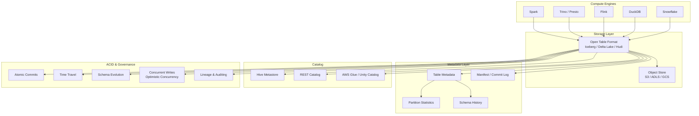

# Data Lakehouse Architecture

## Architecture at a Glance



## What is it?

A **data lakehouse** merges the flexibility and low-cost storage of a data lake with the reliability, ACID transactions, and query performance of a data warehouse. It is built on open table formats (Apache Iceberg, Delta Lake, Apache Hudi) that bring warehouse-style semantics — atomic commits, time travel, schema evolution, and concurrent reads/writes — directly on top of object storage (S3, ADLS, GCS).

The three major open table formats differ in origin and philosophy but share a common goal: make petabyte-scale object storage behave like a relational database.

| Property | Data Lake (Legacy) | Data Warehouse | Data Lakehouse |
|---|---|---|---|
| Storage cost | Low ($/TB/mo) | High | Low |
| Schema enforcement | None (schema-on-read) | Strict (schema-on-write) | Enforced with evolution support |
| ACID transactions | None or eventually consistent | Full ACID | Full ACID |
| BI performance | Poor (full scan) | Excellent (indexes, MVs) | Good (partition pruning, file skipping) |
| ML/AI support | Native (raw files) | Limited (structured only) | Native (raw files + structured) |
| Open formats | Yes | Proprietary (usually) | Yes |
| Concurrent access | Prone to corruption | MVCC | MVCC via optimistic concurrency |

### Data Lake vs Data Warehouse vs Lakehouse

- **Data Lake**: Stores raw data in native format (Parquet, Avro, JSON, images, videos). No schema enforced at write time. Cheap storage, expensive compute due to lack of indexing. Prone to "swamp" problems — data with no governance or discoverability.

- **Data Warehouse**: Stores highly structured, pre-joined, aggregated data optimized for BI queries. Enforces schema on write. Excellent query performance but high storage cost and vendor lock-in. Not suitable for unstructured data or ML workloads.

- **Data Lakehouse**: Sits on object storage with a metadata layer that provides warehouse semantics. The same data serves BI dashboards (via Trino/Snowflake), ML training (Spark/DuckDB), and streaming ingestion (Flink/Kafka). One copy of data, multiple engines.

## Why it was created

The data lakehouse was created to solve the **data silo problem**. Organizations historically maintained:

1. A **data lake** (HDFS/S3 + Spark/Hive) for ETL, data science, and raw data exploration.
2. A **data warehouse** (Teradata, Snowflake, Redshift) for BI, reporting, and curated datasets.
3. A **search/analytics engine** (Elasticsearch, Druid) for real-time use cases.

These silos caused data duplication (same data stored 3x), cost explosion, inconsistency between systems, and governance nightmares (who owns the "truth"?). Moving data between silos introduced latency and failure points.

The lakehouse eliminates silos by making a single copy of data on object storage support all workloads. The key enablers were open table formats that added transactional semantics to blob storage — a capability missing for the 15+ years that data lakes existed. Delta Lake (2019, Databricks), Iceberg (2018, Netflix → Apache), and Hudi (2017, Uber → Apache) pioneered this pattern. Cloud vendors then embraced it — AWS S3 Tables, Azure Fabric, Google BigLake all build on these formats.

## When to use it

| Scenario | Best Fit |
|---|---|
| You have both BI and ML workloads on the same data | Lakehouse (one copy serves both) |
| Data volume exceeds 10 TB and storage cost matters | Lakehouse on object storage |
| You need multi-engine access (Spark, Trino, DuckDB) | Iceberg / Delta Lake |
| You need ACID guarantees on a data lake | Any of Iceberg, Delta, Hudi |
| You have streaming ingestion with upserts | Hudi (MOR) or Delta Lake |
| You need to time-travel for audit/compliance | Iceberg or Delta Lake |
| Your query patterns are unpredictable/exploratory | Lakehouse (no schema pre-definition needed) |

Avoid lakehouse if: you have only strict BI workloads (<5 TB, fully modeled) where a classic warehouse is simpler; you need sub-second point lookups on billions of keys (use OLTP DB + cache); or your team lacks the operational maturity to manage a distributed system.

## Hands-on Example

### Apache Iceberg + Spark + MinIO (local S3)

Create a local Spark session that reads and writes Iceberg tables on MinIO.

```python
# iceberg_setup.py
from pyspark.sql import SparkSession
import os

# Setup Spark with Iceberg and MinIO
spark = (
    SparkSession.builder.appName("IcebergDemo")
    .config(
        "spark.sql.catalog.my_catalog",
        "org.apache.iceberg.spark.SparkCatalog",
    )
    .config(
        "spark.sql.catalog.my_catalog.type",
        "hadoop",
    )
    .config(
        "spark.sql.catalog.my_catalog.warehouse",
        "s3a://iceberg-warehouse/",
    )
    .config("spark.sql.extensions", "org.apache.iceberg.spark.extensions.IcebergSparkSessionExtensions")
    .config("spark.hadoop.fs.s3a.endpoint", "http://localhost:9000")
    .config("spark.hadoop.fs.s3a.access.key", "minioadmin")
    .config("spark.hadoop.fs.s3a.secret.key", "minioadmin")
    .config("spark.hadoop.fs.s3a.path.style.access", "true")
    .config("spark.hadoop.fs.s3a.impl", "org.apache.hadoop.fs.s3a.S3AFileSystem")
    .getOrCreate()
)

# Create a table with partitioning and schema
spark.sql("""
    CREATE TABLE IF NOT EXISTS my_catalog.orders (
        order_id BIGINT,
        customer_id BIGINT,
        amount DOUBLE,
        currency STRING,
        order_ts TIMESTAMP,
        region STRING
    )
    USING iceberg
    PARTITIONED BY (days(order_ts), region)
""")

# Insert data
spark.sql("""
    INSERT INTO my_catalog.orders VALUES
    (1, 101, 29.99, 'USD', CURRENT_TIMESTAMP, 'US'),
    (2, 102, 49.99, 'EUR', CURRENT_TIMESTAMP, 'EU'),
    (3, 103, 15.50, 'USD', CURRENT_TIMESTAMP, 'US')
""")

# Time travel — show current and historical data
spark.sql("SELECT * FROM my_catalog.orders").show()

# Get snapshot history
spark.sql("SELECT * FROM my_catalog.orders.snapshots").show()

# Time travel to a specific snapshot
spark.sql("SELECT * FROM my_catalog.orders VERSION AS OF 1234567890").show()

# Schema evolution — add a new column
spark.sql("ALTER TABLE my_catalog.orders ADD COLUMN discount DOUBLE")
spark.sql("UPDATE my_catalog.orders SET discount = 0.1 WHERE order_id = 1")

# Compaction — rewrite small files
spark.sql("CALL my_catalog.system.rewrite_data_files(table => 'orders')")

# Expire old snapshots
spark.sql("CALL my_catalog.system.expire_snapshots(table => 'orders', older_than => TIMESTAMP '2025-01-01 00:00:00.000')")
```

### Delta Lake Quick Start

```python
# delta_setup.py
from pyspark.sql import SparkSession

spark = SparkSession.builder.appName("DeltaDemo") \
    .config("spark.sql.extensions", "io.delta.sql.DeltaSparkSessionExtension") \
    .config("spark.sql.catalog.spark_catalog", "org.apache.spark.sql.delta.catalog.DeltaCatalog") \
    .getOrCreate()

# Create Delta table
df = spark.range(0, 5)
df.write.format("delta").mode("overwrite").save("/tmp/delta-table")

# Read as Delta
spark.read.format("delta").load("/tmp/delta-table").show()

# UPSERT with MERGE
spark.sql("""
    MERGE INTO delta.`/tmp/delta-table` target
    USING (SELECT id FROM RANGE(3, 8)) source
    ON target.id = source.id
    WHEN MATCHED THEN UPDATE SET target.id = target.id + 100
    WHEN NOT MATCHED THEN INSERT (id) VALUES (source.id)
""")

# Time travel
spark.read.format("delta") \
    .option("versionAsOf", 0) \
    .load("/tmp/delta-table") \
    .show()

# Vacuum (remove old files)
from delta.tables import DeltaTable
dt = DeltaTable.forPath(spark, "/tmp/delta-table")
dt.vacuum(retentionHours=168)
```

## Best Practices

- **Choose the right table format** — Match the format to your workload: Iceberg for multi-engine access and strict governance; Delta Lake for tight Databricks/Spark integration and managed ML pipelines; Hudi for write-heavy streaming with upserts.
- **Partition wisely** — Partition by date or region (low cardinality), not by high-cardinality columns like user_id. Iceberg's hidden partitioning automatically handles bucketing — use `days(ts)` and `bucket(id, 128)`.
- **Compact small files** — Streaming jobs create many small files. Schedule compaction (`rewrite_data_files` in Iceberg, `OPTIMIZE` in Delta, `clustering` in Hudi) during off-peak hours.
- **Set snapshot retention** — Keep 7–30 days of history for time travel but expire old snapshots to reduce storage. Set `spark.sql.iceberg.expire.snapshots.delete` or Delta's `delta.logRetentionDuration`.
- **Use a unified catalog** — Register all tables in a shared metastore (Hive Metastore, AWS Glue, Unity Catalog) so every engine can discover and query them without manual path management.
- **Enable column-level stats** — Iceberg stores per-file column stats (min, max, null count) to enable predicate pushdown and file skipping. Validate stats are accurate after large deletes/updates.
- **Handle concurrent writes** — Use optimistic concurrency (retry on conflict). Set reasonable retry limits (10–20 attempts). In high-contention scenarios, partition data to reduce write conflicts.
- **Monitor lineage** — Track which jobs write to which partitions. Use the table format's commit metadata to trace data origin for debugging and compliance.
- **Benchmark engine-specific features** — Iceberg supports `DELETE` with equality delete files (row-level deletes without rewriting), Hudi supports MOR tables (merge-on-read for low-latency ingestion), Delta has `ZORDER` for multidimensional clustering — evaluate before adopting.

## Interview Questions

### 1. Explain how Apache Iceberg provides ACID transactions on object storage. What happens during a concurrent write conflict?

**Answer**: Iceberg uses **optimistic concurrency** with a **catalog-level atomic swap** to provide ACID. The table metadata is organized as a tree: a **catalog** (Hive metastore, REST catalog, Glue) points to the **current metadata pointer** (`current-snapshot`), which points to a **snapshot** (a manifest list). Each snapshot references **manifest files**, which list **data files** (Parquet) with column statistics.

When a write commits: (1) Writer creates new data files in object storage. (2) Writer creates new manifest files that reference the new data files and all existing data files (unchanged). (3) Writer creates a new metadata file. (4) Writer attempts an **atomic compare-and-swap** on the catalog — "update the current metadata pointer only if it still points to version N; if it still does, set it to version N+1." If the pointer changed (another writer committed first), step 4 fails. The writer retries by re-reading the latest metadata, rebuilding manifests with the latest state, and re-attempting the atomic swap (typically 5-10 retries with exponential backoff).

This design works because: (a) object storage provides no native rename or appends, so Iceberg uses atomic catalog operations as the commit marker. (b) Data files are immutable once written — a commit is simply a metadata pointer flip. (c) Read consistency is achieved by reading the snapshot pointer at query start — no locks needed.

### 2. Compare and contrast Apache Iceberg, Delta Lake, and Apache Hudi. Which would you choose for a new greenfield project?

**Answer**:

| Feature | Apache Iceberg | Delta Lake | Apache Hudi |
|---|---|---|---|
| **Origin** | Netflix → Apache | Databricks → open source | Uber → Apache |
| **ACID** | MVCC via atomic catalog swap | MVCC via transaction log (JSON) | MVCC via timeline/instant |
| **Data files** | Parquet (ORC, Avro) | Parquet | Parquet, Avro (MOR logs) |
| **Time travel** | Snapshot ID / timestamp | Version / timestamp | Instant time |
| **Schema evolution** | Full (add, drop, rename, reorder, promote) | Add, rename (limited), drop (limited) | Add, delete, modify (limited) |
| **Partition evolution** | Hidden partitioning (auto-evolve) | Static (manual migration) | Static (requires re-clustering) |
| **Row-level delete/update** | Copy-on-write + equality delete files | Merge on write | COW + MOR options |
| **Streaming ingestion** | Flink sink, Kafka Connect | Auto-loader, structured streaming | DeltaStreamer, Flink, Kafka |
| **Multi-engine** | Spark, Trino, Flink, DuckDB, Hive, Snowflake | Spark, (limited) Trino, Flink | Spark, Flink, Presto, Hive |
| **Catalog** | REST, Hive, Glue, JDBC, Nessie | Unity Catalog, Hive, Glue | Hive, Glue, custom |
| **Compaction** | `rewrite_data_files` (offline merging of small + delete files + re-clustering) | `OPTIMIZE` (bin-packing, Z-order) | `clustering` and `compaction` (inline/async for MOR) |

**Greenfield recommendation**: Choose **Iceberg** for most new projects. It has the broadest multi-engine support (Trino, Spark, Flink, DuckDB, Snowflake), the most mature schema evolution (rename and reorder columns), hidden partitioning (no breaking changes when partition spec changes), and a vendor-neutral REST catalog standard. Choose **Delta Lake** if you are deeply invested in Databricks and want Unity Catalog, MLflow integration, and lakehouse AI features. Choose **Hudi** if your primary workload is near-real-time streaming ingestion with upserts (CDC from databases) where MOR tables provide single-digit-minute freshness.

### 3. What is partitioning in a data lakehouse, and how does Iceberg's hidden partitioning differ from Hive-style partitioning?

**Answer**: **Partitioning** divides table data into physical directories based on column values so queries can skip irrelevant files via partition pruning.

**Hive-style partitioning** (used by Delta Lake and Hudi by default) creates directory structures like `orders/order_date=2025-01-01/region=US/part-0001.parquet`. The partition columns are physically embedded in the path. Problems: (1) Changing the partition spec requires rewriting all data (breaking change). (2) Clients must know the partition scheme to query efficiently. (3) Directory listing performance degrades with millions of partitions.

**Iceberg's hidden partitioning** stores the partition spec in metadata, not in paths. Data files are written to hash-based directories (`orders/data/00000-1-xxx.parquet`). The partition value is stored within each file's metadata. When you query `SELECT ... WHERE order_ts >= '2025-01-01'`, Iceberg uses its partition statistics (min/max per file in the manifest) to determine which files to read, regardless of the partition spec. Benefits: (1) Partition spec can evolve (e.g., from `days(ts)` to `months(ts)`) without rewriting — old data retains old spec, new data uses new spec. (2) No directory listing — Iceberg reads manifests via the catalog. (3) Supports transforms (`bucket(id, 128)`, `truncate(name, 10)`) not possible with directory partitioning. (4) Queries never need explicit partition references — the engine infers pruning from the WHERE clause.

## Real Company Usage

| Company | Table Format | Scale & Key Details |
|---|---|---|
| **Netflix** | Apache Iceberg | 3+ PB table; 250M+ accounts; migrated from Hive → Iceberg to eliminate partition listing bottlenecks; multi-engine (Spark, Trino, Flink); saved 40% storage via compaction |
| **Uber** | Apache Hudi | 100+ PB across HDFS; 10M+ trips/h; Hudi's upsert/CDC enables real-time ingestion from MySQL → lake; MOR tables provide minutes-latency for analytics |
| **Databricks (internal + customers)** | Delta Lake | Largest Delta table: 50+ PB in production; used across 10k+ customer environments; Lakehouse AI platform; Unity Catalog governance |
| **Tencent** | Apache Iceberg | 10+ PB ad-tech data; migrated from Hive to Iceberg for ACID support and concurrent ETL/BI workloads; Spark + Trino mixed workloads |
| **Robinhood** | Apache Iceberg + Trino | Replaced Snowflake with Iceberg on S3 + Trino for cost savings; 100+ TB analytical workload; uses Iceberg REST catalog for cross-region replication |
