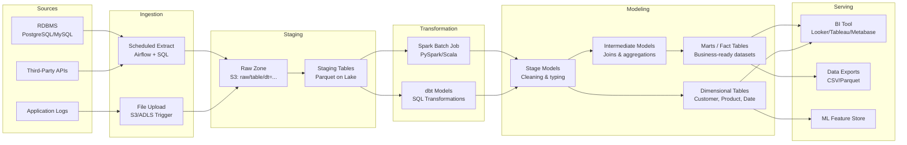

# Batch Processing

## Architecture at a Glance



## What is it?

Batch processing is the execution of data transformations on bounded, finite datasets at scheduled intervals (hourly, daily, weekly). Unlike stream processing, batch jobs operate on data that has already been collected, allowing complex transformations, multi-pass algorithms, and late-arriving data handling.

The modern batch stack centers on two dominant technologies:

- **Apache Spark** — a distributed compute engine that processes data in-memory across clusters. It provides DataFrame, SQL, RDD, and Structured Streaming APIs. Spark reads from object stores (S3, ADLS, GCS) or HDFS, executes transformations (filter, join, aggregate, window), and writes to Parquet, Delta/Iceberg/Hudi tables, or databases.

- **dbt (data build tool)** — an open-source command-line tool that transforms data inside a warehouse or lakehouse using SQL `SELECT` statements. It manages model dependencies, compiles and runs SQL with Jinja templating, generates documentation, runs data tests, and creates DAG lineage automatically. dbt operates on the ELT pattern — raw data is loaded first, transformations happen in the warehouse compute layer.

### Dimensional Modeling

Two dominant approaches for organizing transformed data:

**Kimball Star Schema (dimensional modeling)**:
- **Fact tables** — transactional, measurable events (sales, orders, clicks). Deep and wide, with foreign keys to dimension tables and numeric measures.
- **Dimension tables** — descriptive entities (customer, product, date, store). Shorter, with attributes for slicing and filtering.
- Design principle: **conformed dimensions** (shared across fact tables) and **slowly changing dimensions** (tracking attribute changes over time).
- Best for: business user self-service, BI tools, fast aggregation.

**Inmon CIF (Corporate Information Factory)**:
- A normalized **Enterprise Data Warehouse (EDW)** as the single source of truth.
- **Data marts** are built from the EDW for specific departments (sales mart, finance mart).
- Design principle: bottom-up from 3NF normalized model → dimensional marts.
- Best for: large enterprises requiring cross-department data consistency, regulatory compliance.

Most modern teams adopt **Kimball-in-lakehouse**: dimensional models built directly in SQL/dbt on the data lake, skipping the 3NF EDW layer unless regulatory constraints require it.

## Why it was created

Batch processing was created because the earliest analytical questions (and legal/regulatory reporting) required processing large volumes of data that was impractical to transform in real time. The day-end batch run has existed since the mainframe era (1960s).

In the big data era (2000s+), MapReduce and then Spark were created to batch-process petabytes across commodity hardware — a scale that single-node databases couldn't handle. Batch is inherently simpler than streaming: data is bounded, state management is straightforward (checkpoint at end of run), and failure recovery means re-running the failed partition.

dbt was created (2016) to bring software engineering best practices (testing, version control, CI/CD, documentation) to the SQL transformations that historically lived in brittle, untested scripts. It lowered the barrier for analysts to contribute to production data pipelines and made ELT the dominant pattern for cloud warehouses.

## When to use it

| Workload | Recommended Approach |
|---|---|
| Daily financial reconciliation | Batch (Spark + dbt) |
| Building dimensional models for BI | dbt with Kimball star schema |
| Large-scale joins (>1TB datasets) | Spark (distributed join) |
| Complex multi-pass ML feature engineering | Spark (iterate over data multiple times) |
| Slowly changing dimension tracking | dbt snapshots + SCD Type 2 |
| Cross-source data integration | Spark (read from multiple source types) |
| Backfilling historical data | Batch (re-process with date partitioning) |

Avoid batch when: sub-minute latency is required (use streaming), data volumes are small enough for a single-node database (use PostgreSQL/Python), or you need real-time dashboards on live events.

## Hands-on Example

### Spark Batch ETL — Orders Pipeline

```python
# spark_batch_etl.py
from pyspark.sql import SparkSession
from pyspark.sql.functions import col, to_date, sum as spark_sum, count, when, year, month
from pyspark.sql.types import StructType, StructField, LongType, DoubleType, StringType, TimestampType
import datetime as dt

spark = SparkSession.builder \
    .appName("OrdersBatchETL") \
    .config("spark.sql.sources.partitionOverwriteMode", "dynamic") \
    .getOrCreate()

# Read raw data (simulating from S3)
orders_schema = StructType([
    StructField("order_id", LongType()),
    StructField("customer_id", LongType()),
    StructField("product_id", LongType()),
    StructField("amount", DoubleType()),
    StructField("currency", StringType()),
    StructField("created_at", TimestampType()),
    StructField("status", StringType()),
])

customers_schema = StructType([
    StructField("customer_id", LongType()),
    StructField("name", StringType()),
    StructField("segment", StringType()),
    StructField("country", StringType()),
    StructField("created_at", TimestampType()),
])

# Read raw data (replace with your source path)
orders = spark.read.schema(orders_schema).parquet("s3a://data-lake/raw/orders/")
customers = spark.read.schema(customers_schema).parquet("s3a://data-lake/raw/customers/")

# Filter active orders
active_orders = orders.filter(col("status") == "completed")

# Join with customers
enriched = active_orders.join(customers, on="customer_id", how="left")

# Add derived columns
enriched = enriched.withColumn("order_date", to_date(col("created_at")))

# Convert currency — example rate table (simplified)
enriched = enriched.withColumn(
    "amount_usd",
    when(col("currency") == "EUR", col("amount") * 1.08)
    .when(col("currency") == "GBP", col("amount") * 1.25)
    .otherwise(col("amount"))
)

# Compute daily aggregations
daily_agg = enriched.groupBy("order_date", "segment").agg(
    spark_sum("amount_usd").alias("total_revenue"),
    count("order_id").alias("order_count"),
    count(when(col("amount_usd") > 100, 1)).alias("high_value_orders"),
)

# Write to partitioned Parquet (ELT target for dbt to refine)
daily_agg.write \
    .mode("overwrite") \
    .partitionBy("order_date") \
    .parquet("s3a://data-lake/staging/daily_orders/")

spark.stop()
```

### dbt Project — Models, Tests, Snapshots

```sql
-- models/staging/stg_orders.sql
-- Stage: clean and type raw orders
WITH source AS (
    SELECT * FROM {{ source('raw', 'orders') }}
),
cleaned AS (
    SELECT
        order_id,
        customer_id,
        TRY_CAST(amount AS DECIMAL(18,2)) AS amount,
        currency,
        TRY_CAST(created_at AS TIMESTAMP) AS created_at,
        status
    FROM source
    WHERE status IS NOT NULL
)
SELECT * FROM cleaned
```

```sql
-- models/marts/fct_orders.sql
-- Fact table: daily order metrics
WITH orders AS (
    SELECT * FROM {{ ref('stg_orders') }}
),
customers AS (
    SELECT * FROM {{ ref('dim_customers') }}
)
SELECT
    o.order_id,
    o.customer_id,
    c.segment,
    o.amount,
    o.currency,
    DATE(o.created_at) AS order_date,
    o.status
FROM orders o
LEFT JOIN customers c ON o.customer_id = c.customer_id
WHERE o.status = 'completed'
```

```sql
-- models/marts/dim_customers.sql
-- Slowly changing dimension Type 2
WITH customers AS (
    SELECT * FROM {{ ref('stg_customers') }}
)
SELECT
    customer_id,
    name,
    segment,
    country,
    created_at AS valid_from,
    LEAD(created_at) OVER (PARTITION BY customer_id ORDER BY created_at) AS valid_to,
    CASE
        WHEN LEAD(created_at) OVER (PARTITION BY customer_id ORDER BY created_at) IS NULL
        THEN TRUE ELSE FALSE
    END AS is_current
FROM customers
```

```yml
# schema.yml — tests
version: 2

models:
  - name: fct_orders
    description: "Daily order fact table"
    columns:
      - name: order_id
        tests:
          - unique
          - not_null
      - name: amount
        tests:
          - not_null
          - dbt_utils.accepted_range:
              min_value: 0
              max_value: 1000000
  - name: dim_customers
    columns:
      - name: customer_id
        tests:
          - unique
          - not_null
      - name: is_current
        tests:
          - accepted_values:
              values: [true, false]
```

```sql
-- snapshots/scd_customers.sql

    {{
        config(
            target_schema='snapshots',
            unique_key='customer_id',
            strategy='timestamp',
            updated_at='updated_at',
            invalidate_hard_deletes=True,
        )
    }}
    SELECT * FROM {{ ref('stg_customers') }}

```

## Best Practices

- **Partition data by date** — Partitioning by `order_date` or `ingestion_date` enables efficient backfills (rewrite one partition) and incremental processing (process only new partitions).
- **Use incremental models in dbt** — For large fact tables, use `config(materialized='incremental', unique_key='order_id', on_schema_change='sync_all_columns')` to process only new/changed rows.
- **Test every column** — Define not_null, unique, accepted_values, and custom tests for every model. Run `dbt test` in CI to prevent bad data from reaching consumers.
- **Implement SCD Type 2 carefully** — Track dimension attribute changes with valid_from/valid_to/is_current columns. Use dbt snapshots for timestamp-based or check-based tracking. Avoid SCD Type 2 on high-churn dimensions (millions of updates/day) — use SCD Type 1 (overwrite) instead.
- **Monitor small file problem** — Batch jobs that run every 5 minutes on 10 MB of data create thousands of small Parquet files. Coalesce/repartition before writes: `df.coalesce(n_files)` or use Iceberg compaction/Delta OPTIMIZE.
- **Error handling in Spark** — Set `spark.sql.files.maxPartitionBytes`, handle skew with salted keys for joins, use broadcast hints for small dimension tables (`df.join(customers.hint("broadcast"), "key")`).
- **dbt model layering** — Follow a staging → intermediate → marts naming convention. Staging: 1:1 with source tables, minimal cleaning. Intermediate: join/aggregate across staging. Marts: business-facing fact/dimension tables ready for BI.
- **Idempotent writes** — Always use `mode("overwrite")` with partition overwrite or `MERGE` statements so re-running a failed pipeline on a specific date range does not produce duplicates.

## Interview Questions

### 1. Explain Kimball star schema vs Inmon CIF. Which would you use and why?

**Answer**: **Kimball** is a bottom-up dimensional modeling approach. Data is organized into **fact tables** (measurable events — orders, clicks, transactions) linked to **dimension tables** (descriptive entities — customers, products, dates). Design starts with business processes and builds conformed dimensions shared across marts. Transformation happens first (staging), then data is loaded into a star-schema warehouse. Benefits: intuitive for business users, fast aggregation in BI tools, agile (can add a new fact table without redesigning the whole model).

**Inmon** is a top-down approach. An **enterprise data warehouse (EDW)** in 3NF is built first as the single source of truth. Departmental data marts are then derived from the EDW. Benefits: avoids data redundancy, enforces enterprise-wide consistency, supports complex cross-department queries and regulatory reporting.

**Which to choose**: Default to **Kimball** for modern data stacks. The lakehouse/cloud warehouse makes storage cheap, so some redundancy (conformed dimensions + multiple fact tables) is acceptable. Kimball is faster to deliver business value, easier for analysts to understand, and works naturally with dbt + BI tools. Choose **Inmon** only when: (1) you operate in a heavily regulated industry (banking, insurance) requiring a single auditable source of truth, (2) you have an enterprise data governance team enforcing cross-organizational data standards, or (3) you are integrating data from 50+ source systems where redundancy would cause inconsistency. Most organizations today use a hybrid: star-schema marts fed from a lightly normalized core layer (aka "hub-and-spoke" — the Data Vault approach combining Kimball and Inmon elements).

### 2. What are slowly changing dimensions (SCD)? Explain types 1 through 4 with examples.

**Answer**: SCD handles changes to dimension attributes over time (e.g., a customer moves, changes their name, or is re-segmented).

- **SCD Type 0** — No change allowed (retain original value). Used for immutable attributes (birth date, original signup timestamp).
- **SCD Type 1** — Overwrite the old value. No history preserved. Simple, cheap. Used when corrections are needed (fix a typo in a customer name) or tracking is not required.
- **SCD Type 2** — Add a new row with a new surrogate key, marking the old row as expired. Columns: `valid_from`, `valid_to`, `is_current`. Full history preserved. Most common type. Used for customer segment, address, product category. Trade-off: dimension tables grow over time; fact-to-dimension joins become more complex (need time-bounded join).
- **SCD Type 3** — Add a separate column to track the previous value (e.g., `previous_segment`, `current_segment`). Limited history (only one previous value). Simpler queries than Type 2. Used when you only need "before and after" (e.g., sales territory changes).
- **SCD Type 4** — Use a separate **history table** for all changes and keep only the current value in the main dimension table. The main table stays small (fast for frequent queries); the history table supports audit. Used when the dimension has high-churn attributes (e.g., frequently updated campaign scores).

**dbt implementation**: Use `dbt snapshots` for SCD Type 2 (timestamp or check strategy). Type 1 can be done with `MERGE` or dbt incremental models. Type 4 requires two models (current + history) with a post-hook to move old rows to history.

### 3. Design a batch pipeline that processes 500 GB of daily event data, enriches it with a 50 GB customer dimension, and outputs monthly aggregations. How would you handle failure mid-run?

**Answer Overview**: Use **Spark** reading from S3 (Parquet), performing a broadcast join for the customer dimension (50 GB is too large for default broadcast — set `spark.sql.autoBroadcastJoinThreshold` higher or use a bucketed dimension via `bucketBy`). Write intermediate daily aggregations partitioned by date, then a final Spark job to roll up monthly aggregates.

**Failure handling strategies**: (1) **Partition-level retry** — Each day's data is independent. If day 15 fails, only re-process that day. Write to a `staging.monthly_agg` table using `INSERT OVERWRITE PARTITION (order_date)` so partial months are not corrupted. (2) **Checkpointing** — Spark Structured Streaming (even in batch mode) can write manifest files tracking which files were consumed. On restart, skip already-processed files. (3) **Idempotent writes** — Use `MERGE INTO` (Delta/Iceberg) or partition-overwrite mode in Spark so replaying a failed day produces identical results. (4) **Monitoring + alerting** — Airflow retries the failed task 3 times with backoff (2 min, 5 min, 15 min). If all fail, alert on-call via PagerDuty/Slack. (5) **Reconciliation** — After successful pipeline completion, run a consistency check (row count, sum of revenue) between the source daily aggregates and the final monthly output to catch silent data loss.

## Real Company Usage

| Company | Batch Stack | Scale & Details |
|---|---|---|
| **Airbnb** | Spark + Hive → Trino + Iceberg; Airflow; dbt | 3000+ analysts; 100k+ daily pipelines; migrated to Iceberg for ACID + multi-engine access |
| **Stripe** | Snowflake + dbt + Airflow | 10k+ dbt models; 100+ TB warehouse; daily batch for financial reconciliation, risk metrics, revenue reporting |
| **Walmart** | Spark + GCP (BigQuery + Dataflow) + dbt | Processes 2.5+ PB daily; batch ETL for inventory, supply chain, sales analytics across 10k+ stores |
| **Rivian** | dbt + Snowflake + Airflow + Fivetran | Curated data marts for manufacturing quality, supply chain, vehicle telemetry; dbt tests run on every PR |
| **GitLab** | dbt + Snowflake + Airflow | Open-source data team; 4k+ dbt models; batch processes for product analytics, subscription metrics, and financial reporting |
