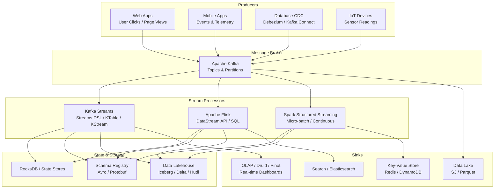

# Stream Processing

## Architecture at a Glance



## What is it?

Stream processing is the continuous, real-time processing of unbounded data as it arrives. Unlike batch processing (which operates on finite datasets at rest), stream processors react to events with sub-second to sub-minute latency, maintaining state and emitting results incrementally.

The modern stream processing ecosystem is anchored by:

- **Apache Kafka** — a distributed event store and message broker. Producers write records to **topics**, which are split into **partitions** (the unit of parallelism). Consumers read from partitions in order. Kafka provides durability (data persisted to disk), fault tolerance (replication across brokers), and exactly-once semantics (EOS) via transactional producers and consumer isolation.

- **Kafka Streams** — a lightweight Java library for building stream processing applications that run as standard JARs (no cluster needed). It provides a **Streams DSL** with operations like `filter`, `map`, `join`, `groupBy`, and `aggregate`. **KTable** represents a changelog stream (stateful, keyed). **KStream** represents a record stream (each record is independent). **State stores** (backed by RocksDB) enable stateful operations (windowing, aggregations, joins).

- **Apache Flink** — a distributed stream processing engine designed for high-throughput, low-latency, and exactly-once semantics. It uses a true streaming architecture (not micro-batching). The **DataStream API** provides typed transformations (`map`, `flatMap`, `filter`, `keyBy`, `window`, `process`). Flink supports **event time** processing with **watermarks** (a mechanism to track event-time progress and handle late data). **Checkpoints** (periodic snapshots of state) enable fault tolerance. **Savepoints** (user-triggered snapshots) enable application upgrades and scaling.

- **Apache Spark Structured Streaming** — treats streaming as an infinite DataFrame with micro-batch execution (configurable down to 500 ms). It offers a high-level API nearly identical to batch DataFrame operations. Continuous processing mode (experimental) offers sub-5ms latency.

### Streaming Patterns

| Pattern | Description | Kafka Streams | Flink | Spark Streaming |
|---|---|---|---|---|
| **Filter** | Discard records not matching a predicate | `.filter()` | `.filter()` | `.filter()` |
| **Transform** | Map each record to a new record | `.map()` / `.flatMap()` | `.map()` / `.flatMap()` | `.withColumn()` / `.select()` |
| **Join** | Combine records from two streams (windowed) | `.join()` (KStream-KStream, KStream-KTable) | `.join()` (windowed, interval) | `.join()` (watermark + timeout) |
| **Aggregate** | Compute running counts/sums per key | `.groupBy().aggregate()` | `.keyBy().window().aggregate()` | `.groupBy().agg()` |
| **Windowing** | Group events into finite buckets | Time windows, session windows | Tumbling, sliding, session, global | Tumbling, sliding, session |

### Windowing Types

- **Tumbling window** — Fixed-size, non-overlapping windows. Every event belongs to exactly one window. Example: `Stream.interval(1 minute)` calculates per-minute counts.
- **Sliding window** — Fixed-size, overlapping windows. An event can belong to multiple windows. Example: `1-hour window sliding every 5 minutes` shows a rolling hourly view updated every 5 minutes.
- **Session window** — Windows defined by periods of inactivity (gap). A session ends when no events arrive for N seconds/minutes. Useful for user behavior analysis (e.g., a user session on a website).

## Why it was created

Stream processing emerged because batch processing could not satisfy latency requirements for real-time use cases. Financial trading, fraud detection, monitoring/alerting, recommendation engines, and real-time personalization all require decisions within seconds (or milliseconds) of data arrival.

Kafka was created at LinkedIn (2011) to replace the point-to-point integration pipelines that could not scale. It introduced the **publish-subscribe log** as a durable, replayable, multi-subscriber event backbone. Kafka Streams followed (2016) as a simpler alternative to running a full cluster (like Storm or Flink) — embed stream processing directly in your app.

Flink originated from TU Berlin research (Stratosphere project) and became the dominant stream processor for workloads requiring exactly-once, high-throughput, low-latency processing with complex state management and event-time semantics. It matured as organizations moved from batch-only (Hadoop/Spark) to hybrid batch+stream architectures.

Spark Structured Streaming (2016) aimed to unify batch and streaming — if you know Spark DataFrames, you already know streaming. It trades pure latency (micro-batch vs true streaming) for simplicity and ecosystem reuse.

## When to use it

| Use Case | Recommended Technology | Justification |
|---|---|---|
| Real-time fraud detection | Flink | Complex event matching, stateful joins, sub-second latency |
| Stream enrichment (join stream with DB) | Kafka Streams | Lightweight, embeddable, KTable-KStream joins |
| Real-time dashboards (sub-minute) | Flink + Kafka + Druid | High throughput, event-time semantics, OLAP sink |
| Log aggregation / monitoring | Spark Streaming | Simple (similar to batch), micro-batch is fine for 1-min latency |
| CDC from MySQL → Data Lake | Kafka Connect + Flink/Spark | Use Kafka as log transport, Flink for upsert to lakehouse |
| User session analysis (web, mobile) | Flink (session windows) | Native session window support, event-time aware |

Avoid streaming when: batch latency (hourly/daily) is acceptable and streaming operations cost >2x batch equivalents; you lack team expertise to operate Kafka/Flink clusters; or requirements are simple enough for a Lambda/trigger-based architecture.

## Hands-on Example

### Kafka Streams — Real-time Order Enrichment

```java
// OrderEnrichment.java
import org.apache.kafka.common.serialization.Serdes;
import org.apache.kafka.streams.*;
import org.apache.kafka.streams.kstream.*;
import java.util.Properties;

public class OrderEnrichment {
    public static void main(String[] args) {
        Properties props = new Properties();
        props.put(StreamsConfig.APPLICATION_ID_CONFIG, "order-enrichment");
        props.put(StreamsConfig.BOOTSTRAP_SERVERS_CONFIG, "localhost:9092");
        props.put(StreamsConfig.DEFAULT_KEY_SERDE_CLASS_CONFIG, Serdes.String().getClass());
        props.put(StreamsConfig.DEFAULT_VALUE_SERDE_CLASS_CONFIG, Serdes.String().getClass());
        props.put(StreamsConfig.PROCESSING_GUARANTEE_CONFIG, "exactly_once_v2");

        StreamsBuilder builder = new StreamsBuilder();

        // Raw order stream: key=customer_id, value=order_json
        KStream<String, String> orders = builder.stream("raw-orders");

        // Customer table from compacted topic
        KTable<String, String> customers = builder.table("customer-profiles",
            Consumed.with(Serdes.String(), Serdes.String()));

        // Enrich each order with customer data
        KStream<String, String> enriched = orders.join(customers,
            (orderJson, customerJson) -> {
                // JSON parsing and enrichment (using Jackson or similar)
                return String.format(
                    "{\"order\": %s, \"customer\": %s}", orderJson, customerJson
                );
            });

        // Sink enriched orders to new topic
        enriched.to("enriched-orders");

        // Materialized per-minute order counts
        KTable<Windowed<String>, Long> orderCounts = orders
            .groupByKey(Grouped.with(Serdes.String(), Serdes.String()))
            .windowedBy(TimeWindows.ofSizeWithNoGrace(java.time.Duration.ofMinutes(1)))
            .count()
            .toStream()
            .toTable();

        orderCounts.toStream().to("orders-per-minute");

        KafkaStreams streams = new KafkaStreams(builder.build(), props);
        streams.start();

        Runtime.getRuntime().addShutdownHook(new Thread(streams::close));
    }
}
```

### Apache Flink — Streaming Aggregation with Windowing

```java
// OrderAggregation.java
import org.apache.flink.streaming.api.datastream.DataStream;
import org.apache.flink.streaming.api.environment.StreamExecutionEnvironment;
import org.apache.flink.streaming.api.windowing.assigners.TumblingEventTimeWindows;
import org.apache.flink.streaming.api.windowing.time.Time;
import org.apache.flink.api.common.eventtime.WatermarkStrategy;
import org.apache.flink.api.common.functions.AggregateFunction;
import org.apache.flink.api.java.tuple.Tuple2;
import java.time.Duration;

public class OrderAggregation {
    public static void main(String[] args) throws Exception {
        StreamExecutionEnvironment env = StreamExecutionEnvironment.getExecutionEnvironment();
        env.enableCheckpointing(60000);  // checkpoint every 60s

        // Read from Kafka
        DataStream<Order> orders = env
            .addSource(new FlinkKafkaConsumer<>("raw-orders",
                new OrderDeserializationSchema(), kafkaProps()))
            .assignTimestampsAndWatermarks(
                WatermarkStrategy
                    .<Order>forBoundedOutOfOrderness(Duration.ofSeconds(10))
                    .withTimestampAssigner((event, ts) -> event.getEventTime()));

        // Per-minute tumbling window aggregation
        DataStream<OrderAggregate> aggregated = orders
            .keyBy(Order::getCustomerId)
            .window(TumblingEventTimeWindows.of(Time.minutes(1)))
            .aggregate(new OrderAggregator());

        aggregated.addSink(new FlinkKafkaProducer<>("orders-agg",
            new AggregateSerializationSchema(), kafkaProps()));

        env.execute("OrderAggregationJob");
    }

    public static class OrderAggregator implements AggregateFunction<Order, Tuple2<Double, Long>, OrderAggregate> {
        @Override
        public Tuple2<Double, Long> createAccumulator() {
            return Tuple2.of(0.0, 0L);
        }

        @Override
        public Tuple2<Double, Long> add(Order order, Tuple2<Double, Long> acc) {
            return Tuple2.of(acc.f0 + order.getAmount(), acc.f1 + 1);
        }

        @Override
        public OrderAggregate getResult(Tuple2<Double, Long> acc) {
            return new OrderAggregate(acc.f0, acc.f1);
        }

        @Override
        public Tuple2<Double, Long> merge(Tuple2<Double, Long> a, Tuple2<Double, Long> b) {
            return Tuple2.of(a.f0 + b.f0, a.f1 + b.f1);
        }
    }
}
```

### Kafka Topic Setup (CLI)

```bash
# Create topics
kafka-topics --bootstrap-server localhost:9092 --create \
  --topic raw-orders \
  --partitions 6 \
  --replication-factor 3 \
  --config cleanup.policy=delete \
  --config retention.ms=604800000

kafka-topics --bootstrap-server localhost:9092 --create \
  --topic customer-profiles \
  --partitions 6 \
  --replication-factor 3 \
  --config cleanup.policy=compact \
  --config min.compaction.lag.ms=60000

# Producer with idempotence
kafka-console-producer --bootstrap-server localhost:9092 \
  --topic raw-orders \
  --producer-property enable.idempotence=true \
  --producer-property acks=all
```

## Best Practices

- **Right-size partitions** — Kafka partition count determines max parallelism. Rule of thumb: partitions = max(consumer throughput needed / per-partition throughput, broker count * 2). Too many partitions cause file handle overhead and rebalance latency.
- **Use idempotent producers** — Set `enable.idempotence=true` and `acks=all` in Kafka producers. This prevents duplicate records during producer retries without sacrificing throughput.
- **Set retention policies intentionally** — Use `cleanup.policy=delete` for event streams (data is consumed then discarded). Use `cleanup.policy=compact` for stateful KTable source topics (only keep latest value per key). Set `min.compaction.lag.ms` to ensure in-flight events are not compacted prematurely.
- **Use exactly-once semantics (EOS)** — Kafka Streams `exactly_once_v2` and Flink `EXACTLY_ONCE` checkpoints ensure no data loss or duplication. EOS has a throughput cost (~20-30%) — evaluate whether at-least-once + deduplication downstream is acceptable for your use case.
- **Handle late data in Flink** — Set `allowedLateness()` on windows to control how long late events can update results. Side-output late data via `.sideOutputLateData(outputTag)` for offline correction. Set `idleness` on watermarks to handle sources with sparse traffic.
- **Monitor consumer lag** — Use Burrow, kafdrop, or Confluent Control Center to monitor consumer lag. Alert if lag exceeds an SLA (e.g., >10 minutes). Sudden lag spikes indicate a processing bottleneck — add partitions or scale application instances.
- **State store sizing** — Kafka Streams and Flink use RocksDB for stateful operations. Monitor disk usage (RocksDB spilling to disk), configure memory limits (`state.backend.rocksdb.memory.managed`), and use key-compaction to reduce state size.
- **Avoid state skew** — Hot keys (e.g., a very popular customer_id) can overload a single partition. Use salting (append random suffix to key before grouping) or Flink's `rebalance()` to distribute load.
- **Graceful shutdown with savepoints (Flink)** — Always `stop-with-savepoint` before upgrading Flink jobs or changing parallelism. This flushes in-flight state to durable storage for fast recovery.
- **Schema evolution** — Always use Schema Registry (Avro, Protobuf) with `FORWARD` or `FULL` compatibility mode for streaming topics. Producers and consumers evolve independently without breaking.
- **Test with production traffic patterns** — Use Kafka MirrorMaker or record replay to test streaming apps against captured production traffic. Verify watermark behavior, state growth, and latency under realistic throughput.

## Interview Questions

### 1. Explain the difference between Kafka Streams KStream and KTable. When would you use each?

**Answer**: **KStream** represents a record stream — each record is an independent event. All records in a topic partition with key K arrive sequentially, but KStream has no notion of "current value" for a key. Operations like `filter()`, `map()`, and `flatMap()` process each record independently. Stateless.

**KTable** represents a **changelog** — it captures the current state for each key. For any key, only the latest value (at the time of the operation) is visible. Internally, the KTable is materialized as a state store (RocksDB). Operations like `join()` between a KStream and a KTable are keyed lookups — for each record in the stream, the KTable retrieves the current value for that key. KTable sources must be **compacted topics** (Kafka topic with `cleanup.policy=compact`) since only the latest value per key matters.

**When to use**: KStream for processing events independently (filtering, transforming, routing). KTable for sidecar data that changes infrequently (customer profiles, product catalog, reference data). The classic pattern: KStream (orders) + KTable (customers) → enriched KStream (orders with customer data). This avoids a database lookup per event — the customer data is cached in the state store local to each application instance.

### 2. What is a watermark in Apache Flink and why is it necessary?

**Answer**: A **watermark** is a mechanism for reasoning about time in an unordered, unbounded event stream. It represents Flink's estimate of "the maximum event time seen so far minus the expected lateness." Any event with a timestamp ≤ the current watermark is considered on-time (not late). Watermarks flow downstream through operators, and when an operator's watermark passes the end of a window, that window is triggered for evaluation and emitted.

**Why necessary**: In distributed systems, events arrive out of order (due to network delays, producer clock skew, or batching). Without watermarks, Flink would need to keep windows open forever waiting for late events — which is impossible for unbounded streams. Watermarks allow Flink to make progress: when the watermark reaches window_end + allowedLateness, the window is evaluated, results are emitted, and state is garbage collected.

**Configuration**: `WatermarkStrategy.forBoundedOutOfOrderness(Duration.ofSeconds(10))` assumes events arrive with up to 10 seconds of out-of-order delay. Events with timestamps below the watermark are either **dropped** or **side-output** (via `sideOutputLateData`). Choose the lateness bound carefully — too tight causes late data loss, too loose increases result latency. For CDC use cases, use `forMonotonousTimestamps()` if the source guarantees ordering (e.g., Kafka partition ordering).

### 3. Compare Kafka Streams, Apache Flink, Spark Structured Streaming, and Pulsar Functions. When would you choose each?

**Answer**:

| Feature | Kafka Streams | Apache Flink | Spark Streaming | Pulsar Functions |
|---|---|---|---|---|
| **Architecture** | Library (JAR) | Cluster (JobManager + TaskManagers) | Micro-batch on Spark cluster | Lightweight functions on Pulsar brokers |
| **Latency** | Low (milliseconds) | Very low (milliseconds) | Medium (500ms+ micro-batch) | Low (milliseconds) |
| **Exactly-once** | Yes (EOS v2) | Yes (checkpointing) | Yes (WAL + checkpoint) | Yes (via Pulsar EOS) |
| **State management** | RocksDB state stores | Managed keyed state (FS/RocksDB) | Stateful via mapGroupsWithState | Limited (Pulsar state API beta) |
| **Event-time support** | Yes (limited) | Excellent (watermarks, allowedLateness, side outputs) | Yes (watermarks in continuous mode) | Basic |
| **Windowing** | Tumbling, hopping, session | Tumbling, sliding, session, global, count | Tumbling, sliding, session | Simple sliding via Pulsar Reader |
| **Connectivity** | Kafka-only (native) | 30+ connectors (Kafka, Kinesis, JDBC, HDFS) | Kafka, Kinesis, files, sockets | Pulsar-only (native connectors) |
| **Operational overhead** | Minimal (run as JVM process) | High (YARN/K8s cluster + job management) | Medium (Spark cluster) | Low (embedded in Pulsar) |
| **Batch/stream unification** | Stream-only | Batch + stream (same APIs) | Yes (same DataFrame API) | Stream-only |

**Choosing**:
- **Kafka Streams** when: you are already on Kafka, want minimal ops (no separate cluster), and your processing is Kafka-to-Kafka (enrichment, transformation, routing).
- **Flink** when: you need the lowest latency, complex event-time semantics, massive state (GB/TB scales), exactly-once guarantees, or a unified batch+stream engine.
- **Spark Streaming** when: your team is already proficient in Spark, you are okay with micro-batch latency (1-5 min), and you want to share code/components with your batch pipeline.
- **Pulsar Functions** when: you are on Apache Pulsar and need simple, lightweight per-message processing (filter, transform, fan-out) without managing a separate stream processor.

## Real Company Usage

| Company | Streaming Stack | Scale & Details |
|---|---|---|
| **Netflix** | Apache Kafka + Flink + Iceberg | 250M+ accounts; 1.5 PB/day streamed events; Flink for real-time AB testing, recommendation scoring, and fraud detection; Kafka as the event backbone for all microservices |
| **Uber** | Apache Kafka + Flink + Hudi | 100+ PB data; Flink powers real-time pricing (surge), driver matching, and ETA computation; Kafka handles 10M+ events/sec across 200+ microservices |
| **LinkedIn** | Apache Kafka (creator) + Kafka Streams + Samza | 1B+ members; Kafka original creators; Samza for stream processing at massive scale (profile views, feed ranking, notifications); migrated many workloads to Kafka Streams |
| **Pinterest** | Apache Kafka + Flink + MemQ | 500M+ monthly users; Flink for real-time ad delivery optimization, content recommendation, and abuse detection; Kafka stores 100T+ events/day |
| **Stripe** | Apache Kafka + Flink | Processes millions of payment events daily; Flink for real-time fraud detection (transaction scoring), risk monitoring, and payment lifecycle processing; sub-100ms decision latency |

