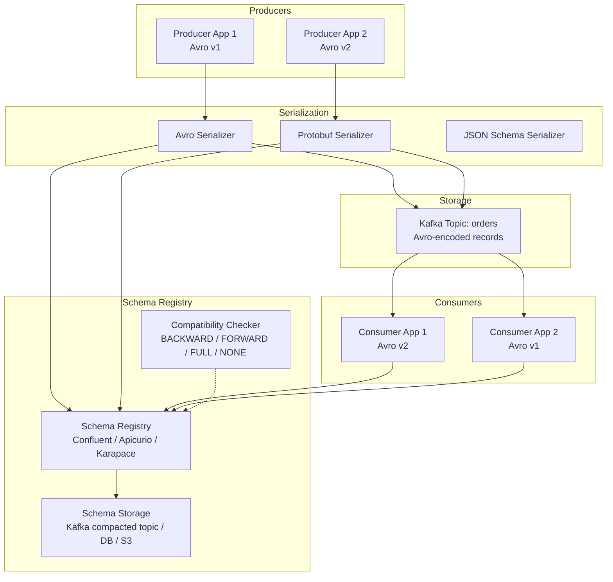

# Schema Registry & Schema Evolution

## Architecture at a Glance



## What is it?

A **Schema Registry** is a centralized service that stores, manages, and validates schemas for data serialization formats (Avro, Protobuf, JSON Schema). Producers and consumers register schemas and retrieve them to encode/decode records, ensuring that data written by any producer can be read by any consumer regardless of when they were deployed.

Schema Registries solve a critical distributed data problem: **how do producers and consumers agree on the shape of data when they evolve independently?**

In streaming systems (Kafka, Pulsar), records are self-contained bytes. Without schema management:
- A producer adds a field; consumers that don't know about it crash with deserialization errors.
- A producer removes a field; consumers expecting it process garbage or fail.
- Different environments (dev, staging, prod) use different schemas, causing silent data corruption during testing.

The registry enforces **compatibility rules** so that schema changes are safe and forward/backward compatible.

### Components

| Component | Role |
|---|---|
| **Subject** | A named scope for schema evolution (typically `<topic>-value`, `<topic>-key`) |
| **Schema** | The type definition (Avro `.avsc`, Protobuf `.proto`, JSON Schema) |
| **Compatibility Mode** | Rule that determines whether a new schema is compatible with existing schemas |
| **Schema ID** | Unique integer identifier assigned by the registry and embedded in each serialized record |
| **Serializer/Deserializer** | Client library that fetches schema by ID, serializes/deserializes data |

### Supported Formats

| Format | Strengths | Weaknesses |
|---|---|---|
| **Apache Avro** | Compact binary; rich schema evolution (full set of compatibility modes); wide ecosystem support | Requires schema to deserialize; verbose JSON schema syntax |
| **Protocol Buffers** | Compact binary; well-typed; excellent backward compat by design; strong typing with proto3 | Schema evolution is more restrictive (no field rename, limited default values) |
| **JSON Schema** | Human-readable; no serialization necessary (plain JSON); familiar to web developers | Larger payload size; no native binary format; slower parsing |

## Why it was created

Schema Registry was created to solve the **impedance mismatch** between producers and consumers in distributed streaming systems. In the early Kafka era (pre-2015), teams used JSON or ad-hoc serialization. A producer would add a field; consumers would silently fail. Or a schema change required a coordinated rollout — "stop all producers, stop all consumers, upgrade, restart" — which defeated the purpose of a streaming platform (independent, decoupled services).

Confluent Schema Registry (2015) introduced the concept of **subject + compatibility mode**: schemas evolve through versions, and the registry validates compatibility before accepting a new version. This allowed:
- **Independent deploys** — producers upgrade first, consumers upgrade later (BACKWARD) or vice versa (FORWARD).
- **Schema discovery** — consumers fetch the schema from the registry, so they never need to be configured with it.
- **Contract enforcement** — breaking changes are rejected at registration time, not at read time.

Apicurio and Karapace emerged as open-source alternatives — Apicurio adds a full API management layer, rules engine, and multi-tenancy; Karapace provides a lightweight, drop-in Confluent-compatible registry.

## When to use it

| Scenario | Recommendation |
|---|---|
| Any Kafka deployment with >1 producer or consumer | Mandatory (Confluent SR, Apicurio, or Karapace) |
| Streaming data shared across teams | Use with Avro + BACKWARD or FULL compatibility |
| Event-driven microservices (async communication) | Schema Registry as the single source of truth for contracts |
| Long-lived data (events stored in Kafka for months) | Schema evolution (schemas change, old data must remain readable) |
| CDC pipeline (Debezium + Kafka) | Use Avro + Schema Registry — Debezium has first-class support |
| Small team, single application | Optional — can hard-code schema in serializer/deserializer |
| Protobuf-based systems | Schema Registry for Protobuf (Confluent SR 6.0+, Apicurio) |

## Hands-on Example

### Avro Schema + Confluent Schema Registry + Kafka Producer/Consumer

**Step 1: Define Avro schema**

```json
// order.avsc
{
  "type": "record",
  "name": "Order",
  "namespace": "com.example",
  "fields": [
    {"name": "order_id", "type": "long"},
    {"name": "customer_id", "type": "long"},
    {"name": "amount", "type": "double"},
    {"name": "currency", "type": "string", "default": "USD"},
    {"name": "status", "type": "string", "default": "pending"}
  ]
}
```

**Step 2: Producer with Avro + Schema Registry**

```java
// OrderProducer.java
import io.confluent.kafka.serializers.KafkaAvroSerializer;
import io.confluent.kafka.serializers.AbstractKafkaSchemaSerDeConfig;
import org.apache.kafka.clients.producer.*;
import org.apache.kafka.common.serialization.LongSerializer;
import java.util.Properties;

public class OrderProducer {
    private static final String SCHEMA_REGISTRY_URL = "http://localhost:8081";
    private static final String BOOTSTRAP_SERVERS = "localhost:9092";
    private static final String TOPIC = "orders-avro";

    public static void main(String[] args) {
        Properties props = new Properties();
        props.put(ProducerConfig.BOOTSTRAP_SERVERS_CONFIG, BOOTSTRAP_SERVERS);
        props.put(ProducerConfig.KEY_SERIALIZER_CLASS_CONFIG, LongSerializer.class.getName());
        props.put(ProducerConfig.VALUE_SERIALIZER_CLASS_CONFIG, KafkaAvroSerializer.class.getName());
        props.put(AbstractKafkaSchemaSerDeConfig.SCHEMA_REGISTRY_URL_CONFIG, SCHEMA_REGISTRY_URL);
        props.put(ProducerConfig.ENABLE_IDEMPOTENCE_CONFIG, true);
        props.put(ProducerConfig.ACKS_CONFIG, "all");

        // Auto-register schema (or point to pre-registered schema ID)
        props.put(AbstractKafkaSchemaSerDeConfig.AUTO_REGISTER_SCHEMAS, true);

        KafkaProducer<Long, Order> producer = new KafkaProducer<>(props);

        // Send sample orders
        for (long i = 0; i < 100; i++) {
            Order order = Order.newBuilder()
                .setOrderId(i)
                .setCustomerId(i % 1000)
                .setAmount(100.0 * (i % 10 + 1))
                .setCurrency("USD")
                .setStatus(i % 3 == 0 ? "pending" : "completed")
                .build();

            ProducerRecord<Long, Order> record =
                new ProducerRecord<>(TOPIC, order.getCustomerId(), order);

            producer.send(record, (metadata, exception) -> {
                if (exception != null) {
                    System.err.println("Send failed: " + exception.getMessage());
                }
            });
        }

        producer.flush();
        producer.close();
    }
}
```

**Step 3: Consumer with Avro + Schema Registry**

```java
// OrderConsumer.java
import io.confluent.kafka.serializers.KafkaAvroDeserializer;
import io.confluent.kafka.serializers.AbstractKafkaSchemaSerDeConfig;
import org.apache.kafka.clients.consumer.*;
import org.apache.kafka.common.serialization.LongDeserializer;
import java.time.Duration;
import java.util.List;
import java.util.Properties;

public class OrderConsumer {
    private static final String SCHEMA_REGISTRY_URL = "http://localhost:8081";
    private static final String BOOTSTRAP_SERVERS = "localhost:9092";
    private static final String GROUP_ID = "order-consumer-v2";
    private static final String TOPIC = "orders-avro";

    public static void main(String[] args) {
        Properties props = new Properties();
        props.put(ConsumerConfig.BOOTSTRAP_SERVERS_CONFIG, BOOTSTRAP_SERVERS);
        props.put(ConsumerConfig.GROUP_ID_CONFIG, GROUP_ID);
        props.put(ConsumerConfig.KEY_DESERIALIZER_CLASS_CONFIG, LongDeserializer.class.getName());
        props.put(ConsumerConfig.VALUE_DESERIALIZER_CLASS_CONFIG, KafkaAvroDeserializer.class.getName());
        props.put(AbstractKafkaSchemaSerDeConfig.SCHEMA_REGISTRY_URL_CONFIG, SCHEMA_REGISTRY_URL);
        props.put(ConsumerConfig.AUTO_OFFSET_RESET_CONFIG, "earliest");
        props.put(ConsumerConfig.ENABLE_AUTO_COMMIT_CONFIG, false);

        // Specific Avro record
        props.put(KafkaAvroDeserializerConfig.SPECIFIC_AVRO_READER_CONFIG, true);

        KafkaConsumer<Long, Order> consumer = new KafkaConsumer<>(props);
        consumer.subscribe(List.of(TOPIC));

        try {
            while (true) {
                ConsumerRecords<Long, Order> records = consumer.poll(Duration.ofMillis(100));
                for (ConsumerRecord<Long, Order> record : records) {
                    Order order = record.value();
                    System.out.printf("Order: id=%d, customer=%d, amount=%.2f %s, status=%s%n",
                        order.getOrderId(), order.getCustomerId(),
                        order.getAmount(), order.getCurrency(),
                        order.getStatus());
                }
                consumer.commitSync();
            }
        } finally {
            consumer.close();
        }
    }
}
```

**Step 4: Evolve schema (add address field)**

```json
// order-v2.avsc
{
  "type": "record",
  "name": "Order",
  "namespace": "com.example",
  "fields": [
    {"name": "order_id", "type": "long"},
    {"name": "customer_id", "type": "long"},
    {"name": "amount", "type": "double"},
    {"name": "currency", "type": "string", "default": "USD"},
    {"name": "status", "type": "string", "default": "pending"},
    {"name": "shipping_address", "type": "string", "default": ""}
  ]
}
```

Register with `BACKWARD` compatibility — new schema can read old data (because new field has a default).

```bash
# Register schema via REST API
curl -X POST http://localhost:8081/subjects/orders-avro-value/versions \
  -H "Content-Type: application/vnd.schemaregistry.v1+json" \
  -d '{
    "schema": "{...order-v2.avsc...}",
    "schemaType": "AVRO"
  }'
```

### Compatibility Check via REST

```bash
# Test compatibility before registering
curl -X POST http://localhost:8081/compatibility/subjects/orders-avro-value/versions/latest \
  -H "Content-Type: application/vnd.schemaregistry.v1+json" \
  -d '{
    "schema": "{...new schema...}",
    "schemaType": "AVRO"
  }'
# Response: {"is_compatible": true}
```

## Best Practices

- **Start with BACKWARD or FULL compatibility** — BACKWARD means old consumers can read data written with a new schema. FULL means both directions. These are the most permissive for rolling upgrades. NONE should be reserved for development only.
- **Always set defaults** — When adding a field in Avro, provide a `default` value. Consumers using the old schema will use the default for the missing field. In Protobuf, all new fields must be optional (proto3 default behavior).
- **Use `AUTO_REGISTER_SCHEMAS=false` in production** — Register schemas upfront via CI/CD pipeline or Terraform. Auto-registration in production can accidentally register a malformed schema or create a subject for a misspelled topic name.
- **Never change field types** — Changing a field's type (int → long, string → enum) is almost always a breaking change. If you need a different type, add a new field with a new name and deprecate the old one.
- **Do not delete fields** — Instead, mark them as deprecated. In Avro, you can drop a field only if it has a default — but schemas are often shared across teams and topics. Deprecating is safer.
- **Rename fields with caution** — Avro allows field aliases, enabling older readers to find fields by the old name. Protobuf does not support renaming (field numbers are the stable identifier). JSON Schema references by path.
- **Use subject naming strategy** — Configure `subject.name.strategy` (TopicNameStrategy, RecordNameStrategy, TopicRecordNameStrategy) to control how schemas map to subjects. The default (TopicNameStrategy) creates one subject per topic-value or topic-key, which works for most teams.
- **Version your data contracts** — Along with schema version in the registry, include a human-readable version in the record metadata or as a header field. This helps debugging when tracing records through multiple hops.
- **Set compatibility before production data exists** — Changing compatibility mode on a subject with live data can cause existing consumers to fail. Set it when the subject is created.
- **Monitor schema registry** — Track the number of subjects, schemas per subject, and write/read request rates. High version counts (1000+ per subject) indicate schema churn — batch changes instead.
- **Back up schema registry** — The registry is a critical service. Confluent SR stores schemas in a Kafka compacted topic (`_schemas`). Ensure this topic has sufficient retention and is backed up. Apicurio supports DB and Kafka storage backends.

## Interview Questions

### 1. Explain the compatibility modes BACKWARD, FORWARD, and FULL in Confluent Schema Registry with examples.

**Answer**:

- **BACKWARD** (default): A new schema is compatible if it can read data written with the **most recent previous schema**. This means new consumers using the latest schema can read data from old producers. What's allowed: adding a field with a default; removing a field that has a default; changing a default value. Not allowed: removing a field without a default; adding a field without a default; changing a field type. Use case: you deploy new consumers first, old producers remain unchanged. The new consumer needs to handle (with defaults) records that were produced before the schema change.

- **FORWARD**: A new schema is compatible if data written with the **new schema** can be read by consumers using the **most recent previous schema**. This means old consumers can read data from new producers. What's allowed: removing a field (old consumer ignores it); adding a field without a default (old consumer won't see it — but must not crash). Not allowed: adding a new required field (old consumer expects it); removing a required field. Use case: you deploy new producers first, old consumers read their data. Old consumers simply ignore fields they don't know about.

- **FULL**: Combines both. A new schema is compatible if it is **both BACKWARD and FORWARD** compatible with the most recent previous schema. The intersection of the two rules. Essentially, you can only add/remove fields that have defaults. Use case: you need both old producers and old consumers to work simultaneously with the new schema — the strictest mode.

The transitive variants (`BACKWARD_TRANSITIVE`, `FORWARD_TRANSITIVE`, `FULL_TRANSITIVE`) check compatibility against **all** previous schema versions, not just the latest. Use these for long-lived topics where any consumer may need to read data written by any prior schema version.

### 2. You're designing a Kafka event system for an e-commerce platform. How do you handle a schema change where a new field (shipping_address) must be added to the Order event? Describe the rollout.

**Answer**:

1. **Add the field with a default**. `"name": "shipping_address", "type": "string", "default": ""` — empty string default ensures backward compatibility.

2. **Set compatibility to `BACKWARD_TRANSITIVE`** on the subject (if not already). This ensures the new schema can read all historical data (including data written before the field existed).

3. **Register the new schema version** via CI/CD (not auto-register). Validate with `POST /compatibility/subjects/orders-value/versions/latest` first.

4. **Rollout consumers first**. Deploy all consumer services with the updated Avro schema. Since compatibility is BACKWARD, new consumers can read data written by old producers (shipping_address will be empty string). Old consumers that haven't been updated still work because the schema is physically unchanged on their end (they use a cached older schema).

5. **Rollout producers** after consumers are stable and verified. New producers start sending events with actual shipping_address values. Old consumers (if any remain) will ignore the field — they deserialize only the fields they know about.

6. **Gradually remove old consumer instances**. Once all consumers are on the new version, the field is fully active.

7. **Optional**: After all consumers are upgraded, you could drop the default if you're confident every future event will have a non-empty shipping_address. But keeping the default is harmless and provides a safety net for late-arriving data from legacy systems.

### 3. How does Schema Registry embed the schema in Kafka records? Why is this approach chosen over embedding the full schema in each record?

**Answer**: Schema Registry uses a **schema ID** embedded in each record, rather than the full schema. The wire format varies by implementation, but Confluent's standard Avro format uses the first 4 bytes as a magic byte (0x00) followed by a 4-byte integer schema ID (big-endian), then the Avro-encoded binary payload:

```
[0x00][schema_id: int32][avro_payload]
```

**Why schema ID instead of full schema**:

- **Size efficiency**: A schema can be 500+ bytes (or more with documentation). Embedding it in every record would add massive overhead — for small events (order_id, amount), the schema bytes could exceed the payload. With schema ID (4 bytes on wire), overhead is fixed at 5 bytes.
- **Performance**: Serializers cache schema ID → deserializer mapping locally after first fetch. Subsequent records of the same schema avoid any registry call — just the 5-byte header overhead.
- **Schema governance**: The registry is the single source of truth. If a schema ever needed to be deprecated or migrated, the registry controls the transition, not every producer/consumer.
- **Schema versioning**: A consumer reads the schema ID from the record, fetches the exact schema version (including the logic to read old formats). Even if the consumer is compiled with a newer schema, it can request the specific version used to write the record.

The trade-off: Schema Registry becomes a dependency for deserialization. If the registry is down and the schema is not cached, deserialization fails. Mitigations: (1) local schema caching (LRU cache with fallback to local file), (2) redundant registry deployment (HA cluster of 3+ nodes), (3) Kafka's compacted `_schemas` topic as the ultimate persistent store. Karapace and Apicurio provide the same wire-format compatibility for this reason.

## Real Company Usage

| Company | Schema Registry | Scale & Details |
|---|---|---|
| **LinkedIn** | Internal Schema Registry (Espresso) → Confluent Schema Registry | 1B+ members; 100k+ schema subjects; Avro-based; pioneered many of the compatibility rules now standard in Confluent SR |
| **Uber** | Ringpop-based Schema Registry, later Confluent SR | 100+ PB data; thousands of Avro schemas; tight integration with Kafka and Hudi for CDC pipelines; enforces FULL_TRANSITIVE on critical event types |
| **Salesforce** | Apicurio + Kafka | Internal event mesh with 10k+ subjects; Protobuf-first; multi-tenant schema registry with team-level access control (Apicurio rules engine) |
| **Zalando** | Confluent Schema Registry + Nakadi (event broker) | 200+ microservices; Avro schemas with mandatory documentation; enforced BACKWARD_TRANSITIVE compatibility on all event types; automated schema migration in CI/CD |
| **Confluent (internal)** | Confluent Schema Registry | 10k+ subjects in production; powers their own cloud (Confluent Cloud) with multi-tenant registry; 99.99% availability SLA on schema fetch operations |
