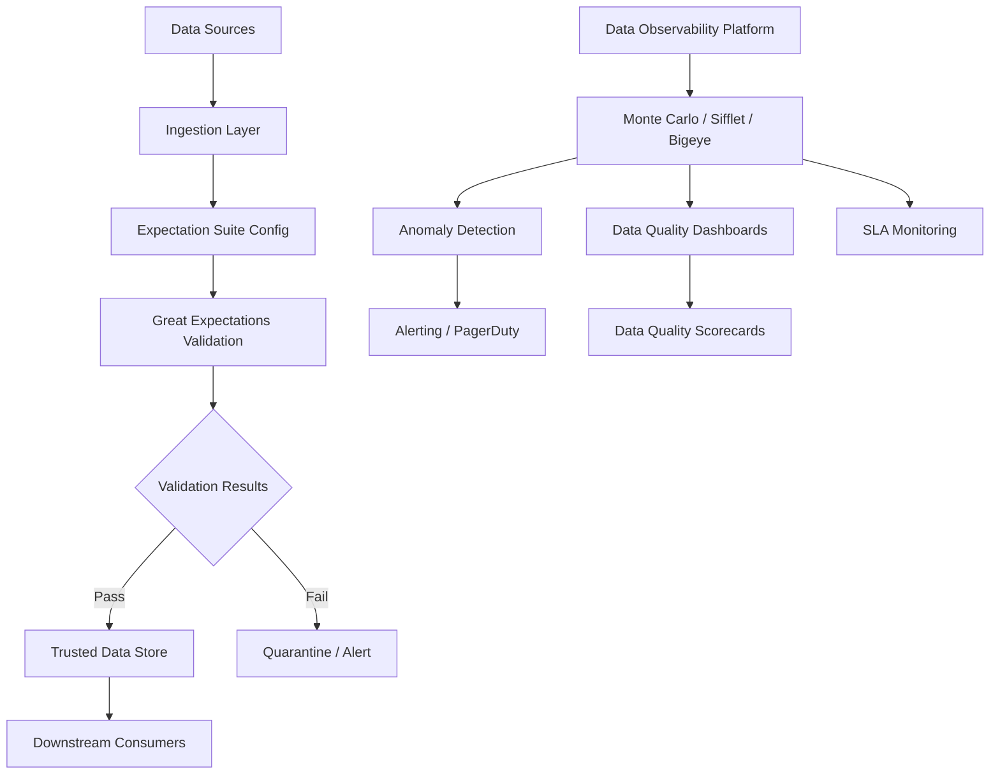

# Data Quality

## Architecture at a Glance



## What is it?

Data quality is the practice of measuring, monitoring, and improving the fitness of data for its intended use. It spans six core dimensions — completeness, accuracy, timeliness, consistency, uniqueness, and validity — and is operationalized through tools like Great Expectations, dbt tests, and data observability platforms (Monte Carlo, Sifflet, Bigeye).

## Why it was created

As data ecosystems grow, bad data costs organizations millions in poor decisions, rework, and lost trust. Data quality frameworks were created to provide systematic, automated guardrails that catch data issues before they reach consumers, establish SLAs, and give teams confidence in their data assets.

## When to use it

- Any data pipeline with downstream business decisions or ML models
- Regulatory environments requiring data lineage and audit trails (HIPAA, SOX, GDPR)
- Migration or consolidation of data sources where schema drift is common
- Teams scaling data operations beyond manual SQL-based validation

## Hands-on Example: Great Expectations Integration in a dbt Pipeline

**File: `greatexpectations/suite.json`**
```json
{
  "data_asset_type": "Dataset",
  "expectation_suite_name": "orders_suite",
  "expectations": [
    {
      "expectation_type": "expect_column_values_to_not_be_null",
      "kwargs": { "column": "order_id" }
    },
    {
      "expectation_type": "expect_column_values_to_be_unique",
      "kwargs": { "column": "order_id" }
    },
    {
      "expectation_type": "expect_column_values_to_be_between",
      "kwargs": { "column": "order_amount", "min_value": 0, "max_value": 100000 }
    },
    {
      "expectation_type": "expect_column_value_lengths_to_be_between",
      "kwargs": { "column": "email", "min_value": 5, "max_value": 254 }
    }
  ]
}
```

**File: `dbt/tests/generic/test_great_expectations.py`**
```python
import great_expectations as ge
import pandas as pd
from dbt.contracts.connection import AdapterResponse

def test_great_expectations_quality(analytics, orders):
    df = pd.DataFrame(orders)
    ge_df = ge.dataset.PandasDataset(df)

    assert ge_df.expect_column_values_to_not_be_null("order_id").success
    assert ge_df.expect_column_values_to_be_unique("order_id").success
    assert ge_df.expect_column_values_to_be_between(
        "order_amount", min_value=0, max_value=100000
    ).success
    assert ge_df.expect_column_values_to_be_in_set(
        "status", ["pending", "shipped", "delivered", "cancelled"]
    ).success
```

**File: `great_expectations/checkpoints/orders_checkpoint.yml`**
```yaml
name: orders_checkpoint
config_version: 1.0
module_name: great_expectations.checkpoint
class_name: SimpleCheckpoint
validation_operator_name: action_list_operator
batches:
  - batch_kwargs:
      path: data/orders.parquet
      datasource: orders_datasource
      data_asset_name: orders
expectation_suite_name: orders_suite
action_list:
  - name: store_validation_result
    action:
      class_name: StoreValidationResultAction
  - name: update_data_docs
    action:
      class_name: UpdateDataDocsAction
```

**Scheduling Checkpoint in Airflow**
```python
from airflow import DAG
from airflow.operators.bash import BashOperator
from datetime import datetime

with DAG("data_quality_check", start_date=datetime(2025,1,1), schedule="@daily") as dag:
    run_ge = BashOperator(
        task_id="run_great_expectations",
        bash_command="cd /data && great_expectations checkpoint run orders_checkpoint",
    )
```

## Best Practices

- Implement data quality tests at every layer of the pipeline (source -> staging -> warehouse -> mart)
- Use a single source of truth for expectation suites that lives in version control
- Set up automated alerting (Slack, PagerDuty) on validation failures with severity levels
- Build a data quality SLA dashboard tracking freshness, volume, and pass rates per table
- Profile source data on ingestion to detect schema drift before it breaks downstream models
- Combine Great Expectations row-level validation with dbt model-level tests for defense-in-depth
- Establish data SLAs (e.g., "orders table must refresh by 7 AM with >99.5% completeness")
- Anomaly detection should flag both sudden drops/spikes and gradual drift in quality metrics
- Regularly review and prune stale expectations; tie each expectation to a business rule

## Interview Questions

**Q1: How do you distinguish between data quality dimensions and which dimension is hardest to enforce?**

Completeness measures whether all required data is present (null checks, row counts). Accuracy measures correctness against a source of truth. Timeliness measures latency from event to availability. Consistency ensures values agree across systems. Uniqueness ensures no duplicate records. Validity checks that data conforms to a schema or domain. Timeliness is often hardest because it requires end-to-end pipeline monitoring and SLAs that cross system boundaries, while validity is the easiest to enforce with schema-on-write constraints.

**Q2: Design a data quality monitoring system for a real-time streaming pipeline producing 10k events/second.**

Use a streaming observability pattern: push events through a lightweight validation layer (e.g., Apache Kafka + Kafka Streams with Great Expectations on mini-batches). Emit quality metrics as a sidecar stream to a time-series DB (Prometheus) for real-time dashboards (Grafana). Configure sliding-window anomaly detection (10 min windows) for volume drop-offs and schema evolution alerts. Store raw validation failures in a DLQ for replay. Complement with a batch observability tool like Monte Carlo for historical trend analysis and lineage.

**Q3: How would you implement a data quality SLA across multiple teams owning different data products?**

Define a company-wide data quality contract specifying dimensions (freshness, completeness, volume, pass rate) per data product tier (Tier 1: critical, Tier 2: important, Tier 3: best-effort). Each team owns an expectation suite and checkpoint. A central data observability platform aggregates all validation results, computes SLA attainment per tier, and publishes a scorecard. Enforce via governance: Tier 1 data must maintain >99% pass rate over a 7-day rolling window or pipelines are auto-paused and on-call is paged.

## Real Company Usage

| Company | Tool(s) | Use Case |
|---------|---------|----------|
| Snowflake | Great Expectations + dbt | Validate all ingested customer data before materializing in production marts |
| DoorDash | Monte Carlo | Anomaly detection on 10TB+ event data to catch freshness and volume anomalies |
| HelloFresh | Sifflet | Data quality scorecards across 50+ data products with automated lineage-based impact analysis |
