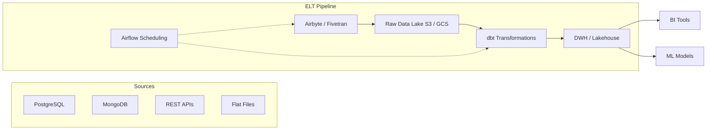

# ETL / ELT Pipelines

## Architecture at a Glance



## What is it?

ETL (Extract, Transform, Load) and ELT (Extract, Load, Transform) are architectural patterns for moving data from source systems into analytics platforms. ETL transforms data before loading (typically in a staging area), while ELT loads raw data first and transforms in the target warehouse, leveraging cloud-scale compute. Modern pipelines use tools like Airbyte for extraction/loading, dbt for transformation, and Airflow for orchestration.

## Why it was created

Traditional ETL was designed when storage was expensive and databases lacked compute for large-scale transforms. ELT emerged with cloud data warehouses (Snowflake, BigQuery, Redshift) that decouple storage and compute, making it cheaper to land raw data and transform on-demand. Airbyte, Fivetran, and Stitch were created to simplify the "E" and "L" — thousands of connector integrations that previously required custom scripts.

## When to use it

- ELT: Cloud-native warehouses, massive raw data volumes, schema-on-read analytics, data science workloads
- ETL: On-prem databases, limited warehouse compute, strict data masking before load, IoT edge scenarios
- Use Airbyte/Fivetran when you need 100+ source connectors with CDC support
- Use dbt for any SQL-native transformation layer that needs version control, testing, and docs

## Hands-on Example: Building an Airbyte-to-dbt Pipeline

**Step 1: Configure Airbyte source (PostgreSQL CDC)**

File: `airbyte/source_config.json`
```json
{
  "sourceType": "postgres",
  "host": "prod-db.example.com",
  "port": 5432,
  "database": "ecommerce",
  "schemas": ["public"],
  "username": "airbyte",
  "replication_method": {
    "method": "CDC",
    "plugin": "pgoutput",
    "replication_slot": "airbyte_slot",
    "publication": "airbyte_publication"
  }
}
```

**Step 2: Configure Airbyte destination (S3 Parquet)**

File: `airbyte/destination_config.json`
```json
{
  "destinationType": "s3",
  "bucket": "data-lake-raw",
  "bucketPath": "airbyte/{namespace}/{stream}/",
  "format": {
    "format_type": "Parquet",
    "compression_codec": "snappy"
  },
  "s3_bucket_region": "us-east-1",
  "streams": [
    {"name": "orders", "sync_mode": "incremental_append"},
    {"name": "customers", "sync_mode": "incremental_append"}
  ]
}
```

**Step 3: dbt model — staging layer**

File: `dbt/models/staging/stg_orders.sql`
```sql
WITH source AS (
    SELECT * FROM {{ source('airbyte', 'orders') }}
),

renamed AS (
    SELECT
        id AS order_id,
        customer_id,
        order_date,
        status,
        amount,
        _airbyte_emitted_at
    FROM source
    WHERE _airbyte_emitted_at >= '2025-01-01'
)

SELECT * FROM renamed
```

**Step 4: dbt model — mart layer**

File: `dbt/models/marts/daily_orders.sql`
```sql
{{
    config(
        materialized='incremental',
        unique_key='order_id',
        incremental_strategy='merge'
    )
}}

SELECT
    DATE(order_date) AS order_day,
    COUNT(DISTINCT order_id) AS order_count,
    SUM(amount) AS revenue,
    COUNT(DISTINCT customer_id) AS active_customers
FROM {{ ref('stg_orders') }}

    WHERE order_date >= (SELECT MAX(order_date) FROM {{ this }})

GROUP BY 1
```

**Step 5: dbt project config**

File: `dbt/dbt_project.yml`
```yaml
name: ecommerce_pipeline
profile: snowflake
model-paths: ["models"]
sources:
  airbyte:
    database: raw
    schema: airbyte_public
    tables:
      - name: orders
      - name: customers

models:
  ecommerce_pipeline:
    staging:
      +materialized: view
      +schema: staging
    marts:
      +materialized: incremental
      +schema: marts
```

**Step 6: Airflow DAG to orchestrate**

File: `dags/airbyte_dbt_pipeline.py`
```python
from airflow import DAG
from airflow.providers.airbyte.operators import AirbyteTriggerSyncOperator
from airflow.operators.bash import BashOperator
from datetime import datetime, timedelta

with DAG(
    "airbyte_dbt_pipeline",
    start_date=datetime(2025, 1, 1),
    schedule="0 6 * * *",
    catchup=False,
) as dag:

    sync_orders = AirbyteTriggerSyncOperator(
        task_id="sync_orders",
        airbyte_conn_id="airbyte_default",
        connection_id="abc-123-orders",
    )

    sync_customers = AirbyteTriggerSyncOperator(
        task_id="sync_customers",
        airbyte_conn_id="airbyte_default",
        connection_id="def-456-customers",
    )

    run_dbt = BashOperator(
        task_id="run_dbt",
        bash_command="cd /dbt && dbt run --models marts",
    )

    [sync_orders, sync_customers] >> run_dbt
```

## Best Practices

- Use CDC (Change Data Capture) for sources where minimal latency and low load on the source DB is required
- Prefer incremental over full-refresh syncs for large tables; always define a cursor field
- Keep raw data immutable in the landing zone — never transform in-place
- Organize dbt models in layers (staging, intermediate, marts) with clear naming conventions (`stg_`, `int_`, `fct_`, `dim_`)
- Use dbt source freshness tests to alert when upstream data stops arriving
- Run dbt tests (`unique`, `not_null`, `accepted_values`, `relationships`) alongside tests
- Set up data contracts between source owners and pipeline teams for schema changes
- Monitor Airbyte connector health and re-sync failures automatically
- Budget cloud costs: Airbyte on Kubernetes, dbt Cloud or self-hosted, Airflow on Astronomer/Amazon MWAA

## Interview Questions

**Q1: Compare ELT vs ETL. When would you choose one over the other?**

ELT loads raw data into the warehouse first and transforms using SQL at query time. It leverages modern warehouse compute, enables schema-on-read, and allows reprocessing historical data without re-extraction. ETL transforms before loading, which reduces warehouse storage and compute costs but introduces transformation coupling — schema changes require pipeline changes. Choose ETL for on-prem environments, sensitive data that must be masked before landing, or IoT scenarios with limited compute at the destination. Choose ELT for cloud data warehouses, data science workloads requiring raw access, and teams that want SQL-based transformations with git workflows.

**Q2: How would you handle schema drift in an Airbyte-to-dbt pipeline using CDC?**

Use Airbyte's schema change management options: block (fail on new columns), propagate (add columns automatically), or manual review. For production, combine "propagate" with an automated dbt CI job that detects new columns in the raw data, generates `ALTER TABLE` DDL, and updates the staging model. Run `dbt run --full-refresh` on staging when columns change. Optionally configure Airbyte to send new columns as JSON in a variant column, then parse with a dbt macro. Always alert a human when schema drift is detected outside known patterns.

**Q3: Compare Fivetran, Airbyte, and Stitch across cost, connector ecosystem, and operational complexity.**

Fivetran is managed, has 300+ connectors, offers column-level lineage, and handles historical backfills well — but costs can scale quickly with row consumption. Airbyte is open-source, community-driven with 200+ connectors, self-hostable (Kubernetes), and supports custom connector building — operational overhead is higher but costs are predictable. Stitch is simpler with 130+ connectors and a straightforward pricing model, but has less frequent connector updates and no native CDC for most sources. For an organization with 10+ sources and strict CDC requirements, Airbyte self-hosted or Fivetran is preferred over Stitch.

## Real Company Usage

| Company | Tools | Use Case |
|---------|-------|----------|
| Figma | Airbyte + dbt + Snowflake | Sync production PostgreSQL via CDC to Snowflake; dbt for product analytics models |
| Canva | Fivetran + dbt + BigQuery | 200+ connectors for marketing, product, and finance data transformed in BigQuery |
| SeatGeek | Airbyte (OSS) + dbt + Redshift | Custom connector builder for ticketing APIs; dbt for attribution and revenue models |
