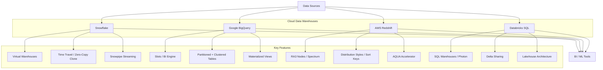

# Data Warehousing

## Architecture at a Glance



## What is it?

A data warehouse is a centralized repository optimized for analytical querying (OLAP) of structured and semi-structured data. Modern cloud data warehouses — Snowflake, BigQuery, Redshift, and Databricks SQL — decouple storage from compute, scale elastically, and provide features like time travel, zero-copy cloning, materialized views, and automatic tuning.

## Why it was created

On-premise warehouses (Teradata, Netezza, Oracle Exadata) were expensive, rigid, and required capacity planning months in advance. Cloud data warehouses were created to offer pay-per-query pricing, instant elasticity, managed infrastructure, and separation of storage (cheap object storage) from compute (elastic virtual warehouses), enabling BI and analytics at unprecedented scale with zero hardware management.

## When to use it

- Centralized analytics with structured reporting and dashboards
- Multi-team data sharing with role-based access controls
- High-concurrency BI workloads (Tableau, Looker, Power BI)
- Scenarios requiring ACID transactions and governance (time travel, row-level security)
- Lakehouse architectures combining data lake flexibility with warehouse performance

## Hands-on Example: Setting Up a Snowflake Data Warehouse

**File: `snowflake/setup.sql`**
```sql
-- Virtual warehouse (compute)
CREATE WAREHOUSE analytics_wh
  WITH WAREHOUSE_SIZE = 'MEDIUM'
       WAREHOUSE_TYPE = 'STANDARD'
       AUTO_SUSPEND = 300
       AUTO_RESUME = TRUE
       INITIALLY_SUSPENDED = TRUE;

-- Database and schema
CREATE DATABASE analytics_db;
CREATE SCHEMA analytics_db.raw;
CREATE SCHEMA analytics_db.staging;
CREATE SCHEMA analytics_db.marts;

-- Raw table with clustering
CREATE TABLE analytics_db.raw.orders (
    order_id      STRING,
    customer_id   STRING,
    order_date    DATE,
    amount        NUMBER(12,2),
    status        STRING,
    _loaded_at    TIMESTAMP_NTZ
) CLUSTER BY (order_date);

-- Staging view
CREATE VIEW analytics_db.staging.v_orders AS
SELECT order_id, customer_id, order_date, amount, status
FROM analytics_db.raw.orders
WHERE order_date >= '2025-01-01';

-- Zero-copy clone for testing
CREATE DATABASE analytics_db_dev CLONE analytics_db;

-- Materialized aggregate
CREATE MATERIALIZED VIEW analytics_db.marts.daily_revenue AS
SELECT order_date,
       COUNT(*) AS order_count,
       SUM(amount) AS revenue
FROM analytics_db.raw.orders
GROUP BY order_date;

-- Data sharing
CREATE SHARE analytics_share;
GRANT SELECT ON DATABASE analytics_db TO SHARE analytics_share;
```

**File: `snowflake/snowpipe.sql`**
```sql
-- Snowpipe auto-ingest from S3
CREATE PIPE analytics_db.pipes.orders_pipe
  AUTO_INGEST = TRUE
  AS
  COPY INTO analytics_db.raw.orders
  FROM @analytics_db.stages.orders_stage
  FILE_FORMAT = (TYPE = PARQUET)
  MATCH_BY_COLUMN_NAME = CASE_INSENSITIVE;
```

**File: `bigquery/setup.sql`**
```sql
-- Partitioned and clustered table
CREATE OR REPLACE TABLE `project.analytics.orders`
PARTITION BY DATE(order_date)
CLUSTER BY customer_id
OPTIONS (
    description = "Daily order data with clustering",
    partition_expiration_days = 365
) AS
SELECT * FROM `project.source.orders_raw`;

-- Materialized view
CREATE MATERIALIZED VIEW `project.analytics.daily_revenue`
AS
SELECT order_date, COUNT(*) AS order_count, SUM(amount) AS revenue
FROM `project.analytics.orders`
GROUP BY order_date;
```

**File: `redshift/setup.sql`**
```sql
-- Distribution styles and sort keys
CREATE TABLE orders (
    order_id      BIGINT ENCODE ZSTD,
    customer_id   BIGINT ENCODE ZSTD,
    order_date    DATE ENCODE DELTA,
    amount        DECIMAL(12,2) ENCODE DELTA,
    status        VARCHAR(20) ENCODE ZSTD
)
DISTKEY(customer_id)
SORTKEY(order_date);
```

**File: `databricks/tables/orders.sql`**
```sql
-- Delta Lake table with liquid clustering
CREATE OR REPLACE TABLE analytics.orders
USING DELTA
PARTITIONED BY (order_date)
LOCATION '/lakehouse/analytics/orders'
AS SELECT * FROM source.orders_raw;

-- Delta Sharing
CREATE SHARE analytics_share;
ALTER SHARE analytics_share ADD TABLE analytics.orders;
```

## Best Practices

- **Snowflake**: Use multi-cluster warehouses for high concurrency; set auto-suspend (5-10 min) to save credits; cluster large tables (>1TB) on frequently filtered columns; leverage zero-copy clones for dev/test without storage costs
- **BigQuery**: Use partitioned tables (by date) on every table over 1GB; slot reservations for predictable workloads; BI Engine for sub-second Looker dashboard queries
- **Redshift**: Use RA3 nodes for managed storage; sort keys on date columns for range-restricted queries; distkeys on join columns for co-located joins; use AQUA for large scan-heavy queries
- **Databricks SQL**: Prefer Photon runtime for SQL workloads (3-10x faster); use Delta Lake liquid clustering for write-optimized partitioning; reserve SQL Warehouses for predictable concurrency
- General: Always implement row-level security (RLS) or column-level security for PII; use RBAC to separate raw (read-only) from transformed (write); set up cost alerts at 50/80/100% of budget

## Interview Questions

**Q1: Compare cost optimization strategies across Snowflake, BigQuery, and Redshift.**

Snowflake: Use auto-suspend (idle compute stops in 1-10 min), right-size virtual warehouses (XS for dev, 2XL for heavy loads), use warehouse auto-scale only when needed, and prefer materialized views over recomputation. BigQuery: Slot reservations cap costs for flat-rate pricing, partition by date to reduce scanned bytes, use BI Engine for repeated dashboard queries, and cluster on high-cardinality filter columns. Redshift: RA3 nodes reduce local storage costs by offloading to S3, use sort keys to prune scan ranges, compress with ZSTD or DELTA encoding per column, and pause clusters during non-business hours.

**Q2: How does Databricks SQL's lakehouse architecture differ from a traditional cloud warehouse?**

Databricks SQL runs on Delta Lake, a file-based ACID layer on object storage (S3/ADLS/GCS), so there is no proprietary storage format — data lives in the data lake. Traditional warehouses (Snowflake, BigQuery, Redshift) use proprietary managed storage; data must be loaded into the warehouse. The lakehouse enables concurrent access by Spark, SQL, ML, and streaming engines on the same data without copies. Trade-off: lakehouses can have higher query latency for small BI queries vs. tuned warehouses, but excel at mixed workloads and data mesh scenarios.

**Q3: What is Snowflake's Time Travel and Zero-Copy Clone, and how would you use them in a disaster recovery plan?**

Time Travel lets you query and restore data at any point within a retention window (1-90 days based on edition). Zero-Copy Clone creates an instant writable copy of a database/schema/table without duplicating underlying data (only metadata changes). For DR: Clone production weekly into a `_backup` database for point-in-time recovery without storage costs. If a bad deployment corrupts tables, run Time Travel (`AT(TIMESTAMP => ...)` or `BEFORE(STATEMENT => ...)`) to restore specific tables. Combine with cross-region replication for geographic disaster recovery. RPO can be minutes (via Snowpipe streaming) and RTO is near-zero (just clone or switch references).

## Real Company Usage

| Company | Warehouse | Use Case |
|---------|-----------|----------|
| Netflix | Snowflake | 200+ TB analytical workload across finance, content, and marketing with data sharing to partners |
| Spotify | BigQuery | PB-scale event analytics with slot reservations for Looker dashboards used by 2,000+ internal analysts |
| Airbnb | Redshift | 10+ PB event data with RA3 nodes, AQUA for accelerated aggregations on ML feature pipelines |
