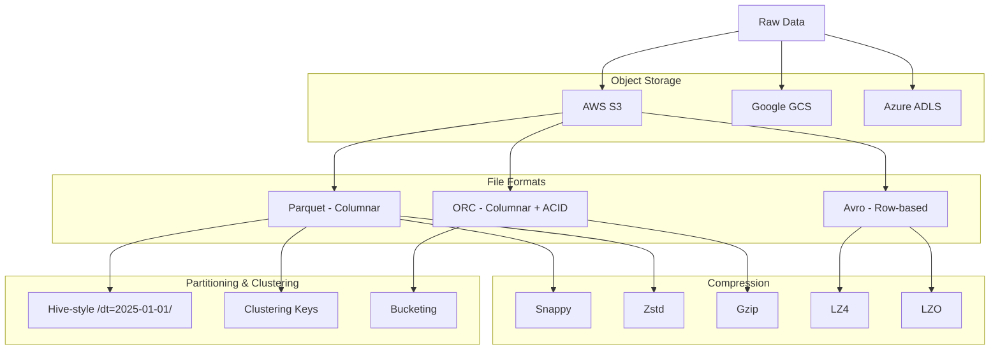

# Data Lake Storage & File Formats

## Architecture at a Glance



## What is it?

Data lake storage uses cheap, scalable object stores (S3, GCS, ADLS) as the foundation for all raw and processed data. File formats like Parquet, ORC, and Avro encode data for efficient reading, while compression codecs (Snappy, Zstd, Gzip, LZ4) reduce size and I/O. Partitioning, clustering, and bucketing strategies organize files for query pruning, and compaction maintains small-file hygiene over time.

## Why it was created

Traditional data warehouses charged high per-TB storage costs and required schema-on-write. Data lakes were created to offer schema-on-read at object-store prices (~$23/TB/month on S3). Specialized file formats emerged because storing JSON/CSV is slow and expensive at scale — Parquet enabled column pruning and predicate pushdown, ORC added ACID transactions on the lake, and Avro provided row-level schema evolution for streaming.

## When to use it

- Parquet: Any analytical workload where column pruning reduces I/O (most Spark, Presto, Hive, Dremio queries)
- ORC: ACID requirements on the data lake (Hive ACID, transactional inserts/updates/deletes)
- Avro: Streaming ingest (Kafka, Kinesis) where row-level writes and schema evolution matter
- Snappy/Zstd: Best general-purpose compression speed/ratio trade-off for Parquet/ORC
- Gzip: When storage costs dominate and you need maximum compression (archival datasets)
- Partitioning: Tables >100GB queried with date-range filters

## Hands-on Example: Parquet with PyArrow and Spark

**File: `pyarrow/parquet_example.py`**
```python
import pyarrow as pa
import pyarrow.parquet as pq
import pandas as pd
import numpy as np

# Create sample data
df = pd.DataFrame({
    "order_id": np.arange(1, 100001),
    "customer_id": np.random.randint(1000, 9999, 100000),
    "order_date": pd.date_range("2025-01-01", periods=100000, freq="T"),
    "amount": np.random.uniform(5.0, 500.0, 100000).round(2),
    "status": np.random.choice(["pending","shipped","delivered"], 100000),
})

table = pa.Table.from_pandas(df)

# Write Parquet with Snappy compression + row group size
pq.write_table(
    table,
    "data/orders.parquet",
    compression="snappy",
    row_group_size=50000,
    data_page_size=1048576,  # 1MB
)

# Read with column projection and row group filtering
table_read = pq.read_table(
    "data/orders.parquet",
    columns=["order_id", "amount", "status"],
    filters=[("status", "=", "delivered")],
)

print(f"Read {table_read.num_rows} rows with 3 columns")

# Metadata inspection
meta = pq.read_metadata("data/orders.parquet")
print(f"Row groups: {meta.num_row_groups}")
print(f"Row count: {meta.num_rows}")
```

**File: `spark/parquet_optimization.py`**
```python
from pyspark.sql import SparkSession
from pyspark.sql.functions import col

spark = SparkSession.builder \
    .appName("ParquetOptimization") \
    .config("spark.sql.parquet.compression.codec", "zstd") \
    .config("spark.sql.files.maxPartitionBytes", 134217728) \
    .getOrCreate()

df = spark.read.parquet("data/orders.parquet")

# Write with Hive-style partitioning
df.write \
    .mode("overwrite") \
    .partitionBy("order_date") \
    .option("maxRecordsPerFile", 1000000) \
    .parquet("data/orders_partitioned")

# Clustering / bucketing
df.write \
    .mode("overwrite") \
    .bucketBy(16, "customer_id") \
    .sortBy("order_date") \
    .saveAsTable("orders_bucketed")

# Read with predicate pushdown
delivered = spark.read.parquet("data/orders_partitioned") \
    .filter(col("status") == "delivered") \
    .select("order_id", "amount")

delivered.show()
```

**File: `spark/compaction.py`**
```python
# Compaction: combine small files into larger ones
df = spark.read.parquet("data/orders_partitioned")

df.coalesce(4) \
    .write \
    .mode("overwrite") \
    .option("maxRecordsPerFile", 5000000) \
    .parquet("data/orders_compacted")

# Delta Lake OPTIMIZE for Delta tables
# spark.sql("OPTIMIZE analytics.orders ZORDER BY (customer_id)")
```

**Partitioning Strategy Example (Hive-style directory layout)**
```
s3://data-lake/orders/
  order_date=2025-01-01/
    part-00001.snappy.parquet
    part-00002.snappy.parquet
  order_date=2025-01-02/
    part-00001.snappy.parquet
  ...
```

## Best Practices

- Choose Parquet as the default analytical format; use Zstd compression for the best speed/ratio balance
- Set row group size to 64-256 MB (large enough for efficient column scan, small enough for parallel readers)
- Partition by date or a high-cardinality filter column; avoid over-partitioning (hundreds of thousands of partitions)
- Use Hive-style partitioning (`/year=2025/month=01/day=01/`) for compatibility with Hive, Spark, Presto, Athena
- Cluster/bucket tables on join keys to enable shuffle-free joins in Spark
- Run compaction jobs regularly for tables with streaming or micro-batch writes to keep files at 128-512 MB
- Enable predicate pushdown — store min/max statistics in Parquet/ORC footer for each row group
- Use column pruning in every read: never `SELECT *` in production
- For streaming, write in Avro and batch-convert to Parquet for query performance
- Set up lifecycle policies to move old partitions to cheaper storage (S3 Glacier, GCS Archive) after access patterns cool

## Interview Questions

**Q1: Explain Parquet row group sizing, statistics, and predicate pushdown in detail.**

Parquet files are composed of row groups (horizontal partitions of rows). Each row group stores min/max statistics for each column in its metadata footer. When a query has a filter (e.g., `WHERE status = 'delivered'`), the reader can skip entire row groups whose column statistics show no matching values. This is predicate pushdown. Row group size of 128 MB balances parallelism (smaller groups = more parallel readers) and scan efficiency (larger groups = better compression ratio). Too-small row groups (<8 MB) create excessive metadata overhead; too-large (>1 GB) reduce parallelism.

**Q2: Compare Parquet, ORC, and Avro — when would you choose each?**

Parquet is columnar, optimized for read-heavy analytical workloads with predicate pushdown and nested column support. Best for query engines (Spark, Presto, Athena, Dremio). ORC is also columnar but adds ACID transactions, bloom filters, and stripe-level indexes; best for Hive ACID tables and transactional lakehouse operations. Avro is row-based with full schema evolution (backward/forward compatible); best for streaming ingest (Kafka), write-heavy pipelines where you need per-row writes without buffering, and systems requiring data to be splittable by line (MapReduce). General rule: Parquet for analytics, ORC for ACID on Hive, Avro for streaming/ingestion.

**Q3: You discover your 10TB Parquet-based data lake has 5 million small files (<8 MB each). What problems does this cause and how would you fix it?**

Small files cause massive metadata overhead for the filesystem, slow Hive metastore queries (millions of partitions), and poor Spark performance (each file creates a task — millions of tasks overwhelm the scheduler). Fix: Run periodic compaction jobs using Spark `coalesce()` or `repartition()` to write fewer, larger files (target 128-512 MB). Use Delta Lake or Iceberg which provide auto-compaction (`OPTIMIZE`). Prevent recurrence: set `maxRecordsPerFile` in Spark writes, batch micro-batch streaming into larger windows (e.g., 1-hour window -> 1 file), and enforce a compaction SLA (hourly for streaming tables, daily for batch).

## Real Company Usage

| Company | Format(s) | Use Case |
|---------|-----------|----------|
| Uber | Parquet (Hive) + Avro (Kafka) | 100+ PB data lake on S3; Avro for real-time event ingestion, Parquet for Presto/Spark analytics |
| Pinterest | ORC on S3 | ACID-compatible data lake with Hive for near-real-time analytics at 10+ PB |
| Netflix | Parquet + Iceberg | 1+ PB daily Parquet writes to S3 on Iceberg tables for consistent reads and file-level compaction |
