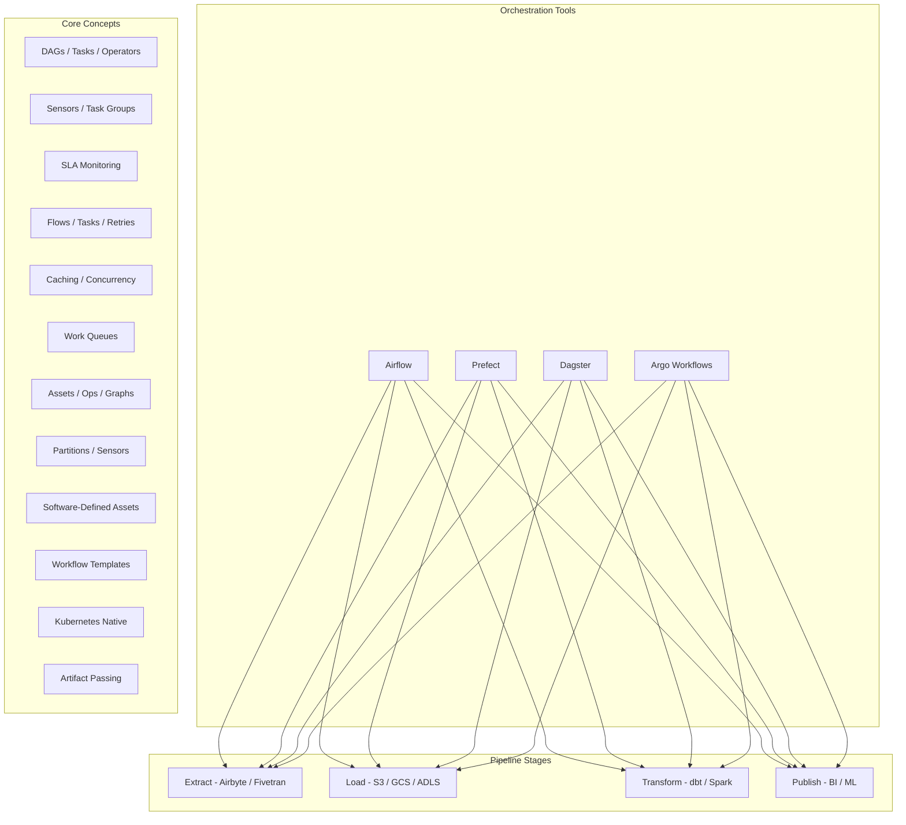

# Workflow Orchestration

## Architecture at a Glance



## What is it?

Workflow orchestration is the automated coordination of multi-step data pipelines — sequencing tasks, handling retries, managing dependencies, monitoring SLAs, and triggering downstream actions. Tools like Airflow, Prefect, Dagster, and Argo Workflows provide DAG-based execution with scheduling, observability, and failure-handling semantics that go far beyond simple cron jobs.

## Why it was created

Cron scripts and shell glue code fail silently, lack dependency management, scale poorly across teams, and have no visibility into failures or lineage. Orchestrators were created to provide programmable DAGs, automatic retries, rich alerting, parallel execution, and a web UI for monitoring. Airflow pioneered this (2015), while Prefect and Dagster addressed gaps in dynamic pipelines, asset-centric design, and local testing.

## When to use it

- Airflow: Mature ecosystem, 1,800+ providers, enterprises needing deep integration with AWS/GCP/Azure/Snowflake
- Prefect: Python-native syntax, easier local testing, automatic retries/caching, hybrid execution model
- Dagster: Asset-centric teams that want software-defined assets, lineage, and partitioned pipelines
- Argo Workflows: Kubernetes-native teams already on K8s, wanting YAML-defined workflows with minimal overhead

## Hands-on Example: Airflow DAG for a Data Pipeline

**File: `dags/data_pipeline.py`**
```python
"""
Complete Airflow DAG: Extract -> Load -> Transform -> Publish
Uses deferrable operators for cost savings and sensor efficiency.
"""
from airflow.decorators import dag, task
from airflow.sensors.external_task import ExternalTaskSensor
from airflow.providers.amazon.aws.transfers.s3_to_redshift import S3ToRedshiftOperator
from airflow.operators.empty import EmptyOperator
from datetime import datetime, timedelta
import logging

default_args = {
    "owner": "data_team",
    "retries": 2,
    "retry_delay": timedelta(minutes=5),
    "execution_timeout": timedelta(hours=2),
}

@dag(
    dag_id="data_pipeline",
    start_date=datetime(2025, 1, 1),
    schedule="0 7 * * *",
    catchup=False,
    tags=["production", "ecommerce"],
    default_args=default_args,
)
def data_pipeline():
    start = EmptyOperator(task_id="start")

    # Deferrable sensor — waits for upstream data with zero worker slot consumption
    wait_for_source = ExternalTaskSensor(
        task_id="wait_for_airbyte_sync",
        external_dag_id="airbyte_sync",
        external_task_id="sync_complete",
        mode="reschedule",
        poke_interval=60,
        timeout=3600,
        deferrable=True,
    )

    @task
    def validate_raw_data():
        row_count = check_raw_table("orders")
        if row_count == 0:
            raise ValueError("Raw table is empty — aborting pipeline")
        logging.info(f"Raw orders: {row_count} rows")

    load_to_redshift = S3ToRedshiftOperator(
        task_id="load_to_redshift",
        schema="staging",
        table="orders",
        s3_bucket="data-lake-prod",
        s3_key="airbyte/orders/{{ ds }}/",
        copy_options=["FORMAT AS PARQUET"],
        redshift_conn_id="redshift_default",
    )

    @task
    def run_dbt_models():
        from airflow.providers.common.sql.operators import SQLExecuteQueryOperator
        # dbt Cloud API call or local dbt runner
        import requests
        resp = requests.post(
            "https://cloud.getdbt.com/api/v2/accounts/12345/runs/",
            json={"cause": "Airflow triggered", "models": ["marts"]},
            headers={"Authorization": "Bearer {{ var.value.dbt_token }}"},
        )
        resp.raise_for_status()

    @task
    def publish_metrics():
        from datetime import datetime as dt
        logging.info(f"Pipeline completed at {dt.utcnow()}")

    end = EmptyOperator(task_id="end")

    start >> wait_for_source >> validate_raw_data() >> load_to_redshift
    load_to_redshift >> run_dbt_models() >> publish_metrics() >> end

dag_instance = data_pipeline()
```

**File: `dags/example_prefect_flow.py`**
```python
from prefect import flow, task
from prefect.tasks import task_input_hash
from datetime import timedelta
import httpx

@task(cache_key_fn=task_input_hash, cache_expiration=timedelta(hours=1))
def fetch_orders(date: str) -> list:
    resp = httpx.get(f"https://api.example.com/orders?date={date}")
    return resp.json()

@task(retries=3, retry_delay_seconds=60)
def transform(orders: list) -> list:
    return [{"order_id": o["id"], "amount": float(o["total"])} for o in orders]

@task
def load(transformed: list) -> None:
    for row in transformed:
        print(f"Writing {row}")

@flow(log_prints=True)
def daily_pipeline(date: str):
    raw = fetch_orders(date)
    clean = transform(raw)
    load(clean)

if __name__ == "__main__":
    daily_pipeline("2025-06-01")
```

**File: `dags/dagster_pipeline.py`**
```python
from dagster import asset, op, job, ScheduleDefinition, Definitions, AssetSelection

@asset
def raw_orders(context):
    return [{"id": 1, "amount": 100.0}]

@asset
def transformed_orders(raw_orders):
    return [{"order_id": r["id"], "revenue": r["amount"]} for r in raw_orders]

@asset
def daily_metrics(transformed_orders):
    return {"order_count": len(transformed_orders), "total_revenue": sum(r["revenue"] for r in transformed_orders)}

defs = Definitions(
    assets=[raw_orders, transformed_orders, daily_metrics],
    schedules=[
        ScheduleDefinition(
            name="daily_schedule",
            target=AssetSelection.all(),
            cron_schedule="0 8 * * *",
        )
    ],
)
```

## Comparison Table: Airflow vs Prefect vs Dagster vs Argo Workflows

| Feature | Airflow | Prefect | Dagster | Argo Workflows |
|---------|---------|---------|---------|----------------|
| DAG Definition | Python DAG files | Python decorators (`@flow`/`@task`) | Python assets + ops | YAML + custom K8s CRDs |
| Local Testing | Hard (needs Airflow env) | Easy (pure Python) | Easy (Dagster dev) | Requires K8s cluster |
| Caching | XComs (manual) | Built-in (cache_key_fn) | Solid I/O management | Artifacts via S3/GCS |
| Retries | Per-task configurable | Decorator-based | Via op config | Container-level restart |
| Concurrency Control | Pools + slots | Work queues + concurrency limits | Global / per-asset concurrency | K8s resource quotas |
| UI / Observability | Rich (DAG views, Gantt, SLA) | Cloud UI (Prefect Cloud) | Dagit — asset lineage view | Argo UI — DAG + logs |
| Event-Driven | Sensors + deferrable operators | Webhooks / clouds events | Sensors | Webhooks / K8s events |
| Kubernetes Integration | K8sPodOperator, CeleryK8s | Prefect Agent on K8s | K8sRunLauncher | Native (designed for K8s) |
| Maturity | 2015, largest ecosystem | 2019, growing fast | 2020, asset-first niche | 2018, K8s-first |
| Best For | Enterprise, 1800+ integrations | Teams wanting Python DX | Asset lineage and data products | K8s-native teams |

## Best Practices

- Use deferrable operators (`deferrable=True`) in Airflow to free worker slots during long waits (sensors, external APIs)
- Organize DAGs in idempotent tasks — rerunning a failed task should produce the same result
- Set clear SLA timeouts at both DAG and task level; configure SLA misses to page on-call
- Use task groups in Airflow to organize sub-DAGs visually in the UI
- Pin provider and orchestrator versions; test DAGs in CI with `pytest` and `dagbag.test_cycle()`
- Never put secrets in DAG code — use Airflow connections / variables, Prefect blocks, Dagster secrets
- Design for backfill: use `{{ ds }}` macros and allow arbitrary start dates for historical reruns
- Instrument every task with logging and emit metrics (DataDog, Prometheus) for pipeline health monitoring
- Use work queues / pools to isolate critical production pipelines from experimental ones
- Implement upstream data sensors to avoid wasting compute on pipelines where source data hasn't arrived

## Interview Questions

**Q1: Compare workflow orchestration versus simple cron scheduling. When does a cron become insufficient?**

Cron provides fixed-interval execution with no dependency management, no retry logic, no failure alerts, no parallel execution graph, and no observability into what failed or why. A cron is sufficient for a single script that runs daily and exits cleanly. It becomes insufficient when you have multi-step pipelines (A -> B -> C must run after A completes), need conditional branching or dynamic task generation, require automatic retries on transient failures, need to share context between steps (XComs), or must coordinate pipelines across multiple teams/domains with different SLAs.

**Q2: Design an Airflow architecture that supports 500+ DAGs across 5 teams with different SLAs and resource requirements.**

Use the CeleryK8sExecutor hybrid: Celery workers for standard tasks, K8sPodOperator for burst workloads. Create 5 separate DAG folders mapped to team-specific Git branches. Use Airflow pools to cap concurrent tasks per team (e.g., team_A=10, team_B=5). Tag DAGs by team and SLA tier (Tier-1: 5 min SLAs, Tier-3: best-effort). Set up `sla_miss_callback` to Slack channel per team. Dedicate separate Airflow instances for real-time (<5 min latency) vs batch (daily) to avoid resource contention. Use deferrable operators for long-running sensors and API calls to keep worker utilization high.

**Q3: Explain the concept of software-defined assets in Dagster and how they differ from Airflow's task-centric approach.**

In Airflow, the primary abstraction is the DAG and its tasks — data is a side effect pushed through XComs or external storage. In Dagster, a software-defined asset is a first-class object representing a dataset, table, or file, with an explicit upstream/downstream dependency graph. Assets know what input they need and what output they produce. This allows automatic lineage, selective materialization (only rebuild asset X and its downstream dependents), partition awareness (materialize only the partition that failed), and built-in freshness policies. The mental model shifts from "run this task at this time" to "keep this dataset up to date."

## Real Company Usage

| Company | Tool | Use Case |
|---------|------|----------|
| Airbnb | Airflow (created it) | 2,000+ DAGs across data engineering, ML, and analytics — the original orchestrator use case |
| GitHub | Prefect Cloud | Orchestrate data pipelines for GitHub Insights and internal analytics with 1,000+ flows |
| Loom | Dagster | Asset-based pipeline for video analytics, partitioned by day, with automatic lineage tracking |
