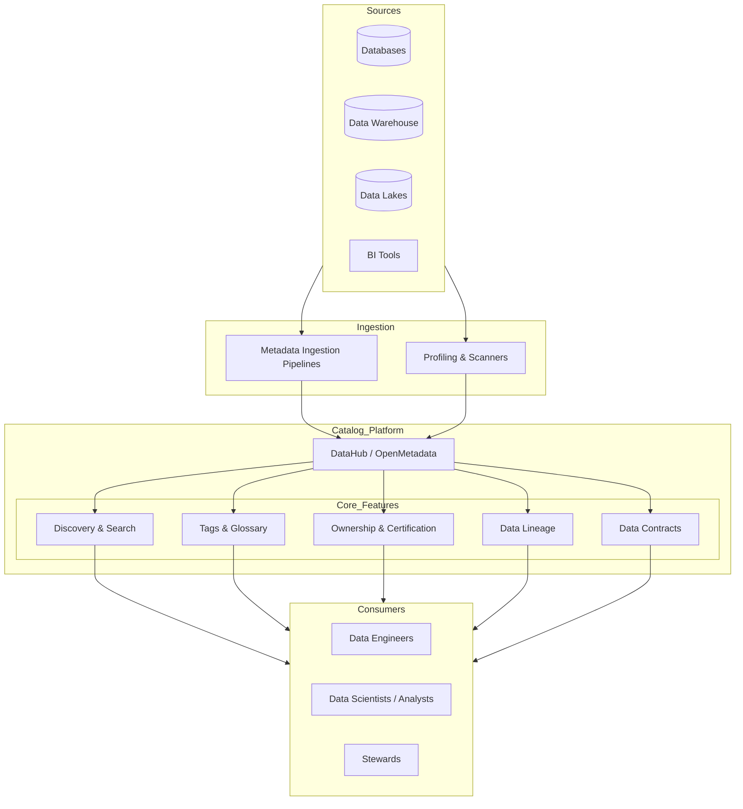

# Data Catalog & Metadata Management

## Architecture at a Glance



## What is it?

A **data catalog** is a centralized metadata platform that indexes all data assets across an organization—tables, views, dashboards, pipelines, ML models—making them discoverable, understandable, and trustable. **Metadata management** encompasses the processes, policies, and tools for collecting, storing, and governing metadata (technical, business, and operational).

## Why it was created

As organizations scaled their data infrastructure, data sprawl made it impossible for analysts to find relevant datasets, understand their meaning, or know who owned them. Without a catalog, teams waste 30–40% of their time discovering and understanding data, leading to duplicate efforts, stale reports, and data distrust. Data catalogs were created to provide a single pane of glass for the data ecosystem.

## When to use it

- Organizations with 50+ data sources and 500+ datasets
- Teams practicing data mesh (each domain publishes to the catalog)
- Regulatory environments requiring data lineage and impact analysis
- Any team where data discovery takes more than 20% of analyst time
- When onboarding new team members who need to understand existing data assets

## Hands-on Example: Setting up DataHub with dbt + Snowflake Ingestion

### Step 1: Deploy DataHub locally

```yaml
# docker-compose.yml
version: "3.8"
services:
  datahub-gms:
    image: acryldata/datahub-gms:latest
    ports:
      - "8080:8080"
    environment:
      - DATAHUB_SECRET=secret
      - DATAHUB_METADATA_SERVICE_NAME=datahub
    depends_on:
      - mysql

  mysql:
    image: mysql:8
    environment:
      MYSQL_ROOT_PASSWORD: datahub
      MYSQL_DATABASE: datahub
    ports:
      - "3306:3306"

  datahub-frontend:
    image: acryldata/datahub-frontend:latest
    ports:
      - "9002:9002"
    environment:
      - DATAHUB_GMS_HOST=datahub-gms
      - DATAHUB_GMS_PORT=8080
```

### Step 2: Install metadata ingestion CLI

```bash
pip install 'acryl-datahub[datahub-rest,snowflake,dbt]'
```

### Step 3: Configure Snowflake ingestion recipe

```yaml
# snowflake_recipe.yml
source:
  type: snowflake
  config:
    account_id: xy12345.us-east-1
    username: ${SNOWFLAKE_USER}
    password: ${SNOWFLAKE_PASS}
    role: ACCOUNTADMIN
    warehouse: COMPUTE_WH
    database_pattern:
      allow:
        - "PROD_DB"
    include_table_lineage: true
    include_view_lineage: true

sink:
  type: datahub-rest
  config:
    server: "http://localhost:8080"
```

### Step 4: Configure dbt ingestion recipe

```yaml
# dbt_recipe.yml
source:
  type: dbt
  config:
    manifest_path: ./target/manifest.json
    catalog_path: ./target/catalog.json
    sources_path: ./target/sources.json
    target_platform: snowflake
    node_type_pattern:
      allow:
        - model
        - source
        - test

sink:
  type: datahub-rest
  config:
    server: "http://localhost:8080"
```

### Step 5: Run ingestions

```bash
datahub ingest -c snowflake_recipe.yml
datahub ingest -c dbt_recipe.yml
```

### Step 6: Search and explore

Navigate to `http://localhost:9002` and search for your datasets. You'll see lineage from dbt models to Snowflake tables, column-level profiled statistics, and ownership information.

## Best Practices

- **Ingest technical metadata first**, then layer business metadata (glossary terms, descriptions) through collaboration
- **Enforce ownership** for every dataset—no asset should be orphaned
- **Use automated profiling** (column stats, null ratios, distributions) but limit to off-peak hours
- **Tag sensitive data** (PII, PHI, financial) at ingestion time using automated classifiers
- **Certify gold datasets** to signal trustworthiness; deprecate or archive unused assets
- **Integrate lineage** from dbt, Airflow, and Spark to enable full impact analysis
- **Set up data contracts** between producers and consumers as part of the catalog workflow
- **Review and clean stale metadata** quarterly to prevent catalog bloat

## Interview Questions

**Q1: How would you design a data catalog for a company with 200+ data sources across Snowflake, Redshift, S3, and Kafka, ensuring column-level lineage and PII tagging?**

A: Start with a metadata ingestion framework using DataHub or OpenMetadata. Deploy ingestion recipes per source type using a push-based model from orchestrators (Airflow). Use column-level profilers to detect PII via regex, entropy checks, and ML classifiers. Store column-level lineage by parsing query logs (Snowflake `QUERY_HISTORY`) and dbt `manifest.json`. Serve via a REST API with a frontend supporting search (Elasticsearch-backed), tags, glossary, and certification badges. Implement a webhook-based notification system to alert owners of schema changes.

**Q2: DataHub vs OpenMetadata vs Amundsen—compare their maturity, community, and key differentiators for a mid-size fintech startup.**

A: DataHub (Acryl Data) has the strongest lineage support and data contracts. It uses a push-based model with a real-time Kafka-backed metadata store. OpenMetadata offers a richer UI with built-in data quality and collaboration features (conversations, tasks). It has a pull-based ingestion framework with Airflow integration. Amundsen (Lyft) is simpler and more focused on search and discovery but has limited lineage and slower development velocity. For a fintech startup needing strong lineage and compliance, DataHub is preferred; for a team wanting all-in-one quality+catalog, OpenMetadata works better.

**Q3: A stakeholder reports they cannot find a dataset they know exists. Walk through your diagnostic process.**

A: (1) Check if the source is configured in ingestion recipes. (2) Verify the last successful ingestion run timeduration. (3) Examine ingestion logs for schema changes that may have caused the asset to be filtered. (4) Check the catalog's search index (Elasticsearch) for the dataset by exact name. (5) Verify RBAC filters aren't hiding the asset. (6) Check if the dataset was deprecated or archived by a stewardship action. (7) Look at the source database to confirm the table still exists. Resolution typically involves re-running ingestion or adjusting the dataset filter patterns.

## Real Company Usage

| Company | Tool(s) Used | Use Case |
|---------|-------------|----------|
| Netflix | Amundsen (internal) + custom metadata service | Data discovery for 10,000+ datasets across 100+ teams; search ranking based on user behavior |
| LinkedIn | DataHub (originally built here) | End-to-end metadata platform ingesting from 50+ source types; automated lineage from Azkaban pipelines |
| Airbnb | Data Portal (in-house) + Amundsen | Data discovery, ownership, and column-level lineage for their data lake; integration with Databook |
| Uber | Databook (in-house) | Central metadata store for Hive, Kafka, and ML features; automated impact analysis for schema changes |
| WeWork | OpenMetadata | Centralized catalog for Snowflake, Redshift, and dbt assets; data quality integration with Great Expectations |
