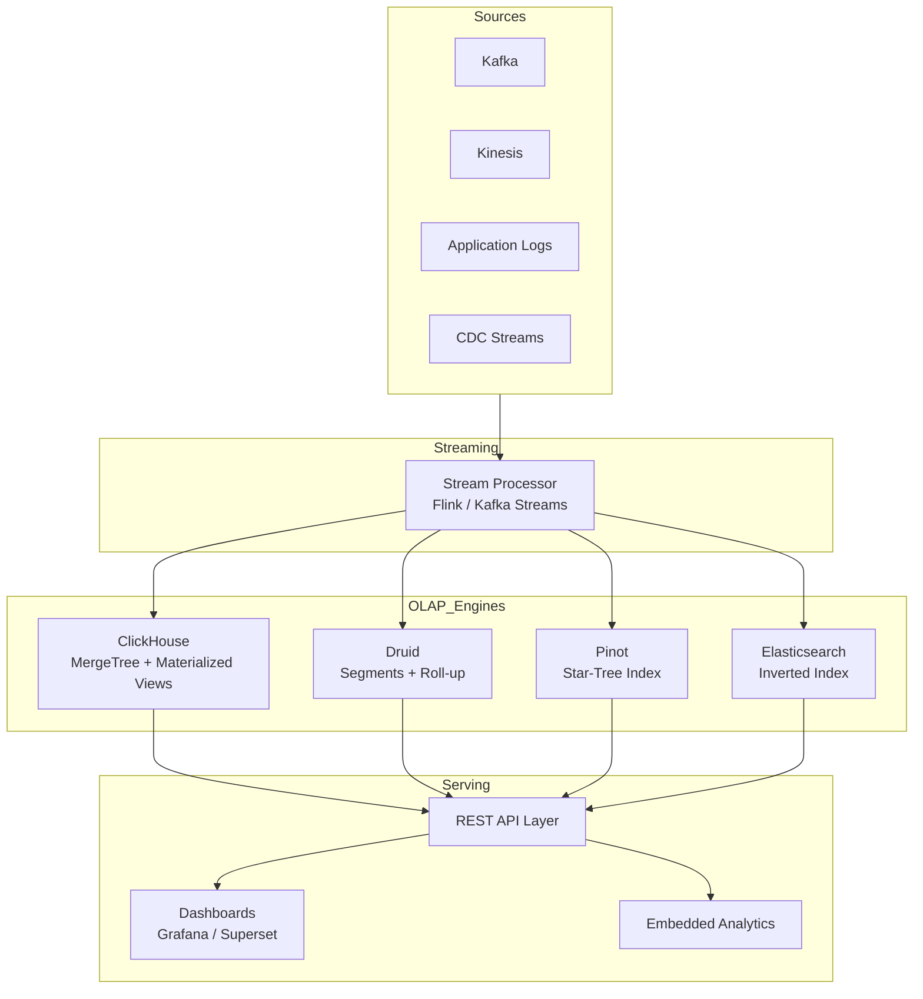

# Real-Time Analytics

## Architecture at a Glance



## What is it?

**Real-time analytics** refers to querying and visualizing data within seconds (or milliseconds) of ingestion. Unlike traditional OLAP databases optimized for batch loads, real-time OLAP engines are designed for continuous ingestion, high-concurrency point queries, and sub-second aggregations over large datasets. Key engines include **ClickHouse**, **Apache Druid**, **Apache Pinot**, and **Elasticsearch**, each with different trade-offs.

## Why it was created

Batch processing (hourly/daily) was too slow for operational use cases: fraud detection, monitoring dashboards, ad-tech bidding, and user-facing analytics. Traditional databases (PostgreSQL, MySQL) couldn't handle analytical queries at streaming scale, and data warehouses (Snowflake, Redshift) had too much ingestion latency. Real-time OLAP engines fill the gap between streaming (Kafka) and serving (dashboards/APIs).

## When to use it

- User-facing analytics dashboards with sub-second SLAs (e.g., product analytics)
- Monitoring and observability (metrics, traces, logs)
- Ad-tech and marketing attribution (high cardinality, high throughput)
- Fraud detection and anomaly detection
- IoT sensor analytics (time-series with high ingestion rates)
- When you need both real-time ingestion AND complex analytical queries (not just key-value lookups)

## Hands-on Example: ClickHouse with Kafka Tables and Materialized Views

### Step 1: Deploy ClickHouse and Kafka

```yaml
# docker-compose.yml
version: "3.8"
services:
  clickhouse:
    image: clickhouse/clickhouse-server:latest
    ports:
      - "8123:8123"
      - "9000:9000"
    environment:
      CLICKHOUSE_DB: analytics
    volumes:
      - ./clickhouse-config.xml:/etc/clickhouse-server/config.d/config.xml

  kafka:
    image: confluentinc/cp-kafka:latest
    ports:
      - "9092:9092"
    environment:
      KAFKA_ADVERTISED_LISTENERS: PLAINTEXT://localhost:9092
      KAFKA_OFFSETS_TOPIC_REPLICATION_FACTOR: 1
```

### Step 2: Create Kafka topic and produce events

```bash
docker exec -it kafka kafka-topics --create \
  --topic pageviews \
  --bootstrap-server localhost:9092 \
  --partitions 3 \
  --replication-factor 1

# Produce sample events
docker exec -it kafka bash -c '
echo "{\"user_id\":1001,\"page\":\"/home\",\"timestamp\":\"2025-01-15 10:00:00\",\"duration_sec\":45}
{\"user_id\":1002,\"page\":\"/pricing\",\"timestamp\":\"2025-01-15 10:00:05\",\"duration_sec\":120}" \
| kafka-console-producer --topic pageviews --bootstrap-server localhost:9092
'
```

### Step 3: Create Kafka engine table and materialized views in ClickHouse

```sql
-- Kafka engine table (ingestion)
CREATE TABLE analytics.pageviews_kafka
(
    user_id    UInt32,
    page       String,
    timestamp  DateTime,
    duration_sec UInt32
)
ENGINE = Kafka()
SETTINGS
    kafka_broker_list = 'kafka:9092',
    kafka_topic_list = 'pageviews',
    kafka_group_name = 'clickhouse_group',
    kafka_format = 'JSONEachRow';

-- Target MergeTree table
CREATE TABLE analytics.pageviews
(
    user_id    UInt32,
    page       String,
    timestamp  DateTime,
    duration_sec UInt32
)
ENGINE = MergeTree()
PARTITION BY toYYYYMM(timestamp)
ORDER BY (timestamp, user_id);

-- Materialized view: Kafka -> MergeTree
CREATE MATERIALIZED VIEW analytics.pageviews_mv TO analytics.pageviews AS
SELECT * FROM analytics.pageviews_kafka;

-- Aggregating materialized view (pre-computed per minute)
CREATE MATERIALIZED VIEW analytics.pageviews_agg_mv
ENGINE = SummingMergeTree()
PARTITION BY toYYYYMM(timestamp)
ORDER BY (page, toStartOfMinute(timestamp))
AS
SELECT
    page,
    toStartOfMinute(timestamp) AS minute,
    count()                    AS views,
    sum(duration_sec)          AS total_duration,
    uniq(user_id)              AS unique_users
FROM analytics.pageviews
GROUP BY page, minute;
```

### Step 4: Query real-time aggregations

```sql
-- Real-time query: last 5 minutes by page
SELECT
    page,
    sum(views) AS total_views,
    sum(unique_users) AS unique_users
FROM analytics.pageviews_agg_mv
WHERE minute >= now() - INTERVAL 5 MINUTE
GROUP BY page
ORDER BY total_views DESC;

-- Per-minute breakdown
SELECT
    minute,
    page,
    views,
    unique_users
FROM analytics.pageviews_agg_mv
WHERE minute >= now() - INTERVAL 1 HOUR
ORDER BY minute DESC, views DESC;
```

## Comparison Table: ClickHouse vs Druid vs Pinot vs Elasticsearch

| Feature | ClickHouse | Apache Druid | Apache Pinot | Elasticsearch |
|---------|-----------|-------------|-------------|---------------|
| **Engine type** | Columnar OLAP | Columnar + time-based | Columnar + inverted | Inverted index + aggregations |
| **Primary index** | Sparse sorted (MergeTree) | Time + dimension | Star-tree, inverted | Lucene inverted index |
| **Ingestion model** | Pull (INSERT) / Kafka engine | Push (Tranquility/Kafka) | Push (Segment push) | Push (Bulk API) / Logstash |
| **Real-time ingestion** | Native Kafka engine | Native Kafka indexing | Native Kafka/Streams | Logstash/Beat |
| **Query latency** | 1–50 ms | 50–500 ms | 10–200 ms | 10–100 ms |
| **Concurrent queries** | High (shared-nothing) | Medium (broker coordination) | High (stateless brokers) | Medium (coordinator overhead) |
| **Data freshness** | Near real-time (seconds) | Real-time (seconds) | Real-time (seconds) | Near real-time (<1s) |
| **SQL support** | Full SQL (MySQL dialect) | SQL (Druid SQL, limited JOINs) | SQL (Pinot SQL) | Query DSL (SQL limited) |
| **Mutability** | UPDATE/DELETE heavy | Append-optimized, batch updates | Append-optimized | Update by doc ID |
| **Tiered storage** | No (disk only) | Yes (hot/warm/cold) | No (separate clusters) | Yes (hot/warm/frozen) |
| **Best for** | Real-time analytics, observability | Time-series, exploratory analytics | User-facing analytics, high QPS | Full-text search, logs |

## Best Practices

- **Choose the right engine**: ClickHouse for complex SQL and high concurrency; Druid for time-series with roll-up; Pinot for user-facing sub-second QPS; Elasticsearch for text-heavy logs
- **Pre-aggregate aggressively**: Use materialized views (ClickHouse) or roll-up specs (Druid) to reduce data volume at ingestion
- **Partition by time and sort keys**: Align partitioning with your most common query filters (usually time range)
- **Use Kafka for buffering**: Never write directly to the OLAP engine from applications—Kafka provides replayability and decoupling
- **Monitor query performance**: Most real-time engines have system tables for slow queries; set up alerts for p99 latency > SLA
- **Plan for high cardinality**: Star-tree index (Pinot) or bloom filters (ClickHouse) help with high-cardinality dimensions
- **Separate compute from storage where possible**: Druid's tiered storage and Pinot's hybrid tables allow cost-effective scaling
- **Use a real-time dashboard tool**: Grafana (ClickHouse plugin), Apache Superset, or Metabase for visualization

## Interview Questions

**Q1: Your team needs to build a real-time analytics dashboard showing page views, revenue, and user counts by page, country, and device, with < 3s freshness and 200k events/sec. Design the architecture.**

A: Use Kafka as the ingestion buffer for 200k events/sec (partition by page_id for ordering). Stream process with Flink for enrichment (geo IP, device parsing) and deduplication. Write to ClickHouse via its Kafka engine (native, no Flink needed for simple pipelines). Create an aggregating materialized view (`SummingMergeTree` or `AggregatingMergeTree`) rolled up by minute + dimensions (page, country, device). Serve via a REST API using ClickHouse's HTTP interface with query caching (Redis) for repeated dashboard queries. Grafana with the ClickHouse datasource renders the frontend. For < 3s freshness, set ClickHouse's `kafka_flush_interval_ms` to 1000.

**Q2: Compare ClickHouse MergeTree engine with Apache Druid segments. What are the key architectural differences and how do they impact query performance?**

A: MergeTree organizes data into ordered parts, each with a primary key sparse index. Queries scan only relevant granules (default 8192 rows) using the ordering index. Druid organizes data into time-based segments stored as columnar frames. Segments use a bitmap index for dimension filtering. Key differences: (1) ClickHouse index is a sparse ordered index (good for range scans), Druid uses bitmaps (good for high-cardinality dimension filtering). (2) ClickHouse stores one part per partition per INSERT; Druid compacts segments via a background process. (3) Druid supports tiered storage (hot/warm/cold) natively; ClickHouse uses disk tiers. (4) Druid's broker layer handles distributed query routing; ClickHouse uses a coordinator-less approach where any node can be the query entry point.

**Q3: A ClickHouse query that worked in staging is 50x slower in production. How do you debug it?**

A: (1) Check the `system.query_log` for the query's `read_rows`, `read_bytes`, and `memory_usage`. (2) Look at the query pipeline via `EXPLAIN` to see if the primary key is being used. (3) Check `system.parts` to see if the table has too many small parts (need `OPTIMIZE` or tune `merge_tree` settings). (4) Verify the `ORDER BY` key aligns with the query's `WHERE` clause—mismatched sort keys cause full table scans. (5) Check concurrent queries via `system.processes`—maybe resource contention. (6) Look at disk I/O via `system.disks`. (7) Tune `max_threads` and `max_memory_usage` per query. (8) If filtering on a high-cardinality column not in the primary key, add a secondary skip index (`minmax` or `set`).

## Real Company Usage

| Company | Engine(s) | Use Case |
|---------|-----------|----------|
| Uber | ClickHouse | Real-time driver/rider metrics dashboard; 2M+ events/sec, p99 query < 100ms |
| Netflix | Druid | Real-time monitoring of streaming quality (startup time, buffering, bitrate) |
| LinkedIn | Pinot | User-facing "Who viewed your profile" and "Trending" with sub-second latency at 100k+ QPS |
| eBay | Druid + Pinot | Real-time bidding analytics and seller dashboard with tiered storage for cost optimization |
| Cloudflare | ClickHouse | HTTP analytics (1M+ req/sec across 200+ data centers); custom "Analytics" product serving customers |
| Slack | Elasticsearch + ClickHouse | Logs (Elasticsearch) and product analytics (ClickHouse) for workspace metrics |
