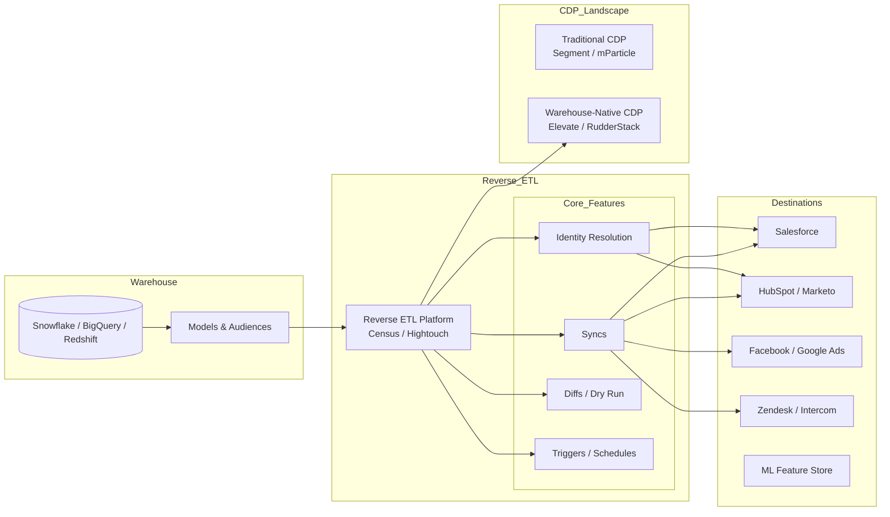

# Reverse ETL

## Architecture at a Glance



## What is it?

**Reverse ETL** is the process of syncing transformed, modeled data from a data warehouse back into operational SaaS tools (Salesforce, HubSpot, Marketo, ad platforms). Whereas ETL moves data *into* the warehouse, reverse ETL moves *out* of the warehouse to power actions—segment updates in CRMs, audience targeting in ad platforms, personalized emails, and more. It completes the data loop: operational systems → warehouse → activation.

## Why it was created

Traditional CDPs (Segment, mParticle) require you to send raw event data to their platform, then enrich and forward it—creating a data silo. Companies with data warehouses wanted to use their warehouse as the source of truth for customer data: run complex SQL transforms, join across sources (billing, support, product), and send the results to SaaS tools. Reverse ETL tools (Census, Hightouch) were created to bridge this gap, enabling "warehouse-native CDP" patterns.

## When to use it

- You already have a data warehouse with customer data (Snowflake, BigQuery, Redshift)
- You need to sync customer segments (computed via SQL/dbt) to Salesforce or HubSpot
- You want to power ad audiences (Facebook, Google Ads) from warehouse data
- You need to update CRM records with computed metrics (LTV, churn score, NPS)
- You're replacing or augmenting a traditional CDP (Segment/mParticle) with a warehouse-native approach
- You want to trigger operational workflows (email sequences, support tickets) based on data models

## Hands-on Example: Reverse ETL from Snowflake to Salesforce using Census

### Step 1: Define the source model in Snowflake

```sql
-- Customer scoring model
CREATE OR REPLACE VIEW analytics.salesforce_customer_sync AS
SELECT
    c.external_id           AS salesforce_id,   -- Salesforce record ID
    c.email                 AS email,
    c.full_name             AS name,
    c.company               AS account_name,
    COALESCE(o.total_revenue, 0) AS lifetime_value,
    COALESCE(o.last_order_date, NULL) AS last_purchase_date,
    CASE
        WHEN c.lifetime_value > 5000 THEN 'Platinum'
        WHEN c.lifetime_value > 1000 THEN 'Gold'
        WHEN c.lifetime_value > 0    THEN 'Silver'
        ELSE 'Bronze'
    END                     AS tier,
    CASE
        WHEN DATEDIFF('day', COALESCE(o.last_order_date, c.created_at), CURRENT_DATE) > 180
        THEN 'At Risk'
        ELSE 'Active'
    END                     AS churn_risk,
    CURRENT_TIMESTAMP       AS synced_at
FROM analytics.customers c
LEFT JOIN analytics.orders_summary o ON c.customer_id = o.customer_id
WHERE c.email IS NOT NULL;
```

### Step 2: Configure the Census connection

```yaml
# census_sync_config.yml (configured via UI, equivalent in code)
connections:
  source:
    type: snowflake
    account: xy12345.us-east-1
    database: analytics
    warehouse: COMPUTE_WH
    role: TRANSFORMER

  destination:
    type: salesforce
    oauth: ${SALESFORCE_OAUTH_TOKEN}

sync:
  name: "Customer Tier Sync"
  model: analytics.salesforce_customer_sync

  # Salesforce object mapping
  object: Contact
  external_id: salesforce_id__c  # custom external ID field

  # Field mapping (source -> destination)
  field_mapping:
    - from: email
      to: Email
    - from: name
      to: Name
    - from: account_name
      to: Account.Name
    - from: lifetime_value
      to: Lifetime_Value__c
    - from: last_purchase_date
      to: Last_Purchase_Date__c
    - from: tier
      to: Tier__c
    - from: churn_risk
      to: Churn_Risk__c
    - from: synced_at
      to: Last_Synced_At__c

  behavior:
    operation: upsert          # create or update matching records
    matching_key: email        # match on email for deduplication
    diff_mode: true            # only sync changed rows
    schedule: every 3 hours

  # Pre-sync and post-sync hooks
  pre_sync:
    - run_sql: "CALL analytics.refresh_customer_scores()"
  post_sync:
    - webhook: "${SLACK_WEBHOOK}?text=Customer tier sync completed"
```

### Step 3: Trigger the sync

```bash
# Using Census API to trigger sync
curl -X POST https://app.census.io/api/v1/syncs/12345/trigger \
  -H "Authorization: Bearer ${CENSUS_API_KEY}" \
  -H "Content-Type: application/json"
```

### Step 4: Verify in Salesforce

Query the Salesforce Contact object—you should see updated `Tier__c`, `Lifetime_Value__c`, and `Churn_Risk__c` fields populated from your warehouse model.

## Identity Resolution Strategies

| Strategy | Description | Pros | Cons |
|----------|-------------|------|------|
| **Deterministic (exact match)** | Match on exact identifiers: email, phone, customer_id | High precision, simple | Misses anonymous users, multiple identifiers |
| **Probabilistic (fuzzy match)** | ML-based matching on name, address, IP, device fingerprint | Catches more records | Lower precision, requires training data |
| **Customer ID bridge** | Use a central `customer_id` mapped to all known identifiers in the warehouse | High precision, explicit | Requires ETL to resolve IDs first |
| **External ID system** | Store a `salesforce_id__c` or `hubspot_id` in your warehouse as a synced identifier | Supports upsert without full identity resolution | Requires initial sync to establish IDs |
| **Device graph** | Third-party device graphs (LiveRamp, IdentityLink) | Broad coverage | Costly, privacy concerns |

## Best Practices

- **Start with deterministic matching** (email/customer ID) before adding probabilistic resolution
- **Use diff mode** to sync only changed rows—reduces API consumption and speeds up syncs
- **Model in dbt first**: Create and test your customer models in dbt before exposing them to reverse ETL
- **Limit sync frequency**: Most SaaS tools have API rate limits; 1–3 hour intervals are typical
- **Add external ID fields** to your SaaS objects (e.g., `salesforce_id__c`, `hubspot_id`) to enable upsert
- **Monitor sync failures** for API errors (duplicate records, validation failures, permission errors)
- **Use pre-sync hooks** to refresh underlying materialized tables before each sync
- **Document field mappings** clearly—the warehouse-to-SaaS field mapping is the riskiest part
- **Consider warehouse-native CDP** (Elevate, RudderStack) if you need real-time event forwarding AND reverse ETL

## Interview Questions

**Q1: Design a reverse ETL pipeline that syncs a "churn prediction score" computed in Snowflake back to Salesforce and triggers a "Customer Success" task when the score exceeds 0.8.**

A: Build a churn model in Snowflake using customer features (login frequency, support tickets, payment delays, usage decline). Materialize predictions in a `ml.churn_scores` table. Create a reverse ETL model in Census/Hightouch joining `ml.churn_scores` with `customers` to get Salesforce Contact IDs. Sync every 4 hours, upserting `Churn_Score__c` into Salesforce Contacts. In Salesforce, set up a Process Builder flow: when `Churn_Score__c` > 0.8, create a High-Priority Task assigned to the Account Owner, send an email alert, and add the Contact to a "High Churn" Campaign. The data flow: dbt models → Snowflake → Census → Salesforce → Process Builder → Task/Email.

**Q2: Compare warehouse-native CDP (Census/Hightouch + warehouse) with traditional CDP (Segment/mParticle) for a B2C SaaS company generating 2M events/day and needing real-time website personalization.**

A: Traditional CDP: Segment collects events client-side and server-side, sends to warehouse for analytics AND simultaneously to personalization tools (Customer.io, Braze). Best for real-time personalization (< 1s latency) because data doesn't need to round-trip through the warehouse. However, data modeling is limited to Segment's SQL/Spec. Warehouse-native CDP: Events go to warehouse first, then reverse ETL sends computed audiences to tools. Better for complex SQL models (LTV, churn, RFM) but adds 15–60 min latency. For real-time personalization, a hybrid works: Segment for real-time event forwarding + Census for batch audience syncs from the warehouse.

**Q3: A reverse ETL sync is failing intermittently with "duplicate external ID" errors in Salesforce. How do you diagnose and fix?**

A: (1) Check last successful sync vs failed sync rows using Census/Hightouch diff logs. (2) Run the source model SQL directly in Snowflake and check for duplicate `salesforce_id__c` values: `SELECT salesforce_id, count(*) FROM model GROUP BY salesforce_id HAVING count(*) > 1`. (3) If duplicates exist, add `QUALIFY ROW_NUMBER() OVER (PARTITION BY salesforce_id ORDER BY synced_at DESC) = 1` to the model. (4) If duplicates are in Salesforce itself (multiple Contacts with same email), use the matching_key (email) and adopt "merge" behavior or clean up Salesforce first. (5) Add a pre-sync deduplication step: `DELETE FROM contacts WHERE id IN (duplicate_ids)`. (6) Implement idempotency with `upsert` rather than `insert`.

## Real Company Usage

| Company | Tool(s) | Use Case |
|---------|---------|----------|
| Loom | Census | Syncing product usage data (videos watched, team activity) from BigQuery to Salesforce to power sales workflows |
| Canva | Hightouch | Audiences for ad platforms (Facebook, Google, TikTok) built from warehouse data; syncing every 2 hours |
| Notion | Census | Customer tier assignments based on billing data; syncing to Salesforce, HubSpot, and Zendesk |
| Airbyte | Hightouch | Reverse ETL for marketing attribution models, syncing to Google Ads and Facebook for campaign optimization |
| PagerDuty | Census | Operational metrics (incident response times, uptime) synced back to Salesforce for enterprise account reporting |
