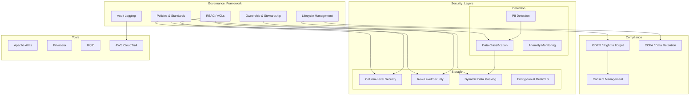

# Data Governance & Security

## Architecture at a Glance



## What is it?

**Data governance** is the framework of policies, processes, and tools that ensure data is managed properly across its lifecycle—covering ownership, quality, security, privacy, and compliance. **Data security** focuses on protecting data from unauthorized access through RBAC, column/row-level security, masking, encryption, and PII detection. Together they form the control plane for trustworthy, compliant data operations.

## Why it was created

As data platforms grew, so did risks: unauthorized access to PII, data breaches, regulatory fines (GDPR up to 4% of revenue), and data misuse. Without governance, teams couldn't answer basic questions: Who owns this dataset? Who accessed it? Is it compliant with retention policies? Data governance provides accountability, security provides protection, and together they enable safe data sharing at scale.

## When to use it

- Any organization handling PII, PHI, or financial data
- Companies operating under GDPR, CCPA, HIPAA, SOX, or PCI-DSS
- Multi-team data platforms where cross-team access needs guardrails
- When sharing data with third parties or across business units
- Before implementing a data mesh (domains need trust boundaries)
- When audit findings identify data access or retention gaps

## Hands-on Example: Column-Level Security in Snowflake

### Step 1: Create a masking policy

```sql
USE DATABASE security_db;
USE SCHEMA governance;

-- Masking policy for email
CREATE OR REPLACE MASKING POLICY mask_email AS
  (val STRING) RETURNS STRING ->
    CASE
      WHEN CURRENT_ROLE() IN ('DATA_STEWARD', 'COMPLIANCE_OFFICER',
                              'ACCOUNTADMIN') THEN val
      WHEN CURRENT_ROLE() = 'DATA_ENGINEER' THEN
        CONCAT(LEFT(val, 2), '****@', SPLIT_PART(val, '@', 2))
      ELSE '***REDACTED***'
    END;

-- Masking policy for SSN (always redact except for compliance)
CREATE OR REPLACE MASKING POLICY mask_ssn AS
  (val STRING) RETURNS STRING ->
    CASE
      WHEN CURRENT_ROLE() IN ('COMPLIANCE_OFFICER', 'ACCOUNTADMIN') THEN val
      ELSE 'XXX-XX-' || RIGHT(val, 4)
    END;

-- Masking policy for numeric salary (show range only)
CREATE OR REPLACE MASKING POLICY mask_salary AS
  (val NUMBER) RETURNS NUMBER ->
    CASE
      WHEN CURRENT_ROLE() IN ('DATA_STEWARD', 'COMPLIANCE_OFFICER',
                              'ACCOUNTADMIN', 'HR_MANAGER') THEN val
      ELSE FLOOR(val / 10000) * 10000
    END;
```

### Step 2: Apply masking policies to tables

```sql
-- Apply to customer table
ALTER TABLE analytics.customers
  MODIFY COLUMN email SET MASKING POLICY governance.mask_email;

ALTER TABLE analytics.customers
  MODIFY COLUMN ssn SET MASKING POLICY governance.mask_ssn;

-- Apply to HR table
ALTER TABLE hr.employees
  MODIFY COLUMN salary SET MASKING POLICY governance.mask_salary;

-- Apply to views (must use policy on underlying columns)
ALTER VIEW analytics.vip_customers
  MODIFY COLUMN email SET MASKING POLICY governance.mask_email;
```

### Step 3: Set up row-level security

```sql
-- Create a mapping table for allowed access
CREATE OR REPLACE TABLE governance.region_access (
    role_name    STRING,
    region       STRING,
    PRIMARY KEY (role_name, region)
);

INSERT INTO governance.region_access VALUES
    ('DATA_ENGINEER_EU', 'EU'),
    ('DATA_ENGINEER_EU', 'UK'),
    ('DATA_ENGINEER_NA', 'US'),
    ('DATA_ENGINEER_NA', 'CA');

-- Create secure view with row-level filter
CREATE OR REPLACE SECURE VIEW analytics.sales_secure AS
SELECT s.*
FROM raw.sales s
JOIN governance.region_access ra
  ON s.region = ra.region
WHERE ra.role_name = CURRENT_ROLE();

-- Grant access
GRANT SELECT ON analytics.sales_secure TO ROLE data_engineer_eu;
GRANT SELECT ON analytics.sales_secure TO ROLE data_engineer_na;
```

### Step 4: Set up audit logging

```sql
-- Query audit log for sensitive table access
SELECT
    query_text,
    query_type,
    role_name,
    user_name,
    start_time,
    end_time,
    rows_produced,
    BYTES_SCANNED
FROM SNOWFLAKE.ACCOUNT_USAGE.QUERY_HISTORY
WHERE query_text ILIKE '%analytics.customers%'
  AND query_type IN ('SELECT', 'UNLOAD')
  AND start_time >= DATEADD('day', -30, CURRENT_DATE)
ORDER BY start_time DESC;

-- Create alert for unusual access patterns
CREATE OR REPLACE ALERT sensitive_data_alert
  WAREHOUSE = COMPUTE_WH
  SCHEDULE = '10 MINUTE'
  IF (
    EXISTS (
      SELECT 1
      FROM SNOWFLAKE.ACCOUNT_USAGE.QUERY_HISTORY
      WHERE query_text ILIKE '%analytics.customers%'
        AND user_name IN (SELECT user_name FROM security_ops.suspicious_users)
        AND start_time >= DATEADD('minute', -10, CURRENT_DATE)
    )
  )
  THEN
    CALL system$send_email(
      'governance_alerts',
      'data-security@company.com',
      'Sensitive data access alert',
      'Suspicious access to customers table detected.'
    );
```

### Step 5: GDPR Right to Forget

```sql
-- Create a procedure for GDPR deletion
CREATE OR REPLACE PROCEDURE governance.gdpr_forget_user(
    p_user_email STRING
)
RETURNS STRING
LANGUAGE SQL
AS
$$
DECLARE
    deleted_count INTEGER;
BEGIN
    -- Anonymize or delete across all tables
    UPDATE analytics.customers
    SET
        email = CONENCT('gdpr-deleted-', user_id, '@company.com'),
        full_name = 'GDPR Redacted',
        phone = NULL,
        address = NULL,
        ssn = NULL,
        gdpr_deleted_at = CURRENT_TIMESTAMP
    WHERE email = :p_user_email;

    DELETE FROM analytics.orders WHERE customer_id IN
        (SELECT customer_id FROM analytics.customers WHERE email = :p_user_email);

    DELETE FROM analytics.support_tickets WHERE customer_email = :p_user_email;

    -- Log the deletion for audit
    INSERT INTO governance.gdpr_audit_log
        (action, user_identifier, executed_by, executed_at)
    VALUES
        ('RIGHT_TO_FORGET', :p_user_email, CURRENT_USER(), CURRENT_TIMESTAMP);

    RETURN 'GDPR forget completed for: ' || :p_user_email;
END;
$$;
```

## Best Practices

- **Mask at the platform level** (Snowflake masking policies) rather than in application code—prevents data leaks through any query path
- **Use the principle of least privilege**: grant only the roles and permissions needed; audit unused privileges quarterly
- **Separate governance roles**: create distinct roles for data steward, compliance officer, data engineer, and analyst with different data access levels
- **Automate PII detection**: use Apache Atlas (column classification), BigID, or Privacera to scan and tag sensitive columns automatically
- **Retain audit logs for at least 1 year** (longer for regulated industries); use immutable storage (S3 Object Lock) for tamper-proof logs
- **Tag data by sensitivity level**: `Public`, `Internal`, `Confidential`, `Restricted`—and enforce RBAC at each tier
- **Test masking policies** with `SELECT CURRENT_ROLE()` before deploying to production
- **Document data retention policies** per dataset (e.g., raw logs: 30 days, aggregated: 2 years, billing: 7 years)
- **Run annual compliance reviews** against GDPR/CCPA/HIPAA checklists

## Interview Questions

**Q1: Design a column-level security strategy for a healthcare data warehouse in Snowflake that must comply with HIPAA.**

A: (1) Classify columns using Apache Atlas or SQL tags: `PHI` (names, SSN, diagnosis), `Clinical` (lab results, procedures), `Derived` (aggregated metrics). (2) Create Snowflake masking policies per classification: full access for `CLINICIAN` and `COMPLIANCE_OFFICER`, masked (last 4 digits) for `DATA_SCIENTIST`, blocked for `ANALYST`. (3) Implement row-level security via a mapping table joining patient records to provider organizations (only see your org's patients). (4) Set up a secure view for research analytics that strips all PHI columns but preserves clinical aggregates. (5) Enable `CLASSIC` or `SNOWFLAKE` encryption at rest and enforce TLS for all connections. (6) Configure `SNOWFLAKE.ACCOUNT_USAGE.QUERY_HISTORY` alerts for any query touching PHI columns by unauthorized roles. (7) Run quarterly HIPAA compliance reports using `system$masking_policy_reference`.

**Q2: A data engineer accidentally ran `SELECT * FROM customers` and exported 5M PII records to their local machine. They reported it immediately. What's your incident response plan?**

A: (1) **Contain**: Revoke the engineer's Snowflake access immediately. Rotate their Snowflake password and any API keys. (2) **Assess scope**: Query `SNOWFLAKE.ACCOUNT_USAGE.QUERY_HISTORY` for the engineer's queries in the last 24 hours. Check if data was exported via `UNLOAD` or `COPY` statements. (3) **Investigate**: Check CloudTrail (if using S3 export) or Snowflake's `STAGE` operations. Determine which columns were retrieved, how many rows, and whether data left Snowflake's network. (4) **Notify**: Inform the DPO and legal team. If the export left the environment (downloaded to laptop or synced to S3), determine if the laptop is encrypted (BitLocker/FileVault). (5) **Remediate**: If data was exported to a cloud bucket, verify bucket encryption settings and rotate access keys. Wipe the local file using secure deletion. (6) **Post-mortem**: Add column-level masking so `SELECT *` on `customers` never exposes raw PII except for approved roles. Implement query monitoring alerts for high-volume exports.

**Q3: Compare Apache Atlas, Privacera, and BigID for PII detection and classification in a data lake on AWS.**

A: Apache Atlas is open-source, integrates with the Hadoop ecosystem (Hive, HBase, Kafka), and uses regex/classification rules to auto-tag columns. It's free but requires significant setup and has no ML-based detection. Privacera (founded by ex-Atlas engineers) extends Atlas with a SaaS control plane, supports AWS Glue, Snowflake, Databricks, and adds automated data lineage, policy management across platforms, and RBAC sync from Active Directory. It has a cost but reduces operational overhead. BigID uses ML-based classification (neural networks) to detect sensitive data even in unstructured formats (PDFs, images, logs). It offers data discovery, DSAR automation, and consent management. For a data lake on AWS: use Privacera if you need policy enforcement across multiple engines (Athena, Redshift, EMR); use BigID if you need deep scanning of unstructured data and consent management for CCPA/GDPR.

## Real Company Usage

| Company | Tools | Focus |
|---------|-------|-------|
| JPMorgan Chase | Apache Atlas + BigID + in-house | PII detection across 10,000+ datasets, automated column classification, and RBAC enforcement for regulatory compliance |
| Spotify | BigID + GDPR/CCPA automation | Automated DSAR (Data Subject Access Request) processing; scanning millions of tracks and user data for PII |
| Atlassian | Privacera + Snowflake masking | Column-level security for 50+ Snowflake databases; RBAC sync from Okta; automated policy for cross-team data access |
| Airbnb | Apache Atlas + Airflow (metadata integration) | Data classification and lineage tracking across their Hadoop ecosystem; integration with Data Portal catalog |
| Capital One | In-house (CloudSheriff) + Snowflake | Real-time RBAC enforcement, automated PII tagging, and audit logging across Snowflake and S3 |
