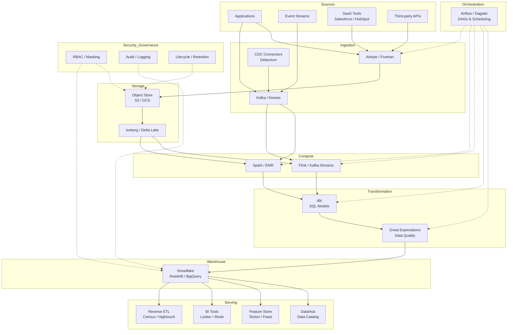

# Data Platform Architecture

## Architecture at a Glance



## What is it?

A **data platform** is the end-to-end infrastructure that ingests, stores, processes, transforms, and serves data for analytics, machine learning, and operational use cases. The modern data platform is modular, cloud-native, and best-of-breed—composed of specialized tools for each layer rather than a monolithic suite. This reference architecture covers ingestion (Airbyte, Kafka), storage (S3 + Iceberg), compute (Spark, Flink), transformation (dbt), warehousing (Snowflake), serving (reverse ETL, BI, feature store), orchestration (Airflow/Dagster), data quality (Great Expectations), catalog (DataHub), and security/governance.

## Why it was created

Legacy data platforms relied on monolithic ETL tools (Informatica, Talend) and on-premise data warehouses that couldn't scale with cloud data volumes, streaming data, or diverse analytical workloads. Teams needed a modular, scalable architecture where each layer could be independently upgraded, scaled, and owned by different teams. The modern data platform enables data mesh (domain ownership), real-time analytics, ML at scale, and cost-efficient storage while maintaining governance and quality.

## When to use it

- Building a greenfield data platform for a mid-to-large organization
- Migrating from legacy on-premise data warehousing to cloud-native architecture
- Implementing data mesh with domain ownership
- Supporting both batch and real-time analytics use cases
- Scaling beyond a single warehouse (50+ TB, 100+ data sources, 500+ users)
- When you need to serve data to BI, ML, reverse ETL, and operational systems

## Hands-on Example: Reference Architecture for a Mid-Size Company

### Step 1: Infrastructure as Code (Terraform)

```hcl
# main.tf — Data Platform Infrastructure
provider "aws" {
  region = "us-east-1"
}

# S3 with Iceberg-compatible layout
resource "aws_s3_bucket" "data_lake" {
  bucket = "company-data-lake-prod"
}

resource "aws_s3_bucket_lifecycle_configuration" "data_lake_lifecycle" {
  bucket = aws_s3_bucket.data_lake.id

  rule {
    id     = "raw-delete-after-30-days"
    status = "Enabled"
    filter {
      prefix = "raw/"
    }
    expiration {
      days = 30
    }
  }

  rule {
    id     = "iceberg-transition-to-glacier"
    status = "Enabled"
    filter {
      prefix = "iceberg/"
    }
    transitions {
      days          = 90
      storage_class = "GLACIER"
    }
  }
}

# MSK (Managed Kafka) for streaming
resource "aws_msk_cluster" "events" {
  cluster_name           = "data-platform-events"
  kafka_version          = "3.5.0"
  number_of_broker_nodes = 3

  broker_node_group_info {
    instance_type   = "kafka.m5.large"
    client_subnets  = var.private_subnet_ids
    security_groups = [aws_security_group.kafka.id]
  }
}

# Snowflake via Snowflake provider (terraform-provider-snowflake)
resource "snowflake_warehouse" "transforming" {
  name           = "TRANSFORMING_WH"
  warehouse_size = "MEDIUM"
  auto_suspend   = 60
  auto_resume    = true
}

resource "snowflake_database" "analytics" {
  name = "ANALYTICS"
}

resource "snowflake_role" "transformer" {
  name = "TRANSFORMER"
}

resource "snowflake_warehouse_grant" "transformer_wh" {
  warehouse_name = snowflake_warehouse.transforming.name
  privilege      = "USAGE"
  roles          = [snowflake_role.transformer.name]
}
```

### Step 2: Orchestration Setup (Airflow)

```python
# dags/data_platform_pipeline.py
from datetime import datetime, timedelta
from airflow import DAG
from airflow.providers.snowflake.operators.snowflake import SnowflakeOperator
from airflow.providers.apache.kafka.operators.kafka import KafkaConsumerOperator
from airflow.providers.dbt.cloud.operators.dbt import DbtCloudRunJobOperator
from airflow.operators.trigger_dagrun import TriggerDagRunOperator

default_args = {
    "owner": "data-platform",
    "depends_on_past": False,
    "email_on_failure": True,
    "retries": 1,
    "retry_delay": timedelta(minutes=5),
}

with DAG(
    dag_id="data_platform_orchestration",
    start_date=datetime(2025, 1, 1),
    schedule_interval="@hourly",
    catchup=False,
    default_args=default_args,
    tags=["platform"],
) as dag:

    # Step 1: Ingestion (Airbyte sync)
    trigger_airbyte_sync = TriggerDagRunOperator(
        task_id="trigger_airbyte_sync",
        trigger_dag_id="airbyte_ingestion",
        wait_for_completion=True,
    )

    # Step 2: Spark batch processing on Iceberg
    spark_etl = SparkSqlOperator(
        task_id="spark_iceberg_etl",
        sql="""
        MERGE INTO prod.iceberg.orders t
        USING staging.orders s ON t.order_id = s.order_id
        WHEN MATCHED THEN UPDATE SET *
        WHEN NOT MATCHED THEN INSERT *
        """,
        conf={
            "spark.sql.extensions": "org.apache.iceberg.spark.extensions.IcebergSparkSessionExtensions",
            "spark.sql.catalog.prod": "org.apache.iceberg.spark.SparkCatalog",
            "spark.sql.catalog.prod.type": "hadoop",
            "spark.sql.catalog.prod.warehouse": "s3://company-data-lake-prod/iceberg",
        },
    )

    # Step 3: dbt transformations
    dbt_run = DbtCloudRunJobOperator(
        task_id="dbt_run",
        dbt_cloud_conn_id="dbt_cloud",
        job_id=12345,
        check_interval=30,
        timeout=1800,
    )

    # Step 4: Data quality checks
    great_expectations_check = GreatExpectationsOperator(
        task_id="great_expectations_check",
        data_context_root_dir="/usr/local/airflow/include/great_expectations",
        checkpoint_name="prod.analytics.orders",
    )

    # Step 5: DataHub metadata ingestion
    trigger_datahub_ingest = TriggerDagRunOperator(
        task_id="trigger_datahub_ingestion",
        trigger_dag_id="datahub_metadata_ingestion",
        wait_for_completion=False,
    )

    # Step 6: Reverse ETL (Census sync)
    census_sync = CensusOperator(
        task_id="census_customer_sync",
        connection_id="census_default",
        sync_id=12345,
    )

    (
        trigger_airbyte_sync
        >> spark_etl
        >> dbt_run
        >> great_expectations_check
        >> [trigger_datahub_ingest, census_sync]
    )
```

### Step 3: dbt Project Configuration

```yaml
# dbt_project.yml
name: 'analytics'
version: '1.0'
profile: 'snowflake'

model-paths: ["models"]
test-paths: ["tests"]

models:
  analytics:
    staging:
      +materialized: view
      +schema: staging
      +tags: ["staging"]

    intermediate:
      +materialized: ephemeral
      +schema: intermediate
      +tags: ["intermediate"]

    marts:
      +materialized: table
      +schema: marts
      +tags: ["marts", "gold"]

    metrics:
      +materialized: table
      +schema: metrics
      +tags: ["metrics"]
```

### Step 4: Data Quality (Great Expectations)

```yaml
# great_expectations/checkpoints/prod_orders.yml
name: prod.analytics.orders
config_version: 3.0

batch_request:
  datasource_name: snowflake
  data_asset_name: analytics.orders

expectations:
  - expect_table_row_count_to_be_between:
      min_value: 10000
      max_value: 10000000

  - expect_column_values_to_not_be_null:
      column: order_id

  - expect_column_values_to_be_unique:
      column: order_id

  - expect_column_values_to_be_in_set:
      column: status
      value_set: ["placed", "shipped", "delivered", "cancelled"]

  - expect_column_proportion_of_unique_values_to_be_between:
      column: customer_id
      min_value: 0.01

action_list:
  - name: notify_slack_on_failure
    action:
      class_name: SlackNotificationAction
      slack_webhook: ${SLACK_DATA_QUALITY_WEBHOOK}
      notify_on: failure
```

## Data Platform Maturity Model

| Level | Name | Characteristics | Tools |
|-------|------|----------------|-------|
| **Level 0** | Ad-hoc | Excel + CSVs, no central warehouse, no governance, manual processes | Excel, Google Sheets, manual SQL |
| **Level 1** | Foundational | Centralized warehouse (Snowflake/Redshift), basic ETL, some dashboards | Stage/transformation in SQL, Looker/Tableau |
| **Level 2** | Standardized | Batch pipeline orchestration (Airflow), dbt for transformations, basic catalog, some testing | Airflow, dbt, Great Expectations, DataHub |
| **Level 3** | Automated | Real-time streaming (Kafka/Flink), reverse ETL, automated governance (RBAC/masking), data mesh domains | Kafka, Flink, Census, Privacera, Iceberg |
| **Level 4** | Intelligent | ML-powered operations, auto-scaling, self-service data products, data contracts, cost optimization AI | ML pipelines, Auto-scaling, Data contracts, Cost intelligence |

## Cost Optimization Strategies

- **Tiered storage**: Use S3 lifecycle policies to move old data to Glacier/Deep Archive (90% cost reduction for cold data)
- **Warehouse auto-suspend**: Snowflake auto-suspend after 60s idle; save 30–50% on credit consumption
- **Partition pruning**: Partition Iceberg tables by date; queries that filter on date scan 90% fewer files
- **Materialized views vs raw queries**: Pre-aggregate at the transformation layer to reduce warehouse compute
- **Spot instances for Spark**: Run EMR on spot instances (60–80% cheaper than on-demand); use checkpointing for resilience
- **Compress and compact**: Run Iceberg compaction for small files; read fewer Parquet/ORC files
- **Right-size Kafka partitions**: Too many partitions = broker overhead; too few = consumer lag. Target 4–8 partitions per broker
- **Eliminate stale pipelines**: Audit Airflow DAGs quarterly; remove orphaned pipelines

## Best Practices

- **Build in layers, not monoliths**: Each layer (ingestion, storage, compute, transformation, serving) should be independently deployable and swappable
- **Use Iceberg/Delta Lake** for your data lake format: ACID transactions, time travel, schema evolution, and partition evolution
- **Treat your data platform as a product**: Define SLAs for freshness, availability, and query latency per data product
- **Implement data contracts** between producers (source systems) and consumers (analytics/ML) to prevent breaking changes
- **Automate everything**: Infrastructure (Terraform/Pulumi), orchestration (Airflow/Dagster), testing (Great Expectations), and metadata (DataHub)
- **Separate environments**: Use dev/staging/prod with data subsetting for cost control in dev
- **Monitor end-to-end latency**: Track time from event creation to availability in warehouse and dashboards
- **Plan for cost observability**: Tag all resources, allocate costs per team/domain, and review monthly

## Interview Questions

**Q1: Design a data platform for a mid-size e-commerce company (100M events/day, 50 TB warehouse, 200 employees). Include ingestion, storage, transformation, serving, and governance.**

A: **Ingestion**: Airbyte for SaaS sources (Shopify, Salesforce) and Kafka + Debezium for CDC from PostgreSQL (orders DB). Fivetran for secondary SaaS as backup. **Storage**: S3 data lake partitioned by source + date, using Iceberg format for ACID. **Compute**: Spark on EMR for hourly batch ETL (Iceberg merges), Flink for real-time enrichment (sessionization of clickstream). **Transformation**: dbt in Snowflake for dimensional modeling (Kimball star schema) with staging/intermediate/marts layers. **Serving**: Looker for BI, Census for reverse ETL to Salesforce/HubSpot, Tecton for feature store (ML use cases), DataHub for catalog. **Orchestration**: Dagster with partitioned assets, monitoring via PagerDuty. **Governance**: Snowflake RBAC with column-level masking for PII, Privacera for policy management, 90-day audit log retention. **Cost**: Auto-suspend Snowflake, spot instances for Spark, S3 lifecycle to Glacier after 90 days.

**Q2: Your company is moving from a monolithic Redshift setup to a modular data platform. What's your migration strategy?**

A: (1) **Assessment phase**: Catalog all current ETL jobs, BI reports, and data consumers. Identify dependencies and critical SLAs. (2) **Parallel run**: Set up the new platform (S3+Iceberg, Airbyte, dbt, Snowflake) alongside Redshift. Use Airflow to orchestrate both. (3) **Lift and shift** the simplest pipelines first: SaaS integrations (Salesforce, HubSpot) via Airbyte into Snowflake. (4) **Phased migration**: Move staging transforms to dbt, then intermediate layers, then marts. Run reconciliation queries daily to ensure parity. (5) **Cutover**: When parallel runs show < 0.1% discrepancy for 2 weeks, redirect all consumers to Snowflake. (6) **Decommission**: Retain Redshift as read-only for 30 days, then decommission. Key risk: maintaining consistency between the old and new platform during migration.

**Q3: How do you implement cost observability across a modern data platform with Snowflake, Spark on EMR, Kafka, and S3?**

A: (1) **Tag all resources** with `cost_center`, `team`, `environment`, and `purpose` tags in AWS and Snowflake. (2) **Snowflake**: Use `ACCOUNT_USAGE.WAREHOUSE_METERING_HISTORY` and `QUERY_HISTORY` to attribute credit usage to queries/users/roles. Allocate by `ROLE` (analyst vs transformer). (3) **EMR**: Use `aws emr describe-cluster` cost allocation tags; track per-job costs by reading `yarn` logs and EMR step durations. (4) **Kafka**: MSK cost is per-broker; attribute by partition count and throughput per topic. (5) **S3**: Use S3 Storage Lens + cost allocation tags to track storage costs by bucket prefix. (6) **Dashboard**: Build a data cost dashboard in Looker/Mode aggregating all sources, showing cost per team per month, cost per query, and cost per TB scanned. Set budget alerts (e.g., 80% of monthly budget triggers Slack notification). (7) **Optimization loop**: Monthly review of top 10 most expensive queries, top 5 most expensive pipelines, and S3 storage by lifecycle stage.

## Real Company Usage

| Company | Architecture Stack | Scale |
|---------|-------------------|-------|
| Airbnb | Kafka + Spark + Hadoop(legacy) → Iceberg + Flink + dbt + Snowflake | 5 PB+ data lake, 10,000+ scheduled pipelines, 500+ data consumers |
| Stripe | Fivetran + Kafka + Spark + dbt + Snowflake + Airflow + Looker | 3,000+ dbt models, 1,000+ Snowflake warehouses (per-account isolation), 100+ TB analytical data |
| DoorDash | Airbyte + Kafka + Flink + Spark + dbt + Snowflake + Dagster + DataHub | 500+ microservices, 200M events/day, 50+ TB Snowflake, ML feature store (Feast) |
| Shopify | Debezium CDC + Kafka + Flink + Iceberg (Trino) + dbt + Airflow | 5+ PB data lake (Iceberg), 100k+ queries/day via Trino, 2,000+ dbt models |
| Slack | Kafka + Spark + ClickHouse + Airflow + Google Dataproc | 1B+ messages/day, 200+ TB analytical data, real-time operational dashboards |
