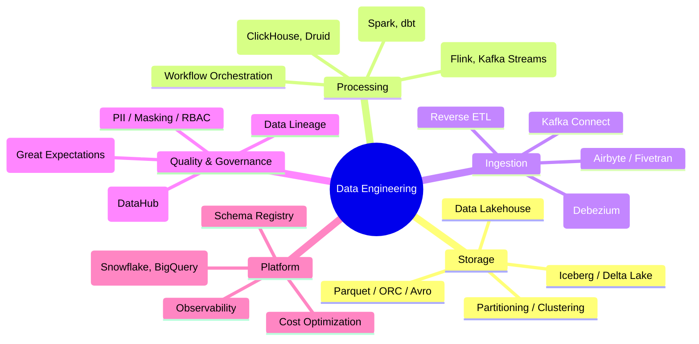
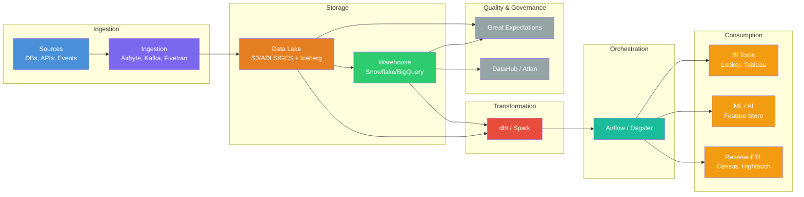

# 26 — Data Engineering

> Master the design, architecture, and operation of data pipelines, warehouses, lakehouses, streaming systems, and the modern data stack — from ingestion to analytics to ML.

## Module Overview

Data Engineering is the foundation of every data-driven organization. This module covers the full data lifecycle: ingestion, storage, transformation, orchestration, quality, governance, and reverse ETL. Each file dives into architecture, hands-on examples, best practices, and real-world usage.

## Topics

| # | File | Topics |
|---|------|--------|
| 01 | [Data Engineering Overview](01-data-engineering-overview.md) | Modern data stack, data pipeline architecture, data engineer role |
| 02 | [Data Lakehouse Architecture](02-data-lakehouse-architecture.md) | Lake vs warehouse vs lakehouse, Apache Iceberg, Delta Lake, Hudi |
| 03 | [Batch Processing](03-batch-processing.md) | Spark, dbt, ETL/ELT, Kimball vs Inmon, incremental models |
| 04 | [Stream Processing](04-stream-processing.md) | Kafka, Kafka Streams, Flink, streaming patterns, exactly-once |
| 05 | [Schema Registry & Evolution](05-schema-registry-evolution.md) | Avro/Protobuf/JSON Schema, compatibility, schema migration |
| 06 | [Data Quality](06-data-quality.md) | Great Expectations, data profiling, observability, anomaly detection |
| 07 | [ETL & ELT Pipelines](07-etl-elt-pipelines.md) | Airbyte, Fivetran, dbt, data ingestion strategies, incremental syncs |
| 08 | [Data Warehousing](08-data-warehousing.md) | Snowflake, BigQuery, Redshift, Databricks SQL, architecture comparison |
| 09 | [Data Lake Storage](09-data-lake-storage.md) | S3/ADLS/GCS, file formats (Parquet, ORC, Avro), partitioning, compression |
| 10 | [Workflow Orchestration](10-workflow-orchestration.md) | Airflow, Prefect, Dagster, DAGs, retries, SLAs, observability |
| 11 | [Data Catalog & Metadata](11-data-catalog-metadata.md) | DataHub, Amundsen, Atlan, data discovery, lineage, ownership |
| 12 | [Real-Time Analytics](12-real-time-analytics.md) | ClickHouse, Druid, Pinot, real-time dashboards, OLAP vs OLTP |
| 13 | [Reverse ETL](13-reverse-etl.md) | Census, Hightouch, operational data, CDP, audience sync |
| 14 | [Data Governance & Security](14-data-governance-security.md) | RBAC, column-level security, masking, PII, compliance (GDPR/SOC2) |
| 15 | [Data Platform Architecture](15-data-platform-architecture.md) | End-to-end platform design, cost optimization, maturity model |

## Learning Path

1. **Start with the overview** (01) — understand the modern data stack and how pieces fit together
2. **Master storage** (02, 09) — data lakehouse architecture and file formats are the foundation
3. **Learn processing patterns** (03, 04) — batch and stream processing for different latency needs
4. **Build pipelines** (07, 10) — ETL/ELT, orchestration, and scheduling
5. **Enforce quality and governance** (06, 11, 14) — data quality, catalog, and security
6. **Enable analytics** (08, 12) — warehousing, real-time analytics, and BI consumption
7. **Close the loop** (13) — reverse ETL for operational data activation
8. **Put it together** (05, 15) — schema management and end-to-end platform architecture

## Prerequisites

- Basic understanding of databases and SQL
- Familiarity with cloud storage (S3, GCS, ADLS)
- Some experience with Python or JVM languages
- Understanding of basic data modeling concepts

---

Previous: [25 — Clean Architecture & Design Patterns](../25-Clean-Architecture-Design-Patterns/README.md)
Next: [27 — Frontend System Design](../27-Frontend-System-Design/README.md)
