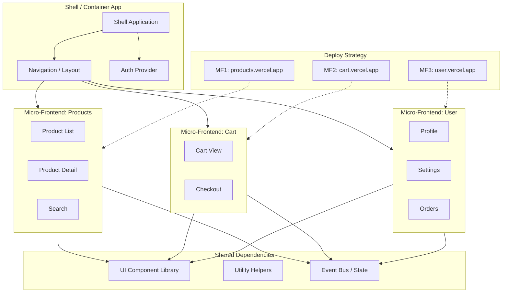

# Micro-Frontends

## Architecture at a Glance



## What is it?

Micro-frontends extend microservices principles to the frontend: decompose a monolithic web application into smaller, independent applications owned by separate teams, each responsible for its own domain, development lifecycle, and deployment. These fragments are composed at runtime or build-time into a cohesive user experience. Integration approaches include Webpack 5 Module Federation, iframes, Web Components, and custom script-loading strategies.

## Why it was created

Frontend monoliths grow uncontrollably in large organizations — deployment coordination becomes a bottleneck, teams step on each other's code, tech stack upgrades require rewrites, and a single bug can take down the entire application. Micro-frontends let teams work autonomously on independent deployables, choose their own technology stack, scale delivery velocity, and isolate failures to a single micro-frontend.

## When to use it

| Approach | Best For |
|---|---|
| Module Federation | Large SPAs with shared dependency management, runtime integration |
| iframes | Strong isolation, legacy integrations, third-party embeds |
| Web Components | Framework-agnostic component distribution |
| Build-time (monorepo) | Small teams wanting code sharing without runtime overhead |
| Edge-Side Includes (ESI) | Server-side composition for SSR apps |

## Hands-on Example — Module Federation with React

```tsx
// host/webpack.config.js — Host Application
const { ModuleFederationPlugin } = require("webpack").container;
const deps = require("./package.json").dependencies;

module.exports = {
  mode: "development",
  devServer: { port: 3000 },
  plugins: [
    new ModuleFederationPlugin({
      name: "host",
      remotes: {
        products: "products@http://localhost:3001/remoteEntry.js",
        cart: "cart@http://localhost:3002/remoteEntry.js",
      },
      shared: {
        react: { singleton: true, requiredVersion: deps.react },
        "react-dom": { singleton: true, requiredVersion: deps["react-dom"] },
        "react-router-dom": { singleton: true },
      },
    }),
  ],
};
```

```tsx
// products/webpack.config.js — Products Micro-Frontend
const { ModuleFederationPlugin } = require("webpack").container;
const deps = require("./package.json").dependencies;

module.exports = {
  mode: "development",
  devServer: { port: 3001 },
  plugins: [
    new ModuleFederationPlugin({
      name: "products",
      filename: "remoteEntry.js",
      exposes: {
        "./ProductList": "./src/ProductList",
        "./ProductDetail": "./src/ProductDetail",
      },
      shared: {
        react: { singleton: true, requiredVersion: deps.react },
        "react-dom": { singleton: true, requiredVersion: deps["react-dom"] },
      },
    }),
  ],
};
```

```tsx
// host/src/App.tsx — Host Consuming Remote Components
import React, { Suspense } from "react";
import { BrowserRouter, Routes, Route, Link } from "react-router-dom";

// Lazy-load micro-frontends at runtime
const ProductList = React.lazy(() => import("products/ProductList"));
const ProductDetail = React.lazy(() => import("products/ProductDetail"));
const CartView = React.lazy(() => import("cart/CartView"));

function App() {
  return (
    <BrowserRouter>
      <nav>
        <Link to="/">Home</Link>
        <Link to="/products">Products</Link>
        <Link to="/cart">Cart</Link>
      </nav>

      <Suspense fallback={<div>Loading...</div>}>
        <Routes>
          <Route path="/products" element={<ProductList />} />
          <Route path="/products/:id" element={<ProductDetail />} />
          <Route path="/cart" element={<CartView />} />
        </Routes>
      </Suspense>
    </BrowserRouter>
  );
}
```

```tsx
// shared/event-bus.ts — Cross-App Communication via Custom Events
type MicroFrontendEvent = {
  type: "NAVIGATE" | "ADD_TO_CART" | "USER_LOGOUT";
  payload: unknown;
};

const EVENT_BUS_NAME = "mf:event";

export function publish(event: MicroFrontendEvent) {
  window.dispatchEvent(new CustomEvent(EVENT_BUS_NAME, { detail: event }));
}

export function subscribe(handler: (event: MicroFrontendEvent) => void) {
  const listener = (e: Event) => handler((e as CustomEvent).detail);
  window.addEventListener(EVENT_BUS_NAME, listener);
  return () => window.removeEventListener(EVENT_BUS_NAME, listener);
}
```

```tsx
// Shared Dependency Strategy: singleton react + react-dom
// In each micro-frontend's webpack config:
shared: {
  react: {
    singleton: true,
    requiredVersion: "^18.0.0",
    eager: false,
  },
}
```

## Best Practices

- Keep shared dependencies minimal and version-pinned — only share truly global infra (React, router, i18n)
- Use a shell/container app for layout, auth, and navigation — never duplicate these in micro-frontends
- Adopt semantic versioning for remoteEntry.js breakage detection
- Design cross-team contracts (event bus shape, route conventions, auth tokens) before coding
- Eager load the shell and priority routes; lazy load less-visited micro-frontends
- Use integration testing (Cypress, Playwright) across micro-frontend boundaries, not just unit tests
- Deploy each micro-frontend independently with its own CI/CD pipeline and canary deploys
- Implement consistent error boundaries per micro-frontend to isolate crashes

## Interview Questions

**Q1: Compare Module Federation (Webpack 5) vs iframes for micro-frontend composition.**

A: Module Federation loads remote JS chunks at runtime into the same JS context — shared dependencies are deduplicated as singletons, DOM is shared, CSS can conflict, and communication is direct (function calls, shared store). Iframes provide true DOM/CSS/JS isolation with postMessage communication, but at the cost of UX friction — no shared scroll, no keyboard nav across boundaries, harder to theme consistently, and significant memory overhead. Use Module Federation for same-origin SPAs needing high integration; use iframes for third-party widgets, legacy apps, or when security isolation is paramount.

**Q2: How do you handle inter-micro-frontend communication without coupling them?**

A: Use a shared event bus via `window.dispatchEvent` / `CustomEvent` with a well-defined contract (typed event shapes). Alternatively, a shared reactive store (Zustand with external store, or a tiny Redux store) can be emitted as a shared singleton via Module Federation. For routing, the shell app owns the router and passes route params down via props or context. Never share internal state directly — each micro-frontend should own its domain state and only emit high-level domain events (e.g., "item added to cart") that others subscribe to.

**Q3: What are the main challenges with micro-frontend testing and deployment?**

A: Testing challenges: integration bugs across micro-frontend boundaries are hard to catch in isolation; E2E tests must span multiple independently-deployed apps; shared dependency version mismatches can cause silent failures. Deployment challenges: coordinating releases when breaking changes cross boundaries; version skew when different micro-frontends are deployed at different times; ensuring backward compatibility of exposed APIs (exposed components should accept optional new props). Solutions: contract testing (Pact); canary deployments; feature flags for cross-cutting changes; versioned remoteEntry files; and a CI pipeline that runs cross-repo integration suites.

## Real Company Usage

| Company | Approach | Why |
|---|---|---|
| IKEA | Module Federation | 12+ teams own distinct domains (product, cart, checkout, planning tools) deployed independently via Webpack 5 |
| Spotify | Custom iframe + Web Components | Each feature squad ships a standalone "deck" with its own tech stack; iframes isolate legacy vs modern |
| DAZN | Module Federation + Shared Store | Video platform with live streaming, schedules, subscriptions — each domain deployed independently, shared auth and player state via federated singletons |
| Zalando | Build-time monorepo (Nx) | 30+ frontend modules in a monorepo with shared lint/test/build pipeline, deployed as a single artifact for consistent checkout experience |
| HelloFresh | Module Federation + AWS S3 | Each micro-frontend deployed to separate S3 buckets with versioned remote entries, composed by a shell app hosted on CloudFront |
