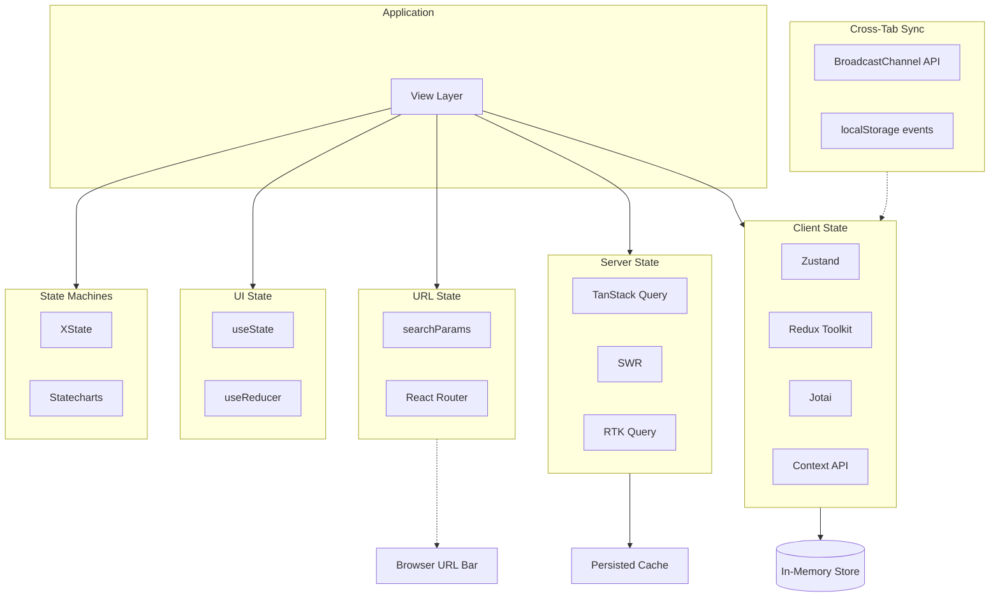

# State Management

## Architecture at a Glance



## What is it?

State management governs how an application creates, reads, updates, and synchronizes data across components, tabs, and network boundaries. It's categorized by data origin: **client state** (UI theme, modal open/close), **server state** (API data, caching, pagination), **URL state** (search params, route), **UI state** (form input, hover), and **machine state** (complex workflows). Modern patterns favor specialized tools per category over a single global store.

## Why it was created

Early React apps stuffed everything into a single Redux store — server data, UI state, form fields — creating massive action/reducer boilerplate and stale cache issues. Developers realized API data needs different treatment (caching, deduplication, background refetch) than client-only state. URL state was ignored entirely, causing broken back-button behavior. State machines emerged to model complex flows (auth, checkout) that are error-prone with boolean flags. The split into categories lets each tool optimize for its domain.

## When to use it

| Category | Tool | When |
|---|---|---|
| Client state | Zustand | Global app state without boilerplate |
| Client state | Redux Toolkit | Large teams, complex state logic, middleware needs |
| Client state | Jotai | Atomic state with React-centric API |
| Server state | TanStack Query | Any API data fetching, caching, pagination |
| Server state | SWR | Lightweight fetching with stale-while-revalidate |
| Server state | RTK Query | Already on Redux Toolkit, want integrated data fetching |
| URL state | Next.js searchParams | Server components, RSC data filtering |
| UI state | useState/useReducer | Local component state, forms |
| State machines | XState | Complex workflows, visual statechart editing |
| Cross-tab | BroadcastChannel | Syncing state across browser tabs |

## Hands-on Example — Zustand + TanStack Query + XState

```tsx
// store/cart-store.ts — Zustand for client state
import { create } from "zustand";
import { persist } from "zustand/middleware";

type CartItem = { productId: string; name: string; price: number; quantity: number };

type CartStore = {
  items: CartItem[];
  isOpen: boolean;
  addItem: (item: CartItem) => void;
  removeItem: (productId: string) => void;
  setOpen: (open: boolean) => void;
  totalItems: () => number;
};

export const useCartStore = create<CartStore>()(
  persist(
    (set, get) => ({
      items: [],
      isOpen: false,
      addItem: (item) => {
        const existing = get().items.find((i) => i.productId === item.productId);
        if (existing) {
          set({
            items: get().items.map((i) =>
              i.productId === item.productId
                ? { ...i, quantity: i.quantity + 1 }
                : i
            ),
          });
        } else {
          set({ items: [...get().items, { ...item, quantity: 1 }] });
        }
      },
      removeItem: (productId) =>
        set({ items: get().items.filter((i) => i.productId !== productId) }),
      setOpen: (open) => set({ isOpen: open }),
      totalItems: () => get().items.reduce((acc, i) => acc + i.quantity, 0),
    }),
    { name: "cart-storage" } // persists to localStorage
  )
);
```

```tsx
// hooks/use-products.ts — TanStack Query for server state
import { useQuery, useMutation, useQueryClient } from "@tanstack/react-query";

type Product = { id: string; name: string; price: number; stock: number };
type ProductFilters = { category?: string; minPrice?: number; page?: number };

async function fetchProducts(filters: ProductFilters): Promise<Product[]> {
  const params = new URLSearchParams(
    Object.entries(filters).filter(([_, v]) => v !== undefined).map(([k, v]) => [k, String(v)])
  );
  const res = await fetch(`/api/products?${params}`);
  if (!res.ok) throw new Error("Failed to fetch products");
  return res.json();
}

export function useProducts(filters: ProductFilters) {
  return useQuery({
    queryKey: ["products", filters],
    queryFn: () => fetchProducts(filters),
    staleTime: 30_000, // 30s before refetch
    placeholderData: (prev) => prev, // keep previous data while fetching next page
  });
}

export function useUpdateStock() {
  const queryClient = useQueryClient();

  return useMutation({
    mutationFn: async ({ productId, stock }: { productId: string; stock: number }) => {
      const res = await fetch(`/api/products/${productId}`, {
        method: "PATCH",
        body: JSON.stringify({ stock }),
      });
      if (!res.ok) throw new Error("Failed to update stock");
      return res.json();
    },
    onSuccess: () => {
      // Invalidate and refetch all product queries
      queryClient.invalidateQueries({ queryKey: ["products"] });
    },
  });
}
```

```tsx
// machines/checkout-machine.ts — XState for complex workflows
import { createMachine, assign } from "xstate";
import { useMachine } from "@xstate/react";

type CheckoutContext = {
  cartId: string | null;
  shippingAddress: Record<string, string> | null;
  paymentIntentId: string | null;
  error: string | null;
};

type CheckoutEvent =
  | { type: "START_CHECKOUT"; cartId: string }
  | { type: "SET_ADDRESS"; address: Record<string, string> }
  | { type: "SUBMIT_PAYMENT" }
  | { type: "PAYMENT_SUCCESS"; paymentIntentId: string }
  | { type: "PAYMENT_FAILURE"; error: string }
  | { type: "RETRY" }
  | { type: "CANCEL" };

export const checkoutMachine = createMachine<CheckoutContext, CheckoutEvent>({
  id: "checkout",
  initial: "idle",
  states: {
    idle: {
      on: { START_CHECKOUT: { target: "shipping", actions: assign({ cartId: (_, e) => e.cartId }) } },
    },
    shipping: {
      on: {
        SET_ADDRESS: { target: "payment", actions: assign({ shippingAddress: (_, e) => e.address }) },
        CANCEL: { target: "idle" },
      },
    },
    payment: {
      on: {
        SUBMIT_PAYMENT: { target: "processing" },
        CANCEL: { target: "shipping" },
      },
    },
    processing: {
      on: {
        PAYMENT_SUCCESS: { target: "success", actions: assign({ paymentIntentId: (_, e) => e.paymentIntentId }) },
        PAYMENT_FAILURE: { target: "error", actions: assign({ error: (_, e) => e.error }) },
      },
    },
    success: {
      type: "final",
    },
    error: {
      on: {
        RETRY: { target: "payment" },
        CANCEL: { target: "idle" },
      },
    },
  },
});

// Component usage
export function CheckoutPage() {
  const [state, send] = useMachine(checkoutMachine);

  return (
    <div>
      {state.matches("idle") && (
        <button onClick={() => send({ type: "START_CHECKOUT", cartId: "cart-123" })}>
          Start Checkout
        </button>
      )}
      {state.matches("shipping") && <AddressForm onComplete={(addr) => send({ type: "SET_ADDRESS", address: addr })} />}
      {state.matches("payment") && <PaymentForm onSubmit={() => send({ type: "SUBMIT_PAYMENT" })} />}
      {state.matches("processing") && <Spinner />}
      {state.matches("success") && <OrderConfirmation />}
      {state.matches("error") && (
        <div>
          <p>Error: {state.context.error}</p>
          <button onClick={() => send({ type: "RETRY" })}>Retry</button>
        </div>
      )}
    </div>
  );
}
```

```tsx
// hooks/use-url-filters.ts — URL state with Next.js searchParams
import { usePathname, useRouter, useSearchParams } from "next/navigation";
import { useCallback } from "react";

export function useUrlFilters() {
  const searchParams = useSearchParams();
  const router = useRouter();
  const pathname = usePathname();

  const filters = {
    category: searchParams.get("category") || undefined,
    minPrice: searchParams.get("minPrice") || undefined,
    page: Number(searchParams.get("page")) || 1,
  };

  const setFilters = useCallback(
    (update: Partial<typeof filters>) => {
      const params = new URLSearchParams(searchParams);
      Object.entries(update).forEach(([key, value]) => {
        if (value === undefined || value === "") {
          params.delete(key);
        } else {
          params.set(key, String(value));
        }
      });
      router.push(`${pathname}?${params.toString()}`);
    },
    [pathname, router, searchParams]
  );

  return { filters, setFilters };
}
```

```tsx
// utils/cross-tab-sync.ts — Cross-tab state sync with BroadcastChannel
export function createCrossTabSync<T>(key: string, initial: T) {
  const channel = new BroadcastChannel(`state:${key}`);

  return {
    subscribe: (onMessage: (data: T) => void) => {
      channel.onmessage = (event) => onMessage(event.data);
      return () => channel.close();
    },
    broadcast: (data: T) => {
      channel.postMessage(data);
    },
  };
}

// Usage with Zustand:
// const cartSync = createCrossTabSync("cart", []);
// useEffect(() => {
//   const unsub = cartSync.subscribe((data) => useCartStore.setState({ items: data }));
//   return unsub;
// }, []);
```

## Best Practices

- Use TanStack Query for ALL server data — it handles caching, dedup, refetch, and pagination automatically
- Keep client state minimal: only store truly global UI state (theme, sidebar open, auth token)
- Derive computed values instead of storing them (use Zustand selectors or Jotai derived atoms)
- Store filter/search state in URL searchParams for shareable/bookmarkable URLs
- Use `useReducer` for complex local component state; Zustand for cross-component state
- Model workflows as state machines (XState) when state transitions have side effects or complex guards
- Normalize nested API responses with tools like `normalizr` or TanStack Query's `select` for referential stability
- Persist only critical state (cart, auth) via middleware; avoid persisting transient UI state

## Interview Questions

**Q1: Why should server state be managed separately from client state?**

A: Server state (API data) has fundamentally different requirements than client state: it needs cache invalidation, background refetch, deduplication of concurrent requests, optimistic updates, retry logic, and stale-while-revalidate patterns. Managing these with a generic Redux/Zustand store requires manually writing thunks/sagas for every API call, tracking loading/error states, and implementing cache eviction. Tools like TanStack Query handle all of this declaratively — they deduplicate fetches, provide `staleTime`/`gcTime` configs, auto-refetch on window focus, and integrate with React's Suspense. Mixing server and client state also leads to stale data displayed to users because the store has no concept of server freshness.

**Q2: Explain the trade-offs between Zustand, Redux Toolkit, and Jotai.**

A: **Zustand**: minimal boilerplate, no provider needed, works outside React, ideal for medium apps and shared libs. **Redux Toolkit**: best for large teams enforcing patterns — `createSlice` + `createAsyncThunk` give structured code, middleware ecosystem (saga, thunk, listeners), DevTools integration, and TypeScript inference. The cost is boilerplate and conceptual overhead (actions, reducers, slices, store config). **Jotai**: atom-based, React-centric, great for fine-grained re-renders and composable derived state. Worse for accessing state outside React or migrating away from React. Choose Zustand for simplicity/flexibility, Redux Toolkit for team scale/structure, Jotai for atomic granularity.

**Q3: What is state normalization and why does it matter for frontend state management?**

A: State normalization means storing data in a flat, denormalized structure where each entity is stored once by its ID, and references use IDs rather than nested objects. Example: instead of `{ posts: [{ id: 1, author: { id: 5, name: "Alice" } }] }`, store `{ posts: { 1: { id: 1, authorId: 5 } }, users: { 5: { id: 5, name: "Alice" } } }`. Benefits: no duplicate data, updating an author's name updates everywhere it appears, referential equality prevents unnecessary re-renders, pagination and list manipulation is simpler. Redux Toolkit's `createEntityAdapter` and TanStack Query's `select` function with normalization libraries (normalizr) are common implementations.

## Real Company Usage

| Company | Tools | Why |
|---|---|---|
| Shopify | Redux Toolkit + RTK Query | Massive React app with complex product/checkout flows; RTK Query for API caching |
| Vercel | Zustand + TanStack Query | Zustand for UI state (themes, sidebar), TanStack Query for all API data in dashboard |
| Stripe | XState + Redux | XState models payment flows (complex state machine), Redux holds UI and session state |
| Linear | Jotai + SWR | Jotai atoms for UI state, SWR for lightweight API fetching with stale-while-revalidate |
| Discord | Zustand + custom cache | Zustand for real-time WebSocket state, custom cache layer for message history (indexedDB) |
