# Web Performance

## Architecture at a Glance

```mermaid
graph LR
    subgraph Metrics["Core Web Vitals"]
        LCP[LCP < 2.5s]
        INP[INP < 200ms]
        CLS[CLS < 0.1]
    end

    subgraph Auditing["Auditing Tools"]
        LH[Lighthouse]
        WPS[WebPageTest]
        CRuX[Chrome UX Report]
    end

    subgraph Optimizations["Optimization Strategies"]
        IMG[Image Optimization]
        FONT[Font Optimization]
        CCSS[Critical CSS]
        RH[Resource Hints]
        CDN[CDN / Edge]
        BUNDLE[Bundle Splitting]
    end

    subgraph Monitoring["Performance Monitoring"]
        RUM[Real User Monitoring]
        SLI[Performance SLIs / Budgets]
        ALERT[Alerting]
    end

    Metrics --> Auditing
    Auditing --> Optimizations
    Optimizations --> Monitoring
    Monitoring -.-> Metrics
```



## What is it?

Web performance is the practice of measuring and optimizing how fast a web page loads, becomes interactive, and responds to user input. It's quantified by **Core Web Vitals** (LCP, INP, CLS), guided by the **RAIL model** (Response, Animation, Idle, Load), enforced via **performance budgets**, and monitored via **Real User Monitoring (RUM)**. Optimization spans image/font loading, critical CSS inlining, resource hints, bundle optimization, and edge delivery.

## Why it was created

Users abandon pages that take >3s to load; e-commerce sites lose 1-2% revenue per 100ms delay in load time. Search engines (Google) made Core Web Vitals a ranking factor. Mobile-first traffic on slow networks demands aggressive optimization. The field systematized best practices (Lighthouse audits, RAIL targets, performance budgets) so teams have measurable, enforceable standards rather than vague "make it faster" goals.

## When to use it

| Technique | When |
|---|---|
| Core Web Vitals tracking | Always — measure from day one, set up RUM |
| Image optimization | Any page with images (most pages) |
| Font optimization | Any page with custom fonts |
| Critical CSS | SSR/SSG pages, above-the-fold paint optimization |
| Resource hints | Third-party origins, preloading hero images |
| Performance budgets | CI gate for any production web application |
| INP optimization | Apps with complex interactivity (forms, drag-and-drop) |
| CDN / Edge caching | Global audience, static assets, SSR at edge |

## Hands-on Example — Performance Budget CI with Lighthouse CI

```js
// lighthouserc.js — Lighthouse CI Configuration
module.exports = {
  ci: {
    collect: {
      url: [
        "http://localhost:3000/",
        "http://localhost:3000/products",
        "http://localhost:3000/product/1",
      ],
      numberOfRuns: 3,
      startServerCommand: "npm run build && npm run start",
    },
    assert: {
      assertions: {
        // Performance Budgets — fail CI if exceeded
        "categories:performance": ["error", { minScore: 0.9 }],
        "categories:accessibility": ["error", { minScore: 0.9 }],
        "categories:seo": ["error", { minScore: 0.95 }],

        // Core Web Vitals
        "largest-contentful-paint": ["error", { maxNumericValue: 2500 }],
        "cumulative-layout-shift": ["error", { maxNumericValue: 0.1 }],
        "total-blocking-time": ["error", { maxNumericValue: 200 }],
        "interaction-to-next-paint": ["error", { maxNumericValue: 200 }],

        // Resource budgets
        "total-byte-weight": ["error", { maxNumericValue: 500_000 }],
        "render-blocking-resources": ["error", { maxNumericValue: 0 }],
        "unused-javascript": ["warn", { maxNumericValue: 50_000 }],
        "unused-css-rules": ["warn", { maxNumericValue: 10_000 }],

        // Image optimization
        "uses-responsive-images": ["error", { minScore: 1 }],
        "uses-webp-images": ["error", { minScore: 1 }],
        "offscreen-images": ["error", { minScore: 1 }],
      },
    },
    upload: {
      target: "temporary-public-storage",
    },
  },
};
```

```json
{
  "scripts": {
    "perf:test": "lhci autorun",
    "perf:budget": "lighthouse --budget-file=budget.json http://localhost:3000"
  }
}
```

```json
{
  "budget.json": {
    "timings": [
      { "metric": "first-contentful-paint", "budget": 1500 },
      { "metric": "largest-contentful-paint", "budget": 2500 },
      { "metric": "interactive", "budget": 3500 },
      { "metric": "total-blocking-time", "budget": 200 }
    ],
    "resourceSizes": [
      { "resourceType": "total", "budget": 500 },
      { "resourceType": "script", "budget": 200 },
      { "resourceType": "stylesheet", "budget": 50 },
      { "resourceType": "image", "budget": 200 },
      { "resourceType": "font", "budget": 50 }
    ],
    "resourceCounts": [
      { "resourceType": "third-party", "budget": 10 },
      { "resourceType": "total", "budget": 40 }
    ]
  }
}
```

```tsx
// components/HeroImage.tsx — Image optimization with responsive + lazy loading
import Image from "next/image";

export function HeroImage() {
  return (
    <Image
      src="/hero.webp"
      alt="Hero banner"
      width={1200}
      height={600}
      priority // preload for LCP image
      sizes="(max-width: 768px) 100vw, (max-width: 1200px) 75vw, 1200px"
      placeholder="blur"
      blurDataURL="data:image/webp;base64,..." // 10px blurred preview
    />
  );
}
```

```html
<!-- Font optimization with font-display: swap + preconnect -->
<head>
  <!-- Preconnect to Google Fonts origin -->
  <link rel="preconnect" href="https://fonts.googleapis.com" />
  <link rel="preconnect" href="https://fonts.gstatic.com" crossorigin />

  <!-- Preload the primary font -->
  <link
    rel="preload"
    href="/fonts/inter-var.woff2"
    as="font"
    type="font/woff2"
    crossorigin
  />

  <!-- CSS with font-display: swap -->
  <style>
    @font-face {
      font-family: "Inter";
      src: url("/fonts/inter-var.woff2") format("woff2");
      font-display: swap; /* Show fallback text immediately, swap when font loads */
      unicode-range: U+0000-00FF; /* Subsetting: only Latin characters */
    }
  </style>
</head>
```

```html
<!-- Resource hints for critical third-party origins -->
<link rel="dns-prefetch" href="https://api.example.com" />
<link rel="preconnect" href="https://api.example.com" />
<link rel="preload" href="/js/chunk-vendors.js" as="script" />
<link rel="prefetch" href="/product/2" as="document" />
<!-- Preload only above-the-fold critical resources, prefetch for next-page predictions -->
```

```css
/* Critical CSS — inline in <head> for above-the-fold paint */
/* Extracted by tools like critters, penthouse, or purgecss */

:root {
  --color-primary: #0052cc;
  --font-family: "Inter", system-ui, sans-serif;
}

* {
  box-sizing: border-box;
  margin: 0;
  padding: 0;
}

body {
  font-family: var(--font-family);
  line-height: 1.5;
  color: #1a1a2e;
}

header {
  height: 64px;
  display: flex;
  align-items: center;
  padding: 0 24px;
  background: #fff;
  border-bottom: 1px solid #eaeaea;
}
```

```tsx
// INP Optimization — avoid long tasks, yield to main thread
import { useCallback, useState, startTransition } from "react";

// Bad: blocks main thread for expensive computation on every keystroke
export function BadSearch() {
  const [query, setQuery] = useState("");
  const [results, setResults] = useState([]);

  const handleChange = (e) => {
    setQuery(e.target.value);
    // Expensive: filters 10k items on every keystroke synchronously
    const filtered = hugeList.filter((item) => item.includes(e.target.value));
    setResults(filtered);
  };

  return <input onChange={handleChange} />;
}

// Good: debounce + yield to main thread with startTransition
import { debounce } from "lodash";

export function GoodSearch({ hugeList }: { hugeList: string[] }) {
  const [query, setQuery] = useState("");
  const [results, setResults] = useState([]);

  const handleChange = useCallback(
    debounce((value: string) => {
      startTransition(() => {
        setQuery(value);
        setResults(hugeList.filter((item) => item.includes(value)));
      });
    }, 150),
    [hugeList]
  );

  return <input onChange={(e) => handleChange(e.target.value)} />;
}
```

```tsx
// RAIL Model in practice
import { useEffect } from "react";

// Response: handle input within 50ms
// Animation: produce a frame within 10ms
// Idle: chunk remaining work into 50ms blocks
// Load: deliver content within 1000ms on mobile

export function usePerformanceObserver() {
  useEffect(() => {
    // Measure INP (formerly FID) via Performance Observer
    if ("PerformanceEventTiming" in window) {
      const observer = new PerformanceObserver((list) => {
        for (const entry of list.getEntries()) {
          if (entry.entryType === "first-input") {
            console.log(`FID: ${entry.processingStart - entry.startTime}ms`);
          }
          if (entry.entryType === "event" && entry.interactionId) {
            console.log(`INP: ${entry.duration}ms`);
          }
        }
      });
      observer.observe({ type: "event", buffered: true });
    }
  }, []);
}
```

## Best Practices

- Set performance budgets in CI from day one — failing CI for regressions is cheaper than manual perf reviews
- Optimize LCP: preload hero image, minimize server response time, inline critical CSS, avoid render-blocking resources
- Optimize INP: avoid long tasks >50ms, use `startTransition` for non-urgent updates, debounce input handlers, use Web Workers for heavy computation
- Optimize CLS: set explicit `width`/`height` on images and ads, use `aspect-ratio` CSS, reserve space for dynamic content (embeds, injected banners)
- Use responsive images (`srcset` + `sizes`) with modern formats (AVIF, WebP) and a fallback to JPEG/PNG
- Self-host fonts or use `font-display: swap` + `preconnect` to fonts origin; subset fonts to only needed characters
- Audit with Lighthouse CI, WebPageTest, and Chrome UX Report (CrUX) — Lighthouse lab data + CrUX field data
- Use RUM tools (Vercel Analytics, Sentry, Datadog RUM) to monitor real user performance across devices and geographies
- Implement resource hints deliberately — `preload` for current-page critical assets, `prefetch` for next-page likely assets, `preconnect` for third-party origins
- Ship minimal JS: code-split by route, lazy-load non-critical components, treeshake unused exports

## Interview Questions

**Q1: Explain the difference between Lighthouse lab data and CrUX field data, and how to use both.**

A: **Lighthouse** runs a simulated audit from a single Chrome instance (typically emulated mid-tier Moto G4 on slow 3G) — it gives repeatable, diagnostic results telling you exactly what to fix but may not reflect real users. **Chrome UX Report (CrUX)** aggregates real user metrics from actual Chrome visitors across all devices/network conditions — it tells you how real users experience your site but offers no specific fix recommendations. Use Lighthouse in CI to catch regressions before deployment; use CrUX to monitor your actual LCP/FID/CLS percentiles in production. A common pattern: set Lighthouse budgets in CI as a gate, and alert on CrUX 75th percentile degradations in production.

**Q2: How do you optimize Interaction to Next Paint (INP) in a React application?**

A: INP measures the time from a user interaction (click, tap, keypress) to the next paint. Strategies: (1) **Avoid long tasks** — break up heavy synchronous work (>50ms) into chunks using `setTimeout`, `requestIdleCallback`, or `scheduler.postTask`. (2) **Use `startTransition`** for non-urgent state updates (e.g., filtering a large list) — this marks the update as low priority and yields to urgent updates. (3) **Debounce/search inputs** — wait 150-300ms before processing keystroke handlers. (4) **Web Workers** — move parsing, formatting, or computation off the main thread. (5) **Virtualize long lists** — only render visible items with `react-window` or `@tanstack/virtual`. (6) **Optimize event handlers** — avoid inline arrow functions in render, memoize callbacks with `useCallback`, batch multiple state updates in a single render.

**Q3: What are the key differences between preload, prefetch, preconnect, and dns-prefetch? When would you use each?**

A: **`dns-prefetch`**: resolves the domain's DNS early — minimal cost, broad use for any cross-origin resource (analytics, CDN, API). **`preconnect`**: does DNS + TCP + TLS handshake — more expensive, use only for 2-4 critical third-party origins (font CDN, API endpoint). **`preload`**: tells the browser to fetch a resource with high priority NOW for the current page — use for critical resources (hero image, main font, above-the-fold CSS/JS) that aren't discovered early by the HTML parser. **`prefetch`**: tells the browser to fetch a resource at LOW priority for a likely NEXT page — use for document or assets of the most probable next route (product page after search results). Overuse of preload hurts performance by competing with critical resources; overuse of prefetch wastes bandwidth on resources users may never visit.

## Real Company Usage

| Company | Performance Targets | Tools & Techniques |
|---|---|---|
| Airbnb | LCP < 1.8s, CLS < 0.05 | WebP/AVIF images, critical CSS inlining, deferred JS, RUM with custom dashboards |
| Amazon | 100ms improvement = 1% revenue | Aggressive image CDN (CloudFront), edge caching, dynamic URL optimization |
| BBC | 1MB page budget, 3s time-to-interactive | Performance budgets in CI, lightweight SPA framework (preact-like), responsive images |
| Pinterest | Reduced perceived wait time by 40% | Skeleton screens, optimized Above-the-Fold rendering, critical CSS extracted per route, WebP conversion |
| GitHub | <2s first paint | Dynamic import splitting, preload for navigation.js, prefetch docs assets, Brotli compression |
