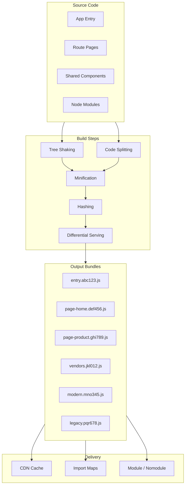

# Bundle Optimization

## Architecture at a Glance



## What is it?

Bundle optimization reduces the amount of JavaScript, CSS, and other assets shipped to the browser. Key techniques: **code splitting** (splitting code at routing boundaries via dynamic imports), **tree shaking** (dead-code elimination via ESM static analysis), **differential serving** (modern JS for modern browsers, transpiled ES5 for legacy), **vendor chunk splitting** (separating stable library code from app code for better caching), and **content hashing** (fingerprinting filenames for long-term CDN caching). Tools like `webpack-bundle-analyzer` and `vite/rollup-plugin-visualizer` reveal bundle composition.

## Why it was created

The web shipped increasingly large JavaScript bundles — single-page apps routinely exceeded 1MB+ of JS. On mobile devices with slow CPUs, parsing and executing 500KB of JS takes 3-5 seconds, directly impacting TTI (Time to Interactive) and INP. Bundle optimization emerged to: (1) only ship code the user actually needs for the current page (code splitting), (2) eliminate dead code from libraries and apps (tree shaking), (3) avoid re-downloading unchanged library code (vendor splitting + hashing), and (4) ship less-transpiled code to modern browsers (differential serving).

## When to use it

| Technique | When |
|---|---|
| Code splitting | Every SPA/MPA — split by route (React.lazy, dynamic import) |
| Tree shaking | Always — use ESM imports, configure `sideEffects` in package.json |
| Vendor chunk splitting | Apps with large libraries (React, lodash, d3) |
| Content hashing | All production builds — enables CDN cache invalidation |
| Differential serving | Sites supporting IE11 or older browsers AND modern browsers |
| Import maps | Micro-frontends, shared dependency management at runtime |
| Bundle analysis | Any production build — run analyzer to find optimization opportunities |
| Module/nomodule | Modern browsers get native ESM; legacy gets transpiled fallback |

## Hands-on Example — Vite Bundle Optimization with Analyzer

```ts
// vite.config.ts — Full bundle optimization setup
import { defineConfig } from "vite";
import react from "@vitejs/plugin-react";
import { visualizer } from "rollup-plugin-visualizer";

export default defineConfig({
  plugins: [
    react(),
    visualizer({
      filename: "dist/stats.html", // Open in browser to see treemap
      open: false,
      gzipSize: true,
      brotliSize: true,
    }),
  ],

  build: {
    target: "es2020", // Modern browsers — less transpilation
    minify: "esbuild", // Fast minification; use "terser" for IE11 support
    cssMinify: true,

    // Code splitting — automatic route-based splitting
    rollupOptions: {
      output: {
        // Manual chunk splitting for vendor deps
        manualChunks: {
          vendor: ["react", "react-dom", "react-router-dom"],
          ui: ["@radix-ui/react-dialog", "@radix-ui/react-dropdown-menu"],
          visualization: ["d3", "chart.js"],
        },

        // Content hashing for long-term caching
        entryFileNames: "assets/[name]-[hash].js",
        chunkFileNames: "assets/[name]-[hash].js",
        assetFileNames: "assets/[name]-[hash][extname]",
      },
    },

    // Treeshaking — enabled by default for ESM
    // Configure sideEffects in package.json (see below)
  },
});
```

```json
{
  "package.json": {
    "sideEffects": [
      "*.css",
      "*.module.css",
      "@radix-ui/themes/styles.css"
    ]
  }
}
```

```tsx
// src/pages/Products.tsx — Route-based code splitting with React.lazy
import { lazy, Suspense } from "react";

// Code split: this chunk only loads when /products is visited
const ProductList = lazy(() => import("@/components/ProductList"));
const ProductFilters = lazy(() => import("@/components/ProductFilters"));
const ProductDetail = lazy(() => import("@/components/ProductDetail"));

export default function ProductsPage() {
  return (
    <Suspense fallback={<div className="p-8"><Skeleton /></div>}>
      <ProductFilters />
      <ProductList />
    </Suspense>
  );
}
```

```tsx
// src/components/HeavyChart.tsx — Dynamic import for heavy dependency
import { useState, useCallback } from "react";

// d3 is ~250KB — only load when user clicks "Show Chart"
export function ChartSection() {
  const [showChart, setShowChart] = useState(false);
  const [ChartComponent, setChartComponent] = useState<React.ComponentType | null>(null);

  const handleShowChart = useCallback(async () => {
    setShowChart(true);
    // Dynamic import — d3 and chart component bundled separately
    const { SalesChart } = await import("@/components/SalesChart");
    setChartComponent(() => SalesChart);
  }, []);

  if (!showChart) {
    return <button onClick={handleShowChart}>Load Chart</button>;
  }

  return ChartComponent ? <ChartComponent /> : <div>Loading chart...</div>;
}
```

```html
<!-- Module / Nomodule Pattern — serve modern JS to modern browsers -->
<!DOCTYPE html>
<html>
<head>
  <!-- Modern browsers: load ES2020 modules -->
  <script type="module" src="/assets/app.modern.abc123.js"></script>

  <!-- Legacy browsers: load transpiled ES5 bundle -->
  <script nomodule src="/assets/app.legacy.xyz789.js" defer></script>

  <!-- Polyfill only for browsers that need it -->
  <script>
    (function() {
      // Only load polyfills if browser doesn't support modules (legacy)
      if (!HTMLScriptElement.prototype.hasOwnProperty('noModule')) {
        var s = document.createElement('script');
        s.src = '/assets/polyfill.legacy.def456.js';
        s.async = false;
        document.head.appendChild(s);
      }
    })();
  </script>
</head>
<body>
  <div id="root"></div>
</body>
</html>
```

```ts
// Vite plugin for automatic module/nomodule generation
// vite.config.ts — extend with vite-plugin-legacy
import legacy from "@vitejs/plugin-legacy";

export default defineConfig({
  plugins: [
    react(),
    legacy({
      targets: ["defaults", "not IE 11"],
      modernPolyfills: true,
    }),
    visualizer({ filename: "dist/stats.html", gzipSize: true }),
  ],
  build: {
    target: "es2020",
    rollupOptions: {
      output: {
        manualChunks: {
          vendor: ["react", "react-dom"],
          utils: ["date-fns", "lodash-es"],
        },
      },
    },
  },
});
```

```html
<!-- Import Maps — shared dependency resolution at runtime -->
<script type="importmap">
{
  "imports": {
    "react": "https://cdn.example.com/react/18.2.0/react.module.js",
    "react-dom": "https://cdn.example.com/react/18.2.0/react-dom.module.js",
    "lodash-es": "https://cdn.example.com/lodash/4.17.21/lodash-es.module.js"
  }
}
</script>

<!-- Micro-frontends resolve shared deps from import map, never duplicate -->
<script type="module">
  import React from "react";
  import { createRoot } from "react-dom";
  import { debounce } from "lodash-es";
  // All fetched from shared CDN URLs, not bundled
</script>
```

```bash
# Analyze bundle sizes with Vite's built-in report
npx vite build

# See stats.html in dist/ for visualization
# Check gzip and brotli sizes per chunk

# Compare before/after optimization
echo "Bundle sizes:"
Get-ChildItem -LiteralPath "dist\assets" -Filter "*.js" | ForEach-Object {
  $gzip = (Get-Item $_.FullName).Length / 1KB
  Write-Host "$($_.Name): $gzip KB"
}

# Use sirv to test production build locally
npx sirv dist --port 4000 --gzip
```

```json
{
  "package.json": {
    "scripts": {
      "build": "vite build",
      "build:analyze": "vite build && start dist/stats.html",
      "preview": "vite preview --port 4000",
      "build:modern": "vite build --mode modern",
      "build:legacy": "vite build --mode legacy"
    }
  }
}
```

```ts
// ESM vs CJS — tree shaking implications
// ✅ ESM (tree-shakeable)
import { debounce } from "lodash-es";
// Only debounce function ends up in bundle

// ❌ CJS (not tree-shakeable in most bundlers)
const { debounce } = require("lodash");
// Entire lodash library ends up in bundle (~500KB)

// ✅ Prefer ESM-only packages: check package.json "type": "module" or "exports"
// Use `"sideEffects": false` in your own package.json to enable deeper tree shaking
```

## Best Practices

- Split code at route boundaries by default — use `React.lazy(() => import("./page"))` for every page
- Use dynamic imports for heavy third-party libraries (d3, moment, chart.js) — defer loading until user interaction
- Configure `manualChunks` in Vite/Rollup/Webpack to separate vendor code, UI library code, and app code
- Audit bundle composition with `vite-plugin-visualizer` or `webpack-bundle-analyzer` after every major dependency change
- Set `"sideEffects": false` in your library's `package.json` and explicitly list CSS/side-effect files
- Prefer ESM packages (lodash-es, date-fns) over CJS ones (lodash, moment) for effective tree shaking
- Use content hashing in filenames (`[name]-[contenthash].js`) and configure aggressive CDN caching (max-age=1 year)
- Ship `module`/`nomodule` tags for differential serving — modern browsers get native ESM, legacy gets transpiled ES5
- Audit `node_modules` for duplicate versions with `npm ls <package>` or `pnpm why <package>`; deduplicate with package manager overrides
- Consider import maps for micro-frontend shared dependency resolution instead of bundling duplicates

## Interview Questions

**Q1: Explain how tree shaking works and why it sometimes fails.**

A: Tree shaking relies on ESM's static import/export structure — bundlers (Webpack, Rollup, Vite) can statically analyze which exports are used and eliminate unused ones. It works because `import { debounce } from "lodash-es"` is a compile-time declaration, unlike CJS `require()` which is dynamic. Tree shaking fails when: (1) package is CJS (lodash, not lodash-es), (2) `sideEffects: false` is missing in package.json — bundler assumes imports may have side effects and keeps them, (3) barrel files (`index.js` that re-export everything) prevent the bundler from seeing which exports are actually consumed, (4) dynamic imports with string concatenation, (5) CSS imports that the bundler doesn't recognize as side-effect-only. Fix: prefer ESM libraries, set `sideEffects: false`, avoid deep barrel exports, and use direct imports like `import dayjs from "dayjs/esm"`.

**Q2: What is differential serving and how does it improve performance?**

A: Differential serving means building two versions of your JS bundle: a **modern** bundle (ES2020+, native ESM) and a **legacy** bundle (ES5, transpiled to CommonJS or IIFE). Modern browsers load the modern bundle (smaller, less transpilation, native `await import`, smaller polyfills). Legacy browsers (`<script nomodule>`) load the transpiled bundle. Performance gains: modern bundles are typically 20-40% smaller because they avoid transpiling `async/await`, arrow functions, optional chaining, nullish coalescing, `class` syntax, `for...of`, etc. Implementation: Vite's `@vitejs/plugin-legacy`, Webpack's `babel-preset-env` with `useBuiltIns: "usage"` + `module/nomodule` in HTML. The tradeoff is doubled build time + dual bundles in CDN storage.

**Q3: How do you decide what goes into vendor chunks vs app chunks, and what splitting strategy maximizes cache hit rates?**

A: Strategy: **vendor chunk** = packages unlikely to change frequently (React, ReactDOM, React Router, state management libs). **UI chunk** = UI libraries with versioned releases (Radix, MUI, Chakra). **App chunk** = your application code that changes every deploy. Content-hash each chunk so filenames change only when content changes. This maximizes cache hits because: (1) vendor chunks rarely invalidate — only when you upgrade React version, (2) app chunks invalidate per deploy but are small, (3) users only re-download the chunk whose hash changed. For micro-frontends, share a single vendor chunk via Module Federation's `singleton: true` to prevent duplicate React in the browser. Avoid over-splitting (too many tiny chunks = more HTTP requests) — aim for 4-8 chunks for typical apps.

## Real Company Usage

| Company | Optimization | Impact |
|---|---|---|
| Airbnb | Code splitting by route + vendor chunk with d3 deferred | Reduced initial JS by 65%, improved TTI by 40% |
| Medium | Tree shaking + async loading for heavy components | Initial bundle reduced from 800KB to 250KB (gzip) |
| GitHub | Module/nomodule differential serving | Saved 30% bundle size for modern browsers, 0.5s faster TTI |
| Instagram (web) | Dynamic import + prefetch predicted routes | Instant navigation to likely next page via prefetch + code splitting |
| BBC | Manual chunk splitting + Brotli compression | Delivered <1MB total page weight, including images |
