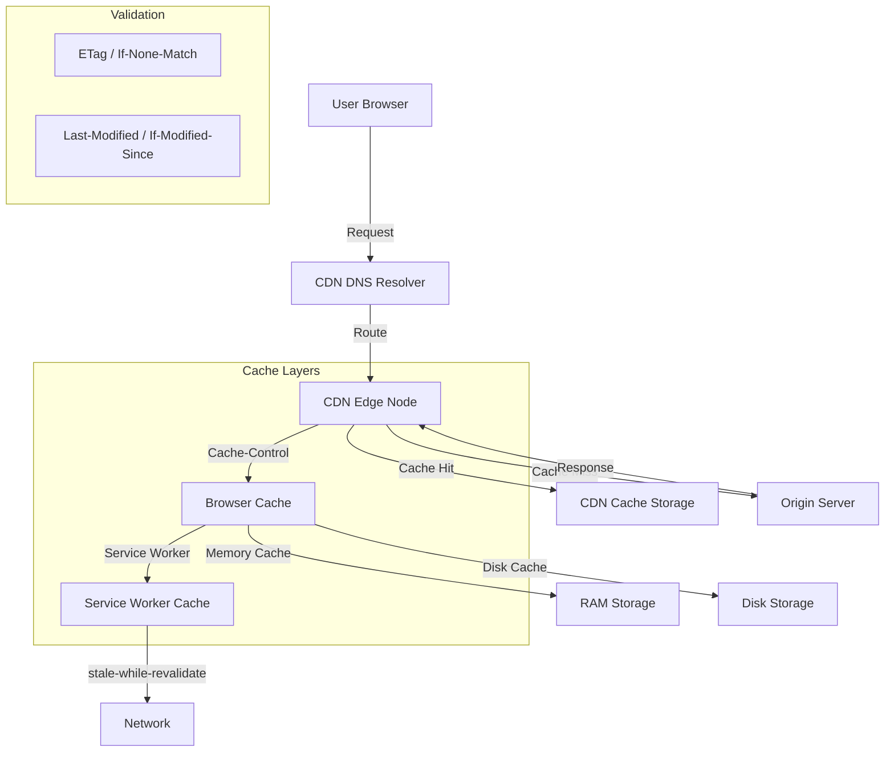

# Frontend Caching Strategies

## Architecture at a Glance



## What is it?

Frontend caching strategies define how and where responses are stored across the delivery chain to reduce latency, minimize bandwidth usage, and improve resilience. Caching occurs at multiple layers: the browser (memory/disk cache), service worker (programmable cache), CDN (edge cache), and origin server. Key HTTP headers—`Cache-Control`, `ETag`, `Last-Modified`, and `Vary`—orchestrate cache behavior. Patterns like **stale-while-revalidate** and **SWR** (stale-while-revalidate) allow serving stale content while fetching fresh data in the background.

## Why it was created

Before structured caching strategies, every page load required a full round-trip to the origin server, causing high latency, bandwidth waste, and poor offline experiences. As SPAs and PWAs grew complex, developers needed explicit control over what gets cached, for how long, and how to serve content when the network is unavailable. Caching strategies emerged to balance freshness vs. performance across unreliable networks and global audiences.

## When to use it

- **Static assets** (JS, CSS, images, fonts) — use Cache First with long max-age and content hashing
- **API responses** — use Network First or Stale While Revalidate for fresh data with offline fallback
- **HTML pages** — use Network First to ensure latest content, cache for offline support
- **User-specific data** — use Network Only or Cache First with session-based keys
- **Third-party resources** — use Cache First with versioned URLs and strict max-age
- **CDN caching** — for global audiences, cache at edge with region-aware `Vary` headers

## Hands-on Example: Service Worker with Workbox Cache Strategies

**Register Service Worker (main.js):**
```js
if ('serviceWorker' in navigator) {
  window.addEventListener('load', async () => {
    try {
      const registration = await navigator.serviceWorker.register('/sw.js');
      console.log('SW registered:', registration.scope);
    } catch (err) {
      console.error('SW registration failed:', err);
    }
  });
}
```

**Service Worker with Workbox (sw.js):**
```js
import { registerRoute } from 'workbox-routing';
import {
  StaleWhileRevalidate,
  CacheFirst,
  NetworkFirst,
  NetworkOnly,
} from 'workbox-strategies';
import { ExpirationPlugin } from 'workbox-expiration';
import { CacheableResponsePlugin } from 'workbox-cacheable-response';
import { precacheAndRoute } from 'workbox-precaching';

precacheAndRoute(self.__WB_MANIFEST || []);

// Cache static assets with CacheFirst + expiration
registerRoute(
  /\.(?:js|css|png|jpg|svg|woff2)$/,
  new CacheFirst({
    cacheName: 'static-assets',
    plugins: [
      new ExpirationPlugin({ maxEntries: 60, maxAgeSeconds: 30 * 24 * 60 * 60 }),
      new CacheableResponsePlugin({ statuses: [0, 200] }),
    ],
  })
);

// API calls with StaleWhileRevalidate
registerRoute(
  /\/api\/v1\//,
  new StaleWhileRevalidate({
    cacheName: 'api-cache',
    plugins: [
      new ExpirationPlugin({ maxEntries: 100, maxAgeSeconds: 5 * 60 }),
    ],
  })
);

// HTML pages with NetworkFirst
registerRoute(
  ({ request }) => request.mode === 'navigate',
  new NetworkFirst({
    cacheName: 'pages',
    plugins: [
      new ExpirationPlugin({ maxEntries: 20, maxAgeSeconds: 24 * 60 * 60 }),
    ],
  })
);

// Analytics - NetworkOnly
registerRoute(
  /\/analytics\//,
  new NetworkOnly()
);
```

**CDN Cache Configuration (CloudFront):**
```js
// CloudFront Functions - cache behavior
function handler(event) {
  var request = event.request;
  var uri = request.uri;
  var headers = request.headers;

  // Static assets: long cache, vary on encoding
  if (uri.match(/\.(js|css|png|jpg|svg|woff2)$/)) {
    return {
      ...request,
      headers: {
        ...headers,
        'cache-control': [
          { key: 'Cache-Control', value: 'public, max-age=31536000, immutable' }
        ]
      }
    };
  }

  // HTML: shorter cache, revalidate
  if (uri.match(/\.html$/) || uri === '/') {
    return {
      ...request,
      headers: {
        ...headers,
        'cache-control': [
          { key: 'Cache-Control', value: 'public, max-age=0, s-maxage=300, stale-while-revalidate=86400' }
        ]
      }
    };
  }

  return request;
}
```

## Best Practices

- Use content-hashed filenames (e.g., `app.a1b2c3.js`) to enable aggressive long-term caching without manual invalidation
- Apply `stale-while-revalidate` for API responses that tolerate slight staleness
- Set `Cache-Control: immutable` for versioned static assets to prevent revalidation
- Limit cache entries with `ExpirationPlugin` to avoid quota overflow on mobile
- Use `Vary: Accept-Encoding, Accept-Language` for CDN caching of localized content
- Cache API responses at the Service Worker level to enable offline-first experiences
- Purge CDN caches selectively (by path or tag) rather than full invalidation
- Monitor cache hit ratios via CDN metrics and browser DevTools
- Avoid caching sensitive user data in shared CDN or browser caches

## Interview Questions

**Q1: Explain the difference between Cache-Control: public, private, and no-store. When would you use each?**
- `public`: Allows any cache (CDN, browser, proxy) to store the response. Use for static assets. `private`: Allows only the browser cache, not CDNs or intermediaries. Use for personalized content. `no-store`: Prevents all caching entirely. Use for sensitive data like auth tokens, payment info, or real-time dashboards where freshness is critical.

**Q2: How does the stale-while-revalidate pattern work and what problem does it solve?**
The `stale-while-revalidate` directive tells the cache it can serve a stale response immediately while asynchronously fetching a fresh response in the background. This solves the "thundering herd" problem where thousands of clients hit the origin simultaneously after a cache expires. It improves perceived performance (instant stale response) while eventually updating the cache. The format is `Cache-Control: max-age=60, stale-while-revalidate=86400`, meaning the response is fresh for 60s, then stale but usable for another 86400s while revalidating.

**Q3: Describe a cache invalidation strategy for a large-scale multi-region CDN deployment.**
For a global CDN, use a combination of: (1) **Content hashing** in filenames to invalidate on deploy without manual purges, (2) **Cache tags** (surrogate-key headers) to purge related resources (e.g., all posts tagged `user:42`) via CDN API, (3) **Staged rollouts** where old cache entries expire naturally via short TTLs during migration, (4) **Regex-based purging** for pattern-matched URLs, and (5) **Global cache flush** only as last resort. Tools like `@cloudfront/purge` or Cloudflare's API purge by hostname/tag provide fine-grained control.

## Real Company Usage

| Company | Strategy | Technology | Details |
|---------|----------|------------|---------|
| **Netflix** | Cache First + SWR | Service Worker + CDN | Caches UI shells and asset bundles; uses stale-while-revalidate for personalized recommendations; SSD-based CDN appliances in ISP hubs |
| **Shopify** | Multi-layer edge + SW | CloudFront + Workbox | Static assets with immutable cache; storefront API with SW stale-while-revalidate; Vary header for multi-language stores; cache tags for instant product update purges |
| **Twitter/X** | Network First + Disk Cache | Service Worker + Apollo | Timeline tweets cached in IndexedDB via SW; images via Cache First with LRU expiration; stale UI shown instantly while polling fresh tweets |
| **Spotify** | Cache First + Offline Storage | IndexedDB + Service Worker | Music metadata and album art cached with CacheFirst; streaming chunks use custom SW strategy with partial content support; LRU eviction per quota |
| **GitHub** | Stale While Revalidate + ETag | Browser Cache + SW | ETag validation for API responses; SW caches repo content; `304 Not Modified` responses reduce payload; visited pages served from SW cache with background refresh |
