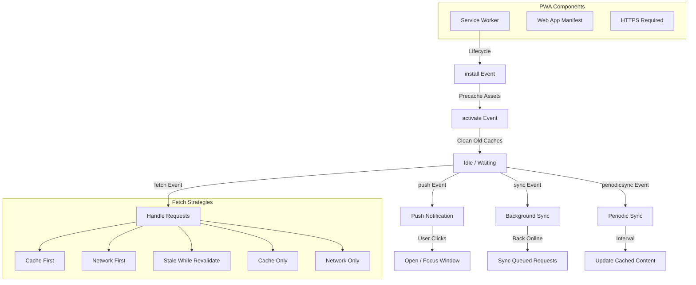

# Service Workers & Progressive Web Apps

## Architecture at a Glance



## What is it?

A **Progressive Web App (PWA)** is a web application that uses modern browser capabilities—**Service Workers**, **Web App Manifest**, and **HTTPS**—to deliver an app-like experience. The **Service Worker** is a JavaScript file that runs in the background, separate from the web page, intercepting network requests, managing caches, and enabling offline support, push notifications, and background sync. PWAs are installable, reliable (even offline), and capable of native-level engagement.

## Why it was created

PWAs were created to bridge the gap between web and native apps. Native apps offered offline support, push notifications, home screen installation, and background processing—capabilities the web lacked. PWAs brought these features to the open web platform, giving users a native-like experience without app store friction, platform lock-in, or large download sizes.

## When to use it

- **Offline-first apps** — news readers, documentation sites, note-taking apps
- **Content-heavy platforms** — e-commerce, blogs, media streaming
- **Low-connectivity regions** — apps targeting emerging markets with unreliable networks
- **Installable experiences** — tools, dashboards, or utilities users want on their home screen
- **Engagement-driven apps** — push notifications for re-engagement (social, messaging)
- **Native app alternatives** — when a full native app is overkill (order tracking, event guides)

## Hands-on Example: PWA with Offline Support + Push Notifications

**Web App Manifest (public/manifest.json):**
```json
{
  "name": "Offline Notes PWA",
  "short_name": "Notes",
  "description": "A note-taking app that works offline",
  "start_url": "/",
  "display": "standalone",
  "background_color": "#ffffff",
  "theme_color": "#3b82f6",
  "icons": [
    {
      "src": "/icons/icon-192.png",
      "sizes": "192x192",
      "type": "image/png",
      "purpose": "any maskable"
    },
    {
      "src": "/icons/icon-512.png",
      "sizes": "512x512",
      "type": "image/png",
      "purpose": "any maskable"
    }
  ]
}
```

**Register Service Worker + Manifest (index.html):**
```html
<!DOCTYPE html>
<html lang="en">
<head>
  <meta charset="UTF-8" />
  <meta name="viewport" content="width=device-width, initial-scale=1.0" />
  <title>Offline Notes</title>
  <link rel="manifest" href="/manifest.json" />
  <meta name="theme-color" content="#3b82f6" />
  <link rel="apple-touch-icon" href="/icons/icon-192.png" />
</head>
<body>
  <div id="app">
    <h1>My Notes</h1>
    <textarea id="note-input" placeholder="Write a note..."></textarea>
    <button id="save-note">Save Note</button>
    <button id="subscribe-push">Enable Notifications</button>
    <ul id="notes-list"></ul>
  </div>

  <script>
    // Register Service Worker
    if ('serviceWorker' in navigator) {
      navigator.serviceWorker.register('/sw.js')
        .then((reg) => {
          console.log('SW registered:', reg.scope);

          // Check for updates
          reg.addEventListener('updatefound', () => {
            const newWorker = reg.installing;
            newWorker.addEventListener('statechange', () => {
              if (newWorker.state === 'installed' && navigator.serviceWorker.controller) {
                showUpdateNotification();
              }
            });
          });
        })
        .catch((err) => console.error('SW registration failed:', err));
    }

    // Request Push Notification permission
    document.getElementById('subscribe-push').addEventListener('click', async () => {
      const permission = await Notification.requestPermission();
      if (permission === 'granted') {
        const registration = await navigator.serviceWorker.ready;
        const subscription = await registration.pushManager.subscribe({
          userVisibleOnly: true,
          applicationServerKey: urlBase64ToUint8Array('YOUR_VAPID_PUBLIC_KEY')
        });
        await fetch('/api/push/subscribe', {
          method: 'POST',
          body: JSON.stringify(subscription),
          headers: { 'Content-Type': 'application/json' }
        });
        alert('Push notifications enabled!');
      }
    });

    // Background Sync for offline saves
    document.getElementById('save-note').addEventListener('click', async () => {
      const note = document.getElementById('note-input').value;
      if (!note) return;

      try {
        await fetch('/api/notes', {
          method: 'POST',
          body: JSON.stringify({ content: note, timestamp: Date.now() }),
          headers: { 'Content-Type': 'application/json' }
        });
      } catch {
        // Offline: queue via Service Worker background sync
        const registration = await navigator.serviceWorker.ready;
        await registration.sync.register('sync-notes');
        // Store in IndexedDB for later
        const db = await openDB();
        await db.add('pending-notes', { content: note, timestamp: Date.now() });
      }
    });
  </script>
</body>
</html>
```

**Service Worker (public/sw.js):**
```js
const CACHE_NAME = 'notes-cache-v2';
const ASSETS = [
  '/',
  '/index.html',
  '/styles.css',
  '/app.js',
  '/icons/icon-192.png',
  '/icons/icon-512.png'
];

// Install: precache static assets
self.addEventListener('install', (event) => {
  event.waitUntil(
    caches.open(CACHE_NAME).then((cache) => {
      console.log('Precaching assets');
      return cache.addAll(ASSETS);
    })
  );
  // Activate immediately
  self.skipWaiting();
});

// Activate: clean old caches
self.addEventListener('activate', (event) => {
  event.waitUntil(
    caches.keys().then((cacheNames) => {
      return Promise.all(
        cacheNames
          .filter((name) => name !== CACHE_NAME)
          .map((name) => caches.delete(name))
      );
    })
  );
  // Control all clients immediately
  self.clients.claim();
});

// Fetch: Network First for API, Cache First for assets
self.addEventListener('fetch', (event) => {
  const { request } = event;

  if (request.url.includes('/api/')) {
    // Network First for API
    event.respondWith(networkFirst(request));
  } else {
    // Cache First for assets
    event.respondWith(cacheFirst(request));
  }
});

async function cacheFirst(request) {
  const cached = await caches.match(request);
  if (cached) return cached;

  try {
    const response = await fetch(request);
    const cache = await caches.open(CACHE_NAME);
    cache.put(request, response.clone());
    return response;
  } catch (err) {
    return new Response('Offline', { status: 503 });
  }
}

async function networkFirst(request) {
  try {
    const response = await fetch(request);
    const cache = await caches.open(CACHE_NAME);
    cache.put(request, response.clone());
    return response;
  } catch {
    const cached = await caches.match(request);
    return cached || new Response(JSON.stringify({ error: 'Offline' }), {
      status: 503,
      headers: { 'Content-Type': 'application/json' }
    });
  }
}

// Push notifications
self.addEventListener('push', (event) => {
  const data = event.data ? event.data.json() : {
    title: 'New Note Reminder',
    body: 'You have unsaved notes!',
    icon: '/icons/icon-192.png'
  };

  event.waitUntil(
    self.registration.showNotification(data.title, {
      body: data.body,
      icon: data.icon,
      badge: '/icons/icon-192.png',
      vibrate: [200, 100, 200],
      actions: [
        { action: 'open', title: 'Open App' },
        { action: 'dismiss', title: 'Dismiss' }
      ]
    })
  );
});

self.addEventListener('notificationclick', (event) => {
  event.notification.close();

  if (event.action === 'open') {
    event.waitUntil(clients.openWindow('/'));
  }
});

// Background Sync
self.addEventListener('sync', (event) => {
  if (event.tag === 'sync-notes') {
    event.waitUntil(syncPendingNotes());
  }
});

async function syncPendingNotes() {
  const db = await openDB();
  const pending = await db.getAll('pending-notes');

  for (const note of pending) {
    try {
      await fetch('/api/notes', {
        method: 'POST',
        body: JSON.stringify(note),
        headers: { 'Content-Type': 'application/json' }
      });
      await db.delete('pending-notes', note.id);
    } catch {
      // Will retry on next sync
      break;
    }
  }
}
```

## Best Practices

- Register the Service Worker early but defer `install` event until critical assets are ready
- Use `self.skipWaiting()` and `clients.claim()` for immediate updates; warn users of version changes
- Version your caches (e.g., `notes-cache-v2`) and clean old ones in `activate`
- Cache the app shell (HTML, CSS, JS) on install, then lazy-load route-specific chunks
- Use IndexedDB for structured offline data, not just Cache Storage
- Keep push notification payloads small; fetch full data from cache/API on click
- Test in Chrome DevTools > Application > Service Workers for lifecycle debugging
- Bundle your SW with a tool like Workbox for production-grade strategies
- Handle SW update flow gracefully — prompt users to refresh when new version is available
- Always serve PWAs over HTTPS (except localhost)

## Interview Questions

**Q1: Walk through the complete Service Worker lifecycle from registration to activation. What happens at each stage?**
(1) **Registration**: browser downloads the SW file, starts install. (2) **Install**: SW fires `install` event — ideal for precaching assets. If the SW script changes byte-by-byte, the browser treats it as a new version. (3) **Waiting**: the new SW waits until all tabs running the old SW close (unless `self.skipWaiting()` is called). (4) **Activate**: old SW is replaced, `activate` event fires — clean up old caches here. (5) **Idle**: SW sits idle, listening for `fetch`, `push`, `sync`, `message` events. (6) **Terminated**: browser may terminate the SW after ~30s of idle to save memory — it restarts on the next event.

**Q2: How does a PWA handle offline form submissions? Describe the complete flow.**
When offline: (a) The `fetch` event in the SW detects the POST request fails (Network First or Network Only strategy). (b) The page catches the error and stores the form data in IndexedDB with a `pending` status. (c) It registers a Background Sync event (`sync.register('sync-form')`). (d) When the browser detects connectivity, it fires the `sync` event in the SW. (e) The SW reads pending items from IndexedDB and replays each POST request against the server. (f) On success, the pending item is removed; on failure, it remains for the next sync cycle. This provides a seamless offline-to-online transition without data loss.

**Q3: Compare PWA vs Native App for a production deployment. What are the trade-offs?**
PWAs win on: instant updates (no app store review), smaller bundle size, shareable URLs, cross-platform from a single codebase, lower development cost. Native wins on: full access to OS APIs (Bluetooth, NFC, file system), background processing beyond SW limits, push notification reliability (especially on iOS), performance for compute-heavy tasks, and discoverability via app stores. For most content/utility apps, a PWA is sufficient; for hardware-intensive or deeply integrated apps, native (or hybrid with a PWA shell) is better. Some companies (e.g., Twitter/X Lite, Spotify) ship PWA as a lighter alternative alongside native.

## Real Company Usage

| Company | PWA Feature | Technology | Impact |
|---------|-------------|------------|--------|
| **Twitter/X Lite** | Offline tweets + push | Workbox + IndexedDB | 75% reduction in data usage; 3x faster initial load; 2x more pages per session |
| **Spotify** | Offline playback + SW streaming | Custom SW + Cache API | Seamless offline music; SW handles partial content (Range headers) for streaming chunks |
| **Pinterest** | Installable PWA + push | Workbox precaching + Web Push | 60% increase in engagement; 44% increase in user-generated ad revenue; 40% faster load time |
| **Starbucks** | Offline menu + order queuing | Workbox + Background Sync | Customers can browse menu and build orders offline; orders sync when back online; 2x daily active users |
| **Telegram** | Desktop PWA with offline cache | Custom SW + IndexedDB | Full messaging offline; background sync sends messages on reconnect; push via Web Push API |
