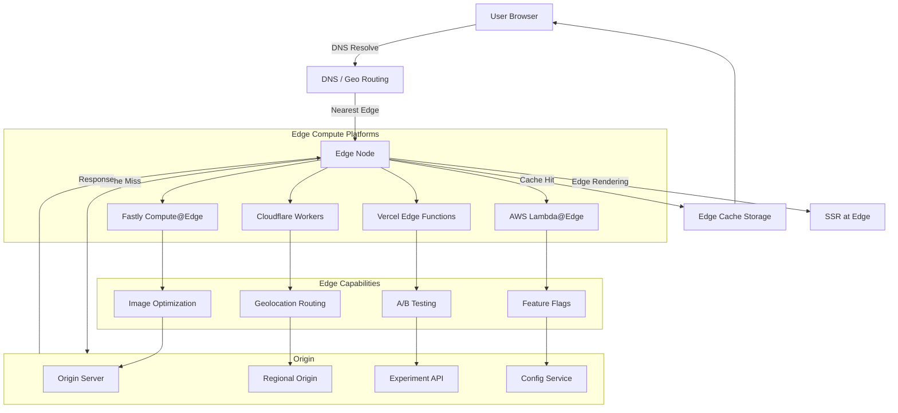

# CDN & Edge Computing

## Architecture at a Glance



## What is it?

Edge computing brings computation to the CDN edge—geographically close to end users—rather than running everything in a central origin server. Platforms like **Cloudflare Workers**, **Vercel Edge Functions**, **Fastly Compute@Edge**, and **AWS Lambda@Edge** / **CloudFront Functions** allow developers to run JavaScript (or WASM) at edge nodes. Use cases include geolocation-based routing, A/B testing, canary deployments, feature flags, personalization, authentication, and image optimization. Edge computing combines the latency benefits of CDN caching with the flexibility of serverless compute.

## Why it was created

Traditional CDNs only cached static content; dynamic personalization required a round-trip to the origin. As web apps demanded faster experiences globally, sending every request to a central server became untenable. Edge computing emerged to move logic closer to users—reducing latency from hundreds of milliseconds to single-digit milliseconds for personalization, experimentation, and routing decisions.

## When to use it

- **Geolocation routing** — Serve region-specific content (language, pricing, compliance) from the nearest edge
- **A/B testing & canary deployments** — Split traffic at the edge without client-side flickering
- **Feature flags** — Toggle features globally or per-segment without redeploying
- **Personalization** — Tailor responses per user at the edge using cookies/JWT
- **Image optimization** — Resize, crop, and compress images on-the-fly at the edge
- **Authentication** — Validate JWT tokens at the edge before requests reach origin
- **Edge rendering** — Server-side render pages at the edge for faster TTFB
- **API aggregation** — Combine multiple backend responses into one edge-computed response

## Hands-on Example: Cloudflare Worker for Geolocation Routing + Vercel Edge Function for A/B Testing

**Cloudflare Worker — Geolocation Routing (workers/geolocation.js):**
```js
// Cloudflare Worker: Geo-based routing and personalization
export default {
  async fetch(request, env, ctx) {
    const url = new URL(request.url);
    const country = request.cf?.country || 'US';
    const city = request.cf?.city || 'Unknown';
    const language = request.cf?.language || 'en-US';
    const continent = request.cf?.continent || 'NA';

    // Skip geo-processing for API calls and static assets
    if (url.pathname.startsWith('/api/') || url.pathname.match(/\.(js|css|png)$/)) {
      return fetch(request);
    }

    // Geo-based language redirect
    const langMap = {
      'DE': 'de', 'AT': 'de', 'CH': 'de',
      'FR': 'fr', 'BE': 'fr',
      'JP': 'ja',
      'BR': 'pt-br', 'PT': 'pt'
    };
    const targetLang = langMap[country] || 'en';

    // Set language cookie if not present
    const cookie = request.headers.get('Cookie') || '';
    if (!cookie.includes('lang=')) {
      const response = await fetch(request);
      const newResponse = new Response(response.body, response);
      newResponse.headers.set(
        'Set-Cookie',
        `lang=${targetLang}; Path=/; Max-Age=86400; Secure`
      );
      return newResponse;
    }

    // Serve different pricing based on region
    if (url.pathname === '/pricing') {
      const pricingRegion = continent === 'EU' ? 'eu' : country === 'US' ? 'us' : 'row';
      url.searchParams.set('region', pricingRegion);
    }

    // Add geo headers for origin
    const requestWithGeo = new Request(url.toString(), request);
    requestWithGeo.headers.set('X-Geo-Country', country);
    requestWithGeo.headers.set('X-Geo-City', city);
    requestWithGeo.headers.set('X-Geo-Language', language);

    // Cache HTML for 5 minutes at the edge
    const cacheKey = `${url.origin}${url.pathname}?lang=${targetLang}`;
    const cache = caches.default;
    const cachedResponse = await cache.match(cacheKey);
    if (cachedResponse) {
      return cachedResponse;
    }

    const response = await fetch(requestWithGeo);
    if (response.status === 200) {
      const responseWithCache = new Response(response.body, response);
      responseWithCache.headers.set('Cache-Control', 'public, s-maxage=300');
      ctx.waitUntil(cache.put(cacheKey, responseWithCache.clone()));
      return responseWithCache;
    }

    return response;
  }
};
```

**Vercel Edge Function — A/B Testing (api/ab-test/route.ts):**
```ts
// Vercel Edge Function: A/B test routing
export const config = {
  runtime: 'edge',
  regions: ['iad1', 'hkg1', 'fra1'],
};

interface ABTestConfig {
  experiments: Record<string, {
    variants: string[];
    distribution: number[];
  }>;
}

const DEFAULT_CONFIG: ABTestConfig = {
  experiments: {
    'checkout-redesign': {
      variants: ['control', 'variant-a', 'variant-b'],
      distribution: [0.6, 0.2, 0.2],
    },
    'pricing-layout': {
      variants: ['control', 'variant-a'],
      distribution: [0.5, 0.5],
    },
  },
};

// Deterministic assignment using user ID or session
function assignVariant(
  userId: string,
  experimentName: string,
  variants: string[],
  distribution: number[]
): string {
  const hash = simpleHash(`${userId}:${experimentName}`);
  const normalized = hash / 0xFFFFFFFF; // normalize to 0-1
  let cumulative = 0;
  for (let i = 0; i < variants.length; i++) {
    cumulative += distribution[i];
    if (normalized < cumulative) {
      return variants[i];
    }
  }
  return variants[variants.length - 1];
}

function simpleHash(str: string): number {
  let hash = 0;
  for (let i = 0; i < str.length; i++) {
    const char = str.charCodeAt(i);
    hash = ((hash << 5) - hash) + char;
    hash = hash & hash; // Convert to 32bit integer
  }
  return Math.abs(hash);
}

export default async function handler(req: Request): Promise<Response> {
  const url = new URL(req.url);
  const userId = req.headers.get('x-user-id') ||
    req.cookies.get('session_id')?.value ||
    'anonymous';

  const config = DEFAULT_CONFIG; // In production, fetch from edge config store

  // Assign all experiment variants for this user
  const assignments: Record<string, string> = {};
  for (const [experiment, { variants, distribution }] of Object.entries(config.experiments)) {
    assignments[experiment] = assignVariant(userId, experiment, variants, distribution);
  }

  // Set cookie to persist assignments on client side
  const cookieStr = Object.entries(assignments)
    .map(([exp, variant]) => `ab_${exp}=${variant}`)
    .join('; ');

  // Clone the request with experiment headers for upstream
  const upstreamReq = new Request(url.toString(), req);
  for (const [exp, variant] of Object.entries(assignments)) {
    upstreamReq.headers.set(`X-Experiment-${exp}`, variant);
  }

  const response = await fetch(upstreamReq);
  const newResponse = new Response(response.body, response);
  newResponse.headers.set('Set-Cookie', `${cookieStr}; Path=/; Max-Age=86400; Secure`);

  return newResponse;
}
```

**Image Optimization at Edge (CloudFront Functions + Lambda@Edge):**
```js
// CloudFront Function: Parse image dimensions from query string
function handleRequest(event) {
  var request = event.request;
  var uri = request.querystring;

  // Extract image transformations: ?w=200&h=200&f=webp
  var width = uri.w ? uri.w.value : null;
  var height = uri.h ? uri.h.value : null;
  var format = uri.f ? uri.f.value : null;

  if (!uri.match && (width || height || format)) {
    // Pass to Lambda@Edge for actual transformation
    return request;
  }

  return request;
}
```

## Best Practices

- Keep edge function bundles small (<1MB for Workers, <50KB for CloudFront Functions)
- Use edge config stores (Workers KV, Vercel Edge Config) for dynamic data, not hardcoded config
- Implement deterministic A/B assignment (hash-based) to avoid flickering
- Cache aggressively at the edge; use `Cache-Control: s-maxage` for CDN-only caching
- Warm edge caches after deployment with strategic pre-fetch requests
- Use multiple edge regions strategically (e.g., deploy to US, EU, Asia for true global coverage)
- Handle edge function timeouts gracefully (Workers: 50ms CPU, Vercel: 30s total, Lambda@Edge: 5s viewer-request)
- Avoid large dependencies — every KB increases cold start latency
- Log edge function errors to centralized monitoring (Datadog, Cloudflare Logs)
- Use origin shields to reduce origin load when many edge nodes miss simultaneously

## Interview Questions

**Q1: Compare Cloudflare Workers, Vercel Edge Functions, and AWS Lambda@Edge. What are the key differences and when would you choose each?**
Cloudflare Workers run on V8 isolates (not containers), supporting 128MB memory and 50ms CPU per request — best for lightweight routing, auth, and A/B testing with sub-5ms cold starts. Vercel Edge Functions are based on Workers but integrate deeply with Next.js and Vercel's data cache — ideal when you're already in the Vercel ecosystem and need edge rendering with ISR. Lambda@Edge runs on AWS Lambda with more resources (128MB–10GB, 5–30s timeout) — best for heavy transformations (image processing, complex API aggregation) and deep AWS integration. Choose Workers for ultra-low-latency light logic, Vercel Edge for Next.js projects, Lambda@Edge for heavy lifting inside AWS.

**Q2: How would you design an edge-based feature flag system for a global web app?**
Store feature flag config in a globally replicated edge data store (Workers KV, Vercel Edge Config, DynamoDB Global Tables). At the edge, the function reads the user's flags based on a cookie/JWT (user ID, beta group). The edge response includes `Set-Cookie` with flag assignments and headers consumed by client-side code. For canary deployments, route a percentage of traffic (by user ID hash) to a different origin or variant. Invalidate edge cache per flag using cache tags or by including flag version in the cache key. This gives sub-50ms flag evaluation globally without hitting the origin.

**Q3: Explain edge rendering vs edge caching. How do they complement each other?**
Edge caching stores pre-rendered responses at the edge (HTML, JSON) and serves them directly on cache hit — very fast (single-digit ms) but can serve stale content. Edge rendering executes server-side logic (SSR) at the edge on every request (or cache miss), producing dynamic HTML — still fast (20-100ms) because compute is close to the user. They complement: edge caching stores the output of edge-rendered pages; ISR (Incremental Static Regeneration) combines both — serve cached page instantly, re-render in background at the edge when cache expires. This yields near-static TTFB with dynamic freshness.

## Real Company Usage

| Company | Edge Platform | Use Case | Impact |
|---------|--------------|----------|--------|
| **Cloudflare** | Cloudflare Workers | 11M+ requests/second at edge; Workers AI for inference; D1 database at edge | 200+ PoPs globally; sub-50ms P95 response times |
| **Vercel/Next.js** | Vercel Edge Functions | Edge rendering for Next.js ISR; A/B testing framework at edge; image optimization | 300+ global edge locations; ISR pages served in <10ms from edge cache |
| **Shopify** | Cloudflare Workers + Storefront Edge | Geolocation routing for 175+ countries; edge-based currency conversion; Oxygen headless edge rendering | 80% reduction in global latency; unified multi-region checkout at edge |
| **The New York Times** | Fastly Compute@Edge | Edge personalization for article recommendations; real-time breaking news at edge; image optimization per device | 3x faster article delivery; backend request reduction by 60% |
| **Epic Games (Fortnite)** | AWS Lambda@Edge + CloudFront | Player authentication at edge; geo-routing to regional game servers; dynamic content personalization | Authenticates 30M+ daily players at edge; reduced origin load by 80% |
