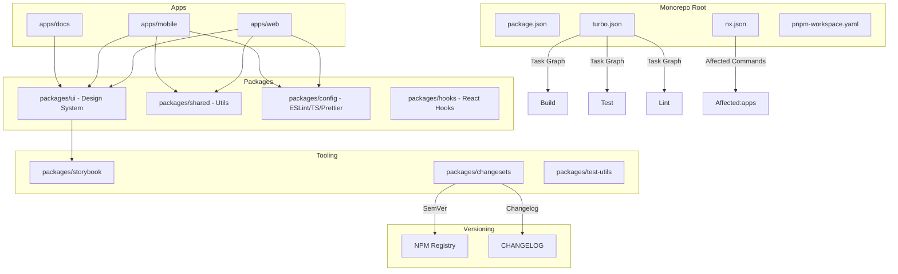

# Monorepo & Component Design

## Architecture at a Glance



## What is it?

A **monorepo** is a single repository containing multiple distinct projects (apps and packages) with shared tooling, configurations, and dependencies. For frontend systems, monorepos are typically managed by **Turborepo**, **Nx**, or **pnpm workspaces**. They enable a **design system** as a versioned component library, shared ESLint/Prettier/TypeScript configs, and coordinated releases via **Changesets** or **Semantic Release**. **Storybook** provides isolated component development, visual testing, and documentation. Component API design patterns (compound components, render props, controlled/uncontrolled) ensure reusable, composable UI.

## Why it was created

As organizations grew, separate repos per app led to duplicated code, inconsistent configurations, and coordination overhead. Monorepos solved these by enabling: shared component libraries (design systems) maintained in one place, atomic cross-project refactoring, unified CI/CD, and consistent dependency versions. Tools like Turborepo and Nx added caching and task orchestration to make monorepos fast at scale.

## When to use it

- **Multi-app organizations** — web app + mobile app + admin panel + docs site
- **Design system teams** — shared UI component library consumed by multiple products
- **Micro-frontend architectures** — independent deployable apps with shared utilities
- **Library authors** — multiple interrelated packages released together (e.g., React ecosystem)
- **Startups scaling from monolith** — gradually splitting code into packages without repo explosion
- **Enterprise with shared config** — consistent ESLint, TypeScript, Prettier across teams

## Hands-on Example: Turborepo + Storybook Setup

**Root Configuration:**

```json
// turbo.json
{
  "$schema": "https://turbo.build/schema.json",
  "globalDependencies": ["**/.env.*local"],
  "pipeline": {
    "build": {
      "dependsOn": ["^build"],
      "outputs": [".next/**", "!.next/cache/**", "dist/**"],
      "cache": true
    },
    "test": {
      "dependsOn": ["^build"],
      "outputs": [],
      "inputs": ["src/**/*.tsx", "src/**/*.ts", "test/**/*.ts"]
    },
    "lint": {
      "outputs": []
    },
    "typecheck": {
      "dependsOn": ["^build"],
      "outputs": []
    },
    "dev": {
      "cache": false,
      "persistent": true
    },
    "storybook": {
      "cache": false,
      "persistent": true,
      "dependsOn": ["^build"]
    }
  },
  "remoteCache": {
    "enabled": true,
    "signature": true
  }
}
```

```yaml
# pnpm-workspace.yaml
packages:
  - "apps/*"
  - "packages/*"
```

```jsonc
// root package.json (partial)
{
  "private": true,
  "scripts": {
    "dev": "turbo dev",
    "build": "turbo build",
    "test": "turbo test",
    "lint": "turbo lint",
    "typecheck": "turbo typecheck",
    "storybook": "turbo storybook",
    "changeset": "changeset",
    "publish": "changeset publish",
    "format": "prettier --write ."
  },
  "devDependencies": {
    "turbo": "^2.0.0",
    "@changesets/cli": "^2.27.0",
    "prettier": "^3.2.0"
  },
  "packageManager": "pnpm@9.0.0"
}
```

**Design System Package (packages/ui/):**

```jsonc
// packages/ui/package.json
{
  "name": "@company/ui",
  "version": "0.1.0",
  "private": false,
  "main": "./dist/index.js",
  "module": "./dist/index.mjs",
  "types": "./dist/index.d.ts",
  "exports": {
    ".": {
      "import": "./dist/index.mjs",
      "require": "./dist/index.js",
      "types": "./dist/index.d.ts"
    },
    "./styles.css": "./dist/styles.css"
  },
  "scripts": {
    "build": "tsup src/index.ts --dts --format esm,css",
    "dev": "tsup src/index.ts --watch",
    "storybook": "storybook dev -p 6006",
    "test": "vitest run",
    "lint": "eslint src/"
  },
  "dependencies": {
    "react": "^18.0.0",
    "@radix-ui/react-dialog": "^1.0.0",
    "class-variance-authority": "^0.7.0",
    "tailwind-merge": "^2.0.0"
  },
  "devDependencies": {
    "@storybook/react": "^8.0.0",
    "@storybook/addon-essentials": "^8.0.0",
    "tsup": "^8.0.0",
    "vitest": "^1.0.0",
    "@testing-library/react": "^14.0.0"
  }
}
```

```tsx
// packages/ui/src/components/Button/Button.tsx
// Compound component with variants
import * as React from "react";
import { cva, type VariantProps } from "class-variance-authority";
import { cn } from "../../utils/cn";

const buttonVariants = cva(
  "inline-flex items-center justify-center rounded-md text-sm font-medium transition-colors focus-visible:outline-none focus-visible:ring-2 focus-visible:ring-ring disabled:pointer-events-none disabled:opacity-50",
  {
    variants: {
      variant: {
        primary: "bg-blue-600 text-white hover:bg-blue-700",
        secondary: "bg-gray-100 text-gray-900 hover:bg-gray-200",
        destructive: "bg-red-600 text-white hover:bg-red-700",
        outline: "border border-gray-300 bg-white hover:bg-gray-50",
        ghost: "hover:bg-gray-100",
      },
      size: {
        sm: "h-8 px-3 text-xs",
        md: "h-10 px-4",
        lg: "h-12 px-6 text-base",
        icon: "h-10 w-10",
      },
    },
    defaultVariants: {
      variant: "primary",
      size: "md",
    },
  }
);

export interface ButtonProps
  extends React.ButtonHTMLAttributes<HTMLButtonElement>,
    VariantProps<typeof buttonVariants> {
  loading?: boolean;
}

export const Button = React.forwardRef<HTMLButtonElement, ButtonProps>(
  ({ className, variant, size, loading, children, disabled, ...props }, ref) => {
    return (
      <button
        className={cn(buttonVariants({ variant, size, className }))}
        ref={ref}
        disabled={disabled || loading}
        {...props}
      >
        {loading && <Spinner className="mr-2 h-4 w-4" />}
        {children}
      </button>
    );
  }
);
Button.displayName = "Button";

// Compound components
Button.Icon = ButtonIcon;
```

```tsx
// packages/ui/src/index.ts
export { Button, type ButtonProps } from "./components/Button";
export { Dialog, DialogTrigger, DialogContent } from "./components/Dialog";
export { Input, type InputProps } from "./components/Input";
export { cn } from "./utils/cn";
export { useMediaQuery } from "./hooks/useMediaQuery";
```

**Storybook Configuration:**

```tsx
// packages/ui/.storybook/main.ts
import type { StorybookConfig } from "@storybook/react-vite";

const config: StorybookConfig = {
  stories: ["../src/**/*.stories.@(ts|tsx)"],
  addons: [
    "@storybook/addon-essentials",
    "@storybook/addon-a11y",
    "@storybook/addon-interactions",
  ],
  framework: {
    name: "@storybook/react-vite",
    options: {},
  },
  staticDirs: ["../public"],
};

export default config;
```

```tsx
// packages/ui/src/components/Button/Button.stories.tsx
import type { Meta, StoryObj } from "@storybook/react";
import { Button } from "./Button";

const meta: Meta<typeof Button> = {
  title: "UI/Button",
  component: Button,
  argTypes: {
    variant: {
      control: "select",
      options: ["primary", "secondary", "destructive", "outline", "ghost"],
    },
    size: { control: "select", options: ["sm", "md", "lg", "icon"] },
    loading: { control: "boolean" },
  },
  tags: ["autodocs"],
};

export default meta;
type Story = StoryObj<typeof Button>;

export const Primary: Story = {
  args: {
    variant: "primary",
    size: "md",
    children: "Submit",
  },
};

export const Loading: Story = {
  args: {
    variant: "primary",
    loading: true,
    children: "Saving...",
  },
};

export const ButtonGroup: Story = {
  render: (args) => (
    <div className="flex gap-2">
      <Button {...args} variant="primary">Save</Button>
      <Button {...args} variant="outline">Cancel</Button>
      <Button {...args} variant="destructive">Delete</Button>
    </div>
  ),
};
```

**Versioning with Changesets:**

```json
// .changeset/config.json
{
  "$schema": "https://unpkg.com/@changesets/config@2.0.0/schema.json",
  "changelog": "@changesets/cli/changelog",
  "commit": false,
  "fixed": [],
  "linked": [],
  "access": "public",
  "baseBranch": "main",
  "updateInternalDependencies": "patch",
  "ignore": ["@company/docs"]
}
```

## Best Practices

- Use `pnpm` with strict dependency isolation (`shamefully-hoist=false`)
- Configure Turborepo remote caching (Vercel Remote Cache or custom) for CI speed
- Keep packages focused: a package should have one clear responsibility
- Enforce a dependency graph direction (e.g., `packages` → `apps`, never reverse)
- Use `tsup` or `vite` for building packages (fast ESM-first bundlers)
- Publish design system components with both ESM and CJS outputs
- Write Storybook stories as the source of truth for component documentation
- Use Changesets for automated version bumps and changelog generation
- Run `turbo build --affected` in CI to skip unchanged packages
- Establish naming conventions: `@company/ui`, `@company/hooks`, `@company/config-eslint`

## Interview Questions

**Q1: How does Turborepo achieve cache efficiency compared to a naive monorepo setup?**
Turborepo uses **content-aware caching**: it hashes input files, dependencies, environment variables, and globals (from `turbo.json`) to create a cache key. If the hash matches a previous run, it restores outputs (build artifacts, test results) from cache instead of re-executing. With **remote caching**, this works across machines in CI — the team shares cache artifacts. Turborepo's **task graph** ensures parallel execution of independent tasks (e.g., lint app A and app B simultaneously) while respecting dependency order. This typically reduces CI times by 60-80% compared to executing every task sequentially.

**Q2: Design a versioning and release strategy for a monorepo with 3 application teams sharing a design system package.**
Use **Changesets** with a conventional commits workflow: (1) Each PR includes a changeset file describing the affected packages and semver bump type (`patch`, `minor`, `major`). (2) On merge to `main`, a GitHub Action runs `changeset version` which consumes all changeset files, bumps versions, and generates `CHANGELOG.md` entries. (3) A second action runs `changeset publish` to publish updated packages to npm and creates a GitHub release. (4) Application teams pin exact versions of shared packages (`@company/ui@1.2.3`) and use Renovate/Dependabot to receive updates automatically. For breaking changes, use a `major` bump and communicate via changelog, allowing apps to upgrade on their own schedule.

**Q3: How do you prevent circular dependencies and enforce architectural boundaries in a large monorepo?**
Use a combination of tools and conventions: (1) **Nx's dependency graph** — run `nx graph` to visualize dependencies and detect circular paths. (2) **ESLint plugin `import/no-restricted-paths`** — forbid apps from importing from sibling apps, or enforce that `packages/*` cannot import from `apps/*`. (3) **Madge** or **dependency-cruiser** — add a CI step that fails if circular dependencies exist. (4) **Barrel file conventions** — only export from `index.ts`, never deep-import to prevent tight coupling. (5) **Architecture decision records (ADRs)** — document which layers can depend on which. Tools like `nx lint` with tags (`type:app`, `type:feature`, `type:ui`) enforce boundaries automatically: `nx lint` fails if a `type:ui` package imports from `type:feature`.

## Real Company Usage

| Company | Monorepo Tool | Structure | Impact |
|---------|--------------|-----------|--------|
| **Vercel** | Turborepo | Next.js, CLI, design system (`@vercel/ui`), shared configs | 70% faster CI via remote caching; 20+ packages managed in one repo |
| **Nike** | Nx | 15+ apps (web, mobile, kiosk), shared design system, GraphQL schema package | 3x developer productivity; centralized design system across all digital products |
| **Microsoft (Fluent UI)** | Lerna → Nx | 100+ packages including React components, web components, icons, utilities | Coordinated releases across teams; dependency graph enforces clean architecture |
| **Netflix (UI Platform)** | Custom + pnpm workspaces | Player UI, browse UI, design language system (`@netflix/design`), shared hooks | Separate teams own independent packages; atomic refactoring across entire UI platform |
| **Shopify (Polaris)** | Turborepo + pnpm | 30+ packages: components, tokens, icons, utilities, docs | Design system used by 500+ engineers across all Shopify products; automated publishing |
